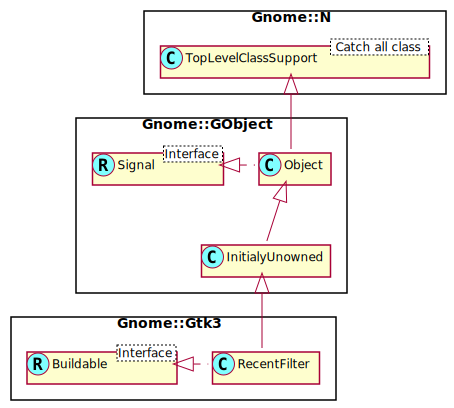

Gnome::Gtk3::RecentFilter
=========================

A filter for selecting a subset of recently used files

Description
===========

A **Gnome::Gtk3::RecentFilter** can be used to restrict the files being shown in a **Gnome::Gtk3::RecentChooser**.

Files can be filtered based on their name (with `add-pattern()`), on their mime type (with `add-mime-type()`), on the application that has registered them (with `add-application()`), or by a custom filter function (with `add-custom()`).

Filtering by mime type handles aliasing and subclassing of mime types; e.g. a filter for text/plain also matches a file with mime type application/rtf, since application/rtf is a subclass of text/plain.

Note that **Gnome::Gtk3::RecentFilter** allows wildcards for the subtype of a mime type, so you can e.g. filter for image/*.

Normally, filters are used by adding them to a **Gnome::Gtk3::RecentChooser**, see `add_filter()`, but it is also possible to manually use a filter on a file with `filter()`.

## **Gnome::Gtk3::RecentFilter** as **Gnome::Gtk3::Buildable**

The **Gnome::Gtk3::RecentFilter** implementation of the **Gnome::Gtk3::Buildable** interface supports adding rules using the <mime-types>, <patterns> and <applications> elements and listing the rules within. Specifying a <mime-type>, <pattern> or <application> has the same effect as calling `gtk_recent_filter_add_mime_type()`, `gtk_recent_filter_add_pattern()` or `gtk_recent_filter_add_application()`.

An example of a UI definition fragment specifying **Gnome::Gtk3::RecentFilter** rules:

    <object class="GtkRecentFilter">
      <mime-types>
        <mime-type>text/plain</mime-type>
        <mime-type>image/png</mime-type>
      </mime-types>
      <patterns>
        <pattern>*.txt</pattern>
        <pattern>*.png</pattern>
      </patterns>
      <applications>
        <application>gimp</application>
        <application>gedit</application>
        <application>glade</application>
      </applications>
    </object>

Synopsis
========

Declaration
-----------

    unit class Gnome::Gtk3::RecentFilter;
    also is Gnome::GObject::InitiallyUnowned;

Uml Diagram
-----------

Methods
=======

new
---

### default, no options

Create a new RecentFilter object.

    multi method new ( )

### :native-object

Create a RecentFilter object using a native object from elsewhere. See also **Gnome::N::TopLevelClassSupport**.

    multi method new ( N-GObject :$native-object! )

### :build-id

Create a RecentFilter object using a native object returned from a builder. See also **Gnome::GObject::Object**.

    multi method new ( Str :$build-id! )

set-name
--------

Sets the human-readable name of the filter; this is the string that will be displayed in the recently used resources selector user interface if there is a selectable list of filters.

    method set-name (  Str  $name )

  * Str $name; then human readable name of *filter*

get-name
--------

Gets the human-readable name for the filter. See `gtk_recent_filter_set_name()`.

Returns: (nullable): the name of the filter, or `Any`. The returned string is owned by the filter object and should not be freed.

    method get-name ( -->  Str  )

add-mime-type
-------------

Adds a rule that allows resources based on their registered MIME type.

    method add-mime-type (  Str  $mime_type )

  * Str $mime_type; a MIME type

add-pattern
-----------

Adds a rule that allows resources based on a pattern matching their display name.

    method add-pattern ( Str $pattern )

  * Str $pattern; a file pattern

add-pixbuf-formats
------------------

Adds a rule allowing image files in the formats supported by **Gnome::Gdk3::Pixbuf**.

    method add-pixbuf-formats ( )

add-application
---------------

Adds a rule that allows resources based on the name of the application that has registered them.

    method add-application ( Str $application )

  * Str $application; an application name

add-group
---------

Adds a rule that allows resources based on the name of the group to which they belong

    method add-group ( Str $group )

  * Str $group; a group name

add-age
-------

Adds a rule that allows resources based on their age - that is, the number of days elapsed since they were last modified.

    method add-age ( Int $days )

  * Int $days; number of days

