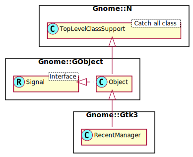

Gnome::Gtk3::RecentManager
==========================

Managing recently used files

Description
===========

**Gnome::Gtk3::RecentManager** provides a facility for adding, removing and looking up recently used files. Each recently used file is identified by its URI, and has meta-data associated to it, like the names and command lines of the applications that have registered it, the number of time each application has registered the same file, the mime type of the file and whether the file should be displayed only by the applications that have registered it.

The recently used files list is per user.

The **Gnome::Gtk3::RecentManager** acts like a database of all the recently used files. You can create new **Gnome::Gtk3::RecentManager** objects, but it is more efficient to use the default manager created by GTK+.

Adding a new recently used file is as simple as:

    my Gnome::Gtk3::RecentManager $manager .= new(:default);
    $manager.add-item('file:///foo/bar.baz');

The **Gnome::Gtk3::RecentManager** will try to gather all the needed information from the file itself through GIO.

Looking up the meta-data associated with a recently used file given its URI requires calling `lookup-item()`:

    my Gnome::Glib::Error $e;
    my Gnome::Gtk3::RecentInfo $ri;
    my Gnome::Gtk3::RecentManager $manager .= new(:default);
    ( $ri, $e ) = $manager.lookup-item('file:///foo/bar.baz');
    if $ri.is-valid {
      # Use the info object …
      # free object
      $ri.clear-object;
    }

    else {
      note $e.message; # or die on it
      $e.clear-object
    }

In order to retrieve the list of recently used files, you can use `get-items()`, which returns a list of **Gnome::Gtk3::RecentInfo** objects. This list must be freed after use.

    sub clear-list ( Gnome::Glib::List $l is copy ) {
      my Gnome::Glib::List $lbackup = $l;
      while $l {
        my Gnome::Gtk3::RecentInfo $ri .= new(:native-object($l.data));
        $ri.clear-object;
        $l .= next;
      }
      $lbackup.clear-object;
    }

    my Gnome::Glib::List $l = .get-items;
    # use first item of the list for example
    my Gnome::Gtk3::RecentInfo $ri .= new(:native-object($l.data));
    # Use the info object …
    # free the list
    clear-list($l);

A **Gnome::Gtk3::RecentManager** is the model used to populate the contents of one, or more **Gnome::Gtk3::RecentChooser** implementations.

Note that the maximum age of the recently used files list is controllable through the *gtk-recent-files-max-age* property.

See Also
--------

**GBookmarkFile**, **Gnome::Gtk3::Settings**, **Gnome::Gtk3::RecentChooser**

Synopsis
========

Declaration
-----------

    unit class Gnome::Gtk3::RecentManager;
    also is Gnome::GObject::Object;

Uml Diagram
-----------

Types
=====

enum GtkRecentManagerError
--------------------------

Error codes for **Gnome::Gtk3::RecentManager** operations

  * GTK_RECENT_MANAGER_ERROR_NOT_FOUND: the URI specified does not exists in the recently used resources list.

  * GTK_RECENT_MANAGER_ERROR_INVALID_URI: the URI specified is not valid.

  * GTK_RECENT_MANAGER_ERROR_INVALID_ENCODING: the supplied string is not UTF-8 encoded.

  * GTK_RECENT_MANAGER_ERROR_NOT_REGISTERED: no application has registered the specified item.

  * GTK_RECENT_MANAGER_ERROR_READ: failure while reading the recently used resources file.

  * GTK_RECENT_MANAGER_ERROR_WRITE: failure while writing the recently used resources file.

  * GTK_RECENT_MANAGER_ERROR_UNKNOWN: unspecified error.

class N-GtkRecentData
---------------------

Meta-data to be passed to `add-full()` when registering a recently used resource.

  * Str $.display_name: a UTF-8 encoded string, containing the name of the recently used resource to be displayed, or `Any`;

  * Str $.description: a UTF-8 encoded string, containing a short description of the resource, or `Any`;

  * Str $.mime_type: the MIME type of the resource;

  * Str $.app_name: the name of the application that is registering this recently used resource;

  * Str $.app_exec: command line used to launch this resource; may contain the `%f` and `%u` escape characters which will be expanded to the resource file path and URI respectively when the command line is retrieved;

  * CArray[Str] $.groups: (array zero-terminated=1): a vector of strings containing groups names. When initializing, an Array of Str is ok, no need to have a last entry set to Nil;

  * Int $.is_private: whether this resource should be displayed only by the applications that have registered it or not.

class N-GtkRecentManager
------------------------

**Gnome::Gtk3::RecentManager**-struct contains only private data and should be accessed using the provided API.

Methods
=======

new
---

### no options

Create a new RecentManager object.

    multi method new ( )

head
====

:default

Gets a unique instance of **Gnome::Gtk3::RecentManager**, that you can share in your application without caring about memory management.

    multi method new ( :default! )

### :native-object

Create a RecentManager object using a native object from elsewhere. See also **Gnome::N::TopLevelClassSupport**.

    multi method new ( N-GObject :$native-object! )

### :build-id

Create a RecentManager object using a native object returned from a builder. See also **Gnome::GObject::Object**.

    multi method new ( Str :$build-id! )

error-quark
-----------

Returns: The error quark used for *Gnome::Gtk3::RecentManager* errors.

    method error-quark ( --> UInt )

add-item
--------

Adds a new resource, pointed by *$uri*, into the recently used resources list. This function automatically retrieves some of the needed metadata and setting other metadata to common default values; it then feeds the data to `add-full()`. See `add-full()` if you want to explicitly define the metadata for the resource pointed by *$uri*.

Returns: `True` if the new item was successfully added to the recently used resources list

    method add-item (  Str  $uri --> Bool )

  * Str $uri; a valid URI

add-full
--------

Adds a new resource, pointed by *$uri*, into the recently used resources list, using the metadata specified inside the `N-GtkRecentData`-struct passed in *$recent_data*. The passed URI will be used to identify this resource inside the list. In order to register the new recently used resource, metadata about the resource must be passed as well as the URI; the metadata is stored in a `N-GtkRecentData`-struct, which must contain the MIME type of the resource pointed by the URI; the name of the application that is registering the item, and a command line to be used when launching the item.

Optionally, a `N-GtkRecentData`-struct might contain a UTF-8 string to be used when viewing the item instead of the last component of the URI; a short description of the item; whether the item should be considered private - that is, should be displayed only by the applications that have registered it.

Returns: `True` if the new item was successfully added to the recently used resources list, `False` otherwise.

    method add-full ( Str $uri, N-GtkRecentData $recent_data --> Bool )

  * Str $uri; a valid URI

  * N-GtkRecentData $recent_data; metadata of the resource

remove-item
-----------

Removes a resource pointed by *$uri* from the recently used resources list handled by a recent manager.

Returns: An invalid error object if the item pointed by *$uri* has been successfully removed by the recently used resources list, and a valid one with additional data otherwise.

    method remove-item ( Str  $uri --> Gnome::Glib::Error )

  * Str $uri; the URI of the item you wish to remove

lookup-item
-----------

Searches for a URI inside the recently used resources list, and returns a **Gnome::Gtk3::RecentInfo**-struct containing informations about the resource like its MIME type, or its display name.

Returns: A list. The first item is a **Gnome::Gtk3::RecentInfo** object containing information about the resource pointed by *uri*, or it is invalid if the URI was not registered in the recently used resources list. Free it with `clear-object()`. The second item is a **Gnome::Glib::Error** object which is invalid when the first item in the list is defined. Otherwise the error object shows why it failed.

    method lookup-item (  Str  $uri --> List )

  * Str $uri; a URI

The returned list items;

  * **Gnome::Gtk3::RecentInfo**; Recent info object or undefined.

  * **Gnome::Glib::Error** $error; A (in)valid error object

has-item
--------

Checks whether there is a recently used resource registered with *$uri* inside the recent manager.

Returns: `True` if the resource was found, `False` otherwise

    method has-item (  Str  $uri --> Bool )

  * Str $uri; a URI

move-item
---------

Changes the location of a recently used resource from *$uri* to *$new_uri*. Please note that this function will not affect the resource pointed by the URIs, but only the URI used in the recently used resources list.

Returns: an invalid error object on success. The error object has information if it fails.

    method move-item (  Str  $uri,  Str  $new_uri --> Gnome::Glib::Error )

  * Str $uri; the URI of a recently used resource

  * Str $new_uri; (allow-none): the new URI of the recently used resource, or `Any` to remove the item pointed by *uri* in the list

  * N-GError $error; (allow-none): a return location for a **GError**, or `Any`

get-items
---------

Gets the list of recently used resources.

Returns: (element-type **Gnome::Gtk3::RecentInfo**): a list of newly allocated **Gnome::Gtk3::RecentInfo** objects. Use `clear-object()` on each item inside the list, and then free the list itself also using `clear-object()`.

    method get-items ( --> Gnome::Glib::List )

purge-items
-----------

Purges every item from the recently used resources list.

Returns: the number of items that have been removed from the recently used resources list

    method purge-items ( --> Int )

Signals
=======

There are two ways to connect to a signal. The first option you have is to use `register-signal()` from **Gnome::GObject::Object**. The second option is to use `g_signal_connect_object()` directly from **Gnome::GObject::Signal**.

First method
------------

The positional arguments of the signal handler are all obligatory as well as their types. The named attributes `:$widget` and user data are optional.

    # handler method
    method mouse-event ( GdkEvent $event, :$widget ) { ... }

    # connect a signal on window object
    my Gnome::Gtk3::Window $w .= new( ... );
    $w.register-signal( self, 'mouse-event', 'button-press-event');

Second method
-------------

    my Gnome::Gtk3::Window $w .= new( ... );
    my Callable $handler = sub (
      N-GObject $native, GdkEvent $event, OpaquePointer $data
    ) {
      ...
    }

    $w.connect-object( 'button-press-event', $handler);

Also here, the types of positional arguments in the signal handler are important. This is because both methods `register-signal()` and `g_signal_connect_object()` are using the signatures of the handler routines to setup the native call interface.

Supported signals
-----------------

### changed

Emitted when the current recently used resources manager changes its contents, either by calling `gtk_recent_manager_add_item()` or by another application.

Since: 2.10

    method handler (
      Int :$_handle_id,
      Gnome::GObject::Object :_widget($recent_manager),
      *%user-options
    );

  * $recent_manager; the recent manager

Properties
==========

An example of using a string type property of a **Gnome::Gtk3::Label** object. This is just showing how to set/read a property, not that it is the best way to do it. This is because a) The class initialization often provides some options to set some of the properties and b) the classes provide many methods to modify just those properties. In the case below one can use **new(:label('my text label'))** or **gtk_label_set_text('my text label')**.

    my Gnome::Gtk3::Label $label .= new;
    my Gnome::GObject::Value $gv .= new(:init(G_TYPE_STRING));
    $label.g-object-get-property( 'label', $gv);
    $gv.g-value-set-string('my text label');

Supported properties
--------------------

### Filename

The full path to the file to be used to store and read the recently used resources list

The **Gnome::GObject::Value** type of property *filename* is `G_TYPE_STRING`.

### Size

The size of the recently used resources list.

The **Gnome::GObject::Value** type of property *size* is `G_TYPE_INT`.

