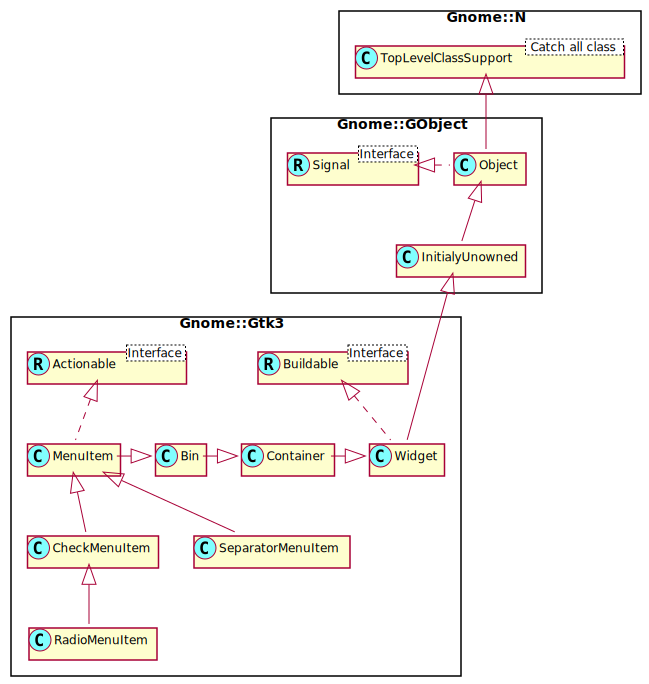

Gnome::Gtk3::SeparatorMenuItem
==============================

A separator used in menus

Description
===========

The **Gnome::Gtk3::SeparatorMenuItem** is a separator used to group items within a menu. It displays a horizontal line with a shadow to make it appear sunken into the interface.

Css Nodes
---------

**Gnome::Gtk3::SeparatorMenuItem** has a single CSS node with name separator.

Synopsis
========

Declaration
-----------

    unit class Gnome::Gtk3::SeparatorMenuItem;
    also is Gnome::Gtk3::MenuItem;

Uml Diagram
-----------

Methods
=======

new
---

### default, no options

Create a new SeparatorMenuItem object.

    multi method new ( )

### :native-object

Create a SeparatorMenuItem object using a native object from elsewhere. See also **Gnome::N::TopLevelClassSupport**.

    multi method new ( N-GObject :$native-object! )

### :build-id

Create a SeparatorMenuItem object using a native object returned from a builder. See also **Gnome::GObject::Object**.

    multi method new ( Str :$build-id! )

