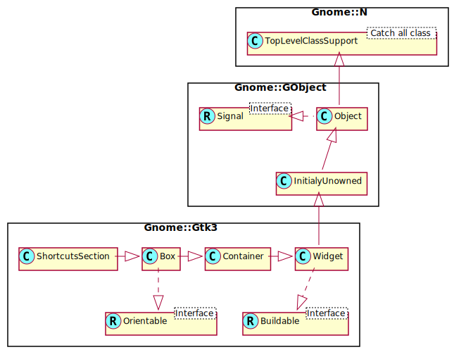

Gnome::Gtk3::ShortcutsSection
=============================

Represents an application mode in a GtkShortcutsWindow

Description
===========

A **Gnome::Gtk3::ShortcutsSection** collects all the keyboard shortcuts and gestures for a major application mode. If your application needs multiple sections, you should give each section a unique *section-name* and a *title* that can be shown in the section selector of the **Gnome::Gtk3::ShortcutsWindow**.

The *max-height* property can be used to influence how the groups in the section are distributed over pages and columns. This widget is only meant to be used with **Gnome::Gtk3::ShortcutsWindow**.

Synopsis
========

Declaration
-----------

    unit class Gnome::Gtk3::ShortcutsSection;
    also is Gnome::Gtk3::Box;

Uml Diagram
-----------

Types
=====

Methods
=======

new
---

### :native-object

Create a ShortcutsSection object using a native object from elsewhere. See also **Gnome::N::TopLevelClassSupport**.

    multi method new ( N-GObject :$native-object! )

### :build-id

Create a ShortcutsSection object using a native object returned from a builder. See also **Gnome::GObject::Object**.

    multi method new ( Str :$build-id! )

Signals
=======

There are two ways to connect to a signal. The first option you have is to use `register-signal()` from **Gnome::GObject::Object**. The second option is to use `connect-object()` directly from **Gnome::GObject::Signal**.

First method
------------

The positional arguments of the signal handler are all obligatory as well as their types. The named attributes `:$widget` and user data are optional.

    # handler method
    method mouse-event ( GdkEvent $event, :$widget ) { ... }

    # connect a signal on window object
    my Gnome::Gtk3::Window $w .= new( ... );
    $w.register-signal( self, 'mouse-event', 'button-press-event');

Second method
-------------

    my Gnome::Gtk3::Window $w .= new( ... );
    my Callable $handler = sub (
      N-GObject $native, GdkEvent $event, OpaquePointer $data
    ) {
      ...
    }

    $w.connect-object( 'button-press-event', $handler);

Also here, the types of positional arguments in the signal handler are important. This is because both methods `register-signal()` and `connect-object()` are using the signatures of the handler routines to setup the native call interface.

Supported signals
-----------------

### change-current-page

    method handler (
      Int $arg1,
      Int :$_handle_id,
      Gnome::GObject::Object :_widget($shortcutssection)
      N-GObject :$_native-object,
      *%user-options
      --> Int
    );

  * $arg1; ? page number ?

  * $_handler-id; The handler id which is returned from the registration

  * $_widget; The instance which registered the signal

  * $_native-object; The native object provided by the caller wrapped in the Raku object.

Properties
==========

An example of using a string type property of a **Gnome::Gtk3::Label** object. This is just showing how to set/read a property, not that it is the best way to do it. This is because a) The class initialization often provides some options to set some of the properties and b) the classes provide many methods to modify just those properties. In the case below one can use **new(:label('my text label'))** or **.set-text('my text label')**.

    my Gnome::Gtk3::Label $label .= new;
    my Gnome::GObject::Value $gv .= new(:init(G_TYPE_STRING));
    $label.get-property( 'label', $gv);
    $gv.set-string('my text label');

Supported properties
--------------------

### Maximum Height: max-height

The maximum number of lines to allow per column. This property can be used to influence how the groups in this section are distributed across pages and columns. The default value of 15 should work in most cases.

The **Gnome::GObject::Value** type of property *max-height* is `G_TYPE_UINT`.

### Section Name: section-name

A unique name to identify this section among the sections added to the GtkShortcutsWindow. Setting the *section-name* property to this string will make this section shown in the **Gnome::Gtk3::ShortcutsWindow**.

The **Gnome::GObject::Value** type of property *section-name* is `G_TYPE_STRING`.

### Title: title

The string to show in the section selector of the GtkShortcutsWindow for this section. If there is only one section, you don't need to set a title, since the section selector will not be shown in this case.

The **Gnome::GObject::Value** type of property *title* is `G_TYPE_STRING`.

### View Name: view-name

A view name to filter the groups in this section by. See *view*. Applications are expected to use the *view-name* property for this purpose.

The **Gnome::GObject::Value** type of property *view-name* is `G_TYPE_STRING`.

