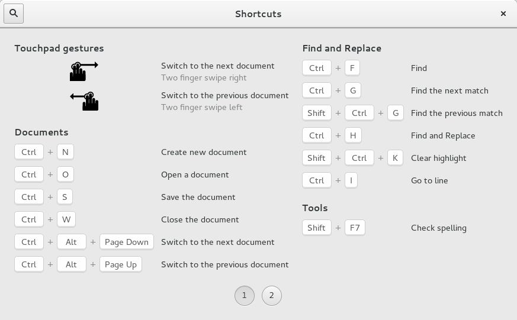

Gnome::Gtk3::ShortcutsWindow
============================

Toplevel which shows help for shortcuts

Description
===========

A **Gnome::Gtk3::ShortcutsWindow** shows brief information about the keyboard shortcuts and gestures of an application. The shortcuts can be grouped, and you can have multiple sections in this window, corresponding to the major modes of your application.

Additionally, the shortcuts can be filtered by the current view, to avoid showing information that is not relevant in the current application context.

The recommended way to construct a GtkShortcutsWindow is with GtkBuilder, by populating a **Gnome::Gtk3::ShortcutsWindow** with one or more **Gnome::Gtk3::ShortcutsSection** objects, which contain **Gnome::Gtk3::ShortcutsGroups** that in turn contain objects of class **Gnome::Gtk3::ShortcutsShortcut**.

A simple example:
-----------------

This example has as single section. As you can see, the shortcut groups are arranged in columns, and spread across several pages if there are too many to find on a single page.

The .ui file for this example can be found [here](https://git.gnome.org/browse/gtk+/tree/demos/gtk-demo/shortcuts-gedit.ui).

An example with multiple views:
-------------------------------

This example shows a **Gnome::Gtk3::ShortcutsWindow** that has been configured to show only the shortcuts relevant to the "stopwatch" view.

The .ui file for this example can be found [here](https://git.gnome.org/browse/gtk+/tree/demos/gtk-demo/shortcuts-clocks.ui).

An example with multiple sections:
----------------------------------

This example shows a **Gnome::Gtk3::ShortcutsWindow** with two sections, "Editor Shortcuts" and "Terminal Shortcuts". The .ui file for this example can be found [here](https://git.gnome.org/browse/gtk+/tree/demos/gtk-demo/shortcuts-builder.ui).

Synopsis
========

Declaration
-----------

    unit class Gnome::Gtk3::ShortcutsWindow;
    also is Gnome::Gtk3::Window;

Inheriting this class
---------------------

Inheriting is done in a special way in that it needs a call from new() to get the native object created by the class you are inheriting from.

    use Gnome::Gtk3::ShortcutsWindow;

    unit class MyGuiClass;
    also is Gnome::Gtk3::ShortcutsWindow;

    submethod new ( |c ) {
      # let the Gnome::Gtk3::ShortcutsWindow class process the options
      self.bless( :GtkShortcutsWindow, |c);
    }

    submethod BUILD ( ... ) {
      ...
    }

Types
=====

Methods
=======

new
---

### default, no options

Create a new ShortcutsWindow object.

    multi method new ( )

### :native-object

Create a ShortcutsWindow object using a native object from elsewhere. See also **Gnome::N::TopLevelClassSupport**.

    multi method new ( N-GObject :$native-object! )

### :build-id

Create a ShortcutsWindow object using a native object returned from a builder. See also **Gnome::GObject::Object**.

    multi method new ( Str :$build-id! )

Signals
=======

There are two ways to connect to a signal. The first option you have is to use `register-signal()` from **Gnome::GObject::Object**. The second option is to use `connect-object()` directly from **Gnome::GObject::Signal**.

First method
------------

The positional arguments of the signal handler are all obligatory as well as their types. The named attributes `:$widget` and user data are optional.

    # handler method
    method mouse-event ( GdkEvent $event, :$widget ) { ... }

    # connect a signal on window object
    my Gnome::Gtk3::Window $w .= new( ... );
    $w.register-signal( self, 'mouse-event', 'button-press-event');

Second method
-------------

    my Gnome::Gtk3::Window $w .= new( ... );
    my Callable $handler = sub (
      N-GObject $native, GdkEvent $event, OpaquePointer $data
    ) {
      ...
    }

    $w.connect-object( 'button-press-event', $handler);

Also here, the types of positional arguments in the signal handler are important. This is because both methods `register-signal()` and `connect-object()` are using the signatures of the handler routines to setup the native call interface.

Supported signals
-----------------

### close

The *close* signal is a keybinding signal which gets emitted when the user uses a keybinding to close the window.

The default binding for this signal is the Escape key.

    method handler (
      Int :$_handle_id,
      Gnome::GObject::Object :_widget($shortcutswindow),
      N-GObject :$_native-object,
      *%user-options
    );

  * $_handler-id; The handler id which is returned from the registration

  * $_widget; The instance which registered the signal

  * $_native-object; The native object provided by the caller wrapped in the Raku object.

### search

The *search* signal is a keybinding signal which gets emitted when the user uses a keybinding to start a search.

The default binding for this signal is Control-F.

    method handler (
      Int :$_handle_id,
      Gnome::GObject::Object :_widget($shortcutswindow),
      N-GObject :$_native-object,
      *%user-options
    );

  * $_handler-id; The handler id which is returned from the registration

  * $_widget; The instance which registered the signal

  * $_native-object; The native object provided by the caller wrapped in the Raku object.

Properties
==========

An example of using a string type property of a **Gnome::Gtk3::Label** object. This is just showing how to set/read a property, not that it is the best way to do it. This is because a) The class initialization often provides some options to set some of the properties and b) the classes provide many methods to modify just those properties. In the case below one can use **new(:label('my text label'))** or **.set-text('my text label')**.

    my Gnome::Gtk3::Label $label .= new;
    my Gnome::GObject::Value $gv .= new(:init(G_TYPE_STRING));
    $label.get-property( 'label', $gv);
    $gv.set-string('my text label');

Supported properties
--------------------

### Section Name: section-name

The name of the section to show.

This should be the section-name of one of the **Gnome::Gtk3::ShortcutsSection** objects that are in this shortcuts window.

The **Gnome::GObject::Value** type of property *section-name* is `G_TYPE_STRING`.

### View Name: view-name

The view name by which to filter the contents.

This should correspond to the *view* property of some of the **Gnome::Gtk3::ShortcutsGroup** objects that are inside this shortcuts window. Set this to `undefined` to show all groups.

The **Gnome::GObject::Value** type of property *view-name* is `G_TYPE_STRING`.

