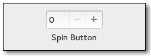
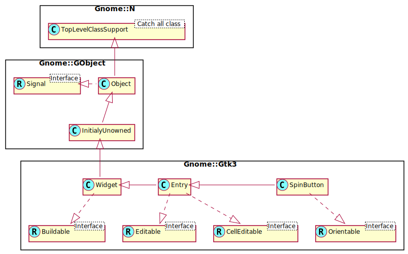

Gnome::Gtk3::SpinButton
=======================

Retrieve an integer or floating-point number from the user

Description
===========

A **Gnome::Gtk3::SpinButton** is an ideal way to allow the user to set the value of some attribute. Rather than having to directly type a number into a **Gnome::Gtk3::Entry**, **Gnome::Gtk3::SpinButton** allows the user to click on one of two arrows to increment or decrement the displayed value. A value can still be typed in, with the bonus that it can be checked to ensure it is in a given range.

The main properties of a **Gnome::Gtk3::SpinButton** are through an adjustment. See the **Gnome::Gtk3::Adjustment** section for more details about an adjustment's properties. Note that **Gnome::Gtk3::SpinButton** will by default make its entry large enough to accomodate the lower and upper bounds of the adjustment, which can lead to surprising results. Best practice is to set both the *width-chars* and *max-width-chars* poperties to the desired number of characters to display in the entry.

Css Nodes
---------

    spinbutton.horizontal
    ├── undershoot.left
    ├── undershoot.right
    ├── entry
    │   ╰── ...
    ├── button.down
    ╰── button.up

    spinbutton.vertical
    ├── undershoot.left
    ├── undershoot.right
    ├── button.up
    ├── entry
    │   ╰── ...
    ╰── button.down

**Gnome::Gtk3::SpinButtons** main CSS node has the name spinbutton. It creates subnodes for the entry and the two buttons, with these names. The button nodes have the style classes .up and .down. The **Gnome::Gtk3::Entry** subnodes (if present) are put below the entry node. The orientation of the spin button is reflected in the .vertical or .horizontal style class on the main node.

See Also
--------

**Gnome::Gtk3::Entry**

Synopsis
========

Declaration
-----------

    unit class Gnome::Gtk3::SpinButton;
    also is Gnome::Gtk3::Entry;

Uml Diagram
-----------

Inheriting this class
---------------------

Inheriting is done in a special way in that it needs a call from new() to get the native object created by the class you are inheriting from.

    use Gnome::Gtk3::SpinButton;

    unit class MyGuiClass;
    also is Gnome::Gtk3::SpinButton;

    submethod new ( |c ) {
      # let the Gnome::Gtk3::SpinButton class process the options
      self.bless( :GtkSpinButton, |c);
    }

    submethod BUILD ( ... ) {
      ...
    }

Example
-------

### Using a **Gnome::Gtk3::SpinButton** to get an integer

An example which shows a **Gnome::Gtk3::SpinButton** in a **Gnome::Gtk3::Window** which models percentage values. The class also has a signal handler to copy an integer value from the SpinButton in a local storage. This can be retrieved by calling `.local-store()`.

    has Int $.local-store;
    method grab-int-value ( Gnome::Gtk3::SpinButton :_widget($button) ) {
       $!local-store = $button.get-value-as-int;
    }

    method create-integer-spin-button ( ) {

      my Gnome::Gtk3::Adjustment $adjustment .= new(
        :value(50.0), :lower(0.0), :upper(100.0), :step-increment(1.0),
        :page-increment(5.0), :page-size(0.0)
      );
      $!local-store = 50.0;

      # creates the spinbutton, with no decimal places
      my Gnome::Gtk3::SpinButton $button .= new(
        :$adjustment, :climb_rate(1.0), :digits(0)
      );
      $button.register-signal( self, 'grab-int-value', 'value-changed');

      given my Gnome::Gtk3::Window $window .= new {
        .set-title('my 1st spin button demo');
        .set-border-width(5);
        .container_add($button);
        .show_all;
      }
    }

### Using a **Gnome::Gtk3::SpinButton** to get a floating point value

The second example shows a **Gnome::Gtk3::SpinButton** which provides a method to retrieve a floating point value. The SpinButton is created as a high precision spin button.

    has Gnome::Gtk3::Window $!window;
    has Gnome::Gtk3::SpinButton $!button;

    method grab-float-value ( --> Num ) {
      $!button.get-value
    }

    method create-floating-spin-button ( ) {

      my Gnome::Gtk3::Adjustment $adjustment .= new(
        :value(2.500), :lower(0.0), :upper(5.0),
        :step-increment(0.001), :page-increment(0.1),
        :page-size(0.0)
      );

      # creates the spinbutton, with three decimal places
      $!button .= new( :$adjustment, :climb_rate(0.001), :digits(3));

      given $!window .= new {
        .set-title('my 2nd spin button demo');
        .set-border-width(5);
        .container_add($!button);
        .show_all;
      }
    }

Types
=====

enum GtkSpinButtonUpdatePolicy
------------------------------

The spin button update policy determines whether the spin button displays values even if they are outside the bounds of its adjustment. See `gtk_spin_button_set_update_policy()`.

  * GTK_UPDATE_ALWAYS: When refreshing your **Gnome::Gtk3::SpinButton**, the value is always displayed

  * GTK_UPDATE_IF_VALID: When refreshing your **Gnome::Gtk3::SpinButton**, the value is only displayed if it is valid within the bounds of the spin button's adjustment

enum GtkSpinType
----------------

The values of the **Gnome::Gtk3::SpinType** enumeration are used to specify the change to make in `gtk_spin_button_spin()`.

  * GTK_SPIN_STEP_FORWARD: Increment by the adjustments step increment.

  * GTK_SPIN_STEP_BACKWARD: Decrement by the adjustments step increment.

  * GTK_SPIN_PAGE_FORWARD: Increment by the adjustments page increment.

  * GTK_SPIN_PAGE_BACKWARD: Decrement by the adjustments page increment.

  * GTK_SPIN_HOME: Go to the adjustments lower bound.

  * GTK_SPIN_END: Go to the adjustments upper bound.

  * GTK_SPIN_USER_DEFINED: Change by a specified amount.

Methods
=======

new
---

### new( :adjustment, :climb_rate, :digits)

Create a new SpinButton object.

    multi method new (
      N-GObject :$adjustment!, Num :$climb_rate = 1e-1, UInt :$digits = 1
    )

  * N-GObject $adjustment; the **Gnome::Gtk3::Adjustment** object that this spin button should use.

  * Num $climb_rate; specifies by how much the rate of change in the value will accelerate if you continue to hold down an up/down button or arrow key

  * UInt $digits; the number of decimal places to display.

### new( :min, :max, :step)

This is a convenience constructor that allows creation of a numeric **Gnome::Gtk3::SpinButton** without manually creating an adjustment. The value is initially set to the minimum value and a page increment of 10 * *$step* is the default. The precision of the spin button is equivalent to the precision of *$step*. Note that the way in which the precision is derived works best if *$step* is a power of ten. If the resulting precision is not suitable for your needs, use `.gtk_spin_button_set_digits()` to correct it.

    multi method new ( Num :$min = 0e0, Num :$max = 1e0, Num :$step! )

  * Num $min; Minimum allowable value

  * Num $max; Maximum allowable value

  * Num $step; Increment added or subtracted by spinning the widget

[gtk_] spin_button_configure
----------------------------

Changes the properties of an existing spin button. The adjustment, climb rate, and number of decimal places are updated accordingly.

    method gtk_spin_button_configure ( N-GObject $adjustment, Num $climb_rate, UInt $digits )

  * N-GObject $adjustment; a **Gnome::Gtk3::Adjustment** to replace the spin button’s existing adjustment, or `Any` to leave its current adjustment unchanged

  * Num $climb_rate; the new climb rate

  * UInt $digits; the number of decimal places to display in the spin button

[[gtk_] spin_button_] set_adjustment
------------------------------------

Replaces the **Gnome::Gtk3::Adjustment** associated with *spin_button*.

    method gtk_spin_button_set_adjustment ( N-GObject $adjustment )

  * N-GObject $adjustment; a **Gnome::Gtk3::Adjustment** to replace the existing adjustment

[[gtk_] spin_button_] get_adjustment
------------------------------------

Get the adjustment associated with a **Gnome::Gtk3::SpinButton**

Returns: (transfer none): the **Gnome::Gtk3::Adjustment** of *spin_button*

    method gtk_spin_button_get_adjustment ( --> N-GObject )

[[gtk_] spin_button_] set_digits
--------------------------------

Set the precision to be displayed by *spin_button*. Up to 20 digit precision is allowed.

    method gtk_spin_button_set_digits ( UInt $digits )

  * UInt $digits; the number of digits after the decimal point to be displayed for the spin button’s value

[[gtk_] spin_button_] get_digits
--------------------------------

Fetches the precision of *spin_button*. See `gtk_spin_button_set_digits()`.

Returns: the current precision

    method gtk_spin_button_get_digits ( --> UInt )

[[gtk_] spin_button_] set_increments
------------------------------------

Sets the step and page increments for spin_button. This affects how quickly the value changes when the spin button’s arrows are activated.

    method gtk_spin_button_set_increments ( Num $step, Num $page )

  * Num $step; increment applied for a button 1 press.

  * Num $page; increment applied for a button 2 press.

[[gtk_] spin_button_] get_increments
------------------------------------

Gets the current step and page the increments used by *spin_button*. See `gtk_spin_button_set_increments()`.

    method gtk_spin_button_get_increments ( --> List )

Returned List holds;

  * Num $step; location to store step increment, or `Any`

  * Num $page; location to store page increment, or `Any`

[[gtk_] spin_button_] set_range
-------------------------------

Sets the minimum and maximum allowable values for *spin_button*. If the current value is outside this range, it will be adjusted to fit within the range, otherwise it will remain unchanged.

    method gtk_spin_button_set_range ( Num $min, Num $max )

  * Num $min; minimum allowable value

  * Num $max; maximum allowable value

[[gtk_] spin_button_] get_range
-------------------------------

Gets the range allowed for *spin_button*. See `gtk_spin_button_set_range()`.

    method gtk_spin_button_get_range ( --> List )

Returned List holds;

  * Num $min; location to store minimum allowed value, or `Any`

  * Num $max; location to store maximum allowed value, or `Any`

[[gtk_] spin_button_] get_value
-------------------------------

Get the value in the *spin_button*.

    method gtk_spin_button_get_value ( --> Num )

[[gtk_] spin_button_] get_value_as_int
--------------------------------------

Get the value *spin_button* represented as an integer.

Returns: the value of *spin_button*

    method gtk_spin_button_get_value_as_int ( --> Int )

[[gtk_] spin_button_] set_value
-------------------------------

Sets the value of *spin_button*.

    method gtk_spin_button_set_value ( Num $value )

  * Num $value; the new value

[[gtk_] spin_button_] set_update_policy
---------------------------------------

Sets the update behavior of a spin button. This determines whether the spin button is always updated or only when a valid value is set.

    method gtk_spin_button_set_update_policy ( GtkSpinButtonUpdatePolicy $policy )

  * GtkSpinButtonUpdatePolicy $policy; a **Gnome::Gtk3::SpinButtonUpdatePolicy** value

[[gtk_] spin_button_] get_update_policy
---------------------------------------

Gets the update behavior of a spin button. See `gtk_spin_button_set_update_policy()`.

Returns: the current update policy

    method gtk_spin_button_get_update_policy ( --> GtkSpinButtonUpdatePolicy )

[[gtk_] spin_button_] set_numeric
---------------------------------

Sets the flag that determines if non-numeric text can be typed into the spin button.

    method gtk_spin_button_set_numeric ( Bool $numeric )

  * Bool $numeric; flag indicating if only numeric entry is allowed

[[gtk_] spin_button_] get_numeric
---------------------------------

Returns whether non-numeric text can be typed into the spin button. See `gtk_spin_button_set_numeric()`. Returns: `1` if only numeric text can be entered

    method gtk_spin_button_get_numeric ( --> Int )

[gtk_] spin_button_spin
-----------------------

Increment or decrement a spin button’s value in a specified direction by a specified amount.

    method gtk_spin_button_spin ( GtkSpinType $direction, Num $increment )

  * GtkSpinType $direction; a **Gnome::Gtk3::SpinType** indicating the direction to spin

  * Num $increment; step increment to apply in the specified direction

[[gtk_] spin_button_] set_wrap
------------------------------

Sets the flag that determines if a spin button value wraps around to the opposite limit when the upper or lower limit of the range is exceeded.

    method gtk_spin_button_set_wrap ( Bool $wrap )

  * Bool $wrap; a flag indicating if wrapping behavior is performed

[[gtk_] spin_button_] get_wrap
------------------------------

Returns whether the spin button’s value wraps around to the opposite limit when the upper or lower limit of the range is exceeded. See `gtk_spin_button_set_wrap()`.

Returns: `1` if the spin button wraps around

    method gtk_spin_button_get_wrap ( --> Int )

[[gtk_] spin_button_] set_snap_to_ticks
---------------------------------------

Sets the policy as to whether values are corrected to the nearest step increment when a spin button is activated after providing an invalid value.

    method gtk_spin_button_set_snap_to_ticks ( Bool $snap_to_ticks )

  * Bool $snap_to_ticks; a flag indicating if invalid values should be corrected

[[gtk_] spin_button_] get_snap_to_ticks
---------------------------------------

Returns whether the values are corrected to the nearest step. See `gtk_spin_button_set_snap_to_ticks()`. Returns: `1` if values are snapped to the nearest step

    method gtk_spin_button_get_snap_to_ticks ( --> Int )

[gtk_] spin_button_update
-------------------------

Manually force an update of the spin button.

    method gtk_spin_button_update ( )

Signals
=======

There are two ways to connect to a signal. The first option you have is to use `register-signal()` from **Gnome::GObject::Object**. The second option is to use `g_signal_connect_object()` directly from **Gnome::GObject::Signal**.

First method
------------

The positional arguments of the signal handler are all obligatory as well as their types. The named attributes `:$widget` and user data are optional.

    # handler method
    method mouse-event ( GdkEvent $event, :$widget ) { ... }

    # connect a signal on window object
    my Gnome::Gtk3::Window $w .= new( ... );
    $w.register-signal( self, 'mouse-event', 'button-press-event');

Second method
-------------

    my Gnome::Gtk3::Window $w .= new( ... );
    my Callable $handler = sub (
      N-GObject $native, GdkEvent $event, OpaquePointer $data
    ) {
      ...
    }

    $w.connect-object( 'button-press-event', $handler);

Also here, the types of positional arguments in the signal handler are important. This is because both methods `register-signal()` and `g_signal_connect_object()` are using the signatures of the handler routines to setup the native call interface.

Supported signals
-----------------

### input

The *input* signal can be used to influence the conversion of the users input into a double value. The signal handler is expected to use `gtk_entry_get_text()` to retrieve the text of the entry and set *new_value* to the new value.

The default conversion uses `g_strtod()`.

Returns: `1` for a successful conversion, `0` if the input was not handled, and `GTK_INPUT_ERROR` if the conversion failed.

    method handler (
      Unknown type G_TYPE_POINTER $new_value,
      Int :$_handle_id,
      Gnome::GObject::Object :_widget($spin_button),
      *%user-options
      --> Int
    );

  * $spin_button; the object on which the signal was emitted

  * $new_value; (out) (type double): return location for the new value

### output

The *output* signal can be used to change to formatting of the value that is displayed in the spin buttons entry. |[<!-- language="C" --> // show leading zeros static gboolean on_output (**Gnome::Gtk3::SpinButton** *spin, gpointer data) { **Gnome::Gtk3::Adjustment** *adjustment; gchar *text; int value;

adjustment = gtk_spin_button_get_adjustment (spin); value = (int)gtk_adjustment_get_value (adjustment); text = g_strdup_printf ("`02d`", value); gtk_entry_set_text (GTK_ENTRY (spin), text); g_free (text);

return TRUE; } ]|

Returns: `1` if the value has been displayed

    method handler (
      Int :$_handle_id,
      Gnome::GObject::Object :_widget($spin_button),
      *%user-options
      --> Int
    );

  * $spin_button; the object on which the signal was emitted

### value-changed

The *value-changed* signal is emitted when the value represented by *spinbutton* changes. Also see the *output* signal.

    method handler (
      Int :$_handle_id,
      Gnome::GObject::Object :_widget($spin_button),
      *%user-options
    );

  * $spin_button; the object on which the signal was emitted

### wrapped

The *wrapped* signal is emitted right after the spinbutton wraps from its maximum to minimum value or vice-versa.

Since: 2.10

    method handler (
      Int :$_handle_id,
      Gnome::GObject::Object :_widget($spin_button),
      *%user-options
    );

  * $spin_button; the object on which the signal was emitted

### change-value

The *change-value* signal is a [keybinding signal][**Gnome::Gtk3::BindingSignal**] which gets emitted when the user initiates a value change.

Applications should not connect to it, but may emit it with `g_signal_emit_by_name()` if they need to control the cursor programmatically.

The default bindings for this signal are Up/Down and PageUp and/PageDown.

    method handler (
      Unknown type GTK_TYPE_SCROLL_TYPE $scroll,
      Int :$_handle_id,
      Gnome::GObject::Object :_widget($spin_button),
      *%user-options
    );

  * $spin_button; the object on which the signal was emitted

  * $scroll; a **Gnome::Gtk3::ScrollType** to specify the speed and amount of change

Properties
==========

An example of using a string type property of a **Gnome::Gtk3::Label** object. This is just showing how to set/read a property, not that it is the best way to do it. This is because a) The class initialization often provides some options to set some of the properties and b) the classes provide many methods to modify just those properties. In the case below one can use **new(:label('my text label'))** or **gtk_label_set_text('my text label')**.

    my Gnome::Gtk3::Label $label .= new;
    my Gnome::GObject::Value $gv .= new(:init(G_TYPE_STRING));
    $label.g-object-get-property( 'label', $gv);
    $gv.g-value-set-string('my text label');

Supported properties
--------------------

### Adjustment

The adjustment that holds the value of the spin button Widget type: GTK_TYPE_ADJUSTMENT

The **Gnome::GObject::Value** type of property *adjustment* is `G_TYPE_OBJECT`.

### Climb Rate

The **Gnome::GObject::Value** type of property *climb-rate* is `G_TYPE_DOUBLE`.

### Digits

The **Gnome::GObject::Value** type of property *digits* is `G_TYPE_UINT`.

### Snap to Ticks

Whether erroneous values are automatically changed to a spin button's nearest step increment Default value: False

The **Gnome::GObject::Value** type of property *snap-to-ticks* is `G_TYPE_BOOLEAN`.

### Numeric

Whether non-numeric characters should be ignored Default value: False

The **Gnome::GObject::Value** type of property *numeric* is `G_TYPE_BOOLEAN`.

### Wrap

Whether a spin button should wrap upon reaching its limits Default value: False

The **Gnome::GObject::Value** type of property *wrap* is `G_TYPE_BOOLEAN`.

### Update Policy

Whether the spin button should update always, or only when the value is legal Default value: False

The **Gnome::GObject::Value** type of property *update-policy* is `G_TYPE_ENUM`.

### Value

The **Gnome::GObject::Value** type of property *value* is `G_TYPE_DOUBLE`.

