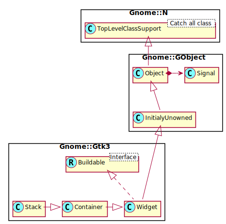

Gnome::Gtk3::Stack
==================

A stacking container

Description
===========

The **Gnome::Gtk3::Stack** widget is a container which only shows one of its children at a time. In contrast to **Gnome::Gtk3::Notebook**, **Gnome::Gtk3::Stack** does not provide a means for users to change the visible child. Instead, the **Gnome::Gtk3::StackSwitcher** widget can be used with **Gnome::Gtk3::Stack** to provide this functionality.

Transitions between pages can be animated as slides or fades. This can be controlled with `gtk_stack_set_transition_type()`. These animations respect the *gtk-enable-animations* setting.

The **Gnome::Gtk3::Stack** widget was added in GTK+ 3.10.

Css Nodes
---------

**Gnome::Gtk3::Stack** has a single CSS node named stack.

See Also
--------

**Gnome::Gtk3::Notebook**, **Gnome::Gtk3::StackSwitcher**

Synopsis
========

Declaration
-----------

    unit class Gnome::Gtk3::Stack;
    also is Gnome::Gtk3::Container;

Uml Diagram 
-----------------------------------

Inheriting this class
---------------------

Inheriting is done in a special way in that it needs a call from new() to get the native object created by the class you are inheriting from.

    use Gnome::Gtk3::Stack;

    unit class MyGuiClass;
    also is Gnome::Gtk3::Stack;

    submethod new ( |c ) {
      # let the Gnome::Gtk3::Stack class process the options
      self.bless( :GtkStack, |c);
    }

    submethod BUILD ( ... ) {
      ...
    }

Types
=====

enum GtkStackTransitionType
---------------------------

These enumeration values describe the possible transitions between pages in a GtkStack widget.

New values may be added to this enumeration over time.

Methods
=======

new
---

### new()

Create a new Stack object.

    multi method new ( )

[[gtk_] stack_] add_named
-------------------------

Adds a child to this stack. The child is identified by the *$name*.

    method gtk_stack_add_named ( N-GObject $child, Str $name )

  * N-GObject $child; the widget to add

  * Str $name; the name for *child*

[[gtk_] stack_] add_titled
--------------------------

Adds a child to this stack. The child is identified by the *$name*. The *$title* will be used by **Gnome::Gtk3::StackSwitcher** to represent *$child* in a tab bar, so it should be short.

    method gtk_stack_add_titled ( N-GObject $child, Str $name, Str $title )

  * N-GObject $child; the widget to add

  * Str $name; the name for *$child*

  * Str $title; a human-readable title for *$child*

[[gtk_] stack_] get_child_by_name
---------------------------------

Finds the child of the **Gnome::Gtk3::Stack** with the name given as the argument. Returns `Any` if there is no child with this name.

Returns: the requested child of the **Gnome::Gtk3::Stack** if any.

    method gtk_stack_get_child_by_name ( Str $name --> N-GObject )

  * Str $name; the name of the child to find

[[gtk_] stack_] set_visible_child
---------------------------------

Makes *$child* the visible child of this stack.

If *$child* is different from the currently visible child, the transition between the two will be animated with the current transition type of this stack.

Note that the *$child* widget has to be visible itself (see `gtk_widget_show()`) in order to become the visible child of this stack.

    method gtk_stack_set_visible_child ( N-GObject $child )

  * N-GObject $child; a child of this stack

[[gtk_] stack_] get_visible_child
---------------------------------

Gets the currently visible child of this stack, or `Any` if there are no visible children.

Returns: the visible child of the **Gnome::Gtk3::Stack**.

    method gtk_stack_get_visible_child ( --> N-GObject )

[[gtk_] stack_] set_visible_child_name
--------------------------------------

Makes the child with the given name visible.

If the child with the name is different from the currently visible child, the transition between the two will be animated with the current transition type of this stack.

Note that the child widget has to be visible itself (see `gtk_widget_show()`) in order to become the visible child of this stack.

    method gtk_stack_set_visible_child_name ( Str $name )

  * Str $name; the name of the child to make visible

[[gtk_] stack_] get_visible_child_name
--------------------------------------

Returns the name of the currently visible child of this stack, or `Any` if there is no visible child.

Returns: the name of the visible child of the **Gnome::Gtk3::Stack**

    method gtk_stack_get_visible_child_name ( --> Str )

[[gtk_] stack_] set_visible_child_full
--------------------------------------

Makes the child with the given name visible.

Note that the child widget has to be visible itself (see `gtk_widget_show()`) in order to become the visible child of this stack.

    method gtk_stack_set_visible_child_full (
      Str $name, GtkStackTransitionType $transition
    )

  * Str $name; the name of the child to make visible

  * GtkStackTransitionType $transition; the transition type to use

[[gtk_] stack_] set_homogeneous
-------------------------------

Sets the **Gnome::Gtk3::Stack** to be homogeneous or not. If it is homogeneous, the **Gnome::Gtk3::Stack** will request the same size for all its children. If it isn't, the stack may change size when a different child becomes visible.

Homogeneity can be controlled separately for horizontal and vertical size, with the `gtk_stack_set_hhomogeneous` and `gtk_stack_set_vhomogeneous`.

    method gtk_stack_set_homogeneous ( Bool $homogeneous )

  * Int $homogeneous; `1` to make this stack homogeneous

[[gtk_] stack_] get_homogeneous
-------------------------------

Gets whether this stack is homogeneous. See `gtk_stack_set_homogeneous()`.

    method gtk_stack_get_homogeneous ( --> Int )

[[gtk_] stack_] set_hhomogeneous
--------------------------------

Sets the **Gnome::Gtk3::Stack** to be horizontally homogeneous or not. If it is homogeneous, the **Gnome::Gtk3::Stack** will request the same width for all its children. If it isn't, the stack may change width when a different child becomes visible.

    method gtk_stack_set_hhomogeneous ( Bool $hhomogeneous )

  * Int $hhomogeneous; `1` to make this stack horizontally homogeneous

[[gtk_] stack_] get_hhomogeneous
--------------------------------

Gets whether this stack is horizontally homogeneous. See `gtk_stack_set_hhomogeneous()`.

    method gtk_stack_get_hhomogeneous ( --> Int )

[[gtk_] stack_] set_vhomogeneous
--------------------------------

Sets the **Gnome::Gtk3::Stack** to be vertically homogeneous or not. If it is homogeneous, the **Gnome::Gtk3::Stack** will request the same height for all its children. If it isn't, the stack may change height when a different child becomes visible.

    method gtk_stack_set_vhomogeneous ( Bool $vhomogeneous )

  * Int $vhomogeneous; `1` to make this stack vertically homogeneous

[[gtk_] stack_] get_vhomogeneous
--------------------------------

Gets whether this stack is vertically homogeneous. See `gtk_stack_set_vhomogeneous()`.

    method gtk_stack_get_vhomogeneous ( --> Int )

[[gtk_] stack_] set_transition_duration
---------------------------------------

Sets the duration that transitions between pages in this stack will take.

    method gtk_stack_set_transition_duration ( UInt $duration )

  * UInt $duration; the new duration, in milliseconds

[[gtk_] stack_] get_transition_duration
---------------------------------------

Returns the amount of time (in milliseconds) that transitions between pages in this stack will take.

    method gtk_stack_get_transition_duration ( --> UInt )

[[gtk_] stack_] set_transition_type
-----------------------------------

Sets the type of animation that will be used for transitions between pages in this stack. Available types include various kinds of fades and slides.

The transition type can be changed without problems at runtime, so it is possible to change the animation based on the page that is about to become current.

    method gtk_stack_set_transition_type ( GtkStackTransitionType $transition )

  * GtkStackTransitionType $transition; the new transition type

[[gtk_] stack_] get_transition_type
-----------------------------------

Gets the type of animation that will be used for transitions between pages in this stack.

    method gtk_stack_get_transition_type ( --> GtkStackTransitionType )

[[gtk_] stack_] get_transition_running
--------------------------------------

Returns whether this stack is currently in a transition from one page to another. `1` if the transition is currently running, `0` otherwise.

    method gtk_stack_get_transition_running ( --> Int )

[[gtk_] stack_] set_interpolate_size
------------------------------------

Sets whether or not this stack will interpolate its size when changing the visible child. If the *$interpolate-size* property is set to `1`, this stack will interpolate its size between the current one and the one it'll take after changing the visible child, according to the set transition duration.

    method gtk_stack_set_interpolate_size ( Bool $interpolate_size )

  * Int $interpolate_size; the new value

[[gtk_] stack_] get_interpolate_size
------------------------------------

Returns wether the **Gnome::Gtk3::Stack** is set up to interpolate between the sizes of children on page switch. Returns: `1` if child sizes are interpolated, `0` otherwise.

    method gtk_stack_get_interpolate_size ( --> Int )

Properties
==========

An example of using a string type property of a **Gnome::Gtk3::Label** object. This is just showing how to set/read a property, not that it is the best way to do it. This is because a) The class initialization often provides some options to set some of the properties and b) the classes provide many methods to modify just those properties. In the case below one can use **new(:label('my text label'))** or **gtk_label_set_text('my text label')**.

    my Gnome::Gtk3::Label $label .= new;
    my Gnome::GObject::Value $gv .= new(:init(G_TYPE_STRING));
    $label.g-object-get-property( 'label', $gv);
    $gv.g-value-set-string('my text label');

Supported properties
--------------------

#-------------------------------------------------------------------------------

### Homogeneous

Homogeneous sizing Default value: True

The **Gnome::GObject::Value** type of property *homogeneous* is `G_TYPE_BOOLEAN`.

#-------------------------------------------------------------------------------

### Horizontally homogeneous

`1` if the stack allocates the same width for all children.

The **Gnome::GObject::Value** type of property *hhomogeneous* is `G_TYPE_BOOLEAN`.

#-------------------------------------------------------------------------------

### Vertically homogeneous

`1` if the stack allocates the same height for all children.

The **Gnome::GObject::Value** type of property *vhomogeneous* is `G_TYPE_BOOLEAN`.

#-------------------------------------------------------------------------------

### Visible child

The widget currently visible in the stack. Widget type: GTK_TYPE_WIDGET

The **Gnome::GObject::Value** type of property *visible-child* is `G_TYPE_OBJECT`.

#-------------------------------------------------------------------------------

### Name of visible child

The name of the widget currently visible in the stack Default value: Any

The **Gnome::GObject::Value** type of property *visible-child-name* is `G_TYPE_STRING`.

#-------------------------------------------------------------------------------

### Transition duration

The **Gnome::GObject::Value** type of property *transition-duration* is `G_TYPE_UINT`.

#-------------------------------------------------------------------------------

### Transition type

The type of animation used to transition. Default value: False.

The **Gnome::GObject::Value** type of property *transition-type* is `G_TYPE_ENUM`.

#-------------------------------------------------------------------------------

### Transition running

Whether or not the transition is currently running. Default value: False.

The **Gnome::GObject::Value** type of property *transition-running* is `G_TYPE_BOOLEAN`.

#-------------------------------------------------------------------------------

### Interpolate size

Whether or not the size should smoothly change when changing between differently sized children. Default value: False.

The **Gnome::GObject::Value** type of property *interpolate-size* is `G_TYPE_BOOLEAN`.

#-------------------------------------------------------------------------------

