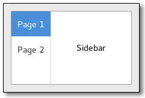

Gnome::Gtk3::StackSidebar
=========================

An automatic sidebar widget

Description
===========

A **Gnome::Gtk3::StackSidebar** enables you to quickly and easily provide a consistent "sidebar" object for your user interface.

In order to use a **Gnome::Gtk3::StackSidebar**, you simply use a **Gnome::Gtk3::Stack** to organize your UI flow, and add the sidebar to your sidebar area. You can use `gtk_stack_sidebar_set_stack()` to connect the **Gnome::Gtk3::StackSidebar** to the **Gnome::Gtk3::Stack**.

Css Nodes
---------

**Gnome::Gtk3::StackSidebar** has a single CSS node with name stacksidebar and style class .sidebar.

When circumstances require it, **Gnome::Gtk3::StackSidebar** adds the .needs-attention style class to the widgets representing the stack pages.

Since: 3.16

Synopsis
========

Declaration
-----------

    unit class Gnome::Gtk3::StackSidebar;
    also is Gnome::Gtk3::Bin;

Methods
=======

new
---

Create a new StackSidebar object.

    multi method new ( )

Create a StackSidebar object using a native object from elsewhere. See also **Gnome::GObject::Object**.

    multi method new ( N-GObject :$native-object! )

Create a StackSidebar object using a native object returned from a builder. See also **Gnome::GObject::Object**.

    multi method new ( Str :$build-id! )

gtk_stack_sidebar_new
---------------------

Creates a new sidebar.

Returns: the new **Gnome::Gtk3::StackSidebar**

Since: 3.16

    method gtk_stack_sidebar_new ( --> N-GObject )

[gtk_stack_sidebar_] set_stack
------------------------------

Set the **Gnome::Gtk3::Stack** associated with this **Gnome::Gtk3::StackSidebar**.

The sidebar widget will automatically update according to the order (packing) and items within the given **Gnome::Gtk3::Stack**.

Since: 3.16

    method gtk_stack_sidebar_set_stack ( N-GObject $stack )

  * N-GObject $stack; a **Gnome::Gtk3::Stack**

[gtk_stack_sidebar_] get_stack
------------------------------

Retrieves the stack. See `gtk_stack_sidebar_set_stack()`.

Returns: the associated **Gnome::Gtk3::Stack** or `Any` if none has been set explicitly

Since: 3.16

    method gtk_stack_sidebar_get_stack ( --> N-GObject )

