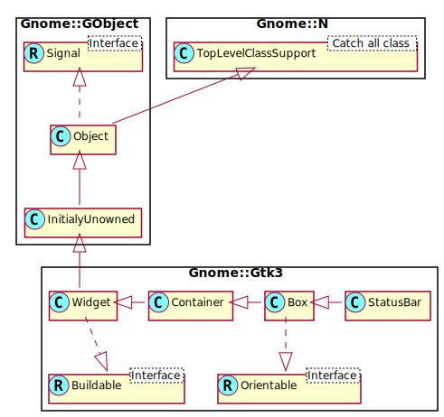

Gnome::Gtk3::Statusbar
======================

Report messages of minor importance to the user

Description
===========

A **Gnome::Gtk3::Statusbar** is usually placed along the bottom of an application's main **Gnome::Gtk3::Window**. It may provide a regular commentary of the application's status (as is usually the case in a web browser, for example), or may be used to simply output a message when the status changes, (when an upload is complete in an FTP client, for example).

Status bars in GTK+ maintain a stack of messages. The message at the top of the each bar’s stack is the one that will currently be displayed.

Any messages added to a statusbar’s stack must specify a context id that is used to uniquely identify the source of a message. This context id can be generated by `.gtk_statusbar_get_context_id()`, given a message and the statusbar that it will be added to. Note that messages are stored in a stack, and when choosing which message to display, the stack structure is adhered to, regardless of the context identifier of a message.

One could say that a statusbar maintains one stack of messages for display purposes, but allows multiple message producers to maintain sub-stacks of the messages they produced (via context ids).

Status bars are created using `.new()`.

Messages are added to the bar’s stack with `.gtk_statusbar_push()`.

The message at the top of the stack can be removed using `.gtk_statusbar_pop()`. A message can be removed from anywhere in the stack if its message id was recorded at the time it was added. This is done using `.gtk_statusbar_remove()`.

CSS node
--------

  * **Gnome::Gtk3::Statusbar** has a single CSS node with name statusbar.

Synopsis
========

Declaration
-----------

    unit class Gnome::Gtk3::Statusbar;
    also is Gnome::Gtk3::Box;

Uml Diagram
-----------

Inheriting this class
---------------------

Inheriting is done in a special way in that it needs a call from new() to get the native object created by the class you are inheriting from.

    use Gnome::Gtk3::Statusbar;

    unit class MyGuiClass;
    also is Gnome::Gtk3::Statusbar;

    submethod new ( |c ) {
      # let the Gnome::Gtk3::Statusbar class process the options
      self.bless( :GtkStatusbar, |c);
    }

    submethod BUILD ( ... ) {
      ...
    }

Methods
=======

new
---

### new()

Creates a new **Gnome::Gtk3::Statusbar** ready for messages.

    multi method new ( )

[[gtk_] statusbar_] get_context_id
----------------------------------

Returns a new context identifier, given a description of the actual context. Note that the description is not shown in the UI.

Returns: an integer id

    method gtk_statusbar_get_context_id ( Str $context_description --> UInt )

  * Str $context_description; textual description of what context the new message is being used in

[gtk_] statusbar_push
---------------------

Pushes a new message onto a statusbar’s stack.

Returns: a message id that can be used with `gtk_statusbar_remove()`.

    method gtk_statusbar_push ( UInt $context_id, Str $text --> UInt )

  * UInt $context_id; the message’s context id, as returned by `gtk_statusbar_get_context_id()`

  * Str $text; the message to add to the statusbar

[gtk_] statusbar_pop
--------------------

Removes the first message in the **Gnome::Gtk3::Statusbar**’s stack with the given context id. Note that this may not change the displayed message, if the message at the top of the stack has a different context id.

    method gtk_statusbar_pop ( UInt $context_id )

  * UInt $context_id; a context identifier

[gtk_] statusbar_remove
-----------------------

Forces the removal of a message from a statusbar’s stack. The exact *context_id* and *message_id* must be specified.

    method gtk_statusbar_remove ( UInt $context_id, UInt $message_id )

  * UInt $context_id; a context identifier

  * UInt $message_id; a message identifier, as returned by `gtk_statusbar_push()`

[[gtk_] statusbar_] remove_all
------------------------------

Forces the removal of all messages from a statusbar's stack with the exact *context_id*.

    method gtk_statusbar_remove_all ( UInt $context_id )

  * UInt $context_id; a context identifier

[[gtk_] statusbar_] get_message_area
------------------------------------

Retrieves the box containing the label widget.

Returns: (type **N-GObject**) a native **Gnome::Gtk3::Box** object

    method gtk_statusbar_get_message_area ( --> N-GObject )

Signals
=======

There are two ways to connect to a signal. The first option you have is to use `register-signal()` from **Gnome::GObject::Object**. The second option is to use `g_signal_connect_object()` directly from **Gnome::GObject::Signal**.

First method
------------

The positional arguments of the signal handler are all obligatory as well as their types. The named attributes `:$widget` and user data are optional.

    # handler method
    method mouse-event ( GdkEvent $event, :$widget ) { ... }

    # connect a signal on window object
    my Gnome::Gtk3::Window $w .= new( ... );
    $w.register-signal( self, 'mouse-event', 'button-press-event');

Second method
-------------

    my Gnome::Gtk3::Window $w .= new( ... );
    my Callable $handler = sub (
      N-GObject $native, GdkEvent $event, OpaquePointer $data
    ) {
      ...
    }

    $w.connect-object( 'button-press-event', $handler);

Also here, the types of positional arguments in the signal handler are important. This is because both methods `register-signal()` and `g_signal_connect_object()` are using the signatures of the handler routines to setup the native call interface.

Supported signals
-----------------

### text-pushed

Is emitted whenever a new message gets pushed onto a statusbar's stack.

    method handler (
      Int $context_id,
      Str $text,
      Int :$_handle_id,
      Gnome::GObject::Object :_widget($statusbar),
      *%user-options
    );

  * $statusbar; the object which received the signal

  * $context_id; the context id of the relevant message/statusbar

  * $text; the message that was pushed

### text-popped

Is emitted whenever a new message is popped off a statusbar's stack.

    method handler (
      Int $context_id,
      Str $text,
      Int :$_handle_id,
      Gnome::GObject::Object :_widget($statusbar),
      *%user-options
    );

  * $statusbar; the object which received the signal

  * $context_id; the context id of the relevant message/statusbar

  * $text; the message that was just popped

