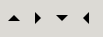

Gnome::Gtk3::StyleContext
=========================

Rendering UI elements

Description
===========

**Gnome::Gtk3::StyleContext** is an object that stores styling information affecting a widget.

In order to construct the final style information, **Gnome::Gtk3::StyleContext** queries information from all attached **Gnome::Gtk3::StyleProviders**. Style providers can be either attached explicitly to the context through `add-provider()`, or to the screen through `add-provider-for-screen()`. The resulting style is a combination of all providers’ information in priority order.

For GTK+ widgets, any **Gnome::Gtk3::StyleContext** returned by `Gnome::Gtk3::Widget.get-style-context()` will already have a **Gnome::Gtk3::WidgetPath**, a **Gnome::Gdk3::Screen** and RTL/LTR information set. The style context will also be updated automatically if any of these settings change on the widget.

If you are using the theming layer standalone, you will need to set a widget path and a screen yourself to the created style context through `set_path()` and `set_screen()`.

Style Classes
-------------

Widgets can add style classes to their context, which can be used to associate different styles by class. The documentation for individual widgets lists which style classes it uses itself, and which style classes may be added by applications to affect their appearance.

GTK+ defines macros for a number of style classes.

Custom styling in UI libraries and applications
-----------------------------------------------

If you are developing a library with custom **Gnome::Gtk3::Widgets** that render differently than standard components, you may need to add a **Gnome::Gtk3::StyleProvider** yourself with the `GTK_STYLE_PROVIDER_PRIORITY_FALLBACK` priority, either a **Gnome::Gtk3::CssProvider** or a custom object implementing the **Gnome::Gtk3::StyleProvider** interface. This way themes may still attempt to style your UI elements in a different way if needed so.

If you are using custom styling on an application, you probably want then to make your style information prevail to the theme’s, so you must use a **Gnome::Gtk3::StyleProvider** with the `GTK_STYLE_PROVIDER_PRIORITY_APPLICATION` priority, keep in mind that the user settings in `XDG_CONFIG_HOME/gtk-3.0/gtk.css` will still take precedence over your changes, as it uses the `GTK_STYLE_PROVIDER_PRIORITY_USER` priority.

Synopsis
========

Declaration
-----------

    unit class Gnome::Gtk3::StyleContext;
    also is Gnome::GObject::Object;

Inheriting this class
---------------------

Inheriting is done in a special way in that it needs a call from new() to get the native object created by the class you are inheriting from.

    use Gnome::Gtk3::StyleContext:api<1>;

    unit class MyGuiClass;
    also is Gnome::Gtk3::StyleContext;

    submethod new ( |c ) {
      # let the Gnome::Gtk3::StyleContext class process the options
      self.bless( :GtkStyleContext, |c);
    }

    submethod BUILD ( ... ) {
      ...
    }

Example
-------

Types
=====

GtkStyleContextPrintFlags
-------------------------

Flags that modify the behavior of gtk_style_context_to_string(). New values may be added to this enumeration.

  * GTK_STYLE_CONTEXT_PRINT_NONE;

  * GTK_STYLE_CONTEXT_PRINT_RECURSE; Print the entire tree of CSS nodes starting at the style context's node

  * GTK_STYLE_CONTEXT_PRINT_SHOW_STYLE; Show the values of the CSS properties for each node

Methods
=======

new
---

### default, no options

Create a new plain object. The value doesn't have to be True nor False. The name only will suffice.

    multi method new ( )

### :native-object

Create a StyleContext object using a native object from elsewhere. See also **Gnome::N::TopLevelClassSupport**.

    multi method new ( N-GObject :$native-object! )

### :build-id

Create a StyleContext object using a native object returned from a builder. See also **Gnome::GObject::Object**.

    multi method new ( Str :$build-id! )

add-class
---------

Adds a style class to *context*, so posterior calls to `get()` or any of the gtk-render-*() functions will make use of this new class for styling.

In the CSS file format, a **Gnome::Gtk3::Entry** defining a “search” class, would be matched by:

    entry.search { … }

While any widget defining a “search” class would be matched by:

      .search { … }

      method add-class ( Str $class_name )

  * Str $class_name; class name to use in styling

add-provider
------------

Adds a style provider to *context*, to be used in style construction. Note that a style provider added by this function only affects the style of the widget to which *context* belongs. If you want to affect the style of all widgets, use `add-provider-for-screen()`.

Note: If both priorities are the same, a **Gnome::Gtk3::StyleProvider** added through this function takes precedence over another added through `add-provider-for-screen()`.

    method add-provider ( N-GObject $provider, UInt $priority )

  * N-GObject $provider; a **Gnome::Gtk3::StyleProvider**

  * UInt $priority; the priority of the style provider. The lower it is, the earlier it will be used in the style construction. Typically this will be in the range between `GTK-STYLE-PROVIDER-PRIORITY-FALLBACK` and `GTK-STYLE-PROVIDER-PRIORITY-USER`

add-provider-for-screen
-----------------------

Adds a global style provider to *screen*, which will be used in style construction for all **Gnome::Gtk3::StyleContexts** under *screen*.

GTK+ uses this to make styling information from **Gnome::Gtk3::Settings** available.

Note: If both priorities are the same, A **Gnome::Gtk3::StyleProvider** added through `add-provider()` takes precedence over another added through this function.

    method add-provider-for-screen ( N-GObject $screen, N-GObject $provider, UInt $priority )

  * N-GObject $screen; a **Gnome::Gtk3::Screen**

  * N-GObject $provider; a **Gnome::Gtk3::StyleProvider**

  * UInt $priority; the priority of the style provider. The lower it is, the earlier it will be used in the style construction. Typically this will be in the range between `GTK-STYLE-PROVIDER-PRIORITY-FALLBACK` and `GTK-STYLE-PROVIDER-PRIORITY-USER`

get-border, get-border-rk
-------------------------

Returns the border for a given state as a **Gnome::Gtk3::Border**.

    method get-border ( UInt $state --> N-GtkBorder )
    method get-border-rk ( UInt $state --> Gnome::Gtk3::Border )

  * UInt $state; state flags from GtkStateFlags to retrieve the border for

get-color, get-color-rk
-----------------------

Returns the foreground color for a given state.

    method get-color ( Uint $state --> N-GdkRGBA )
    method get-color-rk ( UInt $state --> Gnome::Gdk3::RGBA )

  * UInt $state; state flags from GtkStateFlags to retrieve the color for

get-junction-sides
------------------

Returns the sides where rendered elements connect visually with others.

Returns: the junction sides mask. Bits are from GtkJunctionSides.

    method get-junction-sides ( --> UInt )

get-margin, get-margin-rk
-------------------------

Returns the margin for a given state as a **Gnome::Gtk3::Border**.

    method get-margin ( UInt $state --> N-GtkBorder )
    method get-margin-rk ( UInt $state --> Gnome::Gtk3::Border )

  * UInt $state; state flags from GtkStateFlags to retrieve the border for

get-padding, get-padding-rk
---------------------------

Returns the padding for a given state as a **Gnome::Gtk3::Border**.

    method get-padding ( UInt $state --> N-GtkBorder )
    method get-padding-rk ( UInt $state --> Gnome::Gtk3::Border )

  * UInt $state; state flags from GtkStateFlagsto retrieve the padding for

get-parent, get-parent-rk
-------------------------

Gets the parent context set via `set-parent()`. See that function for details.

Returns: the parent context or `undefined`

    method get-parent ( --> N-GObject )
    method get-parent-rk ( --> Gnome::Gtk3::StyleContext )

get-path, get-path-rk
---------------------

Returns the widget path used for style matching.

Returns: A **Gnome::Gtk3::WidgetPath**

    method get-path ( --> N-GObject )
    method get-path-rk ( --> Gnome::Gtk3::WidgetPath )

get-scale
---------

Returns the scale used for assets.

Returns: the scale

    method get-scale ( --> Int )

get-screen, get-screen-rk
-------------------------

Returns the **Gnome::Gtk3::Screen** to which *context* is attached.

Returns: a **Gnome::Gtk3::Screen**.

    method get-screen ( --> N-GObject )
    method get-screen-rk ( --> Gnome::Gdk3::Screen )

get-section, get-section-rk
---------------------------

Queries the location in the CSS where *$property* was defined for the current *context*. Note that the state to be queried is taken from `get-state()`.

If the location is not available, `undefined` will be returned. The location might not be available for various reasons, such as the property being overridden, *$property* not naming a supported CSS property or tracking of definitions being disabled for performance reasons.

Shorthand CSS properties cannot be queried for a location and will always return `undefined`.

Returns: `undefined` or the section where a value for *$property* was defined

    method get-section ( Str $property --> N-GObject )
    method get-section-rk ( Str $property --> Gnome::Gtk3::CssSection )

  * $property; style property name

get-state
---------

Returns the state used for style matching.

This method should only be used to retrieve the bit mask of GtkStateFlags to pass to **Gnome::Gtk3::StyleContext** methods, like `get-padding()`. If you need to retrieve the current state of a **Gnome::Gtk3::Widget**, use `Gnome::Gtk3::Widget.get-state-flags()`.

Returns: the state flags bit mask from `GtkStateFlags`

    method get-state ( --> UInt )

get-style-property, get-style-property-rk
-----------------------------------------

Gets the value for a widget style property.

When *value* is no longer needed, `g-value-unset()` must be called to free any allocated memory.

    method get-style-property ( Str $property_name --> N-GValue )
    method get-style-property-rk ( Str $property_name --> Gnome::GObject::Value )

  * Str $property_name; the name of the widget style property

  * N-GObject $value; Return location for the property value

has-class
---------

Returns `True` if *context* currently has defined the given class name.

Returns: `True` if *context* has *class-name* defined

    method has-class ( Str $class_name --> Bool )

  * Str $class_name; a class name

list-classes, list-classes-rk
-----------------------------

Returns the list of classes currently defined in *context*.

Returns: a **Gnome::Gtk3::List** of strings with the currently defined classes. The contents of the list are owned by GTK+, but you must free the list itself with `clear-object()` when you are done with it.

    method list-classes ( --> N-GList )
    method list-classes-rk ( --> Gnome::Glib::List )

lookup-color, lookup-color-rk
-----------------------------

Looks up and resolves a color name in the *context* color map.

Returns: N-GdkRGBA color if *color-name* was found and resolved, undefined or invalid otherwise

    method lookup-color ( Str $color_name --> N-GdkRGBA )
    method lookup-color-rk ( Str $color_name --> Gnome::Gdk3::RGBA )

  * Str $color_name; color name to lookup

remove-class
------------

Removes *class-name* from *context*.

    method remove-class ( Str $class_name )

  * Str $class_name; class name to remove

remove-provider
---------------

Removes *provider* from the style providers list in *context*.

    method remove-provider ( N-GObject $provider )

  * N-GObject $provider; a **Gnome::Gtk3::StyleProvider**

remove-provider-for-screen
--------------------------

Removes *provider* from the global style providers list in *screen*.

    method remove-provider-for-screen ( N-GObject $screen, N-GObject $provider )

  * N-GObject $screen; a **Gnome::Gtk3::Screen**

  * N-GObject $provider; a **Gnome::Gtk3::StyleProvider**

render-activity
---------------

Renders an activity indicator (such as in **Gnome::Gtk3::Spinner**). The state `GTK-STATE-FLAG-CHECKED` determines whether there is activity going on.

    method render-activity (
      cairo_t $cr, Num() $x, Num() $y, Num() $width, Num() $height
    )

  * cairo_t $cr; a **cairo-t**

  * Num() $x; X origin of the rectangle

  * Num() $y; Y origin of the rectangle

  * Num() $width; rectangle width

  * Num() $height; rectangle height

render-arrow
------------

Renders an arrow pointing to *angle*.

Typical arrow rendering at 0, 1⁄2 π;, π; and 3⁄2 π:

    method render-arrow (
      cairo_t $cr, Num() $angle, Num() $x, Num() $y, Num() $size
    )

  * cairo_t $cr; a **cairo-t**

  * Num() $angle; arrow angle from 0 to 2 * `G-PI`, being 0 the arrow pointing to the north

  * Num() $x; X origin of the render area

  * Num() $y; Y origin of the render area

  * Num() $size; square side for render area

render-background
-----------------

Renders the background of an element.

Typical background rendering, showing the effect of `background-image`, `border-width` and `border-radius`:

    method render-background (
      cairo_t $cr, Num() $x, Num() $y, Num() $width, Num() $height
    )

  * cairo_t $cr; a **cairo-t**

  * Num() $x; X origin of the rectangle

  * Num() $y; Y origin of the rectangle

  * Num() $width; rectangle width

  * Num() $height; rectangle height

render-background-get-clip
--------------------------

Returns the area that will be affected (i.e. drawn to) when calling `background()` for the given *context* and rectangle. Returns a N-GdkRectangle (defined in **Gnome::Gdk3::Types**).

    method render-background-get-clip (
      Num() $x, Num() $y, Num() $width, Num() $height --> N-GdkRectangle
    )

  * Num() $x; X origin of the rectangle

  * Num() $y; Y origin of the rectangle

  * Num() $width; rectangle width

  * Num() $height; rectangle height

render-check
------------

Renders a checkmark (as in a **Gnome::Gtk3::CheckButton**).

The `GTK-STATE-FLAG-CHECKED` state determines whether the check is on or off, and `GTK-STATE-FLAG-INCONSISTENT` determines whether it should be marked as undefined.

Typical checkmark rendering:

    method render-check (
      cairo_t $cr, Num() $x, Num() $y, Num() $width, Num() $height
    )

  * cairo_t $cr; a **cairo-t**

  * Num() $x; X origin of the rectangle

  * Num() $y; Y origin of the rectangle

  * Num() $width; rectangle width

  * Num() $height; rectangle height

render-expander
---------------

Renders an expander (as used in **Gnome::Gtk3::TreeView** and **Gnome::Gtk3::Expander**) in the area defined by *x*, *y*, *width*, *height*. The state `GTK-STATE-FLAG-CHECKED` determines whether the expander is collapsed or expanded.

Typical expander rendering:

    method render-expander (
      cairo_t $cr, Num() $x, Num() $y, Num() $width, Num() $height
    )

  * cairo_t $cr; a **cairo-t**

  * Num() $x; X origin of the rectangle

  * Num() $y; Y origin of the rectangle

  * Num() $width; rectangle width

  * Num() $height; rectangle height

render-extension
----------------

Renders a extension (as in a **Gnome::Gtk3::Notebook** tab) in the rectangle defined by *x*, *y*, *width*, *height*. The side where the extension connects to is defined by *gap-side*.

Typical extension rendering:

    method render-extension (
      cairo_t $cr, Num() $x, Num() $y, Num() $width, Num() $height,
      GtkPositionType $gap_side
    )

  * cairo_t $cr; a **cairo-t**

  * Num() $x; X origin of the rectangle

  * Num() $y; Y origin of the rectangle

  * Num() $width; rectangle width

  * Num() $height; rectangle height

  * GtkPositionType $gap_side; side where the gap is

render-focus
------------

Renders a focus indicator on the rectangle determined by *x*, *y*, *width*, *height*.

Typical focus rendering:

    method render-focus (
      cairo_t $cr, Num() $x, Num() $y, Num() $width, Num() $height
    )

  * cairo_t $cr; a **cairo-t**

  * Num() $x; X origin of the rectangle

  * Num() $y; Y origin of the rectangle

  * Num() $width; rectangle width

  * Num() $height; rectangle height

render-frame
------------

Renders a frame around the rectangle defined by *x*, *y*, *width*, *height*.

Examples of frame rendering, showing the effect of `border-image`, `border-color`, `border-width`, `border-radius` and junctions:

    method render-frame (
      cairo_t $cr, Num() $x, Num() $y, Num() $width, Num() $height
    )

  * cairo_t $cr; a **cairo-t**

  * Num() $x; X origin of the rectangle

  * Num() $y; Y origin of the rectangle

  * Num() $width; rectangle width

  * Num() $height; rectangle height

render-handle
-------------

Renders a handle (as in **Gnome::Gtk3::HandleBox**, **Gnome::Gtk3::Paned** and **Gnome::Gtk3::Window**’s resize grip), in the rectangle determined by *x*, *y*, *width*, *height*.

Handles rendered for the paned and grip classes:

    method render-handle (
      cairo_t $cr, Num() $x, Num() $y, Num() $width, Num() $height
    )

  * cairo_t $cr; a **cairo-t**

  * Num() $x; X origin of the rectangle

  * Num() $y; Y origin of the rectangle

  * Num() $width; rectangle width

  * Num() $height; rectangle height

render-icon
-----------

Renders the icon in *pixbuf* at the specified *x* and *y* coordinates.

This function will render the icon in *pixbuf* at exactly its size, regardless of scaling factors, which may not be appropriate when drawing on displays with high pixel densities.

You probably want to use `icon-surface()` instead, if you already have a Cairo surface.

    method render-icon (
      cairo_t $cr, N-GPixbuf $pixbuf, Num() $x, Num() $y
    )

  * cairo_t $cr; a **cairo-t**

  * N-GObject $pixbuf; a **Gnome::Gtk3::Pixbuf** containing the icon to draw

  * Num() $x; X position for the *pixbuf*

  * Num() $y; Y position for the *pixbuf*

render-icon-surface
-------------------

Renders the icon in *surface* at the specified *x* and *y* coordinates.

    method render-icon-surface (
      cairo_t $cr, cairo_surface_t $surface, Num() $x, Num() $y
    )

  * cairo_t $cr; a **cairo-t**

  * cairo_surface_t $surface; a **cairo-surface-t** containing the icon to draw

  * Num() $x; X position for the *icon*

  * Num() $y; Y position for the *incon*

render-line
-----------

Renders a line from (x0, y0) to (x1, y1).

    method render-line (
      cairo_t $cr, Num() $x0, Num() $y0, Num() $x1, Num() $y1
    )

  * cairo_t $cr; a **cairo-t**

  * Num() $x0; X coordinate for the origin of the line

  * Num() $y0; Y coordinate for the origin of the line

  * Num() $x1; X coordinate for the end of the line

  * Num() $y1; Y coordinate for the end of the line

render-option
-------------

Renders an option mark (as in a **Gnome::Gtk3::RadioButton**), the `GTK-STATE-FLAG-CHECKED` state will determine whether the option is on or off, and `GTK-STATE-FLAG-INCONSISTENT` whether it should be marked as undefined.

Typical option mark rendering:

    method render-option (
      cairo_t $cr, Num() $x, Num() $y, Num() $width, Num() $height
    )

  * cairo_t $cr; a **cairo-t**

  * Num() $x; X origin of the rectangle

  * Num() $y; Y origin of the rectangle

  * Num() $width; rectangle width

  * Num() $height; rectangle height

render-slider
-------------

Renders a slider (as in **Gnome::Gtk3::Scale**) in the rectangle defined by *x*, *y*, *width*, *height*. *orientation* defines whether the slider is vertical or horizontal.

Typical slider rendering:

    method render-slider (
      cairo_t $cr, Num() $x, Num() $y, Num() $width, Num() $height,
      GtkOrientation $orientation
    )

  * cairo_t $cr; a **cairo-t**

  * Num() $x; X origin of the rectangle

  * Num() $y; Y origin of the rectangle

  * Num() $width; rectangle width

  * Num() $height; rectangle height

  * GtkOrientation $orientation; orientation of the slider

reset-widgets
-------------

This function recomputes the styles for all widgets under a particular **Gnome::Gtk3::Screen**. This is useful when some global parameter has changed that affects the appearance of all widgets, because when a widget gets a new style, it will both redraw and recompute any cached information about its appearance. As an example, it is used when the color scheme changes in the related **Gnome::Gtk3::Settings** object.

    method reset-widgets ( N-GObject $screen )

  * N-GObject $screen; a **Gnome::Gtk3::Screen**

restore
-------

Restores *context* state to a previous stage. See `save()`.

    method restore ( )

save
----

Saves the *context* state, so temporary modifications done through `add-class()`, `remove-class()`, `set-state()`, etc. can quickly be reverted in one go through `gtk-style-context-restore()`.

The matching call to `gtk-style-context-restore()` must be done before GTK returns to the main loop.

    method save ( )

set-junction-sides
------------------

Sets the sides where rendered elements (mostly through `render-frame()`) will visually connect with other visual elements.

This is merely a hint that may or may not be honored by themes.

Container widgets are expected to set junction hints as appropriate for their children, so it should not normally be necessary to call this function manually.

    method set-junction-sides ( UInt $sides )

  * UInt $sides; sides where rendered elements are visually connected to other elements. Bits ae from GtkJunctionSides.

set-parent
----------

Sets the parent style context for *context*. The parent style context is used to implement [inheritance](http://www.w3.org/TR/css3-cascade/**inheritance**) of properties.

If you are using a **Gnome::Gtk3::StyleContext** returned from `gtk-widget-get-style-context()`, the parent will be set for you.

    method set-parent ( N-GObject $parent )

  * N-GObject $parent; the new parent or `undefined`

set-path
--------

Sets the **Gnome::Gtk3::WidgetPath** used for style matching. As a consequence, the style will be regenerated to match the new given path.

If you are using a **Gnome::Gtk3::StyleContext** returned from `Gnome::Gtk3::Widget.get-style-context()`, you do not need to call this yourself.

    method set-path ( N-GObject $path )

  * N-GObject $path; a **Gnome::Gtk3::WidgetPath**

set-scale
---------

Sets the scale to use when getting image assets for the style.

    method set-scale ( Int() $scale )

  * Int() $scale; scale

set-screen
----------

Attaches *context* to the given screen.

The screen is used to add style information from “global” style providers, such as the screen’s **Gnome::Gtk3::Settings** instance.

If you are using a **Gnome::Gtk3::StyleContext** returned from `gtk-widget-get-style-context()`, you do not need to call this yourself.

    method set-screen ( N-GObject $screen )

  * N-GObject $screen; a **Gnome::Gtk3::Screen**

set-state
---------

Sets the state bit mask to be used for style matching.

    method set-state ( UInt $flags )

  * UInt $flags; state to represent using bits from GtkStateFlags

to-string
---------

Converts the style context into a string representation.

The string representation always includes information about the name, state, id, visibility and style classes of the CSS node that is backing *context*. Depending on the flags, more information may be included.

This function is intended for testing and debugging of the CSS implementation in GTK+. There are no guarantees about the format of the returned string, it may change.

Returns: a newly allocated string representing *context*

    method to-string ( Uint $flags --> Str )

  * UInt $flags; Flags that determine what to print. Nits are from GtkStyleContextPrintFlags

Signals
=======

There are two ways to connect to a signal. The first option you have is to use `register-signal()` from **Gnome::GObject::Object**. The second option is to use `connect-object()` directly from **Gnome::GObject::Signal**.

First method
------------

The positional arguments of the signal handler are all obligatory as well as their types. The named attributes `:$widget` and user data are optional.

    # handler method
    method mouse-event ( GdkEvent $event, :$widget ) { ... }

    # connect a signal on window object
    my Gnome::Gtk3::Window $w .= new( ... );
    $w.register-signal( self, 'mouse-event', 'button-press-event');

Second method
-------------

    my Gnome::Gtk3::Window $w .= new( ... );
    my Callable $handler = sub (
      N-GObject $native, GdkEvent $event, OpaquePointer $data
    ) {
      ...
    }

    $w.connect-object( 'button-press-event', $handler);

Also here, the types of positional arguments in the signal handler are important. This is because both methods `register-signal()` and `connect-object()` are using the signatures of the handler routines to setup the native call interface.

Supported signals
-----------------

### changed

The *changed* signal is emitted when there is a change in the **Gnome::Gtk3::StyleContext**.

For a **Gnome::Gtk3::StyleContext** returned by `Gnome::Gtk3::Widget.get-style-context()`, the *style-updated* signal might be more convenient to use.

This signal is useful when using the theming layer standalone.

    method handler (
      Int :$_handle_id,
      Gnome::Gtk3::StyleContext :$_widget,
      *%user-options
    );

  * $_handle_id; the registered event handler id

  * $_widget; the object which received the signal.

Properties
==========

An example of using a string type property of a **Gnome::Gtk3::Label** object. This is just showing how to set/read a property, not that it is the best way to do it. This is because a) The class initialization often provides some options to set some of the properties and b) the classes provide many methods to modify just those properties. In the case below one can use **new(:label('my text label'))** or **.set-text('my text label')**.

    my Gnome::Gtk3::Label $label .= new;
    my Gnome::GObject::Value $gv .= new(:init(G_TYPE_STRING));
    $label.get-property( 'label', $gv);
    $gv.set-string('my text label');

Supported properties
--------------------

### Direction: direction

Text direction Default value: False

The **Gnome::GObject::Value** type of property *direction* is `G_TYPE_ENUM`.

### FrameClock: paint-clock

The associated GdkFrameClock Widget type: GDK-TYPE-FRAME-CLOCK

The **Gnome::GObject::Value** type of property *paint-clock* is `G_TYPE_OBJECT`.

### Parent: parent

Sets or gets the style context’s parent. See `set-parent()` for details.

    Widget type: GTK_TYPE_STYLE_CONTEXT

The **Gnome::GObject::Value** type of property *parent* is `G_TYPE_OBJECT`.

### Screen: screen

The associated GdkScreen Widget type: GDK-TYPE-SCREEN

The **Gnome::GObject::Value** type of property *screen* is `G_TYPE_OBJECT`.

