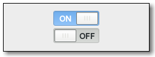

Gnome::Gtk3::Switch
===================

A “light switch” style toggle

Description
===========

**Gnome::Gtk3::Switch** is a widget that has two states: on or off. The user can control which state should be active by clicking the empty area, or by dragging the handle.

**Gnome::Gtk3::Switch** can also handle situations where the underlying state changes with a delay. See *state-set* for details.

Css Nodes
---------

    switch
    ╰── slider

**Gnome::Gtk3::Switch** has two css nodes, the main node with the name switch and a subnode named slider. Neither of them is using any style classes.

Implemented Interfaces
----------------------

Gnome::Gtk3::Switch implements

See Also
--------

**Gnome::Gtk3::ToggleButton**

Synopsis
========

Declaration
-----------

    unit class Gnome::Gtk3::Switch;
    also is Gnome::Gtk3::Widget;

Methods
=======

new
---

Create a new default object.

    multi method new ( )

Create an object using a native object from elsewhere. See also **Gnome::GObject::Object**.

    multi method new ( N-GObject :$native-object! )

Create an object using a native object from a builder. See also **Gnome::GObject::Object**.

    multi method new ( Str :$build-id! )

gtk_switch_new
--------------

Creates a new **Gnome::Gtk3::Switch** widget.

Returns: the newly created **Gnome::Gtk3::Switch** instance

Since: 3.0

    method gtk_switch_new ( --> N-GObject )

[gtk_switch_] set_active
------------------------

Changes the state of the switch to the desired one.

Since: 3.0

    method gtk_switch_set_active ( Int $is_active )

  * Int $is_active; `True` if *sw* should be active, and `False` otherwise

[gtk_switch_] get_active
------------------------

Gets whether the **Gnome::Gtk3::Switch** is in its “on” or “off” state.

Returns: `1` if the **Gnome::Gtk3::Switch** is active, and `0` otherwise

Since: 3.0

    method gtk_switch_get_active ( --> Int )

[gtk_switch_] set_state
-----------------------

Sets the underlying state of the **Gnome::Gtk3::Switch**.

Normally, this is the same as *active*, unless the switch is set up for delayed state changes. This function is typically called from a *state-set* signal handler.

See *state-set* for details.

Since: 3.14

    method gtk_switch_set_state ( Int $state )

  * Int $state; the new state

[gtk_switch_] get_state
-----------------------

Gets the underlying state of the **Gnome::Gtk3::Switch**.

Returns: the underlying state

Since: 3.14

    method gtk_switch_get_state ( --> Int )

Signals
=======

There are two ways to connect to a signal. The first option you have is to use `register-signal()` from **Gnome::GObject::Object**. The second option is to use `g_signal_connect_object()` directly from **Gnome::GObject::Signal**.

First method
------------

The positional arguments of the signal handler are all obligatory as well as their types. The named attributes `:$widget` and user data are optional.

    # handler method
    method mouse-event ( N-GdkEvent $event, :$widget ) { ... }

    # connect a signal on window object
    my Gnome::Gtk3::Window $w .= new( ... );
    $w.register-signal( self, 'mouse-event', 'button-press-event');

Second method
-------------

    my Gnome::Gtk3::Window $w .= new( ... );
    my Callable $handler = sub (
      N-GObject $native, N-GdkEvent $event, OpaquePointer $data
    ) {
      ...
    }

    $w.connect-object( 'button-press-event', $handler);

Also here, the types of positional arguments in the signal handler are important. This is because both methods `register-signal()` and `g_signal_connect_object()` are using the signatures of the handler routines to setup the native call interface.

Supported signals
-----------------

### activate

The *activate* signal on **Gnome::Gtk3::Switch** is an action signal and emitting it causes the switch to animate. Applications should never connect to this signal, but use the notify::active signal.

    method handler (
      Int :$_handler_id,
      Gnome::GObject::Object :_widget($widget),
      *%user-options
    );

  * $widget; the object which received the signal.

### state-set

The *state-set* signal on **Gnome::Gtk3::Switch** is emitted to change the underlying state. It is emitted when the user changes the switch position. The default handler keeps the state in sync with the *active* property.

To implement delayed state change, applications can connect to this signal, initiate the change of the underlying state, and call `gtk_switch_set_state()` when the underlying state change is complete. The signal handler should return `1` to prevent the default handler from running.

Visually, the underlying state is represented by the trough color of the switch, while the *active* property is represented by the position of the switch.

Returns: `1` to stop the signal emission

Since: 3.14

    method handler (
      Int $state,
      Int :$_handler_id,
      Gnome::GObject::Object :_widget($widget),
      *%user-options
      --> Int
    );

  * $widget; the object on which the signal was emitted

  * $state; the new state of the switch

Properties
==========

An example of using a string type property of a **Gnome::Gtk3::Label** object. This is just showing how to set/read a property, not that it is the best way to do it. This is because a) The class initialization often provides some options to set some of the properties and b) the classes provide many methods to modify just those properties. In the case below one can use **new(:label('my text label'))** or **gtk_label_set_text('my text label')**.

    my Gnome::Gtk3::Label $label .= new;
    my Gnome::GObject::Value $gv .= new(:init(G_TYPE_STRING));
    $label.g-object-get-property( 'label', $gv);
    $gv.g-value-set-string('my text label');

Supported properties
--------------------

### Active

Whether the **Gnome::Gtk3::Switch** widget is in its on or off state.

The **Gnome::GObject::Value** type of property *active* is `G_TYPE_BOOLEAN`.

### State

The backend state that is controlled by the switch. See *state-set* for details. Since: 3.14

The **Gnome::GObject::Value** type of property *state* is `G_TYPE_BOOLEAN`.

