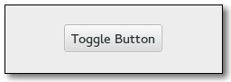

Gnome::Gtk3::ToggleButton
=========================

Create buttons which retain their state

Description
===========

A **Gnome::Gtk3::ToggleButton** is a **Gnome::Gtk3::Button** which will remain “pressed-in” when clicked. Clicking again will cause the toggle button to return to its normal state.

A toggle button is created by calling either `gtk_toggle_button_new()` or `gtk_toggle_button_new_with_label()`. If using the former, it is advisable to pack a widget, (such as a **Gnome::Gtk3::Label** and/or a **Gnome::Gtk3::Image**), into the toggle button’s container. (See **Gnome::Gtk3::Button** for more information).

The state of a **Gnome::Gtk3::ToggleButton** can be set specifically using `gtk_toggle_button_set_active()`, and retrieved using `gtk_toggle_button_get_active()`.

To simply switch the state of a toggle button, use `gtk_toggle_button_toggled()`.

Css Nodes
---------

**Gnome::Gtk3::ToggleButton** has a single CSS node with name button. To differentiate it from a plain **Gnome::Gtk3::Button**, it gets the .toggle style class.

See Also
--------

**Gnome::Gtk3::Button**, **Gnome::Gtk3::CheckButton**, **Gnome::Gtk3::CheckMenuItem**

Synopsis
========

Declaration
-----------

    unit class Gnome::Gtk3::ToggleButton;
    also is Gnome::Gtk3::Button;

Uml Diagram
-----------

Methods
=======

new
---

### default, no options

Creates a new toggle button. A widget should be packed into the button, as in `Gnome::Gtk3::Button.new()`.

    multi method new ( )

### :label

Create a **Gnome::Gtk3::ToggleButton** with a label.

    multi method new ( Str :$label! )

### :native-object

Create a ToggleButton object using a native object from elsewhere. See also **Gnome::N::TopLevelClassSupport**.

    multi method new ( N-GObject :$native-object! )

### :build-id

Create a ToggleButton object using a native object returned from a builder. See also **Gnome::GObject::Object**.

    multi method new ( Str :$build-id! )

get-active
----------

Queries a **Gnome::Gtk3::ToggleButton** and returns its current state. Returns `True` if the toggle button is pressed in and `False` if it is raised.

Returns: a **gboolean** value.

    method get-active ( --> Bool )

get-inconsistent
----------------

Gets the value set by `set-inconsistent()`.

Returns: `True` if the button is displayed as inconsistent, `False` otherwise

    method get-inconsistent ( --> Bool )

get-mode
--------

Retrieves whether the button is displayed as a separate indicator and label. See `set-mode()`.

Returns: `True` if the togglebutton is drawn as a separate indicator and label.

    method get-mode ( --> Bool )

set-active
----------

Sets the status of the toggle button. Set to `True` if you want the **Gnome::Gtk3::ToggleButton** to be “pressed in”, and `False` to raise it. This action causes the *toggled* signal and the *clicked* signal to be emitted.

    method set-active ( Bool $is-active )

  * Bool $is-active; `True` for pressed in, `False` otherwise

set-inconsistent
----------------

If the user has selected a range of elements (such as some text or spreadsheet cells) that are affected by a toggle button, and the current values in that range are inconsistent, you may want to display the toggle in an “in between” state. This function turns on “in between” display. Normally you would turn off the inconsistent state again if the user toggles the toggle button. This has to be done manually, `set-inconsistent()` only affects visual appearance, it doesn’t affect the semantics of the button.

    method set-inconsistent ( Bool $setting )

  * Bool $setting; `True` if state is inconsistent

set-mode
--------

Sets whether the button is displayed as a separate indicator and label. You can call this function on a checkbutton or a radiobutton with *$draw-indicator* = `False` to make the button look like a normal button.

This can be used to create linked strip of buttons that work like a **Gnome::Gtk3::StackSwitcher**.

This function only affects instances of classes like **Gnome::Gtk3::CheckButton** and **Gnome::Gtk3::RadioButton** that derive from **Gnome::Gtk3::ToggleButton**, not instances of **Gnome::Gtk3::ToggleButton** itself.

    method set-mode ( Bool $draw-indicator )

  * Bool $draw-indicator; if `True`, draw the button as a separate indicator and label; if `False`, draw the button like a normal button

toggled
-------

Emits the *toggled* signal on the **Gnome::Gtk3::ToggleButton**. There is no good reason for an application ever to call this function.

    method toggled ( )

Signals
=======

There are two ways to connect to a signal. The first option you have is to use `register-signal()` from **Gnome::GObject::Object**. The second option is to use `connect-object()` directly from **Gnome::GObject::Signal**.

First method
------------

The positional arguments of the signal handler are all obligatory as well as their types. The named attributes `:$widget` and user data are optional.

    # handler method
    method mouse-event ( GdkEvent $event, :$widget ) { ... }

    # connect a signal on window object
    my Gnome::Gtk3::Window $w .= new( ... );
    $w.register-signal( self, 'mouse-event', 'button-press-event');

Second method
-------------

    my Gnome::Gtk3::Window $w .= new( ... );
    my Callable $handler = sub (
      N-GObject $native, GdkEvent $event, OpaquePointer $data
    ) {
      ...
    }

    $w.connect-object( 'button-press-event', $handler);

Also here, the types of positional arguments in the signal handler are important. This is because both methods `register-signal()` and `connect-object()` are using the signatures of the handler routines to setup the native call interface.

Supported signals
-----------------

### toggled

Should be connected if you wish to perform an action whenever the **Gnome::Gtk3::ToggleButton**'s state is changed.

    method handler (
      Int :$_handle_id,
      Gnome::GObject::Object :_widget($togglebutton),
      *%user-options
    );

  * $togglebutton; the object which received the signal.

  * $_handle_id; the registered event handler id

Properties
==========

An example of using a string type property of a **Gnome::Gtk3::Label** object. This is just showing how to set/read a property, not that it is the best way to do it. This is because a) The class initialization often provides some options to set some of the properties and b) the classes provide many methods to modify just those properties. In the case below one can use **new(:label('my text label'))** or **.set-text('my text label')**.

    my Gnome::Gtk3::Label $label .= new;
    my Gnome::GObject::Value $gv .= new(:init(G_TYPE_STRING));
    $label.get-property( 'label', $gv);
    $gv.set-string('my text label');

Supported properties
--------------------

### Active: active

If the toggle button should be pressed in Default value: False

The **Gnome::GObject::Value** type of property *active* is `G_TYPE_BOOLEAN`.

### Draw Indicator: draw-indicator

If the toggle part of the button is displayed Default value: False

The **Gnome::GObject::Value** type of property *draw-indicator* is `G_TYPE_BOOLEAN`.

### Inconsistent: inconsistent

If the toggle button is in an \in between\ state Default value: False

The **Gnome::GObject::Value** type of property *inconsistent* is `G_TYPE_BOOLEAN`.

