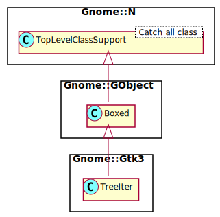

Gnome::Gtk3::TreeIter
=====================

Description
===========

A struct that specifies a TreeIter.

Synopsis
========

Declaration
-----------

    unit class Gnome::Gtk3::TreeIter;
    also is Gnome::GObject::Boxed;

Uml Diagram
-----------

Types
=====

class N-GtkTreeIter
-------------------

The **Gnome::Gtk3::TreeIter** is the primary structure for accessing a **Gnome::Gtk3::TreeModel**. Tree iterators are not created by the users application but are returned from TreeModel implementations such as **Gnome::Gtk3::TreeStore**.

Methods
=======

[gtk_] tree_iter_copy
---------------------

Creates a dynamically allocated tree iterator as a copy of *iter*.

This function is not intended for use in applications, because you can just copy the structures by value like so;

    Gnome::Gtk3::TreeIter $new_iter .= new(
     :native-object($iter.get-native-object())
    );

You must free this iter with `clear-object()`.

Returns: a newly-allocated copy of *iter*

    method gtk_tree_iter_copy ( --> N-GtkTreeIter  )

  * N-GtkTreeIter $iter; a **Gnome::Gtk3::TreeIter**-struct

