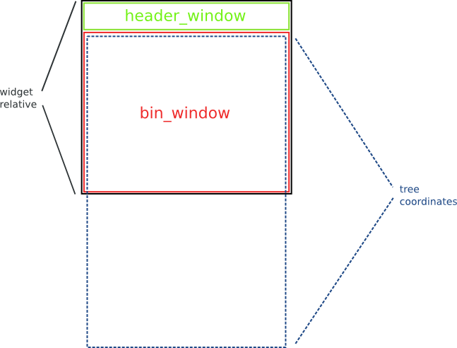

Gnome::Gtk3::TreeView
=====================

A widget for displaying both trees and lists

Description
===========

Widget that displays any object that implements the **Gnome::Gtk3::TreeModel** interface.

Please refer to the [tree widget conceptual overview](https://developer.gnome.org/gtk3/3.24/TreeWidget.html) for an overview of all the objects and data types related to the tree widget and how they work together.

Coordinate systems
------------------

Several different coordinate systems are exposed in the **Gnome::Gtk3::TreeView** API.

Coordinate systems in **Gnome::Gtk3::TreeView** API:

  * Widget coordinates: Coordinates relative to the widget (usually `widget->window`).

  * Bin window coordinates: Coordinates relative to the window that **Gnome::Gtk3::TreeView** renders to.

  * Tree coordinates: Coordinates relative to the entire scrollable area of **Gnome::Gtk3::TreeView**. These coordinates start at (0, 0) for row 0 of the tree.

Several functions are available for converting between the different coordinate systems. The most common translations are between widget and bin window coordinates and between bin window and tree coordinates. For the former you can use `gtk_tree_view_convert_widget_to_bin_window_coords()` (and vice versa), for the latter `gtk_tree_view_convert_bin_window_to_tree_coords()` (and vice versa).

Gnome::Gtk3::TreeView as Gnome::Gtk3::Buildable
-----------------------------------------------

The **Gnome::Gtk3::TreeView** implementation of the **Gnome::Gtk3::Buildable** interface accepts **Gnome::Gtk3::TreeViewColumn** objects as <child> elements and exposes the internal **Gnome::Gtk3::TreeSelection** in UI definitions.

An example of a UI definition fragment with **Gnome::Gtk3::TreeView**:

    <object class="GtkTreeView" id="treeview">
      <property name="model">liststore1</property>
      <child>
        <object class="GtkTreeViewColumn" id="test-column">
          <property name="title">Test</property>
          <child>
            <object class="GtkCellRendererText" id="test-renderer"/>
            <attributes>
              <attribute name="text">1</attribute>
            </attributes>
          </child>
        </object>
      </child>
      <child internal-child="selection">
        <object class="GtkTreeSelection" id="selection">
          <signal name="changed" handler="on_treeview_selection_changed"/>
        </object>
      </child>
    </object>

Css Nodes
---------

    treeview.view
    ├── header
    │   ├── <column header>
    ┊   ┊
    │   ╰── <column header>
    │
    ╰── [rubberband]

**Gnome::Gtk3::TreeView** has a main CSS node with name treeview and style class .view. It has a subnode with name header, which is the parent for all the column header widgets' CSS nodes. For rubberband selection, a subnode with name rubberband is used.

Implemented Interfaces
----------------------

Gnome::Gtk3::TreeView implements

  * [Gnome::Gtk3::Buildable](Buildable.html)

See Also
--------

**Gnome::Gtk3::TreeViewColumn**, **Gnome::Gtk3::TreeSelection**, **Gnome::Gtk3::TreeModel**,

Synopsis
========

Declaration
-----------

    unit class Gnome::Gtk3::TreeView;
    also is Gnome::Gtk3::Container;
    also does Gnome::Gtk3::Buildable;

Types
=====

enum GtkTreeViewDropPosition
----------------------------

An enum for determining where a dropped row goes.

  * GTK_TREE_VIEW_DROP_BEFORE: dropped row is inserted before

  * GTK_TREE_VIEW_DROP_AFTER: dropped row is inserted after

  * GTK_TREE_VIEW_DROP_INTO_OR_BEFORE: dropped row becomes a child or is inserted before

  * GTK_TREE_VIEW_DROP_INTO_OR_AFTER: dropped row becomes a child or is inserted after

Methods
=======

new
---

Create a new plain object.

    multi method new ( Bool :empty! )

Create a new tree view object using a model. This can be e.g. a **Gnome::Gtk3::ListStore** or **Gnome::Gtk3::TreeStore**.

    multi method new ( Bool :model! )

Create an object using a native object from elsewhere. See also **Gnome::GObject::Object**.

    multi method new ( N-GObject :$widget! )

Create an object using a native object from a builder. See also **Gnome::GObject::Object**.

    multi method new ( Str :$build-id! )

[gtk_] tree_view_new
--------------------

Creates a new **Gnome::Gtk3::TreeView** widget.

    method gtk_tree_view_new ( --> N-GObject  )

[[gtk_] tree_view_] new_with_model
----------------------------------

Creates a new **Gnome::Gtk3::TreeView** widget with the model initialized to *model*.

    method gtk_tree_view_new_with_model ( N-GObject $model --> N-GObject  )

  * N-GObject $model; the model.

[[gtk_] tree_view_] get_model
-----------------------------

Returns the model the **Gnome::Gtk3::TreeView** is based on. Returns `Any` if the model is unset.

Returns: (transfer none) (nullable): A **Gnome::Gtk3::TreeModel**, or `Any` if none is currently being used.

    method gtk_tree_view_get_model ( --> N-GObject  )

[[gtk_] tree_view_] set_model
-----------------------------

Sets the model for a **Gnome::Gtk3::TreeView**. If the *tree_view* already has a model set, it will remove it before setting the new model. If *model* is `Any`, then it will unset the old model.

    method gtk_tree_view_set_model ( N-GObject $model )

  * N-GObject $model; (allow-none): The model.

[[gtk_] tree_view_] get_headers_visible
---------------------------------------

Returns `1` if the headers on the *tree_view* are visible.

    method gtk_tree_view_get_headers_visible ( --> Int  )

[[gtk_] tree_view_] set_headers_visible
---------------------------------------

Sets the visibility state of the headers.

    method gtk_tree_view_set_headers_visible ( Int $headers_visible )

  * Int $headers_visible; `1` if the headers are visible

[[gtk_] tree_view_] columns_autosize
------------------------------------

Resizes all columns to their optimal width. Only works after the treeview has been realized.

    method gtk_tree_view_columns_autosize ( )

[[gtk_] tree_view_] get_headers_clickable
-----------------------------------------

Returns `1` if all header columns are clickable, otherwise `0`

Since: 2.10

    method gtk_tree_view_get_headers_clickable ( --> Int  )

[[gtk_] tree_view_] set_headers_clickable
-----------------------------------------

Allow the column title buttons to be clicked.

    method gtk_tree_view_set_headers_clickable ( Int $setting )

  * Int $setting; `1` if the columns are clickable.

[[gtk_] tree_view_] get_activate_on_single_click
------------------------------------------------

Gets the setting set by `gtk_tree_view_set_activate_on_single_click()`. The method returns `1` if row-activated will be emitted on a single click.

Since: 3.8

    method gtk_tree_view_get_activate_on_single_click ( --> Int  )

[[gtk_] tree_view_] set_activate_on_single_click
------------------------------------------------

Cause the *row-activated* signal to be emitted on a single click instead of a double click.

Since: 3.8

    method gtk_tree_view_set_activate_on_single_click ( Int $single )

  * Int $single; `1` to emit row-activated on a single click

[[gtk_] tree_view_] append_column
---------------------------------

Appends *$column* to the list of columns. If this tree view has “fixed_height” mode enabled, then *$column* must have its “sizing” property set to be GTK_TREE_VIEW_COLUMN_FIXED.

Returns: The number of columns in *tree_view* after appending.

    method gtk_tree_view_append_column (
      Gnome::Gtk3::TreeViewColumn $column
      --> Int
    )

  * Gnome::Gtk3::TreeViewColumn $column; The column to add.

[[gtk_] tree_view_] remove_column
---------------------------------

Removes *column* from *tree_view*.

Returns: The number of columns in *tree_view* after removing.

    method gtk_tree_view_remove_column ( N-GObject $column --> Int  )

  * N-GObject $column; The **Gnome::Gtk3::TreeViewColumn** to remove.

[[gtk_] tree_view_] insert_column
---------------------------------

This inserts the *column* into the *tree_view* at *position*. If *position* is -1, then the column is inserted at the end. If *tree_view* has “fixed_height” mode enabled, then *column* must have its “sizing” property set to be GTK_TREE_VIEW_COLUMN_FIXED.

Returns: The number of columns in *tree_view* after insertion.

    method gtk_tree_view_insert_column ( N-GObject $column, Int $position --> Int  )

  * N-GObject $column; The **Gnome::Gtk3::TreeViewColumn** to be inserted.

  * Int $position; The position to insert *column* in.

insert-column-with-attributes
-----------------------------

Creates a new **Gnome::Gtk3::TreeViewColumn** and inserts it into the *tree_view* at *position*. If *position* is -1, then the newly created column is inserted at the end. The column is initialized with the attributes given. If *tree_view* has “fixed_height” mode enabled, then the new column will have its sizing property set to be GTK_TREE_VIEW_COLUMN_FIXED.

Returns: The number of columns in this treeview after insertion.

    method insert-column-with-attributes (
      Int $insert-position,
      Str $title, Gnome::Gtk3::CellRenderer $cellrenderer, ...
      --> Int
    )

  * A repeating list of

    * Int $position; The position to insert the new column in

    * Str $title; The title to set the header to

    * Gnome::Gtk3::CellRenderer $cell; The cell renderer

[[gtk_] tree_view_] get_n_columns
---------------------------------

Queries the number of columns in the given *tree_view*.

Returns: The number of columns in the *tree_view*

Since: 3.4

    method gtk_tree_view_get_n_columns ( --> UInt  )

[[gtk_] tree_view_] get_column
------------------------------

Gets the **Gnome::Gtk3::TreeViewColumn** at the given position in the **tree_view** or undefined if the position is outside the range of columns.

    method gtk_tree_view_get_column ( Int $n --> Gnome::Gtk3::TreeViewColumn )

  * Int $n; The position of the column, counting from 0.

[[gtk_] tree_view_] get_columns
-------------------------------

Returns a **GList** of all the **Gnome::Gtk3::TreeViewColumn** s currently in *tree_view*. The returned list must be freed with `g_list_free()`.

Returns: (element-type **Gnome::Gtk3::TreeViewColumn**) (transfer container): A list of **Gnome::Gtk3::TreeViewColumn** s

    method gtk_tree_view_get_columns ( --> N-GList  )

[[gtk_] tree_view_] move_column_after
-------------------------------------

Moves *column* to be after to *base_column*. If *base_column* is `Any`, then *column* is placed in the first position.

    method gtk_tree_view_move_column_after ( N-GObject $column, N-GObject $base_column )

  * N-GObject $column; The **Gnome::Gtk3::TreeViewColumn** to be moved.

  * N-GObject $base_column; (allow-none): The **Gnome::Gtk3::TreeViewColumn** to be moved relative to, or `Any`.

[[gtk_] tree_view_] set_expander_column
---------------------------------------

Sets the column to draw the expander arrow at. It must be in *tree_view*. If *column* is `Any`, then the expander arrow is always at the first visible column.

If you do not want expander arrow to appear in your tree, set the expander column to a hidden column.

    method gtk_tree_view_set_expander_column ( N-GObject $column )

  * N-GObject $column; `Any`, or the column to draw the expander arrow at.

[[gtk_] tree_view_] get_expander_column
---------------------------------------

Returns the column that is the current expander column. This column has the expander arrow drawn next to it.

Returns: (transfer none): The expander column.

    method gtk_tree_view_get_expander_column ( --> N-GObject  )

[[gtk_] tree_view_] scroll_to_point
-----------------------------------

Scrolls the tree view such that the top-left corner of the visible area is *tree_x*, *tree_y*, where *tree_x* and *tree_y* are specified in tree coordinates. The *tree_view* must be realized before this function is called. If it isn't, you probably want to be using `gtk_tree_view_scroll_to_cell()`.

If either *tree_x* or *tree_y* are -1, then that direction isn’t scrolled.

    method gtk_tree_view_scroll_to_point ( Int $tree_x, Int $tree_y )

  * Int $tree_x; X coordinate of new top-left pixel of visible area, or -1

  * Int $tree_y; Y coordinate of new top-left pixel of visible area, or -1

[[gtk_] tree_view_] expand_all
------------------------------

Recursively expands all nodes in the *tree_view*.

    method gtk_tree_view_expand_all ( )

[[gtk_] tree_view_] collapse_all
--------------------------------

Recursively collapses all visible, expanded nodes in *tree_view*.

    method gtk_tree_view_collapse_all ( )

[[gtk_] tree_view_] set_reorderable
-----------------------------------

This function is a convenience function to allow you to reorder models that support the **Gnome::Gtk3::TreeDragSourceIface** and the **Gnome::Gtk3::TreeDragDestIface**. Both **Gnome::Gtk3::TreeStore** and **Gnome::Gtk3::ListStore** support these. If *reorderable* is `1`, then the user can reorder the model by dragging and dropping rows. The developer can listen to these changes by connecting to the model’s *row-inserted* and *row-deleted* signals. The reordering is implemented by setting up the tree view as a drag source and destination. Therefore, drag and drop can not be used in a reorderable view for any other purpose.

This function does not give you any degree of control over the order -- any reordering is allowed. If more control is needed, you should probably handle drag and drop manually.

    method gtk_tree_view_set_reorderable ( Int $reorderable )

  * Int $reorderable; `1`, if the tree can be reordered.

[[gtk_] tree_view_] get_reorderable
-----------------------------------

Retrieves whether the user can reorder the tree via drag-and-drop. See `gtk_tree_view_set_reorderable()`.

Returns: `1` if the tree can be reordered.

    method gtk_tree_view_get_reorderable ( --> Int  )

[[gtk_] tree_view_] get_bin_window
----------------------------------

Returns the window that *tree_view* renders to. This is used primarily to compare to `event->window` to confirm that the event on *tree_view* is on the right window.

Returns: (nullable) (transfer none): A **Gnome::Gdk3::Window**, or `Any` when *tree_view* hasn’t been realized yet.

    method gtk_tree_view_get_bin_window ( --> N-GObject  )

[[gtk_] tree_view_] get_visible_rect
------------------------------------

Fills *visible_rect* with the currently-visible region of the buffer, in tree coordinates. Convert to bin_window coordinates with `gtk_tree_view_convert_tree_to_bin_window_coords()`. Tree coordinates start at 0,0 for row 0 of the tree, and cover the entire scrollable area of the tree.

    method gtk_tree_view_get_visible_rect ( N-GObject $visible_rect )

  * N-GObject $visible_rect; (out): rectangle to fill

[[gtk_] tree_view_] unset_rows_drag_source
------------------------------------------

Undoes the effect of `gtk_tree_view_enable_model_drag_source()`. Calling this method sets *reorderable* to `0`.

    method gtk_tree_view_unset_rows_drag_source ( )

[[gtk_] tree_view_] unset_rows_drag_dest
----------------------------------------

Undoes the effect of `gtk_tree_view_enable_model_drag_dest()`. Calling this method sets *reorderable* to `0`.

    method gtk_tree_view_unset_rows_drag_dest ( )

[[gtk_] tree_view_] set_enable_search
-------------------------------------

If *enable_search* is set, then the user can type in text to search through the tree interactively (this is sometimes called "typeahead find").

Note that even if this is `0`, the user can still initiate a search using the “start-interactive-search” key binding.

    method gtk_tree_view_set_enable_search ( Int $enable_search )

  * Int $enable_search; `1`, if the user can search interactively

[[gtk_] tree_view_] get_enable_search
-------------------------------------

Returns whether or not the tree allows to start interactive searching by typing in text.

Returns: whether or not to let the user search interactively

    method gtk_tree_view_get_enable_search ( --> Int  )

[[gtk_] tree_view_] get_search_column
-------------------------------------

Gets the column searched on by the interactive search code.

Returns: the column the interactive search code searches in.

    method gtk_tree_view_get_search_column ( --> Int  )

[[gtk_] tree_view_] set_search_column
-------------------------------------

Sets *column* as the column where the interactive search code should search in for the current model.

If the search column is set, users can use the “start-interactive-search” key binding to bring up search popup. The enable-search property controls whether simply typing text will also start an interactive search.

Note that *column* refers to a column of the current model. The search column is reset to -1 when the model is changed.

    method gtk_tree_view_set_search_column ( Int $column )

  * Int $column; the column of the model to search in, or -1 to disable searching

[[gtk_] tree_view_] get_search_entry
------------------------------------

Returns the **Gnome::Gtk3::Entry** which is currently in use as interactive search entry for *tree_view*. In case the built-in entry is being used, `Any` will be returned.

Returns: (transfer none): the entry currently in use as search entry.

Since: 2.10

    method gtk_tree_view_get_search_entry ( --> N-GObject  )

[[gtk_] tree_view_] set_search_entry
------------------------------------

Sets the entry which the interactive search code will use for this *tree_view*. This is useful when you want to provide a search entry in our interface at all time at a fixed position. Passing `Any` for *entry* will make the interactive search code use the built-in popup entry again.

Since: 2.10

    method gtk_tree_view_set_search_entry ( N-GObject $entry )

  * N-GObject $entry; (allow-none): the entry the interactive search code of *tree_view* should use or `Any`

[[gtk_] tree_view_] convert_widget_to_tree_coords
-------------------------------------------------

Converts widget coordinates to coordinates for the tree (the full scrollable area of the tree).

Since: 2.12

    method gtk_tree_view_convert_widget_to_tree_coords ( Int $wx, Int $wy, Int $tx, Int $ty )

  * Int $wx; X coordinate relative to the widget

  * Int $wy; Y coordinate relative to the widget

  * Int $tx; (out): return location for tree X coordinate

  * Int $ty; (out): return location for tree Y coordinate

[[gtk_] tree_view_] convert_tree_to_widget_coords
-------------------------------------------------

Converts tree coordinates (coordinates in full scrollable area of the tree) to widget coordinates.

Since: 2.12

    method gtk_tree_view_convert_tree_to_widget_coords ( Int $tx, Int $ty, Int $wx, Int $wy )

  * Int $tx; X coordinate relative to the tree

  * Int $ty; Y coordinate relative to the tree

  * Int $wx; (out): return location for widget X coordinate

  * Int $wy; (out): return location for widget Y coordinate

[[gtk_] tree_view_] convert_widget_to_bin_window_coords
-------------------------------------------------------

Converts widget coordinates to coordinates for the bin_window (see `gtk_tree_view_get_bin_window()`).

Since: 2.12

    method gtk_tree_view_convert_widget_to_bin_window_coords ( Int $wx, Int $wy, Int $bx, Int $by )

  * Int $wx; X coordinate relative to the widget

  * Int $wy; Y coordinate relative to the widget

  * Int $bx; (out): return location for bin_window X coordinate

  * Int $by; (out): return location for bin_window Y coordinate

[[gtk_] tree_view_] convert_bin_window_to_widget_coords
-------------------------------------------------------

Converts bin_window coordinates (see `gtk_tree_view_get_bin_window()`) to widget relative coordinates.

Since: 2.12

    method gtk_tree_view_convert_bin_window_to_widget_coords ( Int $bx, Int $by, Int $wx, Int $wy )

  * Int $bx; bin_window X coordinate

  * Int $by; bin_window Y coordinate

  * Int $wx; (out): return location for widget X coordinate

  * Int $wy; (out): return location for widget Y coordinate

[[gtk_] tree_view_] convert_tree_to_bin_window_coords
-----------------------------------------------------

Converts tree coordinates (coordinates in full scrollable area of the tree) to bin_window coordinates.

Since: 2.12

    method gtk_tree_view_convert_tree_to_bin_window_coords ( Int $tx, Int $ty, Int $bx, Int $by )

  * Int $tx; tree X coordinate

  * Int $ty; tree Y coordinate

  * Int $bx; (out): return location for X coordinate relative to bin_window

  * Int $by; (out): return location for Y coordinate relative to bin_window

[[gtk_] tree_view_] convert_bin_window_to_tree_coords
-----------------------------------------------------

Converts bin_window coordinates to coordinates for the tree (the full scrollable area of the tree).

Since: 2.12

    method gtk_tree_view_convert_bin_window_to_tree_coords ( Int $bx, Int $by, Int $tx, Int $ty )

  * Int $bx; X coordinate relative to bin_window

  * Int $by; Y coordinate relative to bin_window

  * Int $tx; (out): return location for tree X coordinate

  * Int $ty; (out): return location for tree Y coordinate

[[gtk_] tree_view_] set_fixed_height_mode
-----------------------------------------

Enables or disables the fixed height mode of *tree_view*. Fixed height mode speeds up **Gnome::Gtk3::TreeView** by assuming that all rows have the same height. Only enable this option if all rows are the same height and all columns are of type `GTK_TREE_VIEW_COLUMN_FIXED`.

Since: 2.6

    method gtk_tree_view_set_fixed_height_mode ( Int $enable )

  * Int $enable; `1` to enable fixed height mode

[[gtk_] tree_view_] get_fixed_height_mode
-----------------------------------------

Returns whether fixed height mode is turned on for *tree_view*.

Returns: `1` if *tree_view* is in fixed height mode

Since: 2.6

    method gtk_tree_view_get_fixed_height_mode ( --> Int  )

[[gtk_] tree_view_] set_hover_selection
---------------------------------------

Enables or disables the hover selection mode of *tree_view*. Hover selection makes the selected row follow the pointer. Currently, this works only for the selection modes `GTK_SELECTION_SINGLE` and `GTK_SELECTION_BROWSE`.

Since: 2.6

    method gtk_tree_view_set_hover_selection ( Int $hover )

  * Int $hover; `1` to enable hover selection mode

[[gtk_] tree_view_] get_hover_selection
---------------------------------------

Returns whether hover selection mode is turned on for *tree_view*.

Returns: `1` if *tree_view* is in hover selection mode

Since: 2.6

    method gtk_tree_view_get_hover_selection ( --> Int  )

[[gtk_] tree_view_] set_hover_expand
------------------------------------

Enables or disables the hover expansion mode of *tree_view*. Hover expansion makes rows expand or collapse if the pointer moves over them.

Since: 2.6

    method gtk_tree_view_set_hover_expand ( Int $expand )

  * Int $expand; `1` to enable hover selection mode

[[gtk_] tree_view_] get_hover_expand
------------------------------------

Returns whether hover expansion mode is turned on for *tree_view*.

Returns: `1` if *tree_view* is in hover expansion mode

Since: 2.6

    method gtk_tree_view_get_hover_expand ( --> Int  )

[[gtk_] tree_view_] set_rubber_banding
--------------------------------------

Enables or disables rubber banding in *tree_view*. If the selection mode is **GTK_SELECTION_MULTIPLE**, rubber banding will allow the user to select multiple rows by dragging the mouse.

Since: 2.10

    method gtk_tree_view_set_rubber_banding ( Int $enable )

  * Int $enable; `1` to enable rubber banding

[[gtk_] tree_view_] get_rubber_banding
--------------------------------------

Returns whether rubber banding is turned on for *tree_view*. If the selection mode is **GTK_SELECTION_MULTIPLE**, rubber banding will allow the user to select multiple rows by dragging the mouse.

Returns: `1` if rubber banding in *tree_view* is enabled.

Since: 2.10

    method gtk_tree_view_get_rubber_banding ( --> Int  )

[[gtk_] tree_view_] is_rubber_banding_active
--------------------------------------------

Returns whether a rubber banding operation is currently being done in *tree_view*.

Returns: `1` if a rubber banding operation is currently being done in *tree_view*.

Since: 2.12

    method gtk_tree_view_is_rubber_banding_active ( --> Int  )

[[gtk_] tree_view_] get_enable_tree_lines
-----------------------------------------

Returns whether or not tree lines are drawn in *tree_view*.

Returns: `1` if tree lines are drawn in *tree_view*, `0` otherwise.

Since: 2.10

    method gtk_tree_view_get_enable_tree_lines ( --> Int  )

[[gtk_] tree_view_] set_enable_tree_lines
-----------------------------------------

Sets whether to draw lines interconnecting the expanders in *tree_view*. This does not have any visible effects for lists.

Since: 2.10

    method gtk_tree_view_set_enable_tree_lines ( Int $enabled )

  * Int $enabled; `1` to enable tree line drawing, `0` otherwise.

[[gtk_] tree_view_] set_show_expanders
--------------------------------------

Sets whether to draw and enable expanders and indent child rows in *tree_view*. When disabled there will be no expanders visible in trees and there will be no way to expand and collapse rows by default. Also note that hiding the expanders will disable the default indentation. You can set a custom indentation in this case using `gtk_tree_view_set_level_indentation()`. This does not have any visible effects for lists.

Since: 2.12

    method gtk_tree_view_set_show_expanders ( Int $enabled )

  * Int $enabled; `1` to enable expander drawing, `0` otherwise.

[[gtk_] tree_view_] get_show_expanders
--------------------------------------

Returns whether or not expanders are drawn in *tree_view*.

Returns: `1` if expanders are drawn in *tree_view*, `0` otherwise.

Since: 2.12

    method gtk_tree_view_get_show_expanders ( --> Int  )

[[gtk_] tree_view_] set_level_indentation
-----------------------------------------

Sets the amount of extra indentation for child levels to use in *tree_view* in addition to the default indentation. The value should be specified in pixels, a value of 0 disables this feature and in this case only the default indentation will be used. This does not have any visible effects for lists.

Since: 2.12

    method gtk_tree_view_set_level_indentation ( Int $indentation )

  * Int $indentation; the amount, in pixels, of extra indentation in *tree_view*.

[[gtk_] tree_view_] get_level_indentation
-----------------------------------------

Returns the amount, in pixels, of extra indentation for child levels in *tree_view*.

Returns: the amount of extra indentation for child levels in *tree_view*. A return value of 0 means that this feature is disabled.

Since: 2.12

    method gtk_tree_view_get_level_indentation ( --> Int  )

[[gtk_] tree_view_] set_tooltip_column
--------------------------------------

If you only plan to have simple (text-only) tooltips on full rows, you can use this function to have **Gnome::Gtk3::TreeView** handle these automatically for you. *column* should be set to the column in *tree_view*’s model containing the tooltip texts, or -1 to disable this feature.

When enabled, *has-tooltip* will be set to `1` and *tree_view* will connect a *query-tooltip* signal handler.

Note that the signal handler sets the text with `gtk_tooltip_set_markup()`, so &, <, etc have to be escaped in the text.

Since: 2.12

    method gtk_tree_view_set_tooltip_column ( Int $column )

  * Int $column; an integer, which is a valid column number for *tree_view*’s model

[[gtk_] tree_view_] get_tooltip_column
--------------------------------------

Returns the column of *tree_view*’s model which is being used for displaying tooltips on *tree_view*’s rows.

Returns: the index of the tooltip column that is currently being used, or -1 if this is disabled.

Since: 2.12

    method gtk_tree_view_get_tooltip_column ( --> Int  )

Signals
=======

There are two ways to connect to a signal. The first option you have is to use `register-signal()` from **Gnome::GObject::Object**. The second option is to use `g_signal_connect_object()` directly from **Gnome::GObject::Signal**.

First method
------------

The positional arguments of the signal handler are all obligatory as well as their types. The named attributes `:$widget` and user data are optional.

    # handler method
    method mouse-event ( GdkEvent $event, :$widget ) { ... }

    # connect a signal on window object
    my Gnome::Gtk3::Window $w .= new( ... );
    $w.register-signal( self, 'mouse-event', 'button-press-event');

Second method
-------------

    my Gnome::Gtk3::Window $w .= new( ... );
    my Callable $handler = sub (
      N-GObject $native, GdkEvent $event, OpaquePointer $data
    ) {
      ...
    }

    $w.connect-object( 'button-press-event', $handler);

Also here, the types of positional arguments in the signal handler are important. This is because both methods `register-signal()` and `g_signal_connect_object()` are using the signatures of the handler routines to setup the native call interface.

Supported signals
-----------------

### row-activated

The "row-activated" signal is emitted when the method `gtk_tree_view_row_activated()` is called, when the user double clicks a treeview row with the "activate-on-single-click" property set to `0`, or when the user single clicks a row when the "activate-on-single-click" property set to `1`. It is also emitted when a non-editable row is selected and one of the keys: Space, Shift+Space, Return or Enter is pressed.

For selection handling refer to the [tree widget conceptual overview][TreeWidget] as well as **Gnome::Gtk3::TreeSelection**.

    method handler (
      Unknown type GTK_TYPE_TREE_PATH $path,
      Unknown type GTK_TYPE_TREE_VIEW_COLUMN $column,
      Gnome::GObject::Object :widget($tree_view),
      *%user-options
    );

  * $tree_view; the object on which the signal is emitted

  * $path; the **Gnome::Gtk3::TreePath** for the activated row

  * $column; the **Gnome::Gtk3::TreeViewColumn** in which the activation occurred

### test-expand-row

The given row is about to be expanded (show its children nodes). Use this signal if you need to control the expandability of individual rows.

Returns: `0` to allow expansion, `1` to reject

    method handler (
      Unknown type GTK_TYPE_TREE_ITER $iter,
      Unknown type GTK_TYPE_TREE_PATH $path,
      Gnome::GObject::Object :widget($tree_view),
      *%user-options
      --> Int
    );

  * $tree_view; the object on which the signal is emitted

  * $iter; the tree iter of the row to expand

  * $path; a tree path that points to the row

### test-collapse-row

The given row is about to be collapsed (hide its children nodes). Use this signal if you need to control the collapsibility of individual rows.

Returns: `0` to allow collapsing, `1` to reject

    method handler (
      Unknown type GTK_TYPE_TREE_ITER $iter,
      Unknown type GTK_TYPE_TREE_PATH $path,
      Gnome::GObject::Object :widget($tree_view),
      *%user-options
      --> Int
    );

  * $tree_view; the object on which the signal is emitted

  * $iter; the tree iter of the row to collapse

  * $path; a tree path that points to the row

### row-expanded

The given row has been expanded (child nodes are shown).

    method handler (
      Unknown type GTK_TYPE_TREE_ITER $iter,
      Unknown type GTK_TYPE_TREE_PATH $path,
      Gnome::GObject::Object :widget($tree_view),
      *%user-options
    );

  * $tree_view; the object on which the signal is emitted

  * $iter; the tree iter of the expanded row

  * $path; a tree path that points to the row

### row-collapsed

The given row has been collapsed (child nodes are hidden).

    method handler (
      Unknown type GTK_TYPE_TREE_ITER $iter,
      Unknown type GTK_TYPE_TREE_PATH $path,
      Gnome::GObject::Object :widget($tree_view),
      *%user-options
    );

  * $tree_view; the object on which the signal is emitted

  * $iter; the tree iter of the collapsed row

  * $path; a tree path that points to the row

### columns-changed

The number of columns of the treeview has changed.

    method handler (
      Gnome::GObject::Object :widget($tree_view),
      *%user-options
    );

  * $tree_view; the object on which the signal is emitted

### cursor-changed

The position of the cursor (focused cell) has changed.

    method handler (
      Gnome::GObject::Object :widget($tree_view),
      *%user-options
    );

  * $tree_view; the object on which the signal is emitted

### move-cursor

The *move-cursor* signal is a [keybinding signal][**Gnome::Gtk3::BindingSignal**] which gets emitted when the user presses one of the cursor keys.

Applications should not connect to it, but may emit it with `g_signal_emit_by_name()` if they need to control the cursor programmatically. In contrast to `gtk_tree_view_set_cursor()` and `gtk_tree_view_set_cursor_on_cell()` when moving horizontally *move-cursor* does not reset the current selection.

Returns: `1` if *step* is supported, `0` otherwise.

    method handler (
      Unknown type GTK_TYPE_MOVEMENT_STEP $step,
      Int $direction,
      Gnome::GObject::Object :widget($tree_view),
      *%user-options
      --> Int
    );

  * $tree_view; the object on which the signal is emitted.

  * $step; the granularity of the move, as a

  * $direction; the direction to move: +1 to move forwards;

### select-all

    method handler (
      Gnome::GObject::Object :widget($treeview),
      *%user-options
      --> Int
    );

  * $treeview;

### unselect-all

    method handler (
      Gnome::GObject::Object :widget($treeview),
      *%user-options
      --> Int
    );

  * $treeview;

### select-cursor-row

    method handler (
      Int $int,
      Gnome::GObject::Object :widget($treeview),
      *%user-options
      --> Int
    );

  * $treeview;

  * $int;

### toggle-cursor-row

    method handler (
      Gnome::GObject::Object :widget($treeview),
      *%user-options
      --> Int
    );

  * $treeview;

### expand-collapse-cursor-row

    method handler (
      Int $int,
      Int $int,
      Int $int,
      Gnome::GObject::Object :widget($treeview),
      *%user-options
      --> Int
    );

  * $treeview;

  * $int;

  * $int;

  * $int;

### select-cursor-parent

    method handler (
      Gnome::GObject::Object :widget($treeview),
      *%user-options
      --> Int
    );

  * $treeview;

### start-interactive-search

    method handler (
      Gnome::GObject::Object :widget($treeview),
      *%user-options
      --> Int
    );

  * $treeview;

Properties
==========

An example of using a string type property of a **Gnome::Gtk3::Label** object. This is just showing how to set/read a property, not that it is the best way to do it. This is because a) The class initialization often provides some options to set some of the properties and b) the classes provide many methods to modify just those properties. In the case below one can use **new(:label('my text label'))** or **gtk_label_set_text('my text label')**.

    my Gnome::Gtk3::Label $label .= new(:empty);
    my Gnome::GObject::Value $gv .= new(:init(G_TYPE_STRING));
    $label.g-object-get-property( 'label', $gv);
    $gv.g-value-set-string('my text label');

Supported properties
--------------------

### TreeView Model

The model for the tree view Widget type: GTK_TYPE_TREE_MODEL

The **Gnome::GObject::Value** type of property *model* is `G_TYPE_OBJECT`.

### Headers Visible

Show the column header buttons Default value: True

The **Gnome::GObject::Value** type of property *headers-visible* is `G_TYPE_BOOLEAN`.

### Headers Clickable

Column headers respond to click events Default value: True

The **Gnome::GObject::Value** type of property *headers-clickable* is `G_TYPE_BOOLEAN`.

### Expander Column

Set the column for the expander column Widget type: GTK_TYPE_TREE_VIEW_COLUMN

The **Gnome::GObject::Value** type of property *expander-column* is `G_TYPE_OBJECT`.

### Reorderable

View is reorderable Default value: False

The **Gnome::GObject::Value** type of property *reorderable* is `G_TYPE_BOOLEAN`.

### Enable Search

View allows user to search through columns interactively Default value: True

The **Gnome::GObject::Value** type of property *enable-search* is `G_TYPE_BOOLEAN`.

### Search Column

The **Gnome::GObject::Value** type of property *search-column* is `G_TYPE_INT`.

### Fixed Height Mode

Setting the *fixed-height-mode* property to `1` speeds up **Gnome::Gtk3::TreeView** by assuming that all rows have the same height. Only enable this option if all rows are the same height. Please see `gtk_tree_view_set_fixed_height_mode()` for more information on this option. Since: 2.4

The **Gnome::GObject::Value** type of property *fixed-height-mode* is `G_TYPE_BOOLEAN`.

### Hover Selection

Enables or disables the hover selection mode of *tree_view*. Hover selection makes the selected row follow the pointer. Currently, this works only for the selection modes `GTK_SELECTION_SINGLE` and `GTK_SELECTION_BROWSE`. This mode is primarily intended for treeviews in popups, e.g. in **Gnome::Gtk3::ComboBox** or **Gnome::Gtk3::EntryCompletion**. Since: 2.6

The **Gnome::GObject::Value** type of property *hover-selection* is `G_TYPE_BOOLEAN`.

### Hover Expand

Enables or disables the hover expansion mode of *tree_view*. Hover expansion makes rows expand or collapse if the pointer moves over them. This mode is primarily intended for treeviews in popups, e.g. in **Gnome::Gtk3::ComboBox** or **Gnome::Gtk3::EntryCompletion**. Since: 2.6

The **Gnome::GObject::Value** type of property *hover-expand* is `G_TYPE_BOOLEAN`.

### Show Expanders

`1` if the view has expanders. Since: 2.12

The **Gnome::GObject::Value** type of property *show-expanders* is `G_TYPE_BOOLEAN`.

### Level Indentation

Extra indentation for each level. Since: 2.12

The **Gnome::GObject::Value** type of property *level-indentation* is `G_TYPE_INT`.

### Rubber Banding

Whether to enable selection of multiple items by dragging the mouse pointer Default value: False

The **Gnome::GObject::Value** type of property *rubber-banding* is `G_TYPE_BOOLEAN`.

### Enable Grid Lines

Whether grid lines should be drawn in the tree view Default value: False

The **Gnome::GObject::Value** type of property *enable-grid-lines* is `G_TYPE_ENUM`.

### Enable Tree Lines

Whether tree lines should be drawn in the tree view Default value: False

The **Gnome::GObject::Value** type of property *enable-tree-lines* is `G_TYPE_BOOLEAN`.

### Tooltip Column

The **Gnome::GObject::Value** type of property *tooltip-column* is `G_TYPE_INT`.

### Activate on Single Click

The activate-on-single-click property specifies whether the "row-activated" signal will be emitted after a single click. Since: 3.8

The **Gnome::GObject::Value** type of property *activate-on-single-click* is `G_TYPE_BOOLEAN`.

