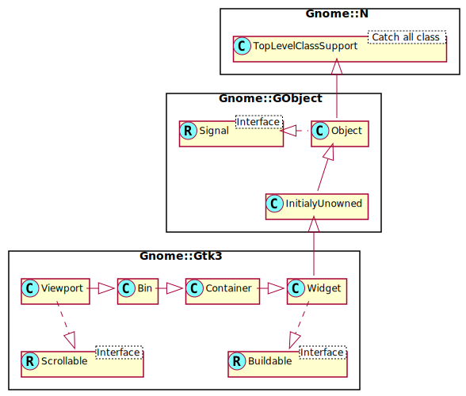

Gnome::Gtk3::Viewport
=====================

An adapter which makes widgets scrollable

Description
===========

The **Gnome::Gtk3::Viewport** widget acts as an adaptor class, implementing scrollability for child widgets that lack their own scrolling capabilities. Use GtkViewport to scroll child widgets such as **Gnome::Gtk3::Grid**, **Gnome::Gtk3::Box**, and so on.

If a widget has native scrolling abilities, such as **Gnome::Gtk3::TextView**, **Gnome::Gtk3::TreeView** or **Gnome::Gtk3::IconView**, it can be added to a **Gnome::Gtk3::ScrolledWindow** with `gtk-container-add()`. If a widget does not, you must first add the widget to a **Gnome::Gtk3::Viewport**, then add the viewport to the scrolled window. `gtk-container-add()` does this automatically if a child that does not implement **Gnome::Gtk3::Scrollable** is added to a **Gnome::Gtk3::ScrolledWindow**, so you can ignore the presence of the viewport.

The GtkViewport will start scrolling content only if allocated less than the child widget’s minimum size in a given orientation.

Css Nodes
---------

The **Gnome::Gtk3::Viewport** has a single CSS node with name viewport.

See Also
--------

**Gnome::Gtk3::ScrolledWindow**, **Gnome::Gtk3::Adjustment**

Synopsis
========

Declaration
-----------

    unit class Gnome::Gtk3::Viewport;
    also is Gnome::Gtk3::Bin;
    also does Gnome::Gtk3::Scrollable;

Uml Diagram
-----------

Inheriting this class
---------------------

Inheriting is done in a special way in that it needs a call from new() to get the native object created by the class you are inheriting from.

    use Gnome::Gtk3::Viewport:api<1>;

    unit class MyGuiClass;
    also is Gnome::Gtk3::Viewport;

    submethod new ( |c ) {
      # let the Gnome::Gtk3::Viewport class process the options
      self.bless( :GtkViewport, |c);
    }

    submethod BUILD ( ... ) {
      ...
    }

Methods
=======

new
---

### :hadjustment, :vadjustment

Create a new Viewport object using horizontal and vertical adjustments. The adjustment is of type **Gnome::Gtk3::Adjustment**.

    multi method new ( N-GObject :$hadjustment!, N-GObject :$vadjustment! )

### :native-object

Create a Viewport object using a native object from elsewhere. See also **Gnome::N::TopLevelClassSupport**.

    multi method new ( N-GObject :$native-object! )

### :build-id

Create a Viewport object using a native object returned from a builder. See also **Gnome::GObject::Object**.

    multi method new ( Str :$build-id! )

get-bin-window, get-bin-window-rk
---------------------------------

Gets the bin window of the **Gnome::Gtk3::Viewport**.

    method get-bin-window ( --> N-GObject )
    method get-bin-window-rk ( --> Gnome::Gdk3::Window )

get-shadow-type
---------------

Gets the shadow type of the **Gnome::Gtk3::Viewport**. See `set-shadow-type()`.

    method get-shadow-type ( --> GtkShadowType )

get-view-window, get-view-window-rk
-----------------------------------

Gets the view window of the **Gnome::Gtk3::Viewport**.

    method get-view-window ( --> N-GObject )
    method get-view-window-rk ( --> Gnome::Gdk3::Window )

set-shadow-type
---------------

Sets the shadow type of the viewport.

    method set-shadow-type ( GtkShadowType $type )

  * GtkShadowType $type; the new shadow type.

Properties
==========

An example of using a string type property of a **Gnome::Gtk3::Label** object. This is just showing how to set/read a property, not that it is the best way to do it. This is because a) The class initialization often provides some options to set some of the properties and b) the classes provide many methods to modify just those properties. In the case below one can use **new(:label('my text label'))** or **.set-text('my text label')**.

    my Gnome::Gtk3::Label $label .= new;
    my Gnome::GObject::Value $gv .= new(:init(G_TYPE_STRING));
    $label.get-property( 'label', $gv);
    $gv.set-string('my text label');

Supported properties
--------------------

### Shadow type: shadow-type

Determines how the shadowed box around the viewport is drawn Default value: False

The **Gnome::GObject::Value** type of property *shadow-type* is `G_TYPE_ENUM`.

