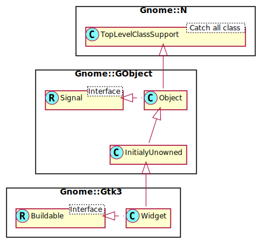

Gnome::Gtk3::Widget
===================

Base class for all widgets

Description
===========

**Gnome::Gtk3::Widget** is the base class all widgets in this package derive from. It manages the widget lifecycle, states and style.

Height-for-width Geometry Management
------------------------------------

GTK+ uses a height-for-width (and width-for-height) geometry management system. Height-for-width means that a widget can change how much vertical space it needs, depending on the amount of horizontal space that it is given (and similar for width-for-height). The most common example is a label that reflows to fill up the available width, wraps to fewer lines, and therefore needs less height.

Height-for-width geometry management is implemented in GTK+ by way of five virtual methods:

  * `get_request_mode()`

  * `get_preferred_width()`

  * `get_preferred_height()`

  * `get_preferred_height_for_width()`

  * `get_preferred_width_for_height()`

  * `get_preferred_height_and_baseline_for_width()`

There are some important things to keep in mind when implementing height-for-width and when using it in container implementations.

The geometry management system will query a widget hierarchy in only one orientation at a time. When widgets are initially queried for their minimum sizes it is generally done in two initial passes in the `GtkSizeRequestMode` chosen by the toplevel.

For example, when queried in the normal `GTK_SIZE_REQUEST_HEIGHT_FOR_WIDTH` mode:

  * First, the default minimum and natural width for each widget in the interface will be computed using `gtk_widget_get_preferred_width()`. Because the preferred widths for each container depend on the preferred widths of their children, this information propagates up the hierarchy, and finally a minimum and natural width is determined for the entire toplevel.

  * Next, the toplevel will use the minimum width to query for the minimum height contextual to that width using `gtk_widget_get_preferred_height_for_width()`, which will also be a highly recursive operation. The minimum height for the minimum width is normally used to set the minimum size constraint on the toplevel (unless `gtk_window_set_geometry_hints()` is explicitly used instead).

After the toplevel window has initially requested its size in both dimensions it can go on to allocate itself a reasonable size (or a size previously specified with `gtk_window_set_default_size()`). During the recursive allocation process it’s important to note that request cycles will be recursively executed while container widgets allocate their children. Each container widget, once allocated a size, will go on to first share the space in one orientation among its children and then request each child's height for its target allocated width or its width for allocated height, depending.

In this way a **Gnome::Gtk3::Widget** will typically be requested its size a number of times before actually being allocated a size. The size a widget is finally allocated can of course differ from the size it has requested. For this reason, **Gnome::Gtk3::Widget** caches a small number of results to avoid re-querying for the same sizes in one allocation cycle.

See [Gnome::Gtk3::Container’s geometry management section](https://developer.gnome.org/gtk3/stable/GtkContainer.html) to learn more about how height-for-width allocations are performed by container widgets.

If a widget does move content around to intelligently use up the allocated size then it must support the request in both `GtkSizeRequestMode`s even if the widget in question only trades sizes in a single orientation.

For instance, a **Gnome::Gtk3::Label** that does height-for-width word wrapping will not expect to have `get_preferred_height()` called because that call is specific to a width-for-height request. In this case the label must return the height required for its own minimum possible width. By following this rule any widget that handles height-for-width or width-for-height requests will always be allocated at least enough space to fit its own content.

Since 3.10 GTK+ also supports baseline vertical alignment of widgets. This means that widgets are positioned such that the typographical baseline of widgets in the same row are aligned. This happens if a widget supports baselines, has a vertical alignment of `GTK_ALIGN_BASELINE`, and is inside a container that supports baselines and has a natural “row” that it aligns to the baseline, or a baseline assigned to it by the grandparent.

Baseline alignment support for a widget is done by the `get_preferred_height_and_baseline_for_width()` virtual function. It allows you to report a baseline in combination with the minimum and natural height. If there is no baseline you can return -1 to indicate this. The default implementation of this virtual function calls into the `get_preferred_height()` and `get_preferred_height_for_width()`, so if baselines are not supported it doesn’t need to be implemented.

If a widget ends up baseline aligned it will be allocated all the space in the parent as if it was `GTK_ALIGN_FILL`, but the selected baseline can be found via `gtk_widget_get_allocated_baseline()`. If this has a value other than -1 you need to align the widget such that the baseline appears at the position.

Style Properties
----------------

**Gnome::Gtk3::Widget** introduces “style properties” - these are basically object properties that are stored not on the object, but in the style object associated to the widget. Style properties are set in gtk resource files. This mechanism is used for configuring such things as the location of the scrollbar arrows through the theme, giving theme authors more control over the look of applications without the need to write a theme engine in C.

Use `gtk_widget_class_install_style_property()` to install style properties for a widget class, `gtk_widget_class_find_style_property()` or `gtk_widget_class_list_style_properties()` to get information about existing style properties and `gtk_widget_style_get_property()`, `gtk_widget_style_get()` or `gtk_widget_style_get_valist()` to obtain the value of a style property.

Gnome::Gtk3::Widget as Gnome::Gtk3::Buildable
---------------------------------------------

The **Gnome::Gtk3::Widget** implementation of the **Gnome::Gtk3::Buildable** interface supports a custom <accelerator> element, which has attributes named ”key”, ”modifiers” and ”signal” and allows to specify accelerators.

An example of a UI definition fragment specifying an accelerator (please note that in this XML the C-Source widget class names must be used; GtkButton instead of Gnome::Gtk3::Button):

    <object class="GtkButton">
      <accelerator key="q" modifiers="GDK_CONTROL_MASK" signal="clicked"/>
    </object>

In addition to accelerators, **Gnome::Gtk3::Widget** also support a custom <accessible> element, which supports actions and relations. Properties on the accessible implementation of an object can be set by accessing the internal child “accessible” of a **Gnome::Gtk3::Widget**.

An example of a UI definition fragment specifying an accessible:

    <object class="GtkButton" id="label1"/>
      <property name="label">I am a Label for a Button</property>
    </object>
    <object class="GtkButton" id="button1">
      <accessibility>
        <action action_name="click" translatable="yes">
          Click the button.
        </action>
        <relation target="label1" type="labelled-by"/>
      </accessibility>
      <child internal-child="accessible">
        <object class="AtkObject" id="a11y-button1">
          <property name="accessible-name">
            Clickable Button
          </property>
        </object>
      </child>
    </object>

Finally, **Gnome::Gtk3::Widget** allows style information such as style classes to be associated with widgets, using the custom 
    </object>

Synopsis
========

Declaration
-----------

    unit class Gnome::Gtk3::Widget;
    also is Gnome::GObject::InitiallyUnowned;
    also does Gnome::Gtk3::Buildable;

Uml Diagram
-----------

Example
-------

    # create a button and set a tooltip
    my Gnome::Gtk3::Button $start-button .= new(:label<Start>);
    $start-button.set-tooltip-text('Nooooo don\'t touch that button!!!!!!!');

Types
=====

enum GtkWidgetHelpType
----------------------

Kinds of widget-specific help. Used by the ::show-help signal.

  * GTK_WIDGET_HELP_TOOLTIP: Tooltip.

  * GTK_WIDGET_HELP_WHATS_THIS: What’s this.

class N-GtkRequisition
----------------------

A **Gnome::Gtk3::Requisition**-struct represents the desired size of a widget. See [**Gnome::Gtk3::Widget**’s geometry management section][geometry-management] for more information.

  * Int $.width: the widget’s desired width

  * Int $.height: the widget’s desired height

class N-GtkAllocation
---------------------

A N-GtkAllocation of a widget represents a region which has been allocated to the widget by its parent. It is a subregion of its parents allocation. See GtkWidget’s geometry management section for more information.

  * Int $.x;

  * Int $.y;

  * Int $.width;

  * Int $.height;

Methods
=======

activate
--------

For widgets that can be “activated” (buttons, menu items, etc.) this function activates them. Activation is what happens when you press Enter on a widget during key navigation. If *widget* isn't activatable, the function returns `False`.

Returns: `True` if the widget was activatable

    method activate ( --> Bool )

add-device-events
-----------------

Adds the device events in the bitfield *events* to the event mask for *widget*. See `set-device-events()` for details.

    method add-device-events ( N-GObject $device, N-GdkEventMask $events )

  * N-GObject $device; a **Gnome::Gtk3::Device**

  * N-GdkEventMask $events; an event mask, see **Gnome::Gtk3::EventMask**

add-events
----------

Adds the events in the bitfield *events* to the event mask for *widget*. See `set-events()` and the [input handling overview][event-masks] for details.

    method add-events ( Int $events )

  * Int $events; an event mask, see **Gnome::Gtk3::EventMask**

add-mnemonic-label
------------------

Adds a widget to the list of mnemonic labels for this widget. (See `list-mnemonic-labels()`). Note the list of mnemonic labels for the widget is cleared when the widget is destroyed, so the caller must make sure to update its internal state at this point as well, by using a connection to the *destroy* signal or a weak notifier.

    method add-mnemonic-label ( N-GObject $label )

  * N-GObject $label; a **Gnome::Gtk3::Widget** that acts as a mnemonic label for *widget*

can-activate-accel
------------------

Determines whether an accelerator that activates the signal identified by *signal-id* can currently be activated. This is done by emitting the *can-activate-accel* signal on *widget*; if the signal isn’t overridden by a handler or in a derived widget, then the default check is that the widget must be sensitive, and the widget and all its ancestors mapped.

Returns: `True` if the accelerator can be activated.

    method can-activate-accel ( UInt $signal_id --> Bool )

  * UInt $signal_id; the ID of a signal installed on *widget*

child-focus
-----------

This function is used by custom widget implementations; if you're writing an app, you’d use `grab-focus()` to move the focus to a particular widget, and `gtk-container-set-focus-chain()` to change the focus tab order. So you may want to investigate those functions instead.

`child-focus()` is called by containers as the user moves around the window using keyboard shortcuts. *direction* indicates what kind of motion is taking place (up, down, left, right, tab forward, tab backward). `child-focus()` emits the *focus* signal; widgets override the default handler for this signal in order to implement appropriate focus behavior.

The default *focus* handler for a widget should return `True` if moving in *direction* left the focus on a focusable location inside that widget, and `False` if moving in *direction* moved the focus outside the widget. If returning `True`, widgets normally call `grab-focus()` to place the focus accordingly; if returning `False`, they don’t modify the current focus location.

Returns: `True` if focus ended up inside *widget*

    method child-focus ( GtkDirectionType $direction --> Bool )

  * GtkDirectionType $direction; direction of focus movement

child-notify
------------

Emits a *child-notify* signal for the [child property][child-properties] *child-property* on *widget*.

This is the analogue of `g-object-notify()` for child properties.

Also see `gtk-container-child-notify()`.

    method child-notify ( Str $child_property )

  * Str $child_property; the name of a child property installed on the class of *widget*’s parent

compute-expand
--------------

Computes whether a container should give this widget extra space when possible. Containers should check this, rather than looking at `get-hexpand()` or `get-vexpand()`.

This function already checks whether the widget is visible, so visibility does not need to be checked separately. Non-visible widgets are not expanded.

The computed expand value uses either the expand setting explicitly set on the widget itself, or, if none has been explicitly set, the widget may expand if some of its children do.

Returns: whether widget tree rooted here should be expanded

    method compute-expand ( GtkOrientation $orientation --> Bool )

  * GtkOrientation $orientation; expand direction

create-pango-context
--------------------

Creates a new **PangoContext** with the appropriate font map, font options, font description, and base direction for drawing text for this widget. See also `get-pango-context()`.

Returns: : the new **PangoContext**

    method create-pango-context ( --> N-GObject )

create-pango-layout
-------------------

Creates a new **PangoLayout** with the appropriate font map, font description, and base direction for drawing text for this widget.

If you keep a **PangoLayout** created in this way around, you need to re-create it when the widget **PangoContext** is replaced. This can be tracked by using the *screen-changed* signal on the widget.

Returns: : the new **PangoLayout**

    method create-pango-layout ( Str $text --> N-GObject )

  * Str $text; text to set on the layout (can be `undefined`)

destroy
-------

Destroys a widget.

When a widget is destroyed all references it holds on other objects will be released:

- if the widget is inside a container, it will be removed from its parent - if the widget is a container, all its children will be destroyed, recursively - if the widget is a top level, it will be removed from the list of top level widgets that GTK+ maintains internally

It's expected that all references held on the widget will also be released; you should connect to the *destroy* signal if you hold a reference to *widget* and you wish to remove it when this function is called. It is not necessary to do so if you are implementing a **Gnome::Gtk3::Container**, as you'll be able to use the **Gnome::Gtk3::ContainerClass**.`remove()` virtual function for that.

It's important to notice that `destroy()` will only cause the *widget* to be finalized if no additional references, acquired using `g-object-ref()`, are held on it. In case additional references are in place, the *widget* will be in an "inert" state after calling this function; *widget* will still point to valid memory, allowing you to release the references you hold, but you may not query the widget's own state.

You should typically call this function on top level widgets, and rarely on child widgets.

See also: `gtk-container-remove()`

    method destroy ( )

destroyed
---------

This function sets **widget-pointer* to `undefined` if *widget-pointer* != `undefined`. It’s intended to be used as a callback connected to the “destroy” signal of a widget. You connect `destroyed()` as a signal handler, and pass the address of your widget variable as user data. Then when the widget is destroyed, the variable will be set to `undefined`. Useful for example to avoid multiple copies of the same dialog.

    method destroyed ( N-GObject $widget_pointer )

  * N-GObject $widget_pointer; : address of a variable that contains *widget*

device-is-shadowed
------------------

Returns `True` if *device* has been shadowed by a GTK+ device grab on another widget, so it would stop sending events to *widget*. This may be used in the *grab-notify* signal to check for specific devices. See `gtk-device-grab-add()`.

Returns: `True` if there is an ongoing grab on *device* by another **Gnome::Gtk3::Widget** than *widget*.

    method device-is-shadowed ( N-GObject $device --> Bool )

  * N-GObject $device; a **Gnome::Gtk3::Device**

draw
----

Draws *widget* to *cr*. The top left corner of the widget will be drawn to the currently set origin point of *cr*.

You should pass a cairo context as *cr* argument that is in an original state. Otherwise the resulting drawing is undefined. For example changing the operator using `cairo-set-operator()` or the line width using `cairo-set-line-width()` might have unwanted side effects. You may however change the context’s transform matrix - like with `cairo-scale()`, `cairo-translate()` or `cairo-set-matrix()` and clip region with `cairo-clip()` prior to calling this function. Also, it is fine to modify the context with `cairo-save()` and `cairo-push-group()` prior to calling this function.

Note that special-purpose widgets may contain special code for rendering to the screen and might appear differently on screen and when rendered using `draw()`.

    method draw ( cairo_t $cr )

  * cairo_t $cr; a cairo context to draw to

error-bell
----------

Notifies the user about an input-related error on this widget. If the *gtk-error-bell* setting is `True`, it calls `gdk-window-beep()`, otherwise it does nothing.

Note that the effect of `gdk-window-beep()` can be configured in many ways, depending on the windowing backend and the desktop environment or window manager that is used.

    method error-bell ( )

event
-----

Rarely-used function. This function is used to emit the event signals on a widget (those signals should never be emitted without using this function to do so). If you want to synthesize an event though, don’t use this function; instead, use `gtk-main-do-event()` so the event will behave as if it were in the event queue. Don’t synthesize expose events; instead, use `gdk-window-invalidate-rect()` to invalidate a region of the window.

Returns: return from the event signal emission (`True` if the event was handled)

    method event ( GdkEvent $event --> Bool )

  * GdkEvent $event; a **Gnome::Gtk3::Event**

freeze-child-notify
-------------------

Stops emission of *child-notify* signals on *widget*. The signals are queued until `thaw-child-notify()` is called on *widget*.

This is the analogue of `g-object-freeze-notify()` for child properties.

    method freeze-child-notify ( )

get-action-group
----------------

Retrieves the **Gnome::Gtk3::ActionGroup** that was registered using *prefix*. The resulting **Gnome::Gtk3::ActionGroup** may have been registered to *widget* or any **Gnome::Gtk3::Widget** in its ancestry.

If no action group was found matching *prefix*, then `undefined` is returned.

Returns: A **Gnome::Gtk3::ActionGroup** based object or `undefined`.

    method get-action-group ( Str $prefix --> N-GObject )

  * Str $prefix; The “prefix” of the action group.

get-allocated-baseline
----------------------

Returns the baseline that has currently been allocated to *widget*. This function is intended to be used when implementing handlers for the *draw* function, and when allocating child widgets in *size-allocate*.

Returns: the baseline of the *widget*, or -1 if none

    method get-allocated-baseline ( --> Int )

get-allocated-height
--------------------

Returns the height that has currently been allocated to *widget*. This function is intended to be used when implementing handlers for the *draw* function.

Returns: the height of the *widget*

    method get-allocated-height ( --> Int )

get-allocated-size
------------------

Retrieves the widget’s allocated size.

This function returns the last values passed to `size-allocate-with-baseline()`. The value differs from the size returned in `get-allocation()` in that functions like `set-halign()` can adjust the allocation, but not the value returned by this function.

If a widget is not visible, its allocated size is 0.

    method get-allocated-size ( --> List )

returns a List with

  * N-GtkAllocation

  * int32 $baseline

get-allocated-width
-------------------

Returns the width that has currently been allocated to *widget*. This function is intended to be used when implementing handlers for the *draw* function.

Returns: the width of the *widget*

    method get-allocated-width ( --> Int )

get-allocation
--------------

Retrieves the widget’s allocation.

Note, when implementing a **Gnome::Gtk3::Container**: a widget’s allocation will be its “adjusted” allocation, that is, the widget’s parent container typically calls `size-allocate()` with an allocation, and that allocation is then adjusted (to handle margin and alignment for example) before assignment to the widget. `get-allocation()` returns the adjusted allocation that was actually assigned to the widget. The adjusted allocation is guaranteed to be completely contained within the `size-allocate()` allocation, however. So a **Gnome::Gtk3::Container** is guaranteed that its children stay inside the assigned bounds, but not that they have exactly the bounds the container assigned. There is no way to get the original allocation assigned by `size-allocate()`, since it isn’t stored; if a container implementation needs that information it will have to track it itself.

    method get-allocation ( --> N-GtkAllocation )

Returns a N-GtkAllocation

get-ancestor
------------

Gets the first ancestor of *widget* with type *widget-type*. For example, `get-ancestor (widget, GTK-TYPE-BOX)` gets the first **Gnome::Gtk3::Box** that’s an ancestor of *widget*. No reference will be added to the returned widget; it should not be unreferenced. See note about checking for a toplevel **Gnome::Gtk3::Window** in the docs for `get-toplevel()`.

Note that unlike `is-ancestor()`, `get-ancestor()` considers *widget* to be an ancestor of itself.

Returns: the ancestor widget, or `undefined` if not found

    method get-ancestor ( N-GObject $widget_type --> N-GObject )

  * N-GObject $widget_type; ancestor type

get-app-paintable
-----------------

Determines whether the application intends to draw on the widget in an *draw* handler.

See `set-app-paintable()`

Returns: `True` if the widget is app paintable

    method get-app-paintable ( --> Bool )

get-can-default
---------------

Determines whether *widget* can be a default widget. See `set-can-default()`.

Returns: `True` if *widget* can be a default widget, `False` otherwise

    method get-can-default ( --> Bool )

get-can-focus
-------------

Determines whether *widget* can own the input focus. See `set-can-focus()`.

Returns: `True` if *widget* can own the input focus, `False` otherwise

    method get-can-focus ( --> Bool )

get-child-visible
-----------------

Gets the value set with `set-child-visible()`. If you feel a need to use this function, your code probably needs reorganization.

This function is only useful for container implementations and never should be called by an application.

Returns: `True` if the widget is mapped with the parent.

    method get-child-visible ( --> Bool )

get-clip
--------

Retrieves the widget’s clip area.

The clip area is the area in which all of *widget*'s drawing will happen. Other toolkits call it the bounding box.

Historically, in GTK+ the clip area has been equal to the allocation retrieved via `get-allocation()`.

    method get-clip ( --> N-GtkAllocation )

Returns a N-GtkAllocation clip

get-default-direction
---------------------

Obtains the current default reading direction. See `set-default-direction()`.

Returns: the current default direction.

    method get-default-direction ( --> GtkTextDirection )

get-device-enabled
------------------

Returns whether *device* can interact with *widget* and its children. See `set-device-enabled()`.

Returns: `True` is *device* is enabled for *widget*

    method get-device-enabled ( N-GObject $device --> Bool )

  * N-GObject $device; a **Gnome::Gtk3::Device**

get-device-events
-----------------

Returns the events mask for the widget corresponding to an specific device. These are the events that the widget will receive when *device* operates on it. Flags in this mask are from `N-GdkEventMask`.

Returns: device event mask for *widget*

    method get-device-events ( N-GObject $device --> Int )

  * N-GObject $device; a **Gnome::Gtk3::Device**

get-direction
-------------

Gets the reading direction for a particular widget. See `set-direction()`.

Returns: the reading direction for the widget.

    method get-direction ( --> GtkTextDirection )

get-display
-----------

Get the **Gnome::Gtk3::Display** for the toplevel window associated with this widget. This function can only be called after the widget has been added to a widget hierarchy with a **Gnome::Gtk3::Window** at the top.

In general, you should only create display specific resources when a widget has been realized, and you should free those resources when the widget is unrealized.

Returns: : the **Gnome::Gtk3::Display** for the toplevel for this widget.

    method get-display ( --> N-GObject )

get-events
----------

Returns the event mask (see **Gnome::Gtk3::EventMask**) for the widget. These are the events that the widget will receive.

Note: Internally, the widget event mask will be the logical OR of the event mask set through `set-events()` or `add-events()`, and the event mask necessary to cater for every **Gnome::Gtk3::EventController** created for the widget.

Returns: event mask for *widget*

    method get-events ( --> Int )

get-focus-on-click
------------------

Returns whether the widget should grab focus when it is clicked with the mouse. See `set-focus-on-click()`.

Returns: `True` if the widget should grab focus when it is clicked with the mouse.

    method get-focus-on-click ( --> Bool )

get-font-map
------------

Gets the font map that has been set with `set-font-map()`.

Returns: A **PangoFontMap**, or `undefined`

    method get-font-map ( --> N-GObject )

get-font-options
----------------

Returns the **cairo-font-options-t** used for Pango rendering. When not set, the defaults font options for the **Gnome::Gtk3::Screen** will be used.

Returns: the **cairo-font-options-t** or `undefined` if not set

    method get-font-options ( --> cairo_font_options_t )

get-frame-clock
---------------

Obtains the frame clock for a widget. The frame clock is a global “ticker” that can be used to drive animations and repaints. The most common reason to get the frame clock is to call `gdk-frame-clock-get-frame-time()`, in order to get a time to use for animating. For example you might record the start of the animation with an initial value from `gdk-frame-clock-get-frame-time()`, and then update the animation by calling `gdk-frame-clock-get-frame-time()` again during each repaint.

`gdk-frame-clock-request-phase()` will result in a new frame on the clock, but won’t necessarily repaint any widgets. To repaint a widget, you have to use `queue-draw()` which invalidates the widget (thus scheduling it to receive a draw on the next frame). `queue-draw()` will also end up requesting a frame on the appropriate frame clock.

A widget’s frame clock will not change while the widget is mapped. Reparenting a widget (which implies a temporary unmap) can change the widget’s frame clock.

Unrealized widgets do not have a frame clock.

Returns: a **Gnome::Gtk3::FrameClock**, or `undefined` if widget is unrealized

    method get-frame-clock ( --> N-GObject )

get-halign
----------

Gets the value of the *halign* property.

For backwards compatibility reasons this method will never return `GTK-ALIGN-BASELINE`, but instead it will convert it to `GTK-ALIGN-FILL`. Baselines are not supported for horizontal alignment.

Returns: the horizontal alignment of *widget*

    method get-halign ( --> GtkAlign )

get-has-tooltip
---------------

Returns the current value of the has-tooltip property. See *has-tooltip* for more information.

Returns: current value of has-tooltip on *widget*.

    method get-has-tooltip ( --> Bool )

get-has-window
--------------

Determines whether *widget* has a **Gnome::Gtk3::Window** of its own. See `set-has-window()`.

Returns: `True` if *widget* has a window, `False` otherwise

    method get-has-window ( --> Bool )

get-hexpand
-----------

Gets whether the widget would like any available extra horizontal space. When a user resizes a **Gnome::Gtk3::Window**, widgets with expand=TRUE generally receive the extra space. For example, a list or scrollable area or document in your window would often be set to expand.

Containers should use `compute-expand()` rather than this function, to see whether a widget, or any of its children, has the expand flag set. If any child of a widget wants to expand, the parent may ask to expand also.

This function only looks at the widget’s own hexpand flag, rather than computing whether the entire widget tree rooted at this widget wants to expand.

Returns: whether hexpand flag is set

    method get-hexpand ( --> Bool )

get-hexpand-set
---------------

Gets whether `set-hexpand()` has been used to explicitly set the expand flag on this widget.

If hexpand is set, then it overrides any computed expand value based on child widgets. If hexpand is not set, then the expand value depends on whether any children of the widget would like to expand.

There are few reasons to use this function, but it’s here for completeness and consistency.

Returns: whether hexpand has been explicitly set

    method get-hexpand-set ( --> Bool )

get-mapped
----------

Whether the widget is mapped.

Returns: `True` if the widget is mapped, `False` otherwise.

    method get-mapped ( --> Bool )

get-margin-bottom
-----------------

Gets the value of the *margin-bottom* property.

Returns: The bottom margin of *widget*

    method get-margin-bottom ( --> Int )

get-margin-end
--------------

Gets the value of the *margin-end* property.

Returns: The end margin of *widget*

    method get-margin-end ( --> Int )

get-margin-start
----------------

Gets the value of the *margin-start* property.

Returns: The start margin of *widget*

    method get-margin-start ( --> Int )

get-margin-top
--------------

Gets the value of the *margin-top* property.

Returns: The top margin of *widget*

    method get-margin-top ( --> Int )

get-modifier-mask
-----------------

Returns the modifier mask the *widget*’s windowing system backend uses for a particular purpose.

See `gdk-keymap-get-modifier-mask()`.

Returns: the modifier mask used for *intent*.

    method get-modifier-mask ( GdkModifierIntent $intent --> GdkModifierType )

  * GdkModifierIntent $intent; the use case for the modifier mask

get-name
--------

Retrieves the name of a widget. See `set-name()` for the significance of widget names.

Returns: name of the widget. This string is owned by GTK+ and should not be modified or freed

    method get-name ( --> Str )

get-no-show-all
---------------

Returns the current value of the *no-show-all* property, which determines whether calls to `show-all()` will affect this widget.

Returns: the current value of the “no-show-all” property.

    method get-no-show-all ( --> Bool )

get-opacity
-----------

Fetches the requested opacity for this widget. See `set-opacity()`.

Returns: the requested opacity for this widget.

    method get-opacity ( --> Num )

get-pango-context
-----------------

Gets a **PangoContext** with the appropriate font map, font description, and base direction for this widget. Unlike the context returned by `create-pango-context()`, this context is owned by the widget (it can be used until the screen for the widget changes or the widget is removed from its toplevel), and will be updated to match any changes to the widget’s attributes. This can be tracked by using the *screen-changed* signal on the widget.

Returns: : the **PangoContext** for the widget.

    method get-pango-context ( --> N-GObject )

get-parent
----------

Returns the parent container of *widget* or `undefined`.

    method get-parent ( --> N-GObject )

get-parent-window
-----------------

Gets *widget*’s parent window, or `undefined` if it does not have one.

Returns: the parent window of *widget*, or `undefined` if it does not have a parent window.

    method get-parent-window ( --> N-GObject )

get-path
--------

Returns the **Gnome::Gtk3::WidgetPath** representing *widget*, if the widget is not connected to a toplevel widget, a partial path will be created.

Returns: The **Gnome::Gtk3::WidgetPath** representing *widget*

    method get-path ( --> N-GObject )

get-preferred-height
--------------------

Retrieves a widget’s initial minimum and natural height.

This call is specific to width-for-height requests.

The returned request will be modified by the GtkWidgetClass::adjust_size_request virtual method and by any GtkSizeGroups that have been applied. That is, the returned request is the one that should be used for layout, not necessarily the one returned by the widget itself.

    method get-preferred-height ( --> List )

Returns a List with

  * Int minimum_height;

  * Int natural_height;

get-preferred-height-and-baseline-for-width
-------------------------------------------

Retrieves a widget’s minimum and natural height and the corresponding baselines if it would be given the specified width , or the default height if width is -1. The baselines may be -1 which means that no baseline is requested for this widget.

The returned request will be modified by the GtkWidgetClass::adjust_size_request and GtkWidgetClass::adjust_baseline_request virtual methods and by any GtkSizeGroups that have been applied. That is, the returned request is the one that should be used for layout, not necessarily the one returned by the widget itself.

    method get-preferred-height-and-baseline-for-width (
      Int $width --> List
    )

  * Int $width;

Returns a List containing;

  * Int minimum_height;

  * Int natural_height;

  * Int minimum_baseline;

  * Int natural_baseline;

get-preferred-height-for-width
------------------------------

Retrieves a widget’s minimum and natural height if it would be given the specified width .

    method get-preferred-height-for-width ( Int $width --> List )

  * Int $width;

Returning a List with

  * Int minimum_height;

  * Int natural_height;

get-preferred-size
------------------

Retrieves the minimum and natural size of a widget, taking into account the widget’s preference for height-for-width management.

This is used to retrieve a suitable size by container widgets which do not impose any restrictions on the child placement. It can be used to deduce toplevel window and menu sizes as well as child widgets in free-form containers such as GtkLayout.

Handle with care. Note that the natural height of a height-for-width widget will generally be a smaller size than the minimum height, since the required height for the natural width is generally smaller than the required height for the minimum width.

Use gtk_widget_get_preferred_height_and_baseline_for_width() if you want to support baseline alignment.

    method get-preferred-size ( --> List )

The returned list holds

  * N-GtkRequisition $minimum_size;

  * N-GtkRequisition $natural_size;

get-preferred-width
-------------------

Retrieves a widget’s initial minimum and natural width.

This call is specific to height-for-width requests.

The returned request will be modified by the GtkWidgetClass::adjust_size_request virtual method and by any GtkSizeGroups that have been applied. That is, the returned request is the one that should be used for layout, not necessarily the one returned by the widget itself.

    method get-preferred-width ( --> List )

Returned List holds;

  * Int minimum_width;

  * Int natural_width;

get-preferred-width-for-height
------------------------------

Retrieves a widget’s minimum and natural width if it would be given the specified height .

The returned request will be modified by the GtkWidgetClass::adjust_size_request virtual method and by any GtkSizeGroups that have been applied. That is, the returned request is the one that should be used for layout, not necessarily the one returned by the widget itself.

    method get-preferred-width-for-height ( Int $height --> List )

  * Int $height;

The returned List holds

  * Int minimum_width;

  * Int natural_width;

get-realized
------------

Determines whether *widget* is realized.

Returns: `True` if *widget* is realized, `False` otherwise

    method get-realized ( --> Bool )

get-receives-default
--------------------

Determines whether *widget* is always treated as the default widget within its toplevel when it has the focus, even if another widget is the default.

See `set-receives-default()`.

Returns: `True` if *widget* acts as the default widget when focused, `False` otherwise

    method get-receives-default ( --> Bool )

get-request-mode
----------------

Gets whether the widget prefers a height-for-width layout or a width-for-height layout.

GtkBin widgets generally propagate the preference of their child, container widgets need to request something either in context of their children or in context of their allocation capabilities.

    method get-request-mode ( --> GtkSizeRequestMode )

get-scale-factor
----------------

Retrieves the internal scale factor that maps from window coordinates to the actual device pixels. On traditional systems this is 1, on high density outputs, it can be a higher value (typically 2).

See `gdk-window-get-scale-factor()`.

Returns: the scale factor for *widget*

    method get-scale-factor ( --> Int )

get-screen
----------

Get the **Gnome::Gtk3::Screen** from the toplevel window associated with this widget. This function can only be called after the widget has been added to a widget hierarchy with a **Gnome::Gtk3::Window** at the top.

In general, you should only create screen specific resources when a widget has been realized, and you should free those resources when the widget is unrealized.

Returns: : the **Gnome::Gtk3::Screen** for the toplevel for this widget.

    method get-screen ( --> N-GObject )

get-sensitive
-------------

Returns the widget’s sensitivity (in the sense of returning the value that has been set using `set-sensitive()`).

The effective sensitivity of a widget is however determined by both its own and its parent widget’s sensitivity. See `is-sensitive()`.

Returns: `True` if the widget is sensitive

    method get-sensitive ( --> Bool )

get-settings
------------

Gets the settings object holding the settings used for this widget.

Note that this function can only be called when the **Gnome::Gtk3::Widget** is attached to a toplevel, since the settings object is specific to a particular **Gnome::Gtk3::Screen**.

Returns: : the relevant **Gnome::Gtk3::Settings** object

    method get-settings ( --> N-GObject )

get-size-request
----------------

Gets the size request that was explicitly set for the widget using `set-size-request()`. A value of -1 stored in *width* or *height* indicates that that dimension has not been set explicitly and the natural requisition of the widget will be used instead. See `set-size-request()`. To get the size a widget will actually request, call `get-preferred-size()` instead of this function.

    method get-size-request ( --> List )

Returned List holds;

  * Int width; return location for width, or `undefined`

  * Int height; return location for height, or `undefined`

get-state-flags
---------------

Returns the widget state as a flag set. It is worth mentioning that the effective `GTK-STATE-FLAG-INSENSITIVE` state will be returned, that is, also based on parent insensitivity, even if *widget* itself is sensitive.

Also note that if you are looking for a way to obtain the **Gnome::Gtk3::StateFlags** to pass to a **Gnome::Gtk3::StyleContext** method, you should look at `gtk-style-context-get-state()`.

Returns: The state flags for widget

    method get-state-flags ( --> GtkStateFlags )

get-style-context
-----------------

Returns the style context associated to *widget*. The returned object is guaranteed to be the same for the lifetime of *widget*.

Returns: : a **Gnome::Gtk3::StyleContext**. This memory is owned by *widget* and must not be freed.

    method get-style-context ( --> N-GObject )

get-support-multidevice
-----------------------

Returns `True` if *widget* is multiple pointer aware. See `set-support-multidevice()` for more information.

Returns: `True` if *widget* is multidevice aware.

    method get-support-multidevice ( --> Bool )

get-template-child
------------------

Fetch an object build from the template XML for *widget-type* in this *widget* instance.

This will only report children which were previously declared with `class-bind-template-child-full()` or one of its variants.

This function is only meant to be called for code which is private to the *widget-type* which declared the child and is meant for language bindings which cannot easily make use of the GObject structure offsets.

Returns: : The object built in the template XML with the id *name*

    method get-template-child ( N-GObject $widget_type, Str $name --> N-GObject )

  * N-GObject $widget_type; The **Gnome::Gtk3::Type** to get a template child for

  * Str $name; The “id” of the child defined in the template XML

get-tooltip-markup
------------------

Gets the contents of the tooltip for *widget*.

Returns: : the tooltip text, or `undefined`. You should free the returned string with `g-free()` when done.

    method get-tooltip-markup ( --> Str )

get-tooltip-text
----------------

Gets the contents of the tooltip for *widget*.

Returns: : the tooltip text, or `undefined`. You should free the returned string with `g-free()` when done.

    method get-tooltip-text ( --> Str )

get-tooltip-window
------------------

Returns the **Gnome::Gtk3::Window** of the current tooltip. This can be the GtkWindow created by default, or the custom tooltip window set using `set-tooltip-window()`.

Returns: : The **Gnome::Gtk3::Window** of the current tooltip.

    method get-tooltip-window ( --> N-GObject )

get-toplevel
------------

This function returns the topmost widget in the container hierarchy *widget* is a part of. If *widget* has no parent widgets, it will be returned as the topmost widget. No reference will be added to the returned widget; it should not be unreferenced.

Note the difference in behavior vs. `get-ancestor()`; `gtk-widget-get-ancestor (widget, GTK-TYPE-WINDOW)` would return `undefined` if *widget* wasn’t inside a toplevel window, and if the window was inside a **Gnome::Gtk3::Window**-derived widget which was in turn inside the toplevel **Gnome::Gtk3::Window**. While the second case may seem unlikely, it actually happens when a **Gnome::Gtk3::Plug** is embedded inside a **Gnome::Gtk3::Socket** within the same application.

To reliably find the toplevel **Gnome::Gtk3::Window**, use `get-toplevel()` and call `GTK-IS-WINDOW()` on the result. For instance, to get the title of a widget's toplevel window, one might use: |[<!-- language="C" --> static const char * get-widget-toplevel-title (GtkWidget *widget) { GtkWidget *toplevel = gtk-widget-get-toplevel (widget); if (GTK-IS-WINDOW (toplevel)) { return gtk-window-get-title (GTK-WINDOW (toplevel)); }

return NULL; } ]|

Returns: : the topmost ancestor of *widget*, or *widget* itself if there’s no ancestor.

    method get-toplevel ( --> N-GObject )

get-valign
----------

Gets the value of the *valign* property.

For backwards compatibility reasons this method will never return `GTK-ALIGN-BASELINE`, but instead it will convert it to `GTK-ALIGN-FILL`. If your widget want to support baseline aligned children it must use `get-valign-with-baseline()`, or `g-object-get (widget, "valign", &value, NULL)`, which will also report the true value.

Returns: the vertical alignment of *widget*, ignoring baseline alignment

    method get-valign ( --> GtkAlign )

get-valign-with-baseline
------------------------

Gets the value of the *valign* property, including `GTK-ALIGN-BASELINE`.

Returns: the vertical alignment of *widget*

    method get-valign-with-baseline ( --> GtkAlign )

get-vexpand
-----------

Gets whether the widget would like any available extra vertical space.

See `get-hexpand()` for more detail.

Returns: whether vexpand flag is set

    method get-vexpand ( --> Bool )

get-vexpand-set
---------------

Gets whether `set-vexpand()` has been used to explicitly set the expand flag on this widget.

See `get-hexpand-set()` for more detail.

Returns: whether vexpand has been explicitly set

    method get-vexpand-set ( --> Bool )

get-visible
-----------

Determines whether the widget is visible. If you want to take into account whether the widget’s parent is also marked as visible, use `is-visible()` instead.

This function does not check if the widget is obscured in any way.

See `set-visible()`.

Returns: `True` if the widget is visible

    method get-visible ( --> Bool )

get-visual
----------

Gets the visual that will be used to render *widget*.

Returns: : the visual for *widget*

    method get-visual ( --> N-GObject )

get-window
----------

Returns the widget’s window if it is realized, `undefined` otherwise

Returns: *widget*’s window.

    method get-window ( --> N-GObject )

grab-default
------------

Causes *widget* to become the default widget. *widget* must be able to be a default widget; typically you would ensure this yourself by calling `set-can-default()` with a `True` value. The default widget is activated when the user presses Enter in a window. Default widgets must be activatable, that is, `activate()` should affect them. Note that **Gnome::Gtk3::Entry** widgets require the “activates-default” property set to `True` before they activate the default widget when Enter is pressed and the **Gnome::Gtk3::Entry** is focused.

    method grab-default ( )

grab-focus
----------

Causes *widget* to have the keyboard focus for the **Gnome::Gtk3::Window** it's inside. *widget* must be a focusable widget, such as a **Gnome::Gtk3::Entry**; something like **Gnome::Gtk3::Frame** won’t work.

More precisely, it must have the `GTK-CAN-FOCUS` flag set. Use `set-can-focus()` to modify that flag.

The widget also needs to be realized and mapped. This is indicated by the related signals. Grabbing the focus immediately after creating the widget will likely fail and cause critical warnings.

    method grab-focus ( )

gtk-cairo-should-draw-window
----------------------------

This function is supposed to be called in *draw* implementations for widgets that support multiple windows. *cr* must be untransformed from invoking of the draw function. This function will return `True` if the contents of the given *window* are supposed to be drawn and `False` otherwise. Note that when the drawing was not initiated by the windowing system this function will return `True` for all windows, so you need to draw the bottommost window first. Also, do not use “else if” statements to check which window should be drawn.

Returns: `True` if *window* should be drawn

    method gtk-cairo-should-draw-window ( cairo_t $cr, N-GObject $window --> Bool )

  * cairo_t $cr; a cairo context

  * N-GObject $window; the window to check. *window* may not be an input-only window.

gtk-cairo-transform-to-window
-----------------------------

Transforms the given cairo context *cr* that from *widget*-relative coordinates to *window*-relative coordinates. If the *widget*’s window is not an ancestor of *window*, no modification will be applied.

This is the inverse to the transformation GTK applies when preparing an expose event to be emitted with the *draw* signal. It is intended to help porting multiwindow widgets from GTK+ 2 to the rendering architecture of GTK+ 3.

    method gtk-cairo-transform-to-window ( cairo_t $cr, N-GObject $widget, N-GObject $window )

  * cairo_t $cr; the cairo context to transform

  * N-GObject $widget; the widget the context is currently centered for

  * N-GObject $window; the window to transform the context to

gtk-requisition-copy
--------------------

Copies a **Gnome::Gtk3::Requisition**.

Returns: a copy of *requisition*

    method gtk-requisition-copy (
      N-GtkRequisition $requisition --> N-GtkRequisition
    )

  * N-GtkRequisition $requisition; a **Gnome::Gtk3::Requisition**

gtk-requisition-free
--------------------

Frees a **Gnome::Gtk3::Requisition**.

    method gtk-requisition-free ( N-GtkRequisition $requisition )

  * N-GtkRequisition $requisition; a **Gnome::Gtk3::Requisition**

has-default
-----------

Determines whether *widget* is the current default widget within its toplevel. See `set-can-default()`.

Returns: `True` if *widget* is the current default widget within its toplevel, `False` otherwise

    method has-default ( --> Bool )

has-focus
---------

Determines if the widget has the global input focus. See `is-focus()` for the difference between having the global input focus, and only having the focus within a toplevel.

Returns: `True` if the widget has the global input focus.

    method has-focus ( --> Bool )

has-grab
--------

Determines whether the widget is currently grabbing events, so it is the only widget receiving input events (keyboard and mouse).

See also `gtk-grab-add()`.

Returns: `True` if the widget is in the grab-widgets stack

    method has-grab ( --> Bool )

has-screen
----------

Checks whether there is a **Gnome::Gtk3::Screen** is associated with this widget. All toplevel widgets have an associated screen, and all widgets added into a hierarchy with a toplevel window at the top.

Returns: `True` if there is a **Gnome::Gtk3::Screen** associated with the widget.

    method has-screen ( --> Bool )

has-visible-focus
-----------------

Determines if the widget should show a visible indication that it has the global input focus. This is a convenience function for use in *draw* handlers that takes into account whether focus indication should currently be shown in the toplevel window of *widget*. See `gtk-window-get-focus-visible()` for more information about focus indication.

To find out if the widget has the global input focus, use `has-focus()`.

Returns: `True` if the widget should display a “focus rectangle”

    method has-visible-focus ( --> Bool )

hide
----

Reverses the effects of `show()`, causing the widget to be hidden (invisible to the user).

    method hide ( )

hide-on-delete
--------------

Utility function; intended to be connected to the *delete-event* signal on a **Gnome::Gtk3::Window**. The function calls `hide()` on its argument, then returns `True`. If connected to *delete-event*, the result is that clicking the close button for a window (on the window frame, top right corner usually) will hide but not destroy the window. By default, GTK+ destroys windows when *delete-event* is received.

Returns: `True`

    method hide-on-delete ( --> Bool )

in-destruction
--------------

Returns whether the widget is currently being destroyed. This information can sometimes be used to avoid doing unnecessary work.

Returns: `True` if *widget* is being destroyed

    method in-destruction ( --> Bool )

init-template
-------------

Creates and initializes child widgets defined in templates. This function must be called in the instance initializer for any class which assigned itself a template using `class-set-template()`

It is important to call this function in the instance initializer of a **Gnome::Gtk3::Widget** subclass and not in **Gnome::Gtk3::Object**.`constructed()` or **Gnome::Gtk3::Object**.`constructor()` for two reasons.

One reason is that generally derived widgets will assume that parent class composite widgets have been created in their instance initializers.

Another reason is that when calling `g-object-new()` on a widget with composite templates, it’s important to build the composite widgets before the construct properties are set. Properties passed to `g-object-new()` should take precedence over properties set in the private template XML.

    method init-template ( )

insert-action-group
-------------------

Inserts *group* into *widget*. Children of *widget* that implement **Gnome::Gtk3::Actionable** can then be associated with actions in *group* by setting their “action-name” to *prefix*.`action-name`.

If *group* is `undefined`, a previously inserted group for *name* is removed from *widget*.

    method insert-action-group ( Str $name, N-GObject $group )

  * Str $name; the prefix for actions in *group*

  * N-GObject $group; a **Gnome::Gtk3::ActionGroup**, or `undefined`

intersect
---------

Computes the intersection of a *widget*’s area and *area*, storing the intersection in *intersection*, and returns `True` if there was an intersection. *intersection* may be `undefined` if you’re only interested in whether there was an intersection.

Returns: `True` if there was an intersection

    method intersect ( N-GObject $area, N-GObject $intersection --> Bool )

  * N-GObject $area; a rectangle

  * N-GObject $intersection; (out caller-allocates) : rectangle to store intersection of *widget* and *area*

is-ancestor
-----------

Determines whether *widget* is somewhere inside *ancestor*, possibly with intermediate containers.

Returns: `True` if *ancestor* contains *widget* as a child, grandchild, great grandchild, etc.

    method is-ancestor ( N-GObject $ancestor --> Bool )

  * N-GObject $ancestor; another **Gnome::Gtk3::Widget**

is-drawable
-----------

Determines whether *widget* can be drawn to. A widget can be drawn to if it is mapped and visible.

Returns: `True` if *widget* is drawable, `False` otherwise

    method is-drawable ( --> Bool )

is-focus
--------

Determines if the widget is the focus widget within its toplevel. (This does not mean that the *has-focus* property is necessarily set; *has-focus* will only be set if the toplevel widget additionally has the global input focus.)

Returns: `True` if the widget is the focus widget.

    method is-focus ( --> Bool )

is-sensitive
------------

Returns the widget’s effective sensitivity, which means it is sensitive itself and also its parent widget is sensitive

Returns: `True` if the widget is effectively sensitive

    method is-sensitive ( --> Bool )

is-toplevel
-----------

Determines whether *widget* is a toplevel widget.

Currently only **Gnome::Gtk3::Window** and **Gnome::Gtk3::Invisible** (and out-of-process **Gnome::Gtk3::Plugs**) are toplevel widgets. Toplevel widgets have no parent widget.

Returns: `True` if *widget* is a toplevel, `False` otherwise

    method is-toplevel ( --> Bool )

is-visible
----------

Determines whether the widget and all its parents are marked as visible.

This function does not check if the widget is obscured in any way.

See also `get-visible()` and `set-visible()`

Returns: `True` if the widget and all its parents are visible

    method is-visible ( --> Bool )

keynav-failed
-------------

This function should be called whenever keyboard navigation within a single widget hits a boundary. The function emits the *keynav-failed* signal on the widget and its return value should be interpreted in a way similar to the return value of `child-focus()`:

When `True` is returned, stay in the widget, the failed keyboard navigation is OK and/or there is nowhere we can/should move the focus to.

When `False` is returned, the caller should continue with keyboard navigation outside the widget, e.g. by calling `child-focus()` on the widget’s toplevel.

The default *keynav-failed* handler returns `False` for `GTK-DIR-TAB-FORWARD` and `GTK-DIR-TAB-BACKWARD`. For the other values of **Gnome::Gtk3::DirectionType** it returns `True`.

Whenever the default handler returns `True`, it also calls `error-bell()` to notify the user of the failed keyboard navigation.

A use case for providing an own implementation of *keynav-failed* (either by connecting to it or by overriding it) would be a row of **Gnome::Gtk3::Entry** widgets where the user should be able to navigate the entire row with the cursor keys, as e.g. known from user interfaces that require entering license keys.

Returns: `True` if stopping keyboard navigation is fine, `False` if the emitting widget should try to handle the keyboard navigation attempt in its parent container(s).

    method keynav-failed ( GtkDirectionType $direction --> Bool )

  * GtkDirectionType $direction; direction of focus movement

list-accel-closures
-------------------

Lists the closures used by *widget* for accelerator group connections with `gtk-accel-group-connect-by-path()` or `gtk-accel-group-connect()`. The closures can be used to monitor accelerator changes on *widget*, by connecting to the *GtkAccelGroup*::accel-changed signal of the **Gnome::Gtk3::AccelGroup** of a closure which can be found out with `gtk-accel-group-from-accel-closure()`.

Returns: (transfer container) (element-type GClosure): a newly allocated **Gnome::Gtk3::List** of closures

    method list-accel-closures ( --> N-GList )

list-action-prefixes
--------------------

Retrieves a `undefined`-terminated array of strings containing the prefixes of **Gnome::Gtk3::ActionGroup**'s available to *widget*.

Returns: (transfer container): a `undefined`-terminated array of strings.

    method list-action-prefixes ( --> CArray[Str] )

list-mnemonic-labels
--------------------

Returns a newly allocated list of the widgets, normally labels, for which this widget is the target of a mnemonic (see for example, `gtk-label-set-mnemonic-widget()`). The widgets in the list are not individually referenced. If you want to iterate through the list and perform actions involving callbacks that might destroy the widgets, you must call `g-list-foreach (result, (GFunc)g-object-ref, NULL)` first, and then unref all the widgets afterwards.

Returns: (element-type GtkWidget) (transfer container): the list of mnemonic labels; free this list with `g-list-free()` when you are done with it.

    method list-mnemonic-labels ( --> N-GList )

map
---

This function is only for use in widget implementations. Causes a widget to be mapped if it isn’t already.

    method map ( )

mnemonic-activate
-----------------

Emits the *mnemonic-activate* signal.

Returns: `True` if the signal has been handled

    method mnemonic-activate ( Bool $group_cycling --> Bool )

  * Bool $group_cycling; `True` if there are other widgets with the same mnemonic

queue-allocate
--------------

This function is only for use in widget implementations.

Flags the widget for a rerun of the GtkWidgetClass::size-allocate function. Use this function instead of `queue-resize()` when the *widget*'s size request didn't change but it wants to reposition its contents.

An example user of this function is `set-halign()`.

    method queue-allocate ( )

queue-compute-expand
--------------------

Mark *widget* as needing to recompute its expand flags. Call this function when setting legacy expand child properties on the child of a container.

See `compute-expand()`.

    method queue-compute-expand ( )

queue-draw
----------

Equivalent to calling `queue-draw-area()` for the entire area of a widget.

    method queue-draw ( )

queue-draw-area
---------------

Convenience function that calls `queue-draw-region()` on the region created from the given coordinates.

The region here is specified in widget coordinates. Widget coordinates are a bit odd; for historical reasons, they are defined as *widget*->window coordinates for widgets that return `True` for `get-has-window()`, and are relative to *widget*->allocation.x, *widget*->allocation.y otherwise.

*width* or *height* may be 0, in this case this function does nothing. Negative values for *width* and *height* are not allowed.

    method queue-draw-area ( Int $x, Int $y, Int $width, Int $height )

  * Int $x; x coordinate of upper-left corner of rectangle to redraw

  * Int $y; y coordinate of upper-left corner of rectangle to redraw

  * Int $width; width of region to draw

  * Int $height; height of region to draw

queue-resize
------------

This function is only for use in widget implementations. Flags a widget to have its size renegotiated; should be called when a widget for some reason has a new size request. For example, when you change the text in a **Gnome::Gtk3::Label**, **Gnome::Gtk3::Label** queues a resize to ensure there’s enough space for the new text.

Note that you cannot call `queue-resize()` on a widget from inside its implementation of the GtkWidgetClass::size-allocate virtual method. Calls to `queue-resize()` from inside GtkWidgetClass::size-allocate will be silently ignored.

    method queue-resize ( )

queue-resize-no-redraw
----------------------

This function works like `queue-resize()`, except that the widget is not invalidated.

    method queue-resize-no-redraw ( )

realize
-------

Creates the GDK (windowing system) resources associated with a widget. For example, *widget*->window will be created when a widget is realized. Normally realization happens implicitly; if you show a widget and all its parent containers, then the widget will be realized and mapped automatically.

Realizing a widget requires all the widget’s parent widgets to be realized; calling `realize()` realizes the widget’s parents in addition to *widget* itself. If a widget is not yet inside a toplevel window when you realize it, bad things will happen.

This function is primarily used in widget implementations, and isn’t very useful otherwise. Many times when you think you might need it, a better approach is to connect to a signal that will be called after the widget is realized automatically, such as *draw*. Or simply `g-signal-connect()` to the *realize* signal.

    method realize ( )

register-window
---------------

Registers a **Gnome::Gtk3::Window** with the widget and sets it up so that the widget receives events for it. Call `unregister-window()` when destroying the window.

Before 3.8 you needed to call `gdk-window-set-user-data()` directly to set this up. This is now deprecated and you should use `register-window()` instead. Old code will keep working as is, although some new features like transparency might not work perfectly.

    method register-window ( N-GObject $window )

  * N-GObject $window; a **Gnome::Gtk3::Window**

remove-accelerator
------------------

Removes an accelerator from *widget*, previously installed with `add-accelerator()`.

Returns: whether an accelerator was installed and could be removed

    method remove-accelerator ( N-GObject $accel_group, UInt $accel_key, GdkModifierType $accel_mods --> Bool )

  * N-GObject $accel_group; accel group for this widget

  * UInt $accel_key; GDK keyval of the accelerator

  * GdkModifierType $accel_mods; modifier key combination of the accelerator

remove-mnemonic-label
---------------------

Removes a widget from the list of mnemonic labels for this widget. (See `list-mnemonic-labels()`). The widget must have previously been added to the list with `add-mnemonic-label()`.

    method remove-mnemonic-label ( N-GObject $label )

  * N-GObject $label; a **Gnome::Gtk3::Widget** that was previously set as a mnemonic label for *widget* with `add-mnemonic-label()`.

remove-tick-callback
--------------------

Removes a tick callback previously registered with `add-tick-callback()`.

    method remove-tick-callback ( UInt $id )

  * UInt $id; an id returned by `add-tick-callback()`

reset-style
-----------

Updates the style context of *widget* and all descendants by updating its widget path. **Gnome::Gtk3::Containers** may want to use this on a child when reordering it in a way that a different style might apply to it. See also `gtk-container-get-path-for-child()`.

    method reset-style ( )

send-focus-change
-----------------

Sends the focus change *event* to *widget*

This function is not meant to be used by applications. The only time it should be used is when it is necessary for a **Gnome::Gtk3::Widget** to assign focus to a widget that is semantically owned by the first widget even though it’s not a direct child - for instance, a search entry in a floating window similar to the quick search in **Gnome::Gtk3::TreeView**.

An example of its usage is:

|[<!-- language="C" --> GdkEvent *fevent = gdk-event-new (GDK-FOCUS-CHANGE);

fevent->focus-change.type = GDK-FOCUS-CHANGE; fevent->focus-change.in = TRUE; fevent->focus-change.window = -get-window (widget); if (fevent->focus-change.window != NULL) g-object-ref (fevent->focus-change.window);

gtk-widget-send-focus-change (widget, fevent);

gdk-event-free (event); ]|

Returns: the return value from the event signal emission: `True` if the event was handled, and `False` otherwise

    method send-focus-change ( GdkEvent $event --> Bool )

  * GdkEvent $event; a **Gnome::Gtk3::Event** of type GDK-FOCUS-CHANGE

set-accel-path
--------------

Given an accelerator group, *accel-group*, and an accelerator path, *accel-path*, sets up an accelerator in *accel-group* so whenever the key binding that is defined for *accel-path* is pressed, *widget* will be activated. This removes any accelerators (for any accelerator group) installed by previous calls to `set-accel-path()`. Associating accelerators with paths allows them to be modified by the user and the modifications to be saved for future use. (See `gtk-accel-map-save()`.)

This function is a low level function that would most likely be used by a menu creation system like **Gnome::Gtk3::UIManager**. If you use **Gnome::Gtk3::UIManager**, setting up accelerator paths will be done automatically.

Even when you you aren’t using **Gnome::Gtk3::UIManager**, if you only want to set up accelerators on menu items `gtk-menu-item-set-accel-path()` provides a somewhat more convenient interface.

Note that *accel-path* string will be stored in a **Gnome::Gtk3::Quark**. Therefore, if you pass a static string, you can save some memory by interning it first with `g-intern-static-string()`.

    method set-accel-path ( Str $accel_path, N-GObject $accel_group )

  * Str $accel_path; path used to look up the accelerator

  * N-GObject $accel_group; a **Gnome::Gtk3::AccelGroup**.

set-allocation
--------------

Sets the widget’s allocation. This should not be used directly, but from within a widget’s size-allocate method.

The allocation set should be the “adjusted” or actual allocation. If you’re implementing a **Gnome::Gtk3::Container**, you want to use `size-allocate()` instead of `set-allocation()`. The GtkWidgetClass::adjust-size-allocation virtual method adjusts the allocation inside `size-allocate()` to create an adjusted allocation.

    method set-allocation ( N-GtkAllocation $allocation )

  * N-GtkAllocation $allocation; a pointer to a **Gnome::Gtk3::Allocation** to copy from

set-app-paintable
-----------------

Sets whether the application intends to draw on the widget in an *draw* handler.

This is a hint to the widget and does not affect the behavior of the GTK+ core; many widgets ignore this flag entirely. For widgets that do pay attention to the flag, such as **Gnome::Gtk3::EventBox** and **Gnome::Gtk3::Window**, the effect is to suppress default themed drawing of the widget's background. (Children of the widget will still be drawn.) The application is then entirely responsible for drawing the widget background.

Note that the background is still drawn when the widget is mapped.

    method set-app-paintable ( Bool $app_paintable )

  * Bool $app_paintable; `True` if the application will paint on the widget

set-can-default
---------------

Specifies whether *widget* can be a default widget. See `grab-default()` for details about the meaning of “default”.

    method set-can-default ( Bool $can_default )

  * Bool $can_default; whether or not *widget* can be a default widget.

set-can-focus
-------------

Specifies whether *widget* can own the input focus. See `grab-focus()` for actually setting the input focus on a widget.

    method set-can-focus ( Bool $can_focus )

  * Bool $can_focus; whether or not *widget* can own the input focus.

set-child-visible
-----------------

Sets whether *widget* should be mapped along with its when its parent is mapped and *widget* has been shown with `show()`.

The child visibility can be set for widget before it is added to a container with `set-parent()`, to avoid mapping children unnecessary before immediately unmapping them. However it will be reset to its default state of `True` when the widget is removed from a container.

Note that changing the child visibility of a widget does not queue a resize on the widget. Most of the time, the size of a widget is computed from all visible children, whether or not they are mapped. If this is not the case, the container can queue a resize itself.

This function is only useful for container implementations and never should be called by an application.

    method set-child-visible ( Bool $is_visible )

  * Bool $is_visible; if `True`, *widget* should be mapped along with its parent.

set-clip
--------

Sets the widget’s clip. This must not be used directly, but from within a widget’s size-allocate method. It must be called after `set-allocation()` (or after chaining up to the parent class), because that function resets the clip.

The clip set should be the area that *widget* draws on. If *widget* is a **Gnome::Gtk3::Container**, the area must contain all children's clips.

If this function is not called by *widget* during a *size-allocate* handler, the clip will be set to *widget*'s allocation.

    method set-clip ( N-GtkAllocation $clip )

  * N-GtkAllocation $clip; a pointer to a **Gnome::Gtk3::Allocation** to copy from

set-default-direction
---------------------

Sets the default reading direction for widgets where the direction has not been explicitly set by `set-direction()`.

    method set-default-direction ( GtkTextDirection $dir )

  * GtkTextDirection $dir; the new default direction. This cannot be `GTK-TEXT-DIR-NONE`.

set-device-enabled
------------------

Enables or disables a **Gnome::Gtk3::Device** to interact with *widget* and all its children.

It does so by descending through the **Gnome::Gtk3::Window** hierarchy and enabling the same mask that is has for core events (i.e. the one that `gdk-window-get-events()` returns).

    method set-device-enabled ( N-GObject $device, Bool $enabled )

  * N-GObject $device; a **Gnome::Gtk3::Device**

  * Bool $enabled; whether to enable the device

set-device-events
-----------------

Sets the device event mask (see **Gnome::Gtk3::EventMask**) for a widget. The event mask determines which events a widget will receive from *device*. Keep in mind that different widgets have different default event masks, and by changing the event mask you may disrupt a widget’s functionality, so be careful. This function must be called while a widget is unrealized. Consider `add-device-events()` for widgets that are already realized, or if you want to preserve the existing event mask. This function can’t be used with windowless widgets (which return `False` from `get-has-window()`); to get events on those widgets, place them inside a **Gnome::Gtk3::EventBox** and receive events on the event box.

    method set-device-events ( N-GObject $device, Int $events )

  * N-GObject $device; a **Gnome::Gtk3::Device**

  * Int $events; event mask with N-GdkEventMask flag values

set-direction
-------------

Sets the reading direction on a particular widget. This direction controls the primary direction for widgets containing text, and also the direction in which the children of a container are packed. The ability to set the direction is present in order so that correct localization into languages with right-to-left reading directions can be done. Generally, applications will let the default reading direction present, except for containers where the containers are arranged in an order that is explicitly visual rather than logical (such as buttons for text justification).

If the direction is set to `GTK-TEXT-DIR-NONE`, then the value set by `set-default-direction()` will be used.

    method set-direction ( GtkTextDirection $dir )

  * GtkTextDirection $dir; the new direction

set-events
----------

Sets the event mask (see **Gnome::Gtk3::EventMask**) for a widget. The event mask determines which events a widget will receive. Keep in mind that different widgets have different default event masks, and by changing the event mask you may disrupt a widget’s functionality, so be careful. This function must be called while a widget is unrealized. Consider `add-events()` for widgets that are already realized, or if you want to preserve the existing event mask. This function can’t be used with widgets that have no window. (See `get-has-window()`). To get events on those widgets, place them inside a **Gnome::Gtk3::EventBox** and receive events on the event box.

    method set-events ( Int $events )

  * Int $events; event mask

set-focus-on-click
------------------

Sets whether the widget should grab focus when it is clicked with the mouse. Making mouse clicks not grab focus is useful in places like toolbars where you don’t want the keyboard focus removed from the main area of the application.

    method set-focus-on-click ( Bool $focus_on_click )

  * Bool $focus_on_click; whether the widget should grab focus when clicked with the mouse

set-font-map
------------

Sets the font map to use for Pango rendering. When not set, the widget will inherit the font map from its parent.

    method set-font-map ( N-GObject $font_map )

  * N-GObject $font_map; a **PangoFontMap**, or `undefined` to unset any previously set font map

set-font-options
----------------

Sets the **cairo-font-options-t** used for Pango rendering in this widget. When not set, the default font options for the **Gnome::Gtk3::Screen** will be used.

    method set-font-options ( cairo_font_options_t $options )

  * cairo_font_options_t $options; a **cairo-font-options-t**, or `undefined` to unset any previously set default font options.

set-halign
----------

Sets the horizontal alignment of *widget*. See the *halign* property.

    method set-halign ( GtkAlign $align )

  * GtkAlign $align; the horizontal alignment

set-has-tooltip
---------------

Sets the has-tooltip property on *widget* to *has-tooltip*. See *has-tooltip* for more information.

    method set-has-tooltip ( Bool $has_tooltip )

  * Bool $has_tooltip; whether or not *widget* has a tooltip.

set-has-window
--------------

Specifies whether *widget* has a **Gnome::Gtk3::Window** of its own. Note that all realized widgets have a non-`undefined` “window” pointer (`get-window()` never returns a `undefined` window when a widget is realized), but for many of them it’s actually the **Gnome::Gtk3::Window** of one of its parent widgets. Widgets that do not create a `window` for themselves in *realize* must announce this by calling this function with *has-window* = `False`.

This function should only be called by widget implementations, and they should call it in their `init()` function.

    method set-has-window ( Bool $has_window )

  * Bool $has_window; whether or not *widget* has a window.

set-hexpand
-----------

Sets whether the widget would like any available extra horizontal space. When a user resizes a **Gnome::Gtk3::Window**, widgets with expand=TRUE generally receive the extra space. For example, a list or scrollable area or document in your window would often be set to expand.

Call this function to set the expand flag if you would like your widget to become larger horizontally when the window has extra room.

By default, widgets automatically expand if any of their children want to expand. (To see if a widget will automatically expand given its current children and state, call `compute-expand()`. A container can decide how the expandability of children affects the expansion of the container by overriding the compute-expand virtual method on **Gnome::Gtk3::Widget**.).

Setting hexpand explicitly with this function will override the automatic expand behavior.

This function forces the widget to expand or not to expand, regardless of children. The override occurs because `set-hexpand()` sets the hexpand-set property (see `set-hexpand-set()`) which causes the widget’s hexpand value to be used, rather than looking at children and widget state.

    method set-hexpand ( Bool $expand )

  * Bool $expand; whether to expand

set-hexpand-set
---------------

Sets whether the hexpand flag (see `get-hexpand()`) will be used.

The hexpand-set property will be set automatically when you call `set-hexpand()` to set hexpand, so the most likely reason to use this function would be to unset an explicit expand flag.

If hexpand is set, then it overrides any computed expand value based on child widgets. If hexpand is not set, then the expand value depends on whether any children of the widget would like to expand.

There are few reasons to use this function, but it’s here for completeness and consistency.

    method set-hexpand-set ( Bool $set )

  * Bool $set; value for hexpand-set property

set-mapped
----------

Marks the widget as being mapped.

This function should only ever be called in a derived widget's “map” or “unmap” implementation.

    method set-mapped ( Bool $mapped )

  * Bool $mapped; `True` to mark the widget as mapped

set-margin-bottom
-----------------

Sets the bottom margin of *widget*. See the *margin-bottom* property.

    method set-margin-bottom ( Int $margin )

  * Int $margin; the bottom margin

set-margin-end
--------------

Sets the end margin of *widget*. See the *margin-end* property.

    method set-margin-end ( Int $margin )

  * Int $margin; the end margin

set-margin-start
----------------

Sets the start margin of *widget*. See the *margin-start* property.

    method set-margin-start ( Int $margin )

  * Int $margin; the start margin

set-margin-top
--------------

Sets the top margin of *widget*. See the *margin-top* property.

    method set-margin-top ( Int $margin )

  * Int $margin; the top margin

set-name
--------

Widgets can be named, which allows you to refer to them from a CSS file. You can apply a style to widgets with a particular name in the CSS file. See the documentation for the CSS syntax (on the same page as the docs for **Gnome::Gtk3::StyleContext**).

Note that the CSS syntax has certain special characters to delimit and represent elements in a selector (period, #, >, *...), so using these will make your widget impossible to match by name. Any combination of alphanumeric symbols, dashes and underscores will suffice.

    method set-name ( Str $name )

  * Str $name; name for the widget

set-no-show-all
---------------

Sets the *no-show-all* property, which determines whether calls to `show-all()` will affect this widget.

This is mostly for use in constructing widget hierarchies with externally controlled visibility, see **Gnome::Gtk3::UIManager**.

    method set-no-show-all ( Bool $no_show_all )

  * Bool $no_show_all; the new value for the “no-show-all” property

set-opacity
-----------

Request the *widget* to be rendered partially transparent, with opacity 0 being fully transparent and 1 fully opaque. (Opacity values are clamped to the [0,1] range.). This works on both toplevel widget, and child widgets, although there are some limitations:

For toplevel widgets this depends on the capabilities of the windowing system. On X11 this has any effect only on X screens with a compositing manager running. See `is-composited()`. On Windows it should work always, although setting a window’s opacity after the window has been shown causes it to flicker once on Windows.

For child widgets it doesn’t work if any affected widget has a native window, or disables double buffering.

    method set-opacity ( Num $opacity )

  * Num $opacity; desired opacity, between 0 and 1

set-parent
----------

This function is useful only when implementing subclasses of **Gnome::Gtk3::Container**. Sets the container as the parent of *widget*, and takes care of some details such as updating the state and style of the child to reflect its new location. The opposite function is `unparent()`.

    method set-parent ( N-GObject $parent )

  * N-GObject $parent; parent container

set-parent-window
-----------------

Sets a non default parent window for *widget*.

For **Gnome::Gtk3::Window** classes, setting a *parent-window* effects whether the window is a toplevel window or can be embedded into other widgets.

For **Gnome::Gtk3::Window** classes, this needs to be called before the window is realized.

    method set-parent-window ( N-GObject $parent_window )

  * N-GObject $parent_window; the new parent window.

set-realized
------------

Marks the widget as being realized. This function must only be called after all **Gnome::Gtk3::Windows** for the *widget* have been created and registered.

This function should only ever be called in a derived widget's “realize” or “unrealize” implementation.

    method set-realized ( Bool $realized )

  * Bool $realized; `True` to mark the widget as realized

set-receives-default
--------------------

Specifies whether *widget* will be treated as the default widget within its toplevel when it has the focus, even if another widget is the default.

See `grab-default()` for details about the meaning of “default”.

    method set-receives-default ( Bool $receives_default )

  * Bool $receives_default; whether or not *widget* can be a default widget.

set-redraw-on-allocate
----------------------

Sets whether the entire widget is queued for drawing when its size allocation changes. By default, this setting is `True` and the entire widget is redrawn on every size change. If your widget leaves the upper left unchanged when made bigger, turning this setting off will improve performance. Note that for widgets where `get-has-window()` is `False` setting this flag to `False` turns off all allocation on resizing: the widget will not even redraw if its position changes; this is to allow containers that don’t draw anything to avoid excess invalidations. If you set this flag on a widget with no window that does draw on *widget*->window, you are responsible for invalidating both the old and new allocation of the widget when the widget is moved and responsible for invalidating regions newly when the widget increases size.

    method set-redraw-on-allocate ( Bool $redraw_on_allocate )

  * Bool $redraw_on_allocate; if `True`, the entire widget will be redrawn when it is allocated to a new size. Otherwise, only the new portion of the widget will be redrawn.

set-sensitive
-------------

Sets the sensitivity of a widget. A widget is sensitive if the user can interact with it. Insensitive widgets are “grayed out” and the user can’t interact with them. Insensitive widgets are known as “inactive”, “disabled”, or “ghosted” in some other toolkits.

    method set-sensitive ( Bool $sensitive )

  * Bool $sensitive; `True` to make the widget sensitive

set-size-request
----------------

Sets the minimum size of a widget; that is, the widget’s size request will be at least *width* by *height*. You can use this function to force a widget to be larger than it normally would be.

In most cases, `gtk-window-set-default-size()` is a better choice for toplevel windows than this function; setting the default size will still allow users to shrink the window. Setting the size request will force them to leave the window at least as large as the size request. When dealing with window sizes, `gtk-window-set-geometry-hints()` can be a useful function as well.

Note the inherent danger of setting any fixed size - themes, translations into other languages, different fonts, and user action can all change the appropriate size for a given widget. So, it's basically impossible to hardcode a size that will always be correct.

The size request of a widget is the smallest size a widget can accept while still functioning well and drawing itself correctly. However in some strange cases a widget may be allocated less than its requested size, and in many cases a widget may be allocated more space than it requested.

If the size request in a given direction is -1 (unset), then the “natural” size request of the widget will be used instead.

The size request set here does not include any margin from the **Gnome::Gtk3::Widget** properties margin-left, margin-right, margin-top, and margin-bottom, but it does include pretty much all other padding or border properties set by any subclass of **Gnome::Gtk3::Widget**.

    method set-size-request ( Int $width, Int $height )

  * Int $width; width *widget* should request, or -1 to unset

  * Int $height; height *widget* should request, or -1 to unset

set-state-flags
---------------

This function is for use in widget implementations. Turns on flag values in the current widget state (insensitive, prelighted, etc.).

This function accepts the values `GTK-STATE-FLAG-DIR-LTR` and `GTK-STATE-FLAG-DIR-RTL` but ignores them. If you want to set the widget's direction, use `set-direction()`.

It is worth mentioning that any other state than `GTK-STATE-FLAG-INSENSITIVE`, will be propagated down to all non-internal children if *widget* is a **Gnome::Gtk3::Container**, while `GTK-STATE-FLAG-INSENSITIVE` itself will be propagated down to all **Gnome::Gtk3::Container** children by different means than turning on the state flag down the hierarchy, both `get-state-flags()` and `is-sensitive()` will make use of these.

    method set-state-flags ( GtkStateFlags $flags, Bool $clear )

  * GtkStateFlags $flags; State flags to turn on

  * Bool $clear; Whether to clear state before turning on *flags*

set-support-multidevice
-----------------------

Enables or disables multiple pointer awareness. If this setting is `True`, *widget* will start receiving multiple, per device enter/leave events. Note that if custom **Gnome::Gtk3::Windows** are created in *realize*, `gdk-window-set-support-multidevice()` will have to be called manually on them.

    method set-support-multidevice ( Bool $support_multidevice )

  * Bool $support_multidevice; `True` to support input from multiple devices.

set-tooltip-markup
------------------

Sets *markup* as the contents of the tooltip, which is marked up with the [Pango text markup language][PangoMarkupFormat].

This function will take care of setting *has-tooltip* to `True` and of the default handler for the *query-tooltip* signal.

See also the *tooltip-markup* property and `gtk-tooltip-set-markup()`.

    method set-tooltip-markup ( Str $markup )

  * Str $markup; the contents of the tooltip for *widget*, or `undefined`

set-tooltip-text
----------------

Sets *text* as the contents of the tooltip. This function will take care of setting *has-tooltip* to `True` and of the default handler for the *query-tooltip* signal.

See also the *tooltip-text* property and `gtk-tooltip-set-text()`.

    method set-tooltip-text ( Str $text )

  * Str $text; the contents of the tooltip for *widget*

set-tooltip-window
------------------

Replaces the default window used for displaying tooltips with *custom-window*. GTK+ will take care of showing and hiding *custom-window* at the right moment, to behave likewise as the default tooltip window. If *custom-window* is `undefined`, the default tooltip window will be used.

    method set-tooltip-window ( N-GObject $custom_window )

  * N-GObject $custom_window; a **Gnome::Gtk3::Window**, or `undefined`

set-valign
----------

Sets the vertical alignment of *widget*. See the *valign* property.

    method set-valign ( GtkAlign $align )

  * GtkAlign $align; the vertical alignment

set-vexpand
-----------

Sets whether the widget would like any available extra vertical space.

See `set-hexpand()` for more detail.

    method set-vexpand ( Bool $expand )

  * Bool $expand; whether to expand

set-vexpand-set
---------------

Sets whether the vexpand flag (see `get-vexpand()`) will be used.

See `set-hexpand-set()` for more detail.

    method set-vexpand-set ( Bool $set )

  * Bool $set; value for vexpand-set property

set-visible
-----------

Sets the visibility state of *widget*. Note that setting this to `True` doesn’t mean the widget is actually viewable, see `get-visible()`.

This function simply calls `show()` or `hide()` but is nicer to use when the visibility of the widget depends on some condition.

    method set-visible ( Bool $visible )

  * Bool $visible; whether the widget should be shown or not

set-visual
----------

Sets the visual that should be used for by widget and its children for creating **Gnome::Gtk3::Windows**. The visual must be on the same **Gnome::Gtk3::Screen** as returned by `get-screen()`, so handling the *screen-changed* signal is necessary.

Setting a new *visual* will not cause *widget* to recreate its windows, so you should call this function before *widget* is realized.

    method set-visual ( N-GObject $visual )

  * N-GObject $visual; visual to be used or `undefined` to unset a previous one

set-window
----------

Sets a widget’s window. This function should only be used in a widget’s *realize* implementation. The `window` passed is usually either new window created with `gdk-window-new()`, or the window of its parent widget as returned by `get-parent-window()`.

Widgets must indicate whether they will create their own **Gnome::Gtk3::Window** by calling `set-has-window()`. This is usually done in the widget’s `init()` function.

Note that this function does not add any reference to *window*.

    method set-window ( N-GObject $window )

  * N-GObject $window; a **Gnome::Gtk3::Window**

show
----

Flags a widget to be displayed. Any widget that isn’t shown will not appear on the screen. If you want to show all the widgets in a container, it’s easier to call `show-all()` on the container, instead of individually showing the widgets.

Remember that you have to show the containers containing a widget, in addition to the widget itself, before it will appear onscreen.

When a toplevel container is shown, it is immediately realized and mapped; other shown widgets are realized and mapped when their toplevel container is realized and mapped.

    method show ( )

show-all
--------

Recursively shows a widget, and any child widgets (if the widget is a container).

    method show-all ( )

show-now
--------

Shows a widget. If the widget is an unmapped toplevel widget (i.e. a **Gnome::Gtk3::Window** that has not yet been shown), enter the main loop and wait for the window to actually be mapped. Be careful; because the main loop is running, anything can happen during this function.

    method show-now ( )

size-allocate
-------------

This function is only used by **Gnome::Gtk3::Container** subclasses, to assign a size and position to their child widgets.

In this function, the allocation may be adjusted. It will be forced to a 1x1 minimum size, and the adjust-size-allocation virtual method on the child will be used to adjust the allocation. Standard adjustments include removing the widget’s margins, and applying the widget’s *halign* and *valign* properties.

For baseline support in containers you need to use `size-allocate-with-baseline()` instead.

    method size-allocate ( N-GtkAllocation $allocation )

  * N-GtkAllocation $allocation; position and size to be allocated to *widget*

size-allocate-with-baseline
---------------------------

This function is only used by **Gnome::Gtk3::Container** subclasses, to assign a size, position and (optionally) baseline to their child widgets.

In this function, the allocation and baseline may be adjusted. It will be forced to a 1x1 minimum size, and the adjust-size-allocation virtual and adjust-baseline-allocation methods on the child will be used to adjust the allocation and baseline. Standard adjustments include removing the widget's margins, and applying the widget’s *halign* and *valign* properties.

If the child widget does not have a valign of `GTK-ALIGN-BASELINE` the baseline argument is ignored and -1 is used instead.

    method size-allocate-with-baseline ( N-GtkAllocation $allocation, Int $baseline )

  * N-GtkAllocation $allocation; position and size to be allocated to *widget*

  * Int $baseline; The baseline of the child, or -1

style-get-property
------------------

Gets the value of a style property of *widget*.

    method style-get-property ( Str $property_name, N-GObject $value )

  * Str $property_name; the name of a style property

  * N-GObject $value; location to return the property value

thaw-child-notify
-----------------

Reverts the effect of a previous call to `freeze-child-notify()`. This causes all queued *child-notify* signals on *widget* to be emitted.

    method thaw-child-notify ( )

translate-coordinates
---------------------

Translate coordinates relative to *src-widget*’s allocation to coordinates relative to *dest-widget*’s allocations. In order to perform this operation, both widgets must be realized, and must share a common toplevel.

    method translate-coordinates (
      N-GObject $dest_widget, Int $src_x, Int $src_y --> List
    )

  * N-GObject $dest_widget; a **Gnome::Gtk3::Widget**

  * Int $src_x; X position relative to *src-widget*

  * Int $src_y; Y position relative to *src-widget*

Returns a List which holds;

  * Bool result; <False> if either widget was not realized, or there was no common ancestor. In this case, the next values are undefined. Otherwise `True` and the next values are defined Int.

  * Int dest_x; X position relative to *$dest-widget*

  * Int dest_y; Y position relative to *$dest-widget*

trigger-tooltip-query
---------------------

Triggers a tooltip query on the display where the toplevel of *widget* is located. See `gtk-tooltip-trigger-tooltip-query()` for more information.

    method trigger-tooltip-query ( )

unmap
-----

This function is only for use in widget implementations. Causes a widget to be unmapped if it’s currently mapped.

    method unmap ( )

unparent
--------

This function is only for use in widget implementations. Should be called by implementations of the remove method on **Gnome::Gtk3::Container**, to dissociate a child from the container.

    method unparent ( )

unrealize
---------

This function is only useful in widget implementations. Causes a widget to be unrealized (frees all GDK resources associated with the widget, such as *widget*->window).

    method unrealize ( )

unregister-window
-----------------

Unregisters a **Gnome::Gtk3::Window** from the widget that was previously set up with `register-window()`. You need to call this when the window is no longer used by the widget, such as when you destroy it.

    method unregister-window ( N-GObject $window )

  * N-GObject $window; a **Gnome::Gtk3::Window**

unset-state-flags
-----------------

This function is for use in widget implementations. Turns off flag values for the current widget state (insensitive, prelighted, etc.). See `set-state-flags()`.

    method unset-state-flags ( GtkStateFlags $flags )

  * GtkStateFlags $flags; State flags to turn off

Signals
=======

There are two ways to connect to a signal. The first option you have is to use `register-signal()` from **Gnome::GObject::Object**. The second option is to use `connect-object()` directly from **Gnome::GObject::Signal**.

First method
------------

The positional arguments of the signal handler are all obligatory as well as their types. The named attributes `:$widget` and user data are optional.

    # handler method
    method mouse-event ( GdkEvent $event, :$widget ) { ... }

    # connect a signal on window object
    my Gnome::Gtk3::Window $w .= new( ... );
    $w.register-signal( self, 'mouse-event', 'button-press-event');

Second method
-------------

    my Gnome::Gtk3::Window $w .= new( ... );
    my Callable $handler = sub (
      N-GObject $native, GdkEvent $event, OpaquePointer $data
    ) {
      ...
    }

    $w.connect-object( 'button-press-event', $handler);

Also here, the types of positional arguments in the signal handler are important. This is because both methods `register-signal()` and `connect-object()` are using the signatures of the handler routines to setup the native call interface.

Supported signals
-----------------

### accel-closures-changed

    method handler (
      Int :$_handle_id,
      Gnome::GObject::Object :_widget($widget),
      *%user-options
      --> Int
    );

  * $widget; the object which received the signal.

### button-press-event

The *button-press-event* signal will be emitted when a button (typically from a mouse) is pressed.

To receive this signal, the **Gnome::Gtk3::Window** associated to the widget needs to enable the **Gnome::Gtk3::DK-BUTTON-PRESS-MASK** mask.

This signal will be sent to the grab widget if there is one.

Returns: `True` to stop other handlers from being invoked for the event. `False` to propagate the event further.

    method handler (
      N-GdkEvent $event,
      Int :$_handle_id,
      Gnome::GObject::Object :_widget($widget),
      *%user-options
      --> Int
    );

  * $widget; the object which received the signal.

  * $event; (type Gdk.EventButton): the **Gnome::Gtk3::EventButton** which triggered this signal.

### button-release-event

The *button-release-event* signal will be emitted when a button (typically from a mouse) is released.

To receive this signal, the **Gnome::Gtk3::Window** associated to the widget needs to enable the **Gnome::Gtk3::DK-BUTTON-RELEASE-MASK** mask.

This signal will be sent to the grab widget if there is one.

Returns: `True` to stop other handlers from being invoked for the event. `False` to propagate the event further.

    method handler (
      N-GdkEvent $event,
      Int :$_handle_id,
      Gnome::GObject::Object :_widget($widget),
      *%user-options
      --> Int
    );

  * $widget; the object which received the signal.

  * $event; (type Gdk.EventButton): the **Gnome::Gtk3::EventButton** which triggered this signal.

### configure-event

The *configure-event* signal will be emitted when the size, position or stacking of the *widget*'s window has changed.

To receive this signal, the **Gnome::Gtk3::Window** associated to the widget needs to enable the **Gnome::Gtk3::DK-STRUCTURE-MASK** mask. GDK will enable this mask automatically for all new windows.

Returns: `True` to stop other handlers from being invoked for the event. `False` to propagate the event further.

    method handler (
      N-GdkEvent $event,
      Int :$_handle_id,
      Gnome::GObject::Object :_widget($widget),
      *%user-options
      --> Int
    );

  * $widget; the object which received the signal

  * $event; (type Gdk.EventConfigure): the **Gnome::Gtk3::EventConfigure** which triggered this signal.

### damage-event

Emitted when a redirected window belonging to *widget* gets drawn into. The region/area members of the event shows what area of the redirected drawable was drawn into.

Returns: `True` to stop other handlers from being invoked for the event. `False` to propagate the event further.

    method handler (
      N-GdkEvent $event,
      Int :$_handle_id,
      Gnome::GObject::Object :_widget($widget),
      *%user-options
      --> Int
    );

  * $widget; the object which received the signal

  * $event; (type Gdk.EventExpose): the **Gnome::Gtk3::EventExpose** event

### delete-event

The *delete-event* signal is emitted if a user requests that a toplevel window is closed. The default handler for this signal destroys the window. Connecting `hide-on-delete()` to this signal will cause the window to be hidden instead, so that it can later be shown again without reconstructing it.

Returns: `True` to stop other handlers from being invoked for the event. `False` to propagate the event further.

    method handler (
      - $event,
      Int :$_handle_id,
      Gnome::GObject::Object :_widget($widget),
      *%user-options
    );

  * $widget; the object which received the signal

  * $event; the event which triggered this signal

### destroy

Signals that all holders of a reference to the widget should release the reference that they hold. May result in finalization of the widget if all references are released.

This signal is not suitable for saving widget state.

    method handler (
      Int :$_handle_id,
      Gnome::GObject::Object :_widget($object),
      *%user-options
    );

  * $object; the object which received the signal

### destroy-event

The *destroy-event* signal is emitted when a **Gnome::Gtk3::Window** is destroyed. You rarely get this signal, because most widgets disconnect themselves from their window before they destroy it, so no widget owns the window at destroy time.

To receive this signal, the **Gnome::Gtk3::Window** associated to the widget needs to enable the **Gnome::Gtk3::DK-STRUCTURE-MASK** mask. GDK will enable this mask automatically for all new windows.

Returns: `True` to stop other handlers from being invoked for the event. `False` to propagate the event further.

    method handler (
      N-GdkEvent $event,
      Int :$_handle_id,
      Gnome::GObject::Object :_widget($widget),
      *%user-options
      --> Int
    );

  * $widget; the object which received the signal.

  * $event; the event which triggered this signal

### direction-changed

The *direction-changed* signal is emitted when the text direction of a widget changes.

    method handler (
      GEnum $previous_direction,
      Int :$_handle_id,
      Gnome::GObject::Object :_widget($widget),
      *%user-options
    );

  * $widget; the object on which the signal is emitted

  * $previous_direction; the previous text direction of *widget* as a GTK_TYPE_TEXT_DIRECTION enum

### enter-notify-event

The *enter-notify-event* will be emitted when the pointer enters the *widget*'s window.

To receive this signal, the **Gnome::Gtk3::Window** associated to the widget needs to enable the **Gnome::Gtk3::DK-ENTER-NOTIFY-MASK** mask.

This signal will be sent to the grab widget if there is one.

Returns: `True` to stop other handlers from being invoked for the event. `False` to propagate the event further.

    method handler (
      N-GdkEvent $event,
      Int :$_handle_id,
      Gnome::GObject::Object :_widget($widget),
      *%user-options
      --> Int
    );

  * $widget; the object which received the signal

  * $event; (type Gdk.EventCrossing): the **Gnome::Gtk3::EventCrossing** which triggered this signal.

### event

The GTK+ main loop will emit three signals for each GDK event delivered to a widget: one generic *event* signal, another, more specific, signal that matches the type of event delivered (e.g. *key-press-event*) and finally a generic *event-after* signal.

Returns: `True` to stop other handlers from being invoked for the event and to cancel the emission of the second specific *event* signal. `False` to propagate the event further and to allow the emission of the second signal. The *event-after* signal is emitted regardless of the return value.

    method handler (
      N-GdkEvent $event,
      Int :$_handle_id,
      Gnome::GObject::Object :_widget($widget),
      *%user-options
      --> Int
    );

  * $widget; the object which received the signal.

  * $event; the **Gnome::Gtk3::Event** which triggered this signal

### event-after

After the emission of the *event* signal and (optionally) the second more specific signal, *event-after* will be emitted regardless of the previous two signals handlers return values.

    method handler (
      N-GdkEvent $event,
      Int :$_handle_id,
      Gnome::GObject::Object :_widget($widget),
      *%user-options
    );

  * $widget; the object which received the signal.

  * $event; the **Gnome::Gtk3::Event** which triggered this signal

### focus

Returns: `True` to stop other handlers from being invoked for the event. `False` to propagate the event further.

    method handler (
      Unknown type GTK_TYPE_DIRECTION_TYPE $direction,
      Int :$_handle_id,
      Gnome::GObject::Object :_widget($widget),
      *%user-options
      --> Int
    );

  * $widget; the object which received the signal.

  * $direction;

### focus-in-event

The *focus-in-event* signal will be emitted when the keyboard focus enters the *widget*'s window.

To receive this signal, the **Gnome::Gtk3::Window** associated to the widget needs to enable the **Gnome::Gtk3::DK-FOCUS-CHANGE-MASK** mask.

Returns: `True` to stop other handlers from being invoked for the event. `False` to propagate the event further.

    method handler (
      N-GdkEvent $event,
      Int :$_handle_id,
      Gnome::GObject::Object :_widget($widget),
      *%user-options
      --> Int
    );

  * $widget; the object which received the signal

  * $event; (type Gdk.EventFocus): the **Gnome::Gtk3::EventFocus** which triggered this signal.

### focus-out-event

The *focus-out-event* signal will be emitted when the keyboard focus leaves the *widget*'s window.

To receive this signal, the **Gnome::Gtk3::Window** associated to the widget needs to enable the **Gnome::Gtk3::DK-FOCUS-CHANGE-MASK** mask.

Returns: `True` to stop other handlers from being invoked for the event. `False` to propagate the event further.

    method handler (
      N-GdkEvent $event,
      Int :$_handle_id,
      Gnome::GObject::Object :_widget($widget),
      *%user-options
      --> Int
    );

  * $widget; the object which received the signal

  * $event; (type Gdk.EventFocus): the **Gnome::Gtk3::EventFocus** which triggered this signal.

### grab-broken-event

Emitted when a pointer or keyboard grab on a window belonging to *widget* gets broken.

On X11, this happens when the grab window becomes unviewable (i.e. it or one of its ancestors is unmapped), or if the same application grabs the pointer or keyboard again.

Returns: `True` to stop other handlers from being invoked for the event. `False` to propagate the event further.

    method handler (
      N-GdkEvent $event,
      Int :$_handle_id,
      Gnome::GObject::Object :_widget($widget),
      *%user-options
      --> Int
    );

  * $widget; the object which received the signal

  * $event; (type Gdk.EventGrabBroken): the **Gnome::Gtk3::EventGrabBroken** event

### grab-focus

    method handler (
      Int :$_handle_id,
      Gnome::GObject::Object :_widget($widget),
      *%user-options
    );

  * $widget; the object which received the signal.

### grab-notify

The *grab-notify* signal is emitted when a widget becomes shadowed by a GTK+ grab (not a pointer or keyboard grab) on another widget, or when it becomes unshadowed due to a grab being removed.

A widget is shadowed by a `gtk-grab-add()` when the topmost grab widget in the grab stack of its window group is not its ancestor.

    method handler (
      Int $was_grabbed,
      Int :$_handle_id,
      Gnome::GObject::Object :_widget($widget),
      *%user-options
    );

  * $widget; the object which received the signal

  * $was_grabbed; `False` if the widget becomes shadowed, `True` if it becomes unshadowed

### hide

The *hide* signal is emitted when *widget* is hidden, for example with `hide()`.

    method handler (
      Int :$_handle_id,
      Gnome::GObject::Object :_widget($widget),
      *%user-options
    );

  * $widget; the object which received the signal.

### hierarchy-changed

The *hierarchy-changed* signal is emitted when the anchored state of a widget changes. A widget is “anchored” when its toplevel ancestor is a **Gnome::Gtk3::Window**. This signal is emitted when a widget changes from un-anchored to anchored or vice-versa.

    method handler (
      N-GObject #`{ is widget } $previous_toplevel,
      Int :$_handle_id,
      Gnome::GObject::Object :_widget($widget),
      *%user-options
    );

  * $widget; the object on which the signal is emitted

  * $previous_toplevel; (allow-none): the previous toplevel ancestor, or `undefined` if the widget was previously unanchored

### key-press-event

The *key-press-event* signal is emitted when a key is pressed. The signal emission will reoccur at the key-repeat rate when the key is kept pressed.

To receive this signal, the **Gnome::Gtk3::Window** associated to the widget needs to enable the **Gnome::Gtk3::DK-KEY-PRESS-MASK** mask.

This signal will be sent to the grab widget if there is one.

Returns: `True` to stop other handlers from being invoked for the event. `False` to propagate the event further.

    method handler (
      N-GdkEvent $event,
      Int :$_handle_id,
      Gnome::GObject::Object :_widget($widget),
      *%user-options
      --> Int
    );

  * $widget; the object which received the signal

  * $event; (type Gdk.EventKey): the **Gnome::Gtk3::EventKey** which triggered this signal.

### key-release-event

The *key-release-event* signal is emitted when a key is released.

To receive this signal, the **Gnome::Gtk3::Window** associated to the widget needs to enable the **Gnome::Gtk3::DK-KEY-RELEASE-MASK** mask.

This signal will be sent to the grab widget if there is one.

Returns: `True` to stop other handlers from being invoked for the event. `False` to propagate the event further.

    method handler (
      N-GdkEvent $event,
      Int :$_handle_id,
      Gnome::GObject::Object :_widget($widget),
      *%user-options
      --> Int
    );

  * $widget; the object which received the signal

  * $event; (type Gdk.EventKey): the **Gnome::Gtk3::EventKey** which triggered this signal.

### keynav-failed

Gets emitted if keyboard navigation fails. See `keynav-failed()` for details.

Returns: `True` if stopping keyboard navigation is fine, `False` if the emitting widget should try to handle the keyboard navigation attempt in its parent container(s).

    method handler (
      Unknown type GTK_TYPE_DIRECTION_TYPE $direction,
      Int :$_handle_id,
      Gnome::GObject::Object :_widget($widget),
      *%user-options
      --> Int
    );

  * $widget; the object which received the signal

  * $direction; the direction of movement

### leave-notify-event

The *leave-notify-event* will be emitted when the pointer leaves the *widget*'s window.

To receive this signal, the **Gnome::Gtk3::Window** associated to the widget needs to enable the **Gnome::Gtk3::DK-LEAVE-NOTIFY-MASK** mask.

This signal will be sent to the grab widget if there is one.

Returns: `True` to stop other handlers from being invoked for the event. `False` to propagate the event further.

    method handler (
      N-GdkEvent $event,
      Int :$_handle_id,
      Gnome::GObject::Object :_widget($widget),
      *%user-options
      --> Int
    );

  * $widget; the object which received the signal

  * $event; (type Gdk.EventCrossing): the **Gnome::Gtk3::EventCrossing** which triggered this signal.

### map

The *map* signal is emitted when *widget* is going to be mapped, that is when the widget is visible (which is controlled with `set-visible()`) and all its parents up to the toplevel widget are also visible. Once the map has occurred, *map-event* will be emitted.

The *map* signal can be used to determine whether a widget will be drawn, for instance it can resume an animation that was stopped during the emission of *unmap*.

    method handler (
      Int :$_handle_id,
      Gnome::GObject::Object :_widget($widget),
      *%user-options
    );

  * $widget; the object which received the signal.

### map-event

The *map-event* signal will be emitted when the *widget*'s window is mapped. A window is mapped when it becomes visible on the screen.

To receive this signal, the **Gnome::Gtk3::Window** associated to the widget needs to enable the **Gnome::Gtk3::DK-STRUCTURE-MASK** mask. GDK will enable this mask automatically for all new windows.

Returns: `True` to stop other handlers from being invoked for the event. `False` to propagate the event further.

    method handler (
      N-GdkEvent $event,
      Int :$_handle_id,
      Gnome::GObject::Object :_widget($widget),
      *%user-options
      --> Int
    );

  * $widget; the object which received the signal

  * $event; (type Gdk.EventAny): the **Gnome::Gtk3::EventAny** which triggered this signal.

### mnemonic-activate

The default handler for this signal activates *widget* if *group-cycling* is `False`, or just makes *widget* grab focus if *group-cycling* is `True`.

Returns: `True` to stop other handlers from being invoked for the event. `False` to propagate the event further.

    method handler (
      Int $group_cycling,
      Int :$_handle_id,
      Gnome::GObject::Object :_widget($widget),
      *%user-options
      --> Int
    );

  * $widget; the object which received the signal.

  * $group_cycling; `True` if there are other widgets with the same mnemonic

### motion-notify-event

The *motion-notify-event* signal is emitted when the pointer moves over the widget's **Gnome::Gtk3::Window**.

To receive this signal, the **Gnome::Gtk3::Window** associated to the widget needs to enable the **Gnome::Gtk3::DK-POINTER-MOTION-MASK** mask.

This signal will be sent to the grab widget if there is one.

Returns: `True` to stop other handlers from being invoked for the event. `False` to propagate the event further.

    method handler (
      N-GdkEvent $event,
      Int :$_handle_id,
      Gnome::GObject::Object :_widget($widget),
      *%user-options
      --> Int
    );

  * $widget; the object which received the signal.

  * $event; (type Gdk.EventMotion): the **Gnome::Gtk3::EventMotion** which triggered this signal.

### move-focus

    method handler (
      Unknown type GTK_TYPE_DIRECTION_TYPE $direction,
      Int :$_handle_id,
      Gnome::GObject::Object :_widget($widget),
      *%user-options
    );

  * $widget; the object which received the signal.

  * $direction;

### parent-set

The *parent-set* signal is emitted when a new parent has been set on a widget.

    method handler (
      N-GObject #`{ is widget } $old_parent,
      Int :$_handle_id,
      Gnome::GObject::Object :_widget($widget),
      *%user-options
    );

  * $widget; the object on which the signal is emitted

  * $old_parent; (allow-none): the previous parent, or `undefined` if the widget just got its initial parent.

### popup-menu

This signal gets emitted whenever a widget should pop up a context menu. This usually happens through the standard key binding mechanism; by pressing a certain key while a widget is focused, the user can cause the widget to pop up a menu. For example, the **Gnome::Gtk3::Entry** widget creates a menu with clipboard commands. See the [Popup Menu Migration Checklist][checklist-popup-menu] for an example of how to use this signal.

Returns: `True` if a menu was activated

    method handler (
      Int :$_handle_id,
      Gnome::GObject::Object :_widget($widget),
      *%user-options
      --> Int
    );

  * $widget; the object which received the signal

### property-notify-event

The *property-notify-event* signal will be emitted when a property on the *widget*'s window has been changed or deleted.

To receive this signal, the **Gnome::Gtk3::Window** associated to the widget needs to enable the **Gnome::Gtk3::DK-PROPERTY-CHANGE-MASK** mask.

Returns: `True` to stop other handlers from being invoked for the event. `False` to propagate the event further.

    method handler (
      N-GdkEvent $event,
      Int :$_handle_id,
      Gnome::GObject::Object :_widget($widget),
      *%user-options
      --> Int
    );

  * $widget; the object which received the signal

  * $event; (type Gdk.EventProperty): the **Gnome::Gtk3::EventProperty** which triggered this signal.

### proximity-in-event

To receive this signal the **Gnome::Gtk3::Window** associated to the widget needs to enable the **Gnome::Gtk3::DK-PROXIMITY-IN-MASK** mask.

This signal will be sent to the grab widget if there is one.

Returns: `True` to stop other handlers from being invoked for the event. `False` to propagate the event further.

    method handler (
      Unknown type GTK_TYPE_SELECTION_DATA | G_SIGNAL_TYPE_STATIC_SCOPE $event,
      Int :$_handle_id,
      Gnome::GObject::Object :_widget($widget),
      *%user-options
      --> Int
    );

  * $widget; the object which received the signal

  * $event; (type Gdk.EventProximity): the **Gnome::Gtk3::EventProximity** which triggered this signal.

### proximity-out-event

To receive this signal the **Gnome::Gtk3::Window** associated to the widget needs to enable the **Gnome::Gtk3::DK-PROXIMITY-OUT-MASK** mask.

This signal will be sent to the grab widget if there is one.

Returns: `True` to stop other handlers from being invoked for the event. `False` to propagate the event further.

    method handler (
      N-GdkEvent $event,
      Int :$_handle_id,
      Gnome::GObject::Object :_widget($widget),
      *%user-options
      --> Int
    );

  * $widget; the object which received the signal

  * $event; (type Gdk.EventProximity): the **Gnome::Gtk3::EventProximity** which triggered this signal.

### query-tooltip

Emitted when *has-tooltip* is `True` and the hover timeout has expired with the cursor hovering "above" *widget*; or emitted when *widget* got focus in keyboard mode.

Using the given coordinates, the signal handler should determine whether a tooltip should be shown for *widget*. If this is the case `True` should be returned, `False` otherwise. Note that if *keyboard-mode* is `True`, the values of *x* and *y* are undefined and should not be used.

The signal handler is free to manipulate *tooltip* with the therefore destined function calls.

Returns: `True` if *tooltip* should be shown right now, `False` otherwise.

    method handler (
      Unknown type GDK_TYPE_EVENT | G_SIGNAL_TYPE_STATIC_SCOPE $x,
      - $y,
      - $keyboard_mode,
      - $tooltip,
      Int :$_handle_id,
      Gnome::GObject::Object :_widget($widget),
      *%user-options
      --> Int
    );

  * $widget; the object which received the signal

  * $x; the x coordinate of the cursor position where the request has been emitted, relative to *widget*'s left side

  * $y; the y coordinate of the cursor position where the request has been emitted, relative to *widget*'s top

  * $keyboard_mode; `True` if the tooltip was triggered using the keyboard

  * $tooltip; a **Gnome::Gtk3::Tooltip**

### realize

The *realize* signal is emitted when *widget* is associated with a **Gnome::Gtk3::Window**, which means that `realize()` has been called or the widget has been mapped (that is, it is going to be drawn).

    method handler (
      Int :$_handle_id,
      Gnome::GObject::Object :_widget($widget),
      *%user-options
    );

  * $widget; the object which received the signal.

### screen-changed

The *screen-changed* signal gets emitted when the screen of a widget has changed.

    method handler (
      - $previous_screen,
      Int :$_handle_id,
      Gnome::GObject::Object :_widget($widget),
      *%user-options
    );

  * $widget; the object on which the signal is emitted

  * $previous_screen; (allow-none): the previous screen, or `undefined` if the widget was not associated with a screen before

### scroll-event

The *scroll-event* signal is emitted when a button in the 4 to 7 range is pressed. Wheel mice are usually configured to generate button press events for buttons 4 and 5 when the wheel is turned.

To receive this signal, the **Gnome::Gtk3::Window** associated to the widget needs to enable the **Gnome::Gtk3::DK-SCROLL-MASK** mask.

This signal will be sent to the grab widget if there is one.

Returns: `True` to stop other handlers from being invoked for the event. `False` to propagate the event further.

    method handler (
      N-GdkEvent $event,
      Int :$_handle_id,
      Gnome::GObject::Object :_widget($widget),
      *%user-options
      --> Int
    );

  * $widget; the object which received the signal.

  * $event; (type Gdk.EventScroll): the **Gnome::Gtk3::EventScroll** which triggered this signal.

### selection-clear-event

The *selection-clear-event* signal will be emitted when the the *widget*'s window has lost ownership of a selection.

Returns: `True` to stop other handlers from being invoked for the event. `False` to propagate the event further.

    method handler (
      N-GdkEvent $event,
      Int :$_handle_id,
      Gnome::GObject::Object :_widget($widget),
      *%user-options
      --> Int
    );

  * $widget; the object which received the signal

  * $event; (type Gdk.EventSelection): the **Gnome::Gtk3::EventSelection** which triggered this signal.

### selection-get

    method handler (
      Unknown type GTK_TYPE_SELECTION_DATA | G_SIGNAL_TYPE_STATIC_SCOPE $data,
       $info,
      - $time,
      Int :$_handle_id,
      Gnome::GObject::Object :_widget($widget),
      *%user-options
      --> Int
    );

  * $widget; the object which received the signal.

  * $data;

  * $info;

  * $time;

### selection-notify-event

Returns: `True` to stop other handlers from being invoked for the event. `False` to propagate the event further.

    method handler (
      N-GdkEvent $event,
      Int :$_handle_id,
      Gnome::GObject::Object :_widget($widget),
      *%user-options
      --> Int
    );

  * $widget; the object which received the signal.

  * $event; (type Gdk.EventSelection):

### selection-received

    method handler (
      Unknown type GDK_TYPE_EVENT | G_SIGNAL_TYPE_STATIC_SCOPE $data,
      - $time,
      Int :$_handle_id,
      Gnome::GObject::Object :_widget($widget),
      *%user-options
      --> Int
    );

  * $widget; the object which received the signal.

  * $data;

  * $time;

### selection-request-event

The *selection-request-event* signal will be emitted when another client requests ownership of the selection owned by the *widget*'s window.

Returns: `True` to stop other handlers from being invoked for the event. `False` to propagate the event further.

    method handler (
      N-GdkEvent $event,
      Int :$_handle_id,
      Gnome::GObject::Object :_widget($widget),
      *%user-options
      --> Int
    );

  * $widget; the object which received the signal

  * $event; (type Gdk.EventSelection): the **Gnome::Gtk3::EventSelection** which triggered this signal.

### show

The *show* signal is emitted when *widget* is shown, for example with `show()`.

    method handler (
      Int :$_handle_id,
      Gnome::GObject::Object :_widget($widget),
      *%user-options
    );

  * $widget; the object which received the signal.

### show-help

Returns: `True` to stop other handlers from being invoked for the event. `False` to propagate the event further.

    method handler (
      - $help_type,
      Int :$_handle_id,
      Gnome::GObject::Object :_widget($widget),
      *%user-options
      --> Int
    );

  * $widget; the object which received the signal.

  * $help_type;

### size-allocate

    method handler (
      Unknown type GDK_TYPE_RECTANGLE | G_SIGNAL_TYPE_STATIC_SCOPE $allocation,
      Int :$_handle_id,
      Gnome::GObject::Object :_widget($widget),
      *%user-options
    );

  * $widget; the object which received the signal.

  * $allocation; (type Gtk.Allocation): the region which has been allocated to the widget.

### state-changed

The *state-changed* signal is emitted when the widget state changes. See `get-state()`.

Deprecated: 3.0: Use *state-flags-changed* instead.

    method handler (
      Unknown type GTK_TYPE_STATE_TYPE $state,
      Int :$_handle_id,
      Gnome::GObject::Object :_widget($widget),
      *%user-options
    );

  * $widget; the object which received the signal.

  * $state; the previous state

### state-flags-changed

The *state-flags-changed* signal is emitted when the widget state changes, see `get-state-flags()`.

    method handler (
      Unknown type GTK_TYPE_STATE_FLAGS $flags,
      Int :$_handle_id,
      Gnome::GObject::Object :_widget($widget),
      *%user-options
    );

  * $widget; the object which received the signal.

  * $flags; The previous state flags.

### style-set

The *style-set* signal is emitted when a new style has been set on a widget. Note that style-modifying functions like `modify-base()` also cause this signal to be emitted.

Note that this signal is emitted for changes to the deprecated **Gnome::Gtk3::Style**. To track changes to the **Gnome::Gtk3::StyleContext** associated with a widget, use the *style-updated* signal.

Deprecated:3.0: Use the *style-updated* signal

    method handler (
      Unknown type GTK_TYPE_STYLE $previous_style,
      Int :$_handle_id,
      Gnome::GObject::Object :_widget($widget),
      *%user-options
    );

  * $widget; the object on which the signal is emitted

  * $previous_style; (allow-none): the previous style, or `undefined` if the widget just got its initial style

### style-updated

The *style-updated* signal is a convenience signal that is emitted when the *changed* signal is emitted on the *widget*'s associated **Gnome::Gtk3::StyleContext** as returned by `get-style-context()`.

Note that style-modifying functions like `override-color()` also cause this signal to be emitted.

    method handler (
      Int :$_handle_id,
      Gnome::GObject::Object :_widget($widget),
      *%user-options
    );

  * $widget; the object on which the signal is emitted

### unmap

The *unmap* signal is emitted when *widget* is going to be unmapped, which means that either it or any of its parents up to the toplevel widget have been set as hidden.

As *unmap* indicates that a widget will not be shown any longer, it can be used to, for example, stop an animation on the widget.

    method handler (
      Int :$_handle_id,
      Gnome::GObject::Object :_widget($widget),
      *%user-options
    );

  * $widget; the object which received the signal.

### unmap-event

The *unmap-event* signal will be emitted when the *widget*'s window is unmapped. A window is unmapped when it becomes invisible on the screen.

To receive this signal, the **Gnome::Gtk3::Window** associated to the widget needs to enable the **Gnome::Gtk3::DK-STRUCTURE-MASK** mask. GDK will enable this mask automatically for all new windows.

Returns: `True` to stop other handlers from being invoked for the event. `False` to propagate the event further.

    method handler (
      N-GdkEvent $event,
      Int :$_handle_id,
      Gnome::GObject::Object :_widget($widget),
      *%user-options
      --> Int
    );

  * $widget; the object which received the signal

  * $event; (type Gdk.EventAny): the **Gnome::Gtk3::EventAny** which triggered this signal

### unrealize

The *unrealize* signal is emitted when the **Gnome::Gtk3::Window** associated with *widget* is destroyed, which means that `unrealize()` has been called or the widget has been unmapped (that is, it is going to be hidden).

    method handler (
      Int :$_handle_id,
      Gnome::GObject::Object :_widget($widget),
      *%user-options
    );

  * $widget; the object which received the signal.

### visibility-notify-event

The *visibility-notify-event* will be emitted when the *widget*'s window is obscured or unobscured.

To receive this signal the **Gnome::Gtk3::Window** associated to the widget needs to enable the **Gnome::Gtk3::DK-VISIBILITY-NOTIFY-MASK** mask.

Returns: `True` to stop other handlers from being invoked for the event. `False` to propagate the event further.

Deprecated: 3.12: Modern composited windowing systems with pervasive transparency make it impossible to track the visibility of a window reliably, so this signal can not be guaranteed to provide useful information.

    method handler (
      Unknown type GDK_TYPE_DRAG_CONTEXT $event,
      Int :$_handle_id,
      Gnome::GObject::Object :_widget($widget),
      *%user-options
      --> Int
    );

  * $widget; the object which received the signal

  * $event; (type Gdk.EventVisibility): the **Gnome::Gtk3::EventVisibility** which triggered this signal.

### window-state-event

The *window-state-event* will be emitted when the state of the toplevel window associated to the *widget* changes.

To receive this signal the **Gnome::Gtk3::Window** associated to the widget needs to enable the **Gnome::Gtk3::DK-STRUCTURE-MASK** mask. GDK will enable this mask automatically for all new windows.

Returns: `True` to stop other handlers from being invoked for the event. `False` to propagate the event further.

    method handler (
      N-GdkEvent $event,
      Int :$_handle_id,
      Gnome::GObject::Object :_widget($widget),
      *%user-options
      --> Int
    );

  * $widget; the object which received the signal

  * $event; (type Gdk.EventWindowState): the **Gnome::Gtk3::EventWindowState** which triggered this signal.

Properties
==========

An example of using a string type property of a **Gnome::Gtk3::Label** object. This is just showing how to set/read a property, not that it is the best way to do it. This is because a) The class initialization often provides some options to set some of the properties and b) the classes provide many methods to modify just those properties. In the case below one can use **new(:label('my text label'))** or **.set-text('my text label')**.

    my Gnome::Gtk3::Label $label .= new;
    my Gnome::GObject::Value $gv .= new(:init(G_TYPE_STRING));
    $label.get-property( 'label', $gv);
    $gv.set-string('my text label');

Supported properties
--------------------

### Application paintable: app-paintable

Whether the application will paint directly on the widget Default value: False

The **Gnome::GObject::Value** type of property *app-paintable* is `G_TYPE_BOOLEAN`.

### Can default: can-default

Whether the widget can be the default widget Default value: False

The **Gnome::GObject::Value** type of property *can-default* is `G_TYPE_BOOLEAN`.

### Can focus: can-focus

Whether the widget can accept the input focus Default value: False

The **Gnome::GObject::Value** type of property *can-focus* is `G_TYPE_BOOLEAN`.

### Composite child: composite-child

Whether the widget is part of a composite widget Default value: False

The **Gnome::GObject::Value** type of property *composite-child* is `G_TYPE_BOOLEAN`.

### Events: events

The event mask that decides what kind of GdkEvents this widget gets.

The **Gnome::GObject::Value** type of property *events* is `G_TYPE_FLAGS`.

### Expand Both: expand

Whether to expand in both directions. Setting this sets both *hexpand* and *vexpand*

The **Gnome::GObject::Value** type of property *expand* is `G_TYPE_BOOLEAN`.

### Focus on click: focus-on-click

Whether the widget should grab focus when it is clicked with the mouse.

This property is only relevant for widgets that can take focus.

Before 3.20, several widgets (GtkButton, GtkFileChooserButton, GtkComboBox) implemented this property individually.

The **Gnome::GObject::Value** type of property *focus-on-click* is `G_TYPE_BOOLEAN`.

### Horizontal Alignment: halign

How to distribute horizontal space if widget gets extra space, see **Gnome::Gtk3::Align**

The **Gnome::GObject::Value** type of property *halign* is `G_TYPE_ENUM`.

### Has default: has-default

Whether the widget is the default widget Default value: False

The **Gnome::GObject::Value** type of property *has-default* is `G_TYPE_BOOLEAN`.

### Has focus: has-focus

Whether the widget has the input focus Default value: False

The **Gnome::GObject::Value** type of property *has-focus* is `G_TYPE_BOOLEAN`.

### Has tooltip: has-tooltip

Enables or disables the emission of *query-tooltip* on *widget*. A value of `True` indicates that *widget* can have a tooltip, in this case the widget will be queried using *query-tooltip* to determine whether it will provide a tooltip or not.

Note that setting this property to `True` for the first time will change the event masks of the GdkWindows of this widget to include leave-notify and motion-notify events. This cannot and will not be undone when the property is set to `False` again.

    *

The **Gnome::GObject::Value** type of property *has-tooltip* is `G_TYPE_BOOLEAN`.

### Height request: height-request

The **Gnome::GObject::Value** type of property *height-request* is `G_TYPE_INT`.

### Horizontal Expand: hexpand

Whether to expand horizontally. See `set-hexpand()`.

    *

The **Gnome::GObject::Value** type of property *hexpand* is `G_TYPE_BOOLEAN`.

### Horizontal Expand Set: hexpand-set

Whether to use the *hexpand* property. See `get-hexpand-set()`.

    *

The **Gnome::GObject::Value** type of property *hexpand-set* is `G_TYPE_BOOLEAN`.

### Is focus: is-focus

Whether the widget is the focus widget within the toplevel Default value: False

The **Gnome::GObject::Value** type of property *is-focus* is `G_TYPE_BOOLEAN`.

### All Margins: margin

Sets all four sides' margin at once. If read, returns max margin on any side.

    *

The **Gnome::GObject::Value** type of property *margin* is `G_TYPE_INT`.

### Margin on Bottom: margin-bottom

Margin on bottom side of widget.

This property adds margin outside of the widget's normal size request, the margin will be added in addition to the size from `set-size-request()` for example.

    *

The **Gnome::GObject::Value** type of property *margin-bottom* is `G_TYPE_INT`.

### Margin on End: margin-end

Margin on end of widget, horizontally. This property supports left-to-right and right-to-left text directions.

This property adds margin outside of the widget's normal size request, the margin will be added in addition to the size from `set-size-request()` for example.

    *

The **Gnome::GObject::Value** type of property *margin-end* is `G_TYPE_INT`.

### Margin on Start: margin-start

Margin on start of widget, horizontally. This property supports left-to-right and right-to-left text directions.

This property adds margin outside of the widget's normal size request, the margin will be added in addition to the size from `set-size-request()` for example.

    *

The **Gnome::GObject::Value** type of property *margin-start* is `G_TYPE_INT`.

### Margin on Top: margin-top

Margin on top side of widget.

This property adds margin outside of the widget's normal size request, the margin will be added in addition to the size from `set-size-request()` for example.

    *

The **Gnome::GObject::Value** type of property *margin-top* is `G_TYPE_INT`.

### Widget name: name

The name of the widget Default value: Any

The **Gnome::GObject::Value** type of property *name* is `G_TYPE_STRING`.

### No show all: no-show-all

Whether show-all( should not affect this widget) Default value: False

The **Gnome::GObject::Value** type of property *no-show-all* is `G_TYPE_BOOLEAN`.

### Opacity for Widget: opacity

The requested opacity of the widget. See `set-opacity()` for more details about window opacity.

Before 3.8 this was only available in GtkWindow

    *

The **Gnome::GObject::Value** type of property *opacity* is `G_TYPE_DOUBLE`.

### Parent widget: parent

The parent widget of this widget. Must be a Container widget Widget type: GTK-TYPE-CONTAINER

The **Gnome::GObject::Value** type of property *parent* is `G_TYPE_OBJECT`.

### Receives default: receives-default

If TRUE, the widget will receive the default action when it is focused Default value: False

The **Gnome::GObject::Value** type of property *receives-default* is `G_TYPE_BOOLEAN`.

### Scale factor: scale-factor

The scale factor of the widget. See `get-scale-factor()` for more details about widget scaling.

    *

The **Gnome::GObject::Value** type of property *scale-factor* is `G_TYPE_INT`.

### Sensitive: sensitive

Whether the widget responds to input Default value: True

The **Gnome::GObject::Value** type of property *sensitive* is `G_TYPE_BOOLEAN`.

### Tooltip markup: tooltip-markup

Sets the text of tooltip to be the given string, which is marked up with the [Pango text markup language][PangoMarkupFormat]. Also see `gtk-tooltip-set-markup()`.

This is a convenience property which will take care of getting the tooltip shown if the given string is not `undefined`: *has-tooltip* will automatically be set to `True` and there will be taken care of *query-tooltip* in the default signal handler.

Note that if both *tooltip-text* and *tooltip-markup* are set, the last one wins.

    *

The **Gnome::GObject::Value** type of property *tooltip-markup* is `G_TYPE_STRING`.

### Tooltip Text: tooltip-text

Sets the text of tooltip to be the given string.

Also see `gtk-tooltip-set-text()`.

This is a convenience property which will take care of getting the tooltip shown if the given string is not `undefined`: *has-tooltip* will automatically be set to `True` and there will be taken care of *query-tooltip* in the default signal handler.

Note that if both *tooltip-text* and *tooltip-markup* are set, the last one wins.

    *

The **Gnome::GObject::Value** type of property *tooltip-text* is `G_TYPE_STRING`.

### Vertical Alignment: valign

How to distribute vertical space if widget gets extra space, see **Gnome::Gtk3::Align**

    * Widget type: GTK_TYPE_ALIGN

The **Gnome::GObject::Value** type of property *valign* is `G_TYPE_ENUM`.

### Vertical Expand: vexpand

Whether to expand vertically. See `set-vexpand()`.

    *

The **Gnome::GObject::Value** type of property *vexpand* is `G_TYPE_BOOLEAN`.

### Vertical Expand Set: vexpand-set

Whether to use the *vexpand* property. See `get-vexpand-set()`.

    *

The **Gnome::GObject::Value** type of property *vexpand-set* is `G_TYPE_BOOLEAN`.

### Visible: visible

Whether the widget is visible Default value: False

The **Gnome::GObject::Value** type of property *visible* is `G_TYPE_BOOLEAN`.

### Width request: width-request

The **Gnome::GObject::Value** type of property *width-request* is `G_TYPE_INT`.

### Window: window

The widget's window if it is realized, `undefined` otherwise.

    * Widget type: GDK_TYPE_WINDOW

The **Gnome::GObject::Value** type of property *window* is `G_TYPE_OBJECT`.

