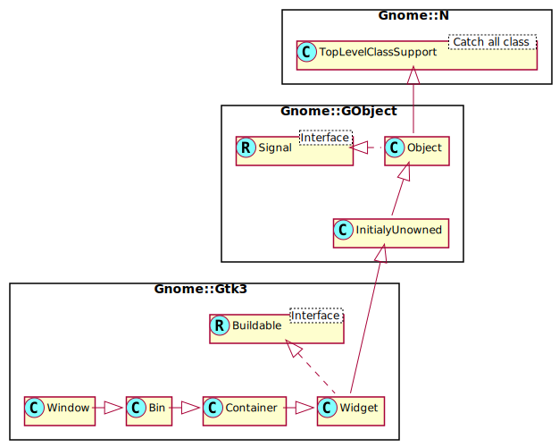

Gnome::Gtk3::Window
===================

Toplevel which can contain other widgets

Description
===========

A **Gnome::Gtk3::Window** is a toplevel window which can contain other widgets. Windows normally have decorations that are under the control of the windowing system and allow the user to manipulate the window (resize it, move it, close it,...).

Gnome::Gtk3::Window as Gnome::Gtk3::Buildable
---------------------------------------------

The **Gnome::Gtk3::Window** implementation of the **Gnome::Gtk3::Buildable** interface supports a custom <accel-groups> element, which supports any number of <group> elements representing the **Gnome::Gtk3::AccelGroup** objects you want to add to your window (synonymous with `gtk_window_add_accel_group()`.

It also supports the <initial-focus> element, whose name property names the widget to receive the focus when the window is mapped.

An example of a UI definition fragment with accel groups:

    <object class="GtkWindow>">
      <accel-groups>
        <group name="accelgroup1"/>
      </accel-groups>
      <initial-focus name="thunderclap"/>
    </object>
    ...
    <object class="GtkAccelGroup>" id="accelgroup1"/>

The **Gnome::Gtk3::Window** implementation of the **Gnome::Gtk3::Buildable** interface supports setting a child as the titlebar by specifying “titlebar” as the “type” attribute of a <child> element.

Css Nodes
---------

    window
    ├── decoration
    ╰── <child>

**Gnome::Gtk3::Window** has a main CSS node with name window and style class .background, and a subnode with name decoration.

Style classes that are typically used with the main CSS node are .csd (when client-side decorations are in use), .solid-csd (for client-side decorations without invisible borders), .ssd (used by mutter when rendering server-side decorations). **Gnome::Gtk3::Window** also represents window states with the following style classes on the main node: .tiled, .maximized, .fullscreen. Specialized types of window often add their own discriminating style classes, such as .popup or .tooltip.

**Gnome::Gtk3::Window** adds the .titlebar and .default-decoration style classes to the widget that is added as a titlebar child.

Synopsis
========

Declaration
-----------

    unit class Gnome::Gtk3::Window;
    also is Gnome::Gtk3::Bin;

Uml Diagram
-----------

Inheriting this class
---------------------

Inheriting is done in a special way in that it needs a call from new() to get the native object created by the class you are inheriting from.

    use Gnome::Gtk3::Window;

    unit class MyGuiClass;
    also is Gnome::Gtk3::Window;

    submethod new ( |c ) {
      # let the Gnome::Gtk3::Window class process the options
      self.bless( :GtkWindow, |c);
    }

    submethod BUILD ( ... ) {
      ...
    }

Example
-------

    my Gnome::Gtk3::Window $w .= new;
    $w.set-title('My Button In My Window');
    my Gnome::Gtk3::Button $b .= new(:label('The Button'));
    $w.add($b);
    $w.show-all;

    my Gnome::Gtk3::Main $m .= new;
    $m.gtk-main;

Types
=====

GtkWindowType
-------------

A **Gnome::Gtk3::Window** can be one of these types. Most things you’d consider a “window” should have type **GTK_WINDOW_TOPLEVEL**; windows with this type are managed by the window manager and have a frame by default (call `gtk_window_set_decorated()` to toggle the frame). Windows with type **GTK_WINDOW_POPUP** are ignored by the window manager; window manager keybindings won’t work on them, the window manager won’t decorate the window with a frame, many GTK+ features that rely on the window manager will not work (e.g. resize grips and maximization/minimization). **GTK_WINDOW_POPUP** is used to implement widgets such as **Gnome::Gtk3::Menu** or tooltips that you normally don’t think of as windows per se. Nearly all windows should be **GTK_WINDOW_TOPLEVEL**. In particular, do not use **GTK_WINDOW_POPUP** just to turn off the window borders; use `gtk_window_set_decorated()` for that.

  * GTK_WINDOW_TOPLEVEL. A regular window, such as a dialog.

  * GTK_WINDOW_POPUP. A special window such as a tooltip.

GtkWindowPosition
-----------------

Window placement can be influenced using this enumeration. Note that using GTK_WIN_POS_CENTER_ALWAYS is almost always a bad idea. It won’t necessarily work well with all window managers or on all windowing systems.

  * GTK_WIN_POS_NONE. No influence is made on placement.

  * GTK_WIN_POS_CENTER. Windows should be placed in the center of the screen.

  * GTK_WIN_POS_MOUSE. Windows should be placed at the current mouse position.

  * GTK_WIN_POS_CENTER_ALWAYS. Keep window centered as it changes size, etc.

  * GTK_WIN_POS_CENTER_ON_PARENT. Center the window on its transient parent.

Methods
=======

new
---

### default, no options

Creates a new **Gnome::Gtk3::Window**, which is a toplevel window that can contain other widgets. The window type is set to `GTK_WINDOW_TOPLEVEL`.

    multi method new ( )

### :window-type

Nearly always, the type of the window should be `GTK_WINDOW_TOPLEVEL` which is the default. If you’re implementing something like a popup menu from scratch (which is a bad idea, just use **Gnome::Gtk3::Menu**), you might use `GTK_WINDOW_POPUP`. `GTK_WINDOW_POPUP` is not for dialogs, though in some other toolkits dialogs are called “popups”. In GTK+, `GTK_WINDOW_POPUP` means a pop-up menu or pop-up tooltip. On X11, popup windows are not controlled by the window manager.

If you simply want an undecorated window (no window borders), use `set-decorated()`, don’t use `GTK_WINDOW_POPUP`.

All top-level windows created by `new()` are stored in an internal top-level window list. This list can be obtained from `list-toplevels()`.

To delete a **Gnome::Gtk3::Window**, call `destroy()`.

    multi method new ( GtkWindowType :$window-type! )

activate-default
----------------

Activates the default widget for the window, unless the current focused widget has been configured to receive the default action (see `Gnome::Gtk3::Widget.set-receives-default()`), in which case the focused widget is activated.

Returns: `True` if a widget got activated.

    method activate-default ( --> Bool )

activate-focus
--------------

Activates the current focused widget within the window.

Returns: `True` if a widget got activated.

    method activate-focus ( --> Bool )

activate-key
------------

Activates mnemonics and accelerators for this **Gnome::Gtk3::Window**. This is normally called by the default ::key-press-event handler for toplevel windows, however in some cases it may be useful to call this directly when overriding the standard key handling for a toplevel window.

Returns: `True` if a mnemonic or accelerator was found and activated.

    method activate-key ( GdkEventKey $event --> Bool )

  * GdkEventKey $event; a **Gnome::Gtk3::EventKey**

add-accel-group
---------------

Associate *accel-group* with *window*, such that calling `gtk-accel-groups-activate()` on *window* will activate accelerators in *accel-group*.

    method add-accel-group ( N-GObject $accel_group )

  * N-GObject $accel_group; a **Gnome::Gtk3::AccelGroup**

add-mnemonic
------------

Adds a mnemonic to this window.

    method add-mnemonic ( UInt $keyval, N-GObject $target )

  * UInt $keyval; the mnemonic

  * N-GObject $target; the widget that gets activated by the mnemonic

begin-move-drag
---------------

Starts moving a window. This function is used if an application has window movement grips. When GDK can support it, the window movement will be done using the standard mechanism for the [window manager][gtk-X11-arch] or windowing system. Otherwise, GDK will try to emulate window movement, potentially not all that well, depending on the windowing system.

    method begin-move-drag ( Int $button, Int $root_x, Int $root_y, UInt $timestamp )

  * Int $button; mouse button that initiated the drag

  * Int $root_x; X position where the user clicked to initiate the drag, in root window coordinates

  * Int $root_y; Y position where the user clicked to initiate the drag

  * UInt $timestamp; timestamp from the click event that initiated the drag

begin-resize-drag
-----------------

Starts resizing a window. This function is used if an application has window resizing controls. When GDK can support it, the resize will be done using the standard mechanism for the [window manager][gtk-X11-arch] or windowing system. Otherwise, GDK will try to emulate window resizing, potentially not all that well, depending on the windowing system.

    method begin-resize-drag ( GdkWindowEdge $edge, Int $button, Int $root_x, Int $root_y, UInt $timestamp )

  * GdkWindowEdge $edge; mouse button that initiated the drag

  * Int $button; position of the resize control

  * Int $root_x; X position where the user clicked to initiate the drag, in root window coordinates

  * Int $root_y; Y position where the user clicked to initiate the drag

  * UInt $timestamp; timestamp from the click event that initiated the drag

close
-----

Requests that the window is closed, similar to what happens when a window manager close button is clicked.

This function can be used with close buttons in custom titlebars.

    method close ( )

deiconify
---------

Asks to deiconify (i.e. unminimize) the specified *window*. Note that you shouldn’t assume the window is definitely deiconified afterward, because other entities (e.g. the user or [window manager][gtk-X11-arch])) could iconify it again before your code which assumes deiconification gets to run.

You can track iconification via the “window-state-event” signal on **Gnome::Gtk3::Widget**.

    method deiconify ( )

fullscreen
----------

Asks to place *window* in the fullscreen state. Note that you shouldn’t assume the window is definitely full screen afterward, because other entities (e.g. the user or [window manager][gtk-X11-arch]) could unfullscreen it again, and not all window managers honor requests to fullscreen windows. But normally the window will end up fullscreen. Just don’t write code that crashes if not.

You can track the fullscreen state via the “window-state-event” signal on **Gnome::Gtk3::Widget**.

    method fullscreen ( )

fullscreen-on-monitor
---------------------

Asks to place *window* in the fullscreen state. Note that you shouldn't assume the window is definitely full screen afterward.

You can track the fullscreen state via the "window-state-event" signal on **Gnome::Gtk3::Widget**.

    method fullscreen-on-monitor ( N-GObject $screen, Int $monitor )

  * N-GObject $screen; a **Gnome::Gdk3::Screen** to draw to

  * Int $monitor; which monitor to go fullscreen on

get-accept-focus
----------------

Gets the value set by `set-accept-focus()`.

Returns: `True` if window should receive the input focus

    method get-accept-focus ( --> Bool )

get-application
---------------

Gets the **Gnome::Gtk3::Application** associated with the window (if any).

Returns: a **Gnome::Gtk3::Application**, or `undefined`

    method get-application ( --> N-GObject )

get-attached-to
---------------

Fetches the attach widget for this window. See `set-attached-to()`.

Returns: the widget where the window is attached, or `undefined` if the window is not attached to any widget.

    method get-attached-to ( --> N-GObject )

get-decorated
-------------

Returns whether the window has been set to have decorations such as a title bar via `set-decorated()`.

Returns: `True` if the window has been set to have decorations

    method get-decorated ( --> Bool )

get-default-icon-list
---------------------

Gets the value set by `set-default-icon-list()`. The list is a copy and should be freed with `g-list-free()`, but the pixbufs in the list have not had their reference count incremented.

Returns: (element-type GdkPixbuf) (transfer container): copy of default icon list

    method get-default-icon-list ( --> N-GList )

get-default-icon-name
---------------------

Returns the fallback icon name for windows that has been set with `set-default-icon-name()`. The returned string is owned by GTK+ and should not be modified. It is only valid until the next call to `set-default-icon-name()`.

Returns: the fallback icon name for windows

    method get-default-icon-name ( --> Str )

get-default-size
----------------

Gets the default size of the window. A value of -1 for the width or height indicates that a default size has not been explicitly set for that dimension, so the “natural” size of the window will be used.

    method get-default-size ( --> List )

The List returns;

  * Int width; location to store the default width, or `undefined`

  * Int height; location to store the default height, or `undefined`

get-default-widget
------------------

Returns the default widget for *window*. See `set-default()` for more details.

Returns: the default widget, or `undefined` if there is none.

    method get-default-widget ( --> N-GObject )

get-deletable
-------------

Returns whether the window has been set to have a close button via `set-deletable()`.

Returns: `True` if the window has been set to have a close button

    method get-deletable ( --> Bool )

get-destroy-with-parent
-----------------------

Returns whether the window will be destroyed with its transient parent. See `set-destroy-with-parent()`.

Returns: `True` if the window will be destroyed with its transient parent.

    method get-destroy-with-parent ( --> Bool )

get-focus
---------

Retrieves the current focused widget within the window. Note that this is the widget that would have the focus if the toplevel window focused; if the toplevel window is not focused then `gtk-widget-has-focus (widget)` will not be `True` for the widget.

Returns: the currently focused widget, or `undefined` if there is none.

    method get-focus ( --> N-GObject )

get-focus-on-map
----------------

Gets the value set by `set-focus-on-map()`.

Returns: `True` if window should receive the input focus when mapped.

    method get-focus-on-map ( --> Bool )

get-focus-visible
-----------------

Gets the value of the *focus-visible* property.

Returns: `True` if “focus rectangles” are supposed to be visible in this window.

    method get-focus-visible ( --> Bool )

get-gravity
-----------

Gets the value set by `set-gravity()`.

Returns: window gravity

    method get-gravity ( --> GdkGravity )

get-group
---------

Returns the group for *window* or the default group, if *window* is `undefined` or if *window* does not have an explicit window group.

Returns: the **Gnome::Gtk3::WindowGroup** for a window or the default group

    method get-group ( --> N-GObject )

get-hide-titlebar-when-maximized
--------------------------------

Returns whether the window has requested to have its titlebar hidden when maximized. See `set-hide-titlebar-when-maximized()`.

Returns: `True` if the window has requested to have its titlebar hidden when maximized

    method get-hide-titlebar-when-maximized ( --> Bool )

get-icon
--------

Gets the value set by `set-icon()` (or if you've called `set-icon-list()`, gets the first icon in the icon list).

Returns: icon for window or `undefined` if none

    method get-icon ( --> N-GObject )

get-icon-list
-------------

Retrieves the list of icons set by `set-icon-list()`. The list is copied, but the reference count on each member won’t be incremented.

Returns: (element-type GdkPixbuf) (transfer container): copy of window’s icon list

    method get-icon-list ( --> N-GList )

get-icon-name
-------------

Returns the name of the themed icon for the window, see `set-icon-name()`.

Returns: the icon name or `undefined` if the window has no themed icon

    method get-icon-name ( --> Str )

get-mnemonic-modifier
---------------------

Returns the mnemonic modifier for this window. See `set-mnemonic-modifier()`.

Returns: the modifier mask used to activate mnemonics on this window.

    method get-mnemonic-modifier ( --> GdkModifierType )

get-mnemonics-visible
---------------------

Gets the value of the *mnemonics-visible* property.

Returns: `True` if mnemonics are supposed to be visible in this window.

    method get-mnemonics-visible ( --> Bool )

get-modal
---------

Returns whether the window is modal. See `set-modal()`.

Returns: `True` if the window is set to be modal and establishes a grab when shown

    method get-modal ( --> Bool )

get-position
------------

This function returns the position you need to pass to `move()` to keep *window* in its current position. This means that the meaning of the returned value varies with window gravity. See `move()` for more details.

The reliability of this function depends on the windowing system currently in use. Some windowing systems, such as Wayland, do not support a global coordinate system, and thus the position of the window will always be (0, 0). Others, like X11, do not have a reliable way to obtain the geometry of the decorations of a window if they are provided by the window manager. Additionally, on X11, window manager have been known to mismanage window gravity, which result in windows moving even if you use the coordinates of the current position as returned by this function.

If you haven’t changed the window gravity, its gravity will be **Gnome::Gtk3::DK-GRAVITY-NORTH-WEST**. This means that `get-position()` gets the position of the top-left corner of the window manager frame for the window. `move()` sets the position of this same top-left corner.

If a window has gravity **Gnome::Gtk3::DK-GRAVITY-STATIC** the window manager frame is not relevant, and thus `get-position()` will always produce accurate results. However you can’t use static gravity to do things like place a window in a corner of the screen, because static gravity ignores the window manager decorations.

Ideally, this function should return appropriate values if the window has client side decorations, assuming that the windowing system supports global coordinates.

In practice, saving the window position should not be left to applications, as they lack enough knowledge of the windowing system and the window manager state to effectively do so. The appropriate way to implement saving the window position is to use a platform-specific protocol, wherever that is available.

    method get-position ( --> List )

The List returns;

  * Int root_x; return location for X coordinate of gravity-determined reference point, or `undefined`

  * Int root_y; return location for Y coordinate of gravity-determined reference point, or `undefined`

get-resizable
-------------

Gets the value set by `set-resizable()`.

Returns: `True` if the user can resize the window

    method get-resizable ( --> Bool )

get-role
--------

Returns the role of the window. See `set-role()` for further explanation.

Returns: the role of the window if set, or `undefined`. The returned is owned by the widget and must not be modified or freed.

    method get-role ( --> Str )

get-screen
----------

Returns the **Gnome::Gdk3::Screen** associated with *window*.

Returns: a **Gnome::Gdk3::Screen**.

    method get-screen ( --> N-GObject )

get-size
--------

Obtains the current size of *window*.

If *window* is not visible on screen, this function return the size GTK+ will suggest to the [window manager][gtk-X11-arch] for the initial window size (but this is not reliably the same as the size the window manager will actually select). See: `set-default-size()`.

Depending on the windowing system and the window manager constraints, the size returned by this function may not match the size set using `resize()`; additionally, since `resize()` may be implemented as an asynchronous operation, GTK+ cannot guarantee in any way that this code:

    # Width and height are set elsewhere with
    $window.resize( $width, $height);

    # And will result in `$new-width` and `$new-height` matching
    #`$width` and `$height`, respectively.
    my Int ( $new-width, $new-height) = $window.get-size;

This function will return the logical size of the **Gnome::Gtk3::Window**, excluding the widgets used in client side decorations; there is, however, no guarantee that the result will be completely accurate because client side decoration may include widgets that depend on the user preferences and that may not be visibile at the time you call this function.

The dimensions returned by this function are suitable for being stored across sessions; use `set-default-size()` to restore them when before showing the window.

To avoid potential race conditions, you should only call this function in response to a size change notification, for instance inside a handler for the `size-allocate` signal, or inside a handler for the `configure-event` signal (both defined in **Gnome::Gtk3::Widget**):

Note that, if you connect to the **Gnome::Gtk3::Widget**::size-allocate signal, you should not use the dimensions of the **Gnome::Gtk3::Allocation** passed to the signal handler, as the allocation may contain client side decorations added by GTK+, depending on the windowing system in use.

If you are getting a window size in order to position the window on the screen, you should, instead, simply set the window’s semantic type with `set-type-hint()`, which allows the window manager to e.g. center dialogs. Also, if you set the transient parent of dialogs with `set-transient-for()` window managers will often center the dialog over its parent window. It's much preferred to let the window manager handle these cases rather than doing it yourself, because all apps will behave consistently and according to user or system preferences, if the window manager handles it. Also, the window manager can take into account the size of the window decorations and border that it may add, and of which GTK+ has no knowledge. Additionally, positioning windows in global screen coordinates may not be allowed by the windowing system. For more information, see: `set-position()`.

    method get-size ( --> List )

  * Int $width; return location for width, or `undefined`

  * Int $height; return location for height, or `undefined`

get-skip-pager-hint
-------------------

Gets the value set by `set-skip-pager-hint()`.

Returns: `True` if window shouldn’t be in pager

    method get-skip-pager-hint ( --> Bool )

get-skip-taskbar-hint
---------------------

Gets the value set by `set-skip-taskbar-hint()`

Returns: `True` if window shouldn’t be in taskbar

    method get-skip-taskbar-hint ( --> Bool )

get-title
---------

Retrieves the title of the window. See `set-title()`.

Returns: the title of the window, or `undefined` if none has been set explicitly. The returned string is owned by the widget and must not be modified or freed.

    method get-title ( --> Str )

get-titlebar
------------

Returns the custom titlebar that has been set with `set-titlebar()`.

Returns: the custom titlebar, or `undefined`

    method get-titlebar ( --> N-GObject )

get-transient-for
-----------------

Fetches the transient parent for this window. See `set-transient-for()`.

Returns: the transient parent for this window, or `undefined` if no transient parent has been set.

    method get-transient-for ( --> N-GObject )

get-type-hint
-------------

Gets the type hint for this window. See `set-type-hint()`.

Returns: the type hint for *window*.

    method get-type-hint ( --> GdkWindowTypeHint )

get-urgency-hint
----------------

Gets the value set by `set-urgency-hint()`

Returns: `True` if window is urgent

    method get-urgency-hint ( --> Bool )

get-window-type
---------------

Gets the type of the window.

Returns: the type of the window

    method get-window-type ( --> GtkWindowType )

has-group
---------

Returns whether *window* has an explicit window group.

Returns: `True` if *window* has an explicit window group.

Since 2.22

    method has-group ( --> Bool )

has-toplevel-focus
------------------

Returns whether the input focus is within this GtkWindow. For real toplevel windows, this is identical to `is-active()`, but for embedded windows, like **Gnome::Gtk3::Plug**, the results will differ.

Returns: `True` if the input focus is within this GtkWindow

    method has-toplevel-focus ( --> Bool )

iconify
-------

Asks to iconify (i.e. minimize) the specified *window*. Note that you shouldn’t assume the window is definitely iconified afterward, because other entities (e.g. the user or [window manager][gtk-X11-arch]) could deiconify it again, or there may not be a window manager in which case iconification isn’t possible, etc. But normally the window will end up iconified. Just don’t write code that crashes if not.

It’s permitted to call this function before showing a window, in which case the window will be iconified before it ever appears onscreen.

You can track iconification via the “window-state-event” signal on **Gnome::Gtk3::Widget**.

    method iconify ( )

is-active
---------

Returns whether the window is part of the current active toplevel. (That is, the toplevel window receiving keystrokes.) The return value is `True` if the window is active toplevel itself, but also if it is, say, a **Gnome::Gtk3::Plug** embedded in the active toplevel. You might use this function if you wanted to draw a widget differently in an active window from a widget in an inactive window. See `has-toplevel-focus()`

Returns: `True` if the window part of the current active window.

    method is-active ( --> Bool )

is-maximized
------------

Retrieves the current maximized state of *window*.

Note that since maximization is ultimately handled by the window manager and happens asynchronously to an application request, you shouldn’t assume the return value of this function changing immediately (or at all), as an effect of calling `maximize()` or `unmaximize()`.

Returns: whether the window has a maximized state.

    method is-maximized ( --> Bool )

list-toplevels
--------------

Returns a list of all existing toplevel windows. The widgets in the list are not individually referenced. If you want to iterate through the list and perform actions involving callbacks that might destroy the widgets, you must call `g-list-foreach (result, (GFunc)g-object-ref, NULL)` first, and then unref all the widgets afterwards.

Returns: (element-type GtkWidget) (transfer container): list of toplevel widgets

    method list-toplevels ( --> N-GList )

maximize
--------

Asks to maximize *window*, so that it becomes full-screen. Note that you shouldn’t assume the window is definitely maximized afterward, because other entities (e.g. the user or [window manager][gtk-X11-arch]) could unmaximize it again, and not all window managers support maximization. But normally the window will end up maximized. Just don’t write code that crashes if not.

It’s permitted to call this function before showing a window, in which case the window will be maximized when it appears onscreen initially.

You can track maximization via the “window-state-event” signal on **Gnome::Gtk3::Widget**, or by listening to notifications on the *is-maximized* property.

    method maximize ( )

mnemonic-activate
-----------------

Activates the targets associated with the mnemonic.

Returns: `True` if the activation is done.

    method mnemonic-activate ( UInt $keyval, GdkModifierType $modifier --> Bool )

  * UInt $keyval; the mnemonic

  * GdkModifierType $modifier; the modifiers

move
----

Asks the [window manager][gtk-X11-arch] to move *window* to the given position. Window managers are free to ignore this; most window managers ignore requests for initial window positions (instead using a user-defined placement algorithm) and honor requests after the window has already been shown.

Note: the position is the position of the gravity-determined reference point for the window. The gravity determines two things: first, the location of the reference point in root window coordinates; and second, which point on the window is positioned at the reference point.

By default the gravity is **Gnome::Gtk3::DK-GRAVITY-NORTH-WEST**, so the reference point is simply the *x*, *y* supplied to `move()`. The top-left corner of the window decorations (aka window frame or border) will be placed at *x*, *y*. Therefore, to position a window at the top left of the screen, you want to use the default gravity (which is **Gnome::Gtk3::DK-GRAVITY-NORTH-WEST**) and move the window to 0,0.

To position a window at the bottom right corner of the screen, you would set **Gnome::Gtk3::DK-GRAVITY-SOUTH-EAST**, which means that the reference point is at *x* + the window width and *y* + the window height, and the bottom-right corner of the window border will be placed at that reference point. So, to place a window in the bottom right corner you would first set gravity to south east, then write: `gtk-window-move (window, `gdk-screen-width()` - window-width, `gdk-screen-height()` - window-height)` (note that this example does not take multi-head scenarios into account).

The [Extended Window Manager Hints Specification](http://www.freedesktop.org/Standards/wm-spec) has a nice table of gravities in the “implementation notes” section.

The `get-position()` documentation may also be relevant.

    method move ( Int $x, Int $y )

  * Int $x; X coordinate to move window to

  * Int $y; Y coordinate to move window to

present
-------

Presents a window to the user. This function should not be used as when it is called, it is too late to gather a valid timestamp to allow focus stealing prevention to work correctly.

    method present ( )

present-with-time
-----------------

Presents a window to the user. This may mean raising the window in the stacking order, deiconifying it, moving it to the current desktop, and/or giving it the keyboard focus, possibly dependent on the user’s platform, window manager, and preferences.

If *window* is hidden, this function calls `Gnome::Gtk3::Widget.show()` as well.

This function should be used when the user tries to open a window that’s already open. Say for example the preferences dialog is currently open, and the user chooses Preferences from the menu a second time; use `present()` to move the already-open dialog where the user can see it.

Presents a window to the user in response to a user interaction. The timestamp should be gathered when the window was requested to be shown (when clicking a link for example), rather than once the window is ready to be shown.

    method present-with-time ( UInt $timestamp )

  * UInt $timestamp; the timestamp of the user interaction (typically a button or key press event) which triggered this call

propagate-key-event
-------------------

Propagate a key press or release event to the focus widget and up the focus container chain until a widget handles *event*. This is normally called by the default ::key-press-event and ::key-release-event handlers for toplevel windows, however in some cases it may be useful to call this directly when overriding the standard key handling for a toplevel window.

Returns: `True` if a widget in the focus chain handled the event.

    method propagate-key-event ( GdkEventKey $event --> Bool )

  * GdkEventKey $event; a **Gnome::Gtk3::EventKey**

remove-accel-group
------------------

Reverses the effects of `add-accel-group()`.

    method remove-accel-group ( N-GObject $accel_group )

  * N-GObject $accel_group; a **Gnome::Gtk3::AccelGroup**

remove-mnemonic
---------------

Removes a mnemonic from this window.

    method remove-mnemonic ( UInt $keyval, N-GObject $target )

  * UInt $keyval; the mnemonic

  * N-GObject $target; the widget that gets activated by the mnemonic

resize
------

Resizes the window as if the user had done so, obeying geometry constraints. The default geometry constraint is that windows may not be smaller than their size request; to override this constraint, call `Gnome::Gtk3::Widget.set-size-request()` to set the window's request to a smaller value.

If `resize()` is called before showing a window for the first time, it overrides any default size set with `set-default-size()`.

Windows may not be resized smaller than 1 by 1 pixels.

When using client side decorations, GTK+ will do its best to adjust the given size so that the resulting window size matches the requested size without the title bar, borders and shadows added for the client side decorations, but there is no guarantee that the result will be totally accurate because these widgets added for client side decorations depend on the theme and may not be realized or visible at the time `resize()` is issued.

If the GtkWindow has a titlebar widget (see `set-titlebar()`), then typically, `resize()` will compensate for the height of the titlebar widget only if the height is known when the resulting GtkWindow configuration is issued. For example, if new widgets are added after the GtkWindow configuration and cause the titlebar widget to grow in height, this will result in a window content smaller that specified by `resize()` and not a larger window.

    method resize ( Int $width, Int $height )

  * Int $width; width in pixels to resize the window to

  * Int $height; height in pixels to resize the window to

set-accept-focus
----------------

Windows may set a hint asking the desktop environment not to receive the input focus. This function sets this hint.

    method set-accept-focus ( Bool $setting )

  * Bool $setting; `True` to let this window receive input focus

set-application
---------------

Sets or unsets the **Gnome::Gtk3::Application** associated with the window.

The application will be kept alive for at least as long as it has any windows associated with it (see `g-application-hold()` for a way to keep it alive without windows).

Normally, the connection between the application and the window will remain until the window is destroyed, but you can explicitly remove it by setting the *application* to `undefined`.

This is equivalent to calling `gtk-application-remove-window()` and/or `gtk-application-add-window()` on the old/new applications as relevant.

    method set-application ( N-GObject $application )

  * N-GObject $application; a **Gnome::Gtk3::Application**, or `undefined` to unset

set-attached-to
---------------

Marks *window* as attached to *attach-widget*. This creates a logical binding between the window and the widget it belongs to, which is used by GTK+ to propagate information such as styling or accessibility to *window* as if it was a children of *attach-widget*.

Examples of places where specifying this relation is useful are for instance a **Gnome::Gtk3::Menu** created by a **Gnome::Gtk3::ComboBox**, a completion popup window created by **Gnome::Gtk3::Entry** or a typeahead search entry created by **Gnome::Gtk3::TreeView**.

Note that this function should not be confused with `set-transient-for()`, which specifies a window manager relation between two toplevels instead.

Passing `undefined` for *attach-widget* detaches the window.

    method set-attached-to ( N-GObject $attach_widget )

  * N-GObject $attach_widget; a **Gnome::Gtk3::Widget**, or `undefined`

set-auto-startup-notification
-----------------------------

By default, after showing the first **Gnome::Gtk3::Window**, GTK+ calls `gdk-notify-startup-complete()`. Call this function to disable the automatic startup notification. You might do this if your first window is a splash screen, and you want to delay notification until after your real main window has been shown, for example.

In that example, you would disable startup notification temporarily, show your splash screen, then re-enable it so that showing the main window would automatically result in notification.

    method set-auto-startup-notification ( Bool $setting )

  * Bool $setting; `True` to automatically do startup notification

set-decorated
-------------

By default, windows are decorated with a title bar, resize controls, etc. Some [window managers][gtk-X11-arch] allow GTK+ to disable these decorations, creating a borderless window. If you set the decorated property to `False` using this function, GTK+ will do its best to convince the window manager not to decorate the window. Depending on the system, this function may not have any effect when called on a window that is already visible, so you should call it before calling `Gnome::Gtk3::Widget.show()`.

On Windows, this function always works, since there’s no window manager policy involved.

    method set-decorated ( Bool $setting )

  * Bool $setting; `True` to decorate the window

set-default
-----------

The default widget is the widget that’s activated when the user presses Enter in a dialog (for example). This function sets or unsets the default widget for a **Gnome::Gtk3::Window**. When setting (rather than unsetting) the default widget it’s generally easier to call `Gnome::Gtk3::Widget.grab-default()` on the widget. Before making a widget the default widget, you must call `Gnome::Gtk3::Widget.set-can-default()` on the widget you’d like to make the default.

    method set-default ( N-GObject $default_widget )

  * N-GObject $default_widget; widget to be the default, or `undefined` to unset the default widget for the toplevel

set-default-icon
----------------

Sets an icon to be used as fallback for windows that haven't had `set-icon()` called on them from a pixbuf.

    method set-default-icon ( N-GObject $icon )

  * N-GObject $icon; the icon

set-default-icon-from-file
--------------------------

Sets an icon to be used as fallback for windows that haven't had `set-icon-list()` called on them from a file on disk.

Returns: a invalid error object if setting the icon succeeded. If it fails, the error must be checked for the reason.

    method set-default-icon-from-file ( Str $filename --> Gnome::Glib::Error )

  * Str $filename; location of icon file.

set-default-icon-list
---------------------

Sets an icon list to be used as fallback for windows that haven't had `set-icon-list()` called on them to set up a window-specific icon list. This function allows you to set up the icon for all windows in your app at once.

See `set-icon-list()` for more details.

    method set-default-icon-list ( N-GList $list )

  * N-GList $list; a list of native **Gnome::Gdk3::Pixbuf** objects

set-default-icon-name
---------------------

Sets an icon to be used as fallback for windows that haven't had `set-icon-list()` called on them from a named themed icon, see `set-icon-name()`.

    method set-default-icon-name ( Str $name )

  * Str $name; the name of the themed icon

set-default-size
----------------

Sets the default size of a window. If the window’s “natural” size (its size request) is larger than the default, the default will be ignored. More generally, if the default size does not obey the geometry hints for the window (`set-geometry-hints()` can be used to set these explicitly), the default size will be clamped to the nearest permitted size.

Unlike `Gnome::Gtk3::Widget.set-size-request()`, which sets a size request for a widget and thus would keep users from shrinking the window, this function only sets the initial size, just as if the user had resized the window themselves. Users can still shrink the window again as they normally would. Setting a default size of -1 means to use the “natural” default size (the size request of the window).

For more control over a window’s initial size and how resizing works, investigate `set-geometry-hints()`.

For some uses, `resize()` is a more appropriate function. `resize()` changes the current size of the window, rather than the size to be used on initial display. `resize()` always affects the window itself, not the geometry widget.

The default size of a window only affects the first time a window is shown; if a window is hidden and re-shown, it will remember the size it had prior to hiding, rather than using the default size.

Windows can’t actually be 0x0 in size, they must be at least 1x1, but passing 0 for *width* and *height* is OK, resulting in a 1x1 default size.

If you use this function to reestablish a previously saved window size, note that the appropriate size to save is the one returned by `get-size()`. Using the window allocation directly will not work in all circumstances and can lead to growing or shrinking windows.

    method set-default-size ( Int $width, Int $height )

  * Int $width; width in pixels, or -1 to unset the default width

  * Int $height; height in pixels, or -1 to unset the default height

set-deletable
-------------

By default, windows have a close button in the window frame. Some [window managers][gtk-X11-arch] allow GTK+ to disable this button. If you set the deletable property to `False` using this function, GTK+ will do its best to convince the window manager not to show a close button. Depending on the system, this function may not have any effect when called on a window that is already visible, so you should call it before calling `Gnome::Gtk3::Widget.show()`.

On Windows, this function always works, since there’s no window manager policy involved.

    method set-deletable ( Bool $setting )

  * Bool $setting; `True` to decorate the window as deletable

set-destroy-with-parent
-----------------------

If *setting* is `True`, then destroying the transient parent of *window* will also destroy *window* itself. This is useful for dialogs that shouldn’t persist beyond the lifetime of the main window they're associated with, for example.

    method set-destroy-with-parent ( Bool $setting )

  * Bool $setting; whether to destroy *window* with its transient parent

set-focus
---------

If *focus* is not the current focus widget, and is focusable, sets it as the focus widget for the window. If *focus* is `undefined`, unsets the focus widget for this window. To set the focus to a particular widget in the toplevel, it is usually more convenient to use `Gnome::Gtk3::Widget.grab-focus()` instead of this function.

    method set-focus ( N-GObject $focus )

  * N-GObject $focus; widget to be the new focus widget, or `undefined` to unset any focus widget for the toplevel window.

set-focus-on-map
----------------

Windows may set a hint asking the desktop environment not to receive the input focus when the window is mapped. This function sets this hint.

    method set-focus-on-map ( Bool $setting )

  * Bool $setting; `True` to let this window receive input focus on map

set-focus-visible
-----------------

Sets the *focus-visible* property.

    method set-focus-visible ( Bool $setting )

  * Bool $setting; the new value

set-geometry-hints
------------------

This function sets up hints about how a window can be resized by the user. You can set a minimum and maximum size; allowed resize increments (e.g. for xterm, you can only resize by the size of a character); aspect ratios; and more. See the **Gnome::Gtk3::Geometry** struct.

    method set-geometry-hints ( N-GObject $geometry_widget, GdkGeometry $geometry, GdkWindowHints $geom_mask )

  * N-GObject $geometry_widget; widget the geometry hints used to be applied to or `undefined`. Since 3.20 this argument is ignored and GTK behaves as if `undefined` was set.

  * GdkGeometry $geometry; struct containing geometry information or `undefined`

  * GdkWindowHints $geom_mask; mask indicating which struct fields should be paid attention to

set-gravity
-----------

Window gravity defines the meaning of coordinates passed to `move()`. See `move()` and **Gnome::Gtk3::Gravity** for more details.

The default window gravity is **Gnome::Gtk3::DK-GRAVITY-NORTH-WEST** which will typically “do what you mean.”

    method set-gravity ( GdkGravity $gravity )

  * GdkGravity $gravity; window gravity

set-has-user-ref-count
----------------------

Tells GTK+ whether to drop its extra reference to the window when `Gnome::Gtk3::Widget.destroy()` is called.

This function is only exported for the benefit of language bindings which may need to keep the window alive until their wrapper object is garbage collected. There is no justification for ever calling this function in an application.

    method set-has-user-ref-count ( Bool $setting )

  * Bool $setting; the new value

set-hide-titlebar-when-maximized
--------------------------------

If *setting* is `True`, then *window* will request that it’s titlebar should be hidden when maximized. This is useful for windows that don’t convey any information other than the application name in the titlebar, to put the available screen space to better use. If the underlying window system does not support the request, the setting will not have any effect.

Note that custom titlebars set with `set-titlebar()` are not affected by this. The application is in full control of their content and visibility anyway.

    method set-hide-titlebar-when-maximized ( Bool $setting )

  * Bool $setting; whether to hide the titlebar when *window* is maximized

set-icon
--------

Sets up the icon representing a **Gnome::Gtk3::Window**. This icon is used when the window is minimized (also known as iconified). Some window managers or desktop environments may also place it in the window frame, or display it in other contexts. On others, the icon is not used at all, so your mileage may vary.

The icon should be provided in whatever size it was naturally drawn; that is, don’t scale the image before passing it to GTK+. Scaling is postponed until the last minute, when the desired final size is known, to allow best quality.

If you have your icon hand-drawn in multiple sizes, use `set-icon-list()`. Then the best size will be used.

This function is equivalent to calling `set-icon-list()` with a 1-element list.

See also `set-default-icon-list()` to set the icon for all windows in your application in one go.

    method set-icon ( N-GObject $icon )

  * N-GObject $icon; icon image, or `undefined`

set-icon-from-file
------------------

Sets the icon for *window*.

This function is equivalent to calling `set-icon()` with a pixbuf created by loading the image from *filename*.

Returns: an invalid error object if setting the icon succeeded.

    method set-icon-from-file ( Str $filename --> Gnome::Glib::Error )

  * Str $filename; location of icon file

set-icon-list
-------------

Sets up the icon representing a **Gnome::Gtk3::Window**. The icon is used when the window is minimized (also known as iconified). Some window managers or desktop environments may also place it in the window frame, or display it in other contexts. On others, the icon is not used at all, so your mileage may vary.

`set-icon-list()` allows you to pass in the same icon in several hand-drawn sizes. The list should contain the natural sizes your icon is available in; that is, don’t scale the image before passing it to GTK+. Scaling is postponed until the last minute, when the desired final size is known, to allow best quality.

By passing several sizes, you may improve the final image quality of the icon, by reducing or eliminating automatic image scaling.

Recommended sizes to provide: 16x16, 32x32, 48x48 at minimum, and larger images (64x64, 128x128) if you have them.

See also `set-default-icon-list()` to set the icon for all windows in your application in one go.

Note that transient windows (those who have been set transient for another window using `set-transient-for()`) will inherit their icon from their transient parent. So there’s no need to explicitly set the icon on transient windows.

    method set-icon-list ( N-GList $list )

  * N-GList $list; list of native **Gnome::Gdk3::Pixbuf** objects

set-icon-name
-------------

Sets the icon for the window from a named themed icon. See the docs for **Gnome::Gtk3::IconTheme** for more details. On some platforms, the window icon is not used at all.

Note that this has nothing to do with the WM-ICON-NAME property which is mentioned in the ICCCM.

    method set-icon-name ( Str $name )

  * Str $name; the name of the themed icon

set-interactive-debugging
-------------------------

Opens or closes the [interactive debugger][interactive-debugging], which offers access to the widget hierarchy of the application and to useful debugging tools.

    method set-interactive-debugging ( Bool $enable )

  * Bool $enable; `True` to enable interactive debugging

set-keep-above
--------------

Asks to keep *window* above, so that it stays on top. Note that you shouldn’t assume the window is definitely above afterward, because other entities (e.g. the user or [window manager][gtk-X11-arch]) could not keep it above, and not all window managers support keeping windows above. But normally the window will end kept above. Just don’t write code that crashes if not.

It’s permitted to call this function before showing a window, in which case the window will be kept above when it appears onscreen initially.

You can track the above state via the “window-state-event” signal on **Gnome::Gtk3::Widget**.

Note that, according to the [Extended Window Manager Hints Specification](http://www.freedesktop.org/Standards/wm-spec), the above state is mainly meant for user preferences and should not be used by applications e.g. for drawing attention to their dialogs.

    method set-keep-above ( Bool $setting )

  * Bool $setting; whether to keep *window* above other windows

set-keep-below
--------------

Asks to keep *window* below, so that it stays in bottom. Note that you shouldn’t assume the window is definitely below afterward, because other entities (e.g. the user or [window manager][gtk-X11-arch]) could not keep it below, and not all window managers support putting windows below. But normally the window will be kept below. Just don’t write code that crashes if not.

It’s permitted to call this function before showing a window, in which case the window will be kept below when it appears onscreen initially.

You can track the below state via the “window-state-event” signal on **Gnome::Gtk3::Widget**.

Note that, according to the [Extended Window Manager Hints Specification](http://www.freedesktop.org/Standards/wm-spec), the above state is mainly meant for user preferences and should not be used by applications e.g. for drawing attention to their dialogs.

    method set-keep-below ( Bool $setting )

  * Bool $setting; whether to keep *window* below other windows

set-mnemonic-modifier
---------------------

Sets the mnemonic modifier for this window.

    method set-mnemonic-modifier ( GdkModifierType $modifier )

  * GdkModifierType $modifier; the modifier mask used to activate mnemonics on this window.

set-mnemonics-visible
---------------------

Sets the *mnemonics-visible* property.

    method set-mnemonics-visible ( Bool $setting )

  * Bool $setting; the new value

set-modal
---------

Sets a window modal or non-modal. Modal windows prevent interaction with other windows in the same application. To keep modal dialogs on top of main application windows, use `set-transient-for()` to make the dialog transient for the parent; most [window managers][gtk-X11-arch] will then disallow lowering the dialog below the parent.

    method set-modal ( Bool $modal )

  * Bool $modal; whether the window is modal

set-position
------------

Sets a position constraint for this window. If the old or new constraint is `GTK-WIN-POS-CENTER-ALWAYS`, this will also cause the window to be repositioned to satisfy the new constraint.

    method set-position ( GtkWindowPosition $position )

  * GtkWindowPosition $position; a position constraint.

set-resizable
-------------

Sets whether the user can resize a window. Windows are user resizable by default.

    method set-resizable ( Bool $resizable )

  * Bool $resizable; `True` if the user can resize this window

set-role
--------

This function is only useful on X11, not with other GTK+ targets.

In combination with the window title, the window role allows a [window manager][gtk-X11-arch] to identify "the same" window when an application is restarted. So for example you might set the “toolbox” role on your app’s toolbox window, so that when the user restarts their session, the window manager can put the toolbox back in the same place.

If a window already has a unique title, you don’t need to set the role, since the WM can use the title to identify the window when restoring the session.

    method set-role ( Str $role )

  * Str $role; unique identifier for the window to be used when restoring a session

set-screen
----------

Sets the **Gnome::Gdk3::Screen** where the *window* is displayed; if the window is already mapped, it will be unmapped, and then remapped on the new screen.

    method set-screen ( N-GObject $screen )

  * N-GObject $screen; a **Gnome::Gdk3::Screen**.

set-skip-pager-hint
-------------------

Windows may set a hint asking the desktop environment not to display the window in the pager. This function sets this hint. (A "pager" is any desktop navigation tool such as a workspace switcher that displays a thumbnail representation of the windows on the screen.)

    method set-skip-pager-hint ( Bool $setting )

  * Bool $setting; `True` to keep this window from appearing in the pager

set-skip-taskbar-hint
---------------------

Windows may set a hint asking the desktop environment not to display the window in the task bar. This function sets this hint.

    method set-skip-taskbar-hint ( Bool $setting )

  * Bool $setting; `True` to keep this window from appearing in the task bar

set-startup-id
--------------

Startup notification identifiers are used by desktop environment to track application startup, to provide user feedback and other features. This function changes the corresponding property on the underlying GdkWindow. Normally, startup identifier is managed automatically and you should only use this function in special cases like transferring focus from other processes. You should use this function before calling `present()` or any equivalent function generating a window map event.

This function is only useful on X11, not with other GTK+ targets.

    method set-startup-id ( Str $startup_id )

  * Str $startup_id; a string with startup-notification identifier

set-title
---------

Sets the title of the **Gnome::Gtk3::Window**. The title of a window will be displayed in its title bar; on the X Window System, the title bar is rendered by the [window manager][gtk-X11-arch], so exactly how the title appears to users may vary according to a user’s exact configuration. The title should help a user distinguish this window from other windows they may have open. A good title might include the application name and current document filename, for example.

    method set-title ( Str $title )

  * Str $title; title of the window

set-titlebar
------------

Sets a custom titlebar for *window*.

A typical widget used here is **Gnome::Gtk3::HeaderBar**, as it provides various features expected of a titlebar while allowing the addition of child widgets to it.

If you set a custom titlebar, GTK+ will do its best to convince the window manager not to put its own titlebar on the window. Depending on the system, this function may not work for a window that is already visible, so you set the titlebar before calling `Gnome::Gtk3::Widget.show()`.

    method set-titlebar ( N-GObject $titlebar )

  * N-GObject $titlebar; the widget to use as titlebar

set-transient-for
-----------------

Dialog windows should be set transient for the main application window they were spawned from. This allows [window managers][gtk-X11-arch] to e.g. keep the dialog on top of the main window, or center the dialog over the main window. `gtk-dialog-new-with-buttons()` and other convenience functions in GTK+ will sometimes call `set-transient-for()` on your behalf.

Passing `undefined` for *parent* unsets the current transient window.

On Wayland, this function can also be used to attach a new **Gnome::Gtk3::TK-WINDOW-POPUP** to a **Gnome::Gtk3::TK-WINDOW-TOPLEVEL** parent already mapped on screen so that the **Gnome::Gtk3::TK-WINDOW-POPUP** will be created as a subsurface-based window **Gnome::Gtk3::DK-WINDOW-SUBSURFACE** which can be positioned at will relatively to the **Gnome::Gtk3::TK-WINDOW-TOPLEVEL** surface.

On Windows, this function puts the child window on top of the parent, much as the window manager would have done on X.

    method set-transient-for ( N-GObject $parent )

  * N-GObject $parent; parent window, or `undefined`

set-type-hint
-------------

By setting the type hint for the window, you allow the window manager to decorate and handle the window in a way which is suitable to the function of the window in your application.

This function should be called before the window becomes visible.

`gtk-dialog-new-with-buttons()` and other convenience functions in GTK+ will sometimes call `set-type-hint()` on your behalf.

    method set-type-hint ( GdkWindowTypeHint $hint )

  * GdkWindowTypeHint $hint; the window type

set-urgency-hint
----------------

Windows may set a hint asking the desktop environment to draw the users attention to the window. This function sets this hint.

    method set-urgency-hint ( Bool $setting )

  * Bool $setting; `True` to mark this window as urgent

stick
-----

Asks to stick *window*, which means that it will appear on all user desktops. Note that you shouldn’t assume the window is definitely stuck afterward, because other entities (e.g. the user or [window manager][gtk-X11-arch] could unstick it again, and some window managers do not support sticking windows. But normally the window will end up stuck. Just don't write code that crashes if not.

It’s permitted to call this function before showing a window.

You can track stickiness via the “window-state-event” signal on **Gnome::Gtk3::Widget**.

    method stick ( )

unfullscreen
------------

Asks to toggle off the fullscreen state for *window*. Note that you shouldn’t assume the window is definitely not full screen afterward, because other entities (e.g. the user or [window manager][gtk-X11-arch]) could fullscreen it again, and not all window managers honor requests to unfullscreen windows. But normally the window will end up restored to its normal state. Just don’t write code that crashes if not.

You can track the fullscreen state via the “window-state-event” signal on **Gnome::Gtk3::Widget**.

    method unfullscreen ( )

unmaximize
----------

Asks to unmaximize *window*. Note that you shouldn’t assume the window is definitely unmaximized afterward, because other entities (e.g. the user or [window manager][gtk-X11-arch]) could maximize it again, and not all window managers honor requests to unmaximize. But normally the window will end up unmaximized. Just don’t write code that crashes if not.

You can track maximization via the “window-state-event” signal on **Gnome::Gtk3::Widget**.

    method unmaximize ( )

unstick
-------

Asks to unstick *window*, which means that it will appear on only one of the user’s desktops. Note that you shouldn’t assume the window is definitely unstuck afterward, because other entities (e.g. the user or [window manager][gtk-X11-arch]) could stick it again. But normally the window will end up stuck. Just don’t write code that crashes if not.

You can track stickiness via the “window-state-event” signal on **Gnome::Gtk3::Widget**.

    method unstick ( )

Signals
=======

There are two ways to connect to a signal. The first option you have is to use `register-signal()` from **Gnome::GObject::Object**. The second option is to use `connect-object()` directly from **Gnome::GObject::Signal**.

First method
------------

The positional arguments of the signal handler are all obligatory as well as their types. The named attributes `:$widget` and user data are optional.

    # handler method
    method mouse-event ( GdkEvent $event, :$widget ) { ... }

    # connect a signal on window object
    my Gnome::Gtk3::Window $w .= new( ... );
    $w.register-signal( self, 'mouse-event', 'button-press-event');

Second method
-------------

    my Gnome::Gtk3::Window $w .= new( ... );
    my Callable $handler = sub (
      N-GObject $native, GdkEvent $event, OpaquePointer $data
    ) {
      ...
    }

    $w.connect-object( 'button-press-event', $handler);

Also here, the types of positional arguments in the signal handler are important. This is because both methods `register-signal()` and `connect-object()` are using the signatures of the handler routines to setup the native call interface.

Supported signals
-----------------

### activate-default

The ::activate-default signal is a [keybinding signal][GtkBindingSignal] which gets emitted when the user activates the default widget of *window*.

    method handler (
      Int :$_handle_id,
      Gnome::GObject::Object :_widget($window),
      *%user-options
    );

  * $window; the window which received the signal

### activate-focus

The ::activate-focus signal is a [keybinding signal][GtkBindingSignal] which gets emitted when the user activates the currently focused widget of *window*.

    method handler (
      Int :$_handle_id,
      Gnome::GObject::Object :_widget($window),
      *%user-options
    );

  * $window; the window which received the signal

### enable-debugging

The ::enable-debugging signal is a [keybinding signal][GtkBindingSignal] which gets emitted when the user enables or disables interactive debugging. When *toggle* is `True`, interactive debugging is toggled on or off, when it is `False`, the debugger will be pointed at the widget under the pointer.

The default bindings for this signal are Ctrl-Shift-I and Ctrl-Shift-D.

Return: `True` if the key binding was handled

    method handler (
      Int $toggle,
      Int :$_handle_id,
      Gnome::GObject::Object :_widget($window),
      *%user-options
      --> Int
    );

  * $window; the window on which the signal is emitted

  * $toggle; toggle the debugger

### keys-changed

The ::keys-changed signal gets emitted when the set of accelerators or mnemonics that are associated with *window* changes.

    method handler (
      Int :$_handle_id,
      Gnome::GObject::Object :_widget($window),
      *%user-options
    );

  * $window; the window which received the signal

### set-focus

This signal is emitted whenever the currently focused widget in this window changes.

    method handler (
      N-GObject #`{ is widget } $widget,
      Int :$_handle_id,
      Gnome::GObject::Object :_widget($window),
      *%user-options
    );

  * $window; the window which received the signal

  * $widget; the newly focused widget (or `undefined` for no focus)

Properties
==========

An example of using a string type property of a **Gnome::Gtk3::Label** object. This is just showing how to set/read a property, not that it is the best way to do it. This is because a) The class initialization often provides some options to set some of the properties and b) the classes provide many methods to modify just those properties. In the case below one can use **new(:label('my text label'))** or **.set-text('my text label')**.

    my Gnome::Gtk3::Label $label .= new;
    my Gnome::GObject::Value $gv .= new(:init(G_TYPE_STRING));
    $label.get-property( 'label', $gv);
    $gv.set-string('my text label');

Supported properties
--------------------

### Accept focus: accept-focus

Whether the window should receive the input focus.

The **Gnome::GObject::Value** type of property *accept-focus* is `G_TYPE_BOOLEAN`.

### GtkApplication: application

The **Gnome::Gtk3::Application** associated with the window.

The application will be kept alive for at least as long as it has any windows associated with it (see `g-application-hold()` for a way to keep it alive without windows).

Normally, the connection between the application and the window will remain until the window is destroyed, but you can explicitly remove it by setting the *application* property to `undefined`.

    Widget type: GTK_TYPE_APPLICATION

The **Gnome::GObject::Value** type of property *application* is `G_TYPE_OBJECT`.

### Attached to Widget: attached-to

The widget to which this window is attached. See `set-attached-to()`.

Examples of places where specifying this relation is useful are for instance a **Gnome::Gtk3::Menu** created by a **Gnome::Gtk3::ComboBox**, a completion popup window created by **Gnome::Gtk3::Entry** or a typeahead search entry created by **Gnome::Gtk3::TreeView**.

    Widget type: GTK_TYPE_WIDGET

The **Gnome::GObject::Value** type of property *attached-to* is `G_TYPE_OBJECT`.

### Decorated: decorated

Whether the window should be decorated by the window manager.

The **Gnome::GObject::Value** type of property *decorated* is `G_TYPE_BOOLEAN`.

### Default Height: default-height

The **Gnome::GObject::Value** type of property *default-height* is `G_TYPE_INT`.

### Default Width: default-width

The **Gnome::GObject::Value** type of property *default-width* is `G_TYPE_INT`.

### Deletable: deletable

Whether the window frame should have a close button.

The **Gnome::GObject::Value** type of property *deletable* is `G_TYPE_BOOLEAN`.

### Destroy with Parent: destroy-with-parent

If this window should be destroyed when the parent is destroyed Default value: False

The **Gnome::GObject::Value** type of property *destroy-with-parent* is `G_TYPE_BOOLEAN`.

### Focus on map: focus-on-map

Whether the window should receive the input focus when mapped.

The **Gnome::GObject::Value** type of property *focus-on-map* is `G_TYPE_BOOLEAN`.

### Focus Visible: focus-visible

Whether 'focus rectangles' are currently visible in this window.

This property is maintained by GTK+ based on user input and should not be set by applications.

The **Gnome::GObject::Value** type of property *focus-visible* is `G_TYPE_BOOLEAN`.

### Gravity: gravity

The window gravity of the window. See `move()` and **Gnome::Gtk3::Gravity** for more details about window gravity.

    Widget type: GDK_TYPE_GRAVITY

The **Gnome::GObject::Value** type of property *gravity* is `G_TYPE_ENUM`.

### Focus in Toplevel: has-toplevel-focus

Whether the input focus is within this GtkWindow Default value: False

The **Gnome::GObject::Value** type of property *has-toplevel-focus* is `G_TYPE_BOOLEAN`.

### Hide the titlebar during maximization: hide-titlebar-when-maximized

Whether the titlebar should be hidden during maximization.

The **Gnome::GObject::Value** type of property *hide-titlebar-when-maximized* is `G_TYPE_BOOLEAN`.

### Icon: icon

Icon for this window Widget type: GDK-TYPE-PIXBUF

The **Gnome::GObject::Value** type of property *icon* is `G_TYPE_OBJECT`.

### Icon Name: icon-name

The *icon-name* property specifies the name of the themed icon to use as the window icon. See **Gnome::Gtk3::IconTheme** for more details.

The **Gnome::GObject::Value** type of property *icon-name* is `G_TYPE_STRING`.

### Is Active: is-active

Whether the toplevel is the current active window Default value: False

The **Gnome::GObject::Value** type of property *is-active* is `G_TYPE_BOOLEAN`.

### Is maximized: is-maximized

Whether the window is maximized Default value: False

The **Gnome::GObject::Value** type of property *is-maximized* is `G_TYPE_BOOLEAN`.

### Mnemonics Visible: mnemonics-visible

Whether mnemonics are currently visible in this window.

This property is maintained by GTK+ based on user input, and should not be set by applications.

The **Gnome::GObject::Value** type of property *mnemonics-visible* is `G_TYPE_BOOLEAN`.

### Modal: modal

If TRUE, the window is modal (other windows are not usable while this one is up) Default value: False

The **Gnome::GObject::Value** type of property *modal* is `G_TYPE_BOOLEAN`.

### Resizable: resizable

If TRUE, users can resize the window Default value: True

The **Gnome::GObject::Value** type of property *resizable* is `G_TYPE_BOOLEAN`.

### Window Role: role

Unique identifier for the window to be used when restoring a session Default value: Any

The **Gnome::GObject::Value** type of property *role* is `G_TYPE_STRING`.

### Screen: screen

The screen where this window will be displayed Widget type: GDK-TYPE-SCREEN

The **Gnome::GObject::Value** type of property *screen* is `G_TYPE_OBJECT`.

### Skip pager: skip-pager-hint

TRUE if the window should not be in the pager. Default value: False

The **Gnome::GObject::Value** type of property *skip-pager-hint* is `G_TYPE_BOOLEAN`.

### Skip taskbar: skip-taskbar-hint

TRUE if the window should not be in the task bar. Default value: False

The **Gnome::GObject::Value** type of property *skip-taskbar-hint* is `G_TYPE_BOOLEAN`.

### Startup ID: startup-id

The *startup-id* is a write-only property for setting window's startup notification identifier. See `set-startup-id()` for more details.

The **Gnome::GObject::Value** type of property *startup-id* is `G_TYPE_STRING`.

### Window Title: title

The title of the window Default value: Any

The **Gnome::GObject::Value** type of property *title* is `G_TYPE_STRING`.

### Transient for Window: transient-for

The transient parent of the window. See `set-transient-for()` for more details about transient windows.

    Widget type: GTK_TYPE_WINDOW

The **Gnome::GObject::Value** type of property *transient-for* is `G_TYPE_OBJECT`.

### Window Type: type

The type of the window Default value: False

The **Gnome::GObject::Value** type of property *type* is `G_TYPE_ENUM`.

### Type hint: type-hint

Hint to help the desktop environment understand what kind of window this is and how to treat it. Default value: False

The **Gnome::GObject::Value** type of property *type-hint* is `G_TYPE_ENUM`.

### Urgent: urgency-hint

TRUE if the window should be brought to the user's attention. Default value: False

The **Gnome::GObject::Value** type of property *urgency-hint* is `G_TYPE_BOOLEAN`.

### Window Position: window-position

The initial position of the window Default value: False

The **Gnome::GObject::Value** type of property *window-position* is `G_TYPE_ENUM`.

