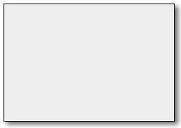
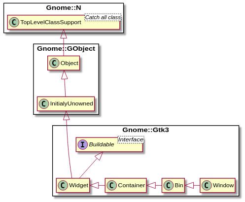

Gnome::Gtk3::Window
===================

Toplevel which can contain other widgets

Description
===========

A **Gnome::Gtk3::Window** is a toplevel window which can contain other widgets. Windows normally have decorations that are under the control of the windowing system and allow the user to manipulate the window (resize it, move it, close it,...).

Gnome::Gtk3::Window as Gnome::Gtk3::Buildable
---------------------------------------------

The **Gnome::Gtk3::Window** implementation of the **Gnome::Gtk3::Buildable** interface supports a custom <accel-groups> element, which supports any number of <group> elements representing the **Gnome::Gtk3::AccelGroup** objects you want to add to your window (synonymous with `gtk_window_add_accel_group()`.

It also supports the <initial-focus> element, whose name property names the widget to receive the focus when the window is mapped.

An example of a UI definition fragment with accel groups:

    <object class="GtkWindow>">
      <accel-groups>
        <group name="accelgroup1"/>
      </accel-groups>
      <initial-focus name="thunderclap"/>
    </object>
    ...
    <object class="GtkAccelGroup>" id="accelgroup1"/>

The **Gnome::Gtk3::Window** implementation of the **Gnome::Gtk3::Buildable** interface supports setting a child as the titlebar by specifying “titlebar” as the “type” attribute of a <child> element.

Css Nodes
---------

    window
    ├── decoration
    ╰── <child>

**Gnome::Gtk3::Window** has a main CSS node with name window and style class .background, and a subnode with name decoration.

Style classes that are typically used with the main CSS node are .csd (when client-side decorations are in use), .solid-csd (for client-side decorations without invisible borders), .ssd (used by mutter when rendering server-side decorations). **Gnome::Gtk3::Window** also represents window states with the following style classes on the main node: .tiled, .maximized, .fullscreen. Specialized types of window often add their own discriminating style classes, such as .popup or .tooltip.

**Gnome::Gtk3::Window** adds the .titlebar and .default-decoration style classes to the widget that is added as a titlebar child.

Synopsis
========

Declaration
-----------

    unit class Gnome::Gtk3::Window;
    also is Gnome::Gtk3::Bin;

Uml Diagram
-----------

Inheriting this class
---------------------

Inheriting is done in a special way in that it needs a call from new() to get the native object created by the class you are inheriting from.

    use Gnome::Gtk3::Window;

    unit class MyGuiClass;
    also is Gnome::Gtk3::Window;

    submethod new ( |c ) {
      # let the Gnome::Gtk3::Window class process the options
      self.bless( :GtkWindow, |c);
    }

    submethod BUILD ( ... ) {
      ...
    }

Example
-------

    my Gnome::Gtk3::Window $w .= new(:title('My Button In My Window'));
    my Gnome::Gtk3::Button $b .= new(:label('The Button'));
    $w.gtk-container-add($b);
    $w.show-all;

    my Gnome::Gtk3::Main $m .= new;
    $m.gtk-main;

Types
=====

GtkWindowType
-------------

A **Gnome::Gtk3::Window** can be one of these types. Most things you’d consider a “window” should have type **GTK_WINDOW_TOPLEVEL**; windows with this type are managed by the window manager and have a frame by default (call `gtk_window_set_decorated()` to toggle the frame). Windows with type **GTK_WINDOW_POPUP** are ignored by the window manager; window manager keybindings won’t work on them, the window manager won’t decorate the window with a frame, many GTK+ features that rely on the window manager will not work (e.g. resize grips and maximization/minimization). **GTK_WINDOW_POPUP** is used to implement widgets such as **Gnome::Gtk3::Menu** or tooltips that you normally don’t think of as windows per se. Nearly all windows should be **GTK_WINDOW_TOPLEVEL**. In particular, do not use **GTK_WINDOW_POPUP** just to turn off the window borders; use `gtk_window_set_decorated()` for that.

  * GTK_WINDOW_TOPLEVEL. A regular window, such as a dialog.

  * GTK_WINDOW_POPUP. A special window such as a tooltip.

GtkWindowPosition
-----------------

Window placement can be influenced using this enumeration. Note that using GTK_WIN_POS_CENTER_ALWAYS is almost always a bad idea. It won’t necessarily work well with all window managers or on all windowing systems.

  * GTK_WIN_POS_NONE. No influence is made on placement.

  * GTK_WIN_POS_CENTER. Windows should be placed in the center of the screen.

  * GTK_WIN_POS_MOUSE. Windows should be placed at the current mouse position.

  * GTK_WIN_POS_CENTER_ALWAYS. Keep window centered as it changes size, etc.

  * GTK_WIN_POS_CENTER_ON_PARENT. Center the window on its transient parent.

Methods
=======

new
---

### new()

Creates a new **Gnome::Gtk3::Window**, which is a toplevel window that can contain other widgets. Nearly always, the type of the window should be `GTK_WINDOW_TOPLEVEL`. If you’re implementing something like a popup menu from scratch (which is a bad idea, just use **Gnome::Gtk3::Menu**), you might use `GTK_WINDOW_POPUP`. `GTK_WINDOW_POPUP` is not for dialogs, though in some other toolkits dialogs are called “popups”. In GTK+, `GTK_WINDOW_POPUP` means a pop-up menu or pop-up tooltip. On X11, popup windows are not controlled by the window manager.

If you simply want an undecorated window (no window borders), use `gtk_window_set_decorated()`, don’t use `GTK_WINDOW_POPUP`.

All top-level windows created by `gtk_window_new()` are stored in an internal top-level window list. This list can be obtained from `gtk_window_list_toplevels()`. Due to Gtk+ keeping a reference to the window internally, `gtk_window_new()` does not return a reference to the caller.

To delete a **Gnome::Gtk3::Window**, call `gtk_widget_destroy()`.

    multi method new (
      GtkWindowType :$window-type = GTK_WINDOW_TOPLEVEL
    )

[[gtk_] window_] set_title
--------------------------

Sets the title of the **Gnome::Gtk3::Window**. The title of a window will be displayed in its title bar; on the X Window System, the title bar is rendered by the window manager, so exactly how the title appears to users may vary according to a user’s exact configuration. The title should help a user distinguish this window from other windows they may have open. A good title might include the application name and current document filename, for example.

    method gtk_window_set_title ( Str $title )

  * Str $title; title of the window

[[gtk_] window_] get_title
--------------------------

Retrieves the title of the window. See `gtk_window_set_title()`.

Returns: (nullable): the title of the window, or `Any` if none has been set explicitly. The returned string is owned by the widget and must not be modified or freed.

    method gtk_window_get_title ( --> Str  )

[[gtk_] window_] set_position
-----------------------------

Sets a position constraint for this window. If the old or new constraint is `GTK_WIN_POS_CENTER_ALWAYS`, this will also cause the window to be repositioned to satisfy the new constraint.

    method gtk_window_set_position ( GtkWindowPosition $position )

  * GtkWindowPosition $position; a position constraint.

[[gtk_] window_] activate_focus
-------------------------------

Activates the current focused widget within the window.

Returns: `1` if a widget got activated.

    method gtk_window_activate_focus ( --> Int  )

[[gtk_] window_] set_focus
--------------------------

If *focus* is not the current focus widget, and is focusable, sets it as the focus widget for the window. If *focus* is `Any`, unsets the focus widget for this window. To set the focus to a particular widget in the toplevel, it is usually more convenient to use `gtk_widget_grab_focus()` instead of this function.

    method gtk_window_set_focus ( N-GObject $focus )

  * N-GObject $focus; (allow-none): widget to be the new focus widget, or `Any` to unset any focus widget for the toplevel window.

[[gtk_] window_] get_focus
--------------------------

Retrieves the current focused widget within the window. Note that this is the widget that would have the focus if the toplevel window focused; if the toplevel window is not focused then `gtk_widget_has_focus (widget)` will not be `1` for the widget.

Returns: (nullable) (transfer none): the currently focused widget, or `Any` if there is none.

    method gtk_window_get_focus ( --> N-GObject  )

[[gtk_] window_] set_default
----------------------------

The default widget is the widget that’s activated when the user presses Enter in a dialog (for example). This function sets or unsets the default widget for a **Gnome::Gtk3::Window**. When setting (rather than unsetting) the default widget it’s generally easier to call `gtk_widget_grab_default()` on the widget. Before making a widget the default widget, you must call `gtk_widget_set_can_default()` on the widget you’d like to make the default.

    method gtk_window_set_default ( N-GObject $default_widget )

  * N-GObject $default_widget; (allow-none): widget to be the default, or `Any` to unset the default widget for the toplevel

[[gtk_] window_] get_default_widget
-----------------------------------

Returns the default widget for *window*. See `gtk_window_set_default()` for more details.

Returns: (nullable) (transfer none): the default widget, or `Any` if there is none.

Since: 2.14

    method gtk_window_get_default_widget ( --> N-GObject  )

[[gtk_] window_] activate_default
---------------------------------

Activates the default widget for the window, unless the current focused widget has been configured to receive the default action (see `gtk_widget_set_receives_default()`), in which case the focused widget is activated.

Returns: `1` if a widget got activated.

    method gtk_window_activate_default ( --> Int  )

[[gtk_] window_] set_transient_for
----------------------------------

Dialog windows should be set transient for the main application window they were spawned from. This allows [window managers][gtk-X11-arch] to e.g. keep the dialog on top of the main window, or center the dialog over the main window. `gtk_dialog_new_with_buttons()` and other convenience functions in GTK+ will sometimes call `gtk_window_set_transient_for()` on your behalf.

Passing `Any` for *parent* unsets the current transient window.

On Wayland, this function can also be used to attach a new `GTK_WINDOW_POPUP` to a `GTK_WINDOW_TOPLEVEL` parent already mapped on screen so that the `GTK_WINDOW_POPUP` will be created as a subsurface-based window `GDK_WINDOW_SUBSURFACE` which can be positioned at will relatively to the `GTK_WINDOW_TOPLEVEL` surface.

On Windows, this function puts the child window on top of the parent, much as the window manager would have done on X.

    method gtk_window_set_transient_for ( N-GObject $parent )

  * N-GObject $parent; (allow-none): parent window, or `Any`

[[gtk_] window_] get_transient_for
----------------------------------

Fetches the transient parent for this window. See `gtk_window_set_transient_for()`.

Returns: (nullable) (transfer none): the transient parent for this window, or `Any` if no transient parent has been set.

    method gtk_window_get_transient_for ( --> N-GObject  )

[[gtk_] window_] set_attached_to
--------------------------------

Marks *window* as attached to *attach_widget*. This creates a logical binding between the window and the widget it belongs to, which is used by GTK+ to propagate information such as styling or accessibility to *window* as if it was a children of *attach_widget*.

Examples of places where specifying this relation is useful are for instance a **Gnome::Gtk3::Menu** created by a **Gnome::Gtk3::ComboBox**, a completion popup window created by **Gnome::Gtk3::Entry** or a typeahead search entry created by **Gnome::Gtk3::TreeView**.

Note that this function should not be confused with `gtk_window_set_transient_for()`, which specifies a window manager relation between two toplevels instead.

Passing `Any` for *attach_widget* detaches the window.

Since: 3.4

    method gtk_window_set_attached_to ( N-GObject $attach_widget )

  * N-GObject $attach_widget; (allow-none): a **Gnome::Gtk3::Widget**, or `Any`

[[gtk_] window_] get_attached_to
--------------------------------

Fetches the attach widget for this window. See `gtk_window_set_attached_to()`.

Returns: (nullable) (transfer none): the widget where the window is attached, or `Any` if the window is not attached to any widget.

Since: 3.4

    method gtk_window_get_attached_to ( --> N-GObject  )

[[gtk_] window_] set_type_hint
------------------------------

By setting the type hint for the window, you allow the window manager to decorate and handle the window in a way which is suitable to the function of the window in your application.

This function should be called before the window becomes visible.

`gtk_dialog_new_with_buttons()` and other convenience functions in GTK+ will sometimes call `gtk_window_set_type_hint()` on your behalf.

    method gtk_window_set_type_hint ( GdkWindowTypeHint32 $hint )

  * GdkWindowTypeHint32 $hint; the window type

[[gtk_] window_] get_type_hint
------------------------------

Gets the type hint for this window. See `gtk_window_set_type_hint()`.

Returns: the type hint for *window*.

    method gtk_window_get_type_hint ( --> GdkWindowTypeHint32  )

[[gtk_] window_] set_skip_taskbar_hint
--------------------------------------

Windows may set a hint asking the desktop environment not to display the window in the task bar. This function sets this hint.

Since: 2.2

    method gtk_window_set_skip_taskbar_hint ( Int $setting )

  * Int $setting; `1` to keep this window from appearing in the task bar

[[gtk_] window_] get_skip_taskbar_hint
--------------------------------------

Gets the value set by `gtk_window_set_skip_taskbar_hint()`

Returns: `1` if window shouldn’t be in taskbar

Since: 2.2

    method gtk_window_get_skip_taskbar_hint ( --> Int  )

[[gtk_] window_] set_skip_pager_hint
------------------------------------

Windows may set a hint asking the desktop environment not to display the window in the pager. This function sets this hint. (A "pager" is any desktop navigation tool such as a workspace switcher that displays a thumbnail representation of the windows on the screen.)

Since: 2.2

    method gtk_window_set_skip_pager_hint ( Int $setting )

  * Int $setting; `1` to keep this window from appearing in the pager

[[gtk_] window_] get_skip_pager_hint
------------------------------------

Gets the value set by `gtk_window_set_skip_pager_hint()`.

Returns: `1` if window shouldn’t be in pager

Since: 2.2

    method gtk_window_get_skip_pager_hint ( --> Int  )

[[gtk_] window_] set_urgency_hint
---------------------------------

Windows may set a hint asking the desktop environment to draw the users attention to the window. This function sets this hint.

Since: 2.8

    method gtk_window_set_urgency_hint ( Int $setting )

  * Int $setting; `1` to mark this window as urgent

[[gtk_] window_] get_urgency_hint
---------------------------------

Gets the value set by `gtk_window_set_urgency_hint()`

Returns: `1` if window is urgent

Since: 2.8

    method gtk_window_get_urgency_hint ( --> Int  )

[[gtk_] window_] set_accept_focus
---------------------------------

Windows may set a hint asking the desktop environment not to receive the input focus. This function sets this hint.

Since: 2.4

    method gtk_window_set_accept_focus ( Int $setting )

  * Int $setting; `1` to let this window receive input focus

[[gtk_] window_] get_accept_focus
---------------------------------

Gets the value set by `gtk_window_set_accept_focus()`.

Returns: `1` if window should receive the input focus

Since: 2.4

    method gtk_window_get_accept_focus ( --> Int  )

[[gtk_] window_] set_focus_on_map
---------------------------------

Windows may set a hint asking the desktop environment not to receive the input focus when the window is mapped. This function sets this hint.

Since: 2.6

    method gtk_window_set_focus_on_map ( Int $setting )

  * Int $setting; `1` to let this window receive input focus on map

[[gtk_] window_] get_focus_on_map
---------------------------------

Gets the value set by `gtk_window_set_focus_on_map()`.

Returns: `1` if window should receive the input focus when mapped.

Since: 2.6

    method gtk_window_get_focus_on_map ( --> Int  )

[[gtk_] window_] set_destroy_with_parent
----------------------------------------

If *setting* is `1`, then destroying the transient parent of *window* will also destroy *window* itself. This is useful for dialogs that shouldn’t persist beyond the lifetime of the main window they're associated with, for example.

    method gtk_window_set_destroy_with_parent ( Int $setting )

  * Int $setting; whether to destroy *window* with its transient parent

[[gtk_] window_] get_destroy_with_parent
----------------------------------------

Returns whether the window will be destroyed with its transient parent. See `gtk_window_set_destroy_with_parent()`.

Returns: `1` if the window will be destroyed with its transient parent.

    method gtk_window_get_destroy_with_parent ( --> Int  )

[[gtk_] window_] set_hide_titlebar_when_maximized
-------------------------------------------------

If *setting* is `1`, then *window* will request that it’s titlebar should be hidden when maximized. This is useful for windows that don’t convey any information other than the application name in the titlebar, to put the available screen space to better use. If the underlying window system does not support the request, the setting will not have any effect.

Note that custom titlebars set with `gtk_window_set_titlebar()` are not affected by this. The application is in full control of their content and visibility anyway.

Since: 3.4

    method gtk_window_set_hide_titlebar_when_maximized ( Int $setting )

  * Int $setting; whether to hide the titlebar when *window* is maximized

[[gtk_] window_] get_hide_titlebar_when_maximized
-------------------------------------------------

Returns whether the window has requested to have its titlebar hidden when maximized. See `gtk_window_set_hide_titlebar_when_maximized()`.

Returns: `1` if the window has requested to have its titlebar hidden when maximized

Since: 3.4

    method gtk_window_get_hide_titlebar_when_maximized ( --> Int  )

[[gtk_] window_] set_mnemonics_visible
--------------------------------------

Sets the prop `mnemonics-visible` property.

Since: 2.20

    method gtk_window_set_mnemonics_visible ( Int $setting )

  * Int $setting; the new value

[[gtk_] window_] get_mnemonics_visible
--------------------------------------

Gets the value of the prop `mnemonics-visible` property.

Returns: `1` if mnemonics are supposed to be visible in this window.

Since: 2.20

    method gtk_window_get_mnemonics_visible ( --> Int  )

[[gtk_] window_] set_focus_visible
----------------------------------

Sets the prop `focus-visible` property.

Since: 3.2

    method gtk_window_set_focus_visible ( Int $setting )

  * Int $setting; the new value

[[gtk_] window_] get_focus_visible
----------------------------------

Gets the value of the prop `focus-visible` property.

Returns: `1` if “focus rectangles” are supposed to be visible in this window.

Since: 3.2

    method gtk_window_get_focus_visible ( --> Int  )

[[gtk_] window_] set_resizable
------------------------------

Sets whether the user can resize a window. Windows are user resizable by default.

    method gtk_window_set_resizable ( Int $resizable )

  * Int $resizable; `1` if the user can resize this window

[[gtk_] window_] get_resizable
------------------------------

Gets the value set by `gtk_window_set_resizable()`.

Returns: `1` if the user can resize the window

    method gtk_window_get_resizable ( --> Int  )

[[gtk_] window_] set_gravity
----------------------------

Window gravity defines the meaning of coordinates passed to `gtk_window_move()`. See `gtk_window_move()` and **Gnome::Gdk3::Gravity** for more details.

The default window gravity is `GDK_GRAVITY_NORTH_WEST` which will typically “do what you mean.”

    method gtk_window_set_gravity ( GdkGravity $gravity )

  * GdkGravity $gravity; window gravity

[[gtk_] window_] get_gravity
----------------------------

Gets the value set by `gtk_window_set_gravity()`.

Returns: (transfer none): window gravity

    method gtk_window_get_gravity ( --> GdkGravity  )

[[gtk_] window_] set_geometry_hints
-----------------------------------

This function sets up hints about how a window can be resized by the user. You can set a minimum and maximum size; allowed resize increments (e.g. for xterm, you can only resize by the size of a character); aspect ratios; and more. See the **Gnome::Gdk3::Geometry** struct.

    method gtk_window_set_geometry_hints ( N-GObject $geometry_widget, GdkGeometry $geometry, GdkWindowHints $geom_mask )

  * N-GObject $geometry_widget; (allow-none): widget the geometry hints used to be applied to or `Any`. Since 3.20 this argument is ignored and GTK behaves as if `Any` was set.

  * GdkGeometry $geometry; (allow-none): struct containing geometry information or `Any`

  * GdkWindowHints $geom_mask; mask indicating which struct fields should be paid attention to

[[gtk_] window_] set_screen
---------------------------

Sets the **Gnome::Gdk3::Screen** where the *window* is displayed; if the window is already mapped, it will be unmapped, and then remapped on the new screen.

Since: 2.2

    method gtk_window_set_screen ( N-GObject $screen )

  * N-GObject $screen; a **Gnome::Gdk3::Screen**.

[[gtk_] window_] get_screen
---------------------------

Returns the **Gnome::Gdk3::Screen** associated with *window*.

Returns: (transfer none): a **Gnome::Gdk3::Screen**.

Since: 2.2

    method gtk_window_get_screen ( --> N-GObject  )

[[gtk_] window_] is_active
--------------------------

Returns whether the window is part of the current active toplevel. (That is, the toplevel window receiving keystrokes.) The return value is `1` if the window is active toplevel itself, but also if it is, say, a **Gnome::Gtk3::Plug** embedded in the active toplevel. You might use this function if you wanted to draw a widget differently in an active window from a widget in an inactive window. See `gtk_window_has_toplevel_focus()`

Returns: `1` if the window part of the current active window.

Since: 2.4

    method gtk_window_is_active ( --> Int  )

[[gtk_] window_] has_toplevel_focus
-----------------------------------

Returns whether the input focus is within this **Gnome::Gtk3::Window**. For real toplevel windows, this is identical to `gtk_window_is_active()`, but for embedded windows, like **Gnome::Gtk3::Plug**, the results will differ.

Returns: `1` if the input focus is within this **Gnome::Gtk3::Window**

Since: 2.4

    method gtk_window_has_toplevel_focus ( --> Int  )

[[gtk_] window_] set_decorated
------------------------------

By default, windows are decorated with a title bar, resize controls, etc. Some [window managers][gtk-X11-arch] allow GTK+ to disable these decorations, creating a borderless window. If you set the decorated property to `0` using this function, GTK+ will do its best to convince the window manager not to decorate the window. Depending on the system, this function may not have any effect when called on a window that is already visible, so you should call it before calling `gtk_widget_show()`.

On Windows, this function always works, since there’s no window manager policy involved.

    method gtk_window_set_decorated ( Int $setting )

  * Int $setting; `1` to decorate the window

[[gtk_] window_] get_decorated
------------------------------

Returns whether the window has been set to have decorations such as a title bar via `gtk_window_set_decorated()`.

Returns: `1` if the window has been set to have decorations

    method gtk_window_get_decorated ( --> Int  )

[[gtk_] window_] set_deletable
------------------------------

By default, windows have a close button in the window frame. Some [window managers][gtk-X11-arch] allow GTK+ to disable this button. If you set the deletable property to `0` using this function, GTK+ will do its best to convince the window manager not to show a close button. Depending on the system, this function may not have any effect when called on a window that is already visible, so you should call it before calling `gtk_widget_show()`.

On Windows, this function always works, since there’s no window manager policy involved.

Since: 2.10

    method gtk_window_set_deletable ( Int $setting )

  * Int $setting; `1` to decorate the window as deletable

[[gtk_] window_] get_deletable
------------------------------

Returns whether the window has been set to have a close button via `gtk_window_set_deletable()`.

Returns: `1` if the window has been set to have a close button

Since: 2.10

    method gtk_window_get_deletable ( --> Int  )

[[gtk_] window_] set_icon_list
------------------------------

Sets up the icon representing a **Gnome::Gtk3::Window**. The icon is used when the window is minimized (also known as iconified). Some window managers or desktop environments may also place it in the window frame, or display it in other contexts. On others, the icon is not used at all, so your mileage may vary.

`gtk_window_set_icon_list()` allows you to pass in the same icon in several hand-drawn sizes. The list should contain the natural sizes your icon is available in; that is, don’t scale the image before passing it to GTK+. Scaling is postponed until the last minute, when the desired final size is known, to allow best quality.

By passing several sizes, you may improve the final image quality of the icon, by reducing or eliminating automatic image scaling.

Recommended sizes to provide: 16x16, 32x32, 48x48 at minimum, and larger images (64x64, 128x128) if you have them.

See also `gtk_window_set_default_icon_list()` to set the icon for all windows in your application in one go.

Note that transient windows (those who have been set transient for another window using `gtk_window_set_transient_for()`) will inherit their icon from their transient parent. So there’s no need to explicitly set the icon on transient windows.

    method gtk_window_set_icon_list ( N-GObject $list )

  * N-GObject $list; (element-type **Gnome::Gdk3::Pixbuf**): list of **Gnome::Gdk3::Pixbuf**

[[gtk_] window_] get_icon_list
------------------------------

Retrieves the list of icons set by `gtk_window_set_icon_list()`. The list is copied, but the reference count on each member won’t be incremented.

Returns: (element-type **Gnome::Gdk3::Pixbuf**) (transfer container): copy of window’s icon list

    method gtk_window_get_icon_list ( --> N-GObject  )

[[gtk_] window_] set_icon
-------------------------

Sets up the icon representing a **Gnome::Gtk3::Window**. This icon is used when the window is minimized (also known as iconified). Some window managers or desktop environments may also place it in the window frame, or display it in other contexts. On others, the icon is not used at all, so your mileage may vary.

The icon should be provided in whatever size it was naturally drawn; that is, don’t scale the image before passing it to GTK+. Scaling is postponed until the last minute, when the desired final size is known, to allow best quality.

If you have your icon hand-drawn in multiple sizes, use `gtk_window_set_icon_list()`. Then the best size will be used. This function is equivalent to calling `gtk_window_set_icon_list()` with a 1-element list.

See also `gtk_window_set_default_icon_list()` to set the icon for all windows in your application in one go.

    method gtk_window_set_icon ( N-GObject $icon )

  * N-GObject $icon; icon image, or undefined

[[gtk_] window_] set_icon_name
------------------------------

Sets the icon for the window from a named themed icon. See the docs for **Gnome::Gtk3::IconTheme** for more details. On some platforms, the window icon is not used at all.

Note that this has nothing to do with the WM_ICON_NAME property which is mentioned in the ICCCM.

Since: 2.6

    method gtk_window_set_icon_name ( Str $name )

  * Str $name; (allow-none): the name of the themed icon

[[gtk_] window_] set_icon_from_file
-----------------------------------

Sets the icon for *window*. Warns on failure if *err* is `Any`.

This function is equivalent to calling `gtk_window_set_icon()` with a pixbuf created by loading the image from *filename*.

Returns: `1` if setting the icon succeeded.

Since: 2.2

    method gtk_window_set_icon_from_file ( Str $filename, N-GObject $err --> Int  )

  * Str $filename; (type filename): location of icon file

  * N-GObject $err; (allow-none): location to store error, or `Any`.

[[gtk_] window_] get_icon
-------------------------

Gets the value set by `gtk_window_set_icon()` (or if you've called `gtk_window_set_icon_list()`, gets the first icon in the icon list).

Returns: (transfer none): icon for window

    method gtk_window_get_icon ( --> N-GObject  )

[[gtk_] window_] get_icon_name
------------------------------

Returns the name of the themed icon for the window, see `gtk_window_set_icon_name()`.

Returns: (nullable): the icon name or `Any` if the window has no themed icon

Since: 2.6

    method gtk_window_get_icon_name ( --> Str  )

[[gtk_] window_] set_default_icon_list
--------------------------------------

Sets an icon list to be used as fallback for windows that haven't had `gtk_window_set_icon_list()` called on them to set up a window-specific icon list. This function allows you to set up the icon for all windows in your app at once.

See `gtk_window_set_icon_list()` for more details.

    method gtk_window_set_default_icon_list ( N-GObject $list )

  * N-GObject $list; (element-type **Gnome::Gdk3::Pixbuf**) (transfer container): a list of **Gnome::Gdk3::Pixbuf**

[[gtk_] window_] get_default_icon_list
--------------------------------------

Gets the value set by `gtk_window_set_default_icon_list()`. The list is a copy and should be freed with `g_list_free()`, but the pixbufs in the list have not had their reference count incremented.

Returns: (element-type **Gnome::Gdk3::Pixbuf**) (transfer container): copy of default icon list

    method gtk_window_get_default_icon_list ( --> N-GObject  )

[[gtk_] window_] set_default_icon
---------------------------------

Sets an icon to be used as fallback for windows that haven't had `gtk_window_set_icon()` called on them from a pixbuf.

Since: 2.4

    method gtk_window_set_default_icon ( N-GObject $icon )

  * N-GObject $icon; the icon

[[gtk_] window_] set_default_icon_name
--------------------------------------

Sets an icon to be used as fallback for windows that haven't had `gtk_window_set_icon_list()` called on them from a named themed icon, see `gtk_window_set_icon_name()`.

Since: 2.6

    method gtk_window_set_default_icon_name ( Str $name )

  * Str $name; the name of the themed icon

[[gtk_] window_] get_default_icon_name
--------------------------------------

Returns the fallback icon name for windows that has been set with `gtk_window_set_default_icon_name()`. The returned string is owned by GTK+ and should not be modified. It is only valid until the next call to `gtk_window_set_default_icon_name()`.

Returns: the fallback icon name for windows

Since: 2.16

    method gtk_window_get_default_icon_name ( --> Str  )

[[gtk_] window_] set_default_icon_from_file
-------------------------------------------

Sets an icon to be used as fallback for windows that haven't had `gtk_window_set_icon_list()` called on them from a file on disk. Warns on failure if *err* is `Any`.

Returns: `1` if setting the icon succeeded.

Since: 2.2

    method gtk_window_set_default_icon_from_file ( Str $filename, N-GObject $err --> Int  )

  * Str $filename; (type filename): location of icon file

  * N-GObject $err; (allow-none): location to store error, or `Any`.

[[gtk_] window_] set_auto_startup_notification
----------------------------------------------

By default, after showing the first **Gnome::Gtk3::Window**, GTK+ calls `gdk_notify_startup_complete()`. Call this function to disable the automatic startup notification. You might do this if your first window is a splash screen, and you want to delay notification until after your real main window has been shown, for example.

In that example, you would disable startup notification temporarily, show your splash screen, then re-enable it so that showing the main window would automatically result in notification.

Since: 2.2

    method gtk_window_set_auto_startup_notification ( Int $setting )

  * Int $setting; `1` to automatically do startup notification

[[gtk_] window_] set_modal
--------------------------

Sets a window modal or non-modal. Modal windows prevent interaction with other windows in the same application. To keep modal dialogs on top of main application windows, use `gtk_window_set_transient_for()` to make the dialog transient for the parent; most [window managers][gtk-X11-arch] will then disallow lowering the dialog below the parent.

    method gtk_window_set_modal ( Int $modal )

  * Int $modal; whether the window is modal

[[gtk_] window_] get_modal
--------------------------

Returns whether the window is modal. See `gtk_window_set_modal()`.

Returns: `1` if the window is set to be modal and establishes a grab when shown

    method gtk_window_get_modal ( --> Int  )

[[gtk_] window_] list_toplevels
-------------------------------

Returns a list of all existing toplevel windows. The widgets in the list are not individually referenced. If you want to iterate through the list and perform actions involving callbacks that might destroy the widgets, you must call `g_list_foreach (result, (GFunc)g_object_ref, NULL)` first, and then unref all the widgets afterwards.

Returns: (element-type **Gnome::Gtk3::Widget**) (transfer container): list of toplevel widgets

    method gtk_window_list_toplevels ( --> N-GObject  )

[[gtk_] window_] set_has_user_ref_count
---------------------------------------

Tells GTK+ whether to drop its extra reference to the window when `gtk_widget_destroy()` is called.

This function is only exported for the benefit of language bindings which may need to keep the window alive until their wrapper object is garbage collected. There is no justification for ever calling this function in an application.

Since: 3.0

    method gtk_window_set_has_user_ref_count ( Int $setting )

  * Int $setting; the new value

[[gtk_] window_] add_mnemonic
-----------------------------

Adds a mnemonic to this window.

    method gtk_window_add_mnemonic ( UInt $keyval, N-GObject $target )

  * UInt $keyval; the mnemonic

  * N-GObject $target; the widget that gets activated by the mnemonic

[[gtk_] window_] remove_mnemonic
--------------------------------

Removes a mnemonic from this window.

    method gtk_window_remove_mnemonic ( UInt $keyval, N-GObject $target )

  * UInt $keyval; the mnemonic

  * N-GObject $target; the widget that gets activated by the mnemonic

[[gtk_] window_] mnemonic_activate
----------------------------------

Activates the targets associated with the mnemonic.

Returns: `1` if the activation is done.

    method gtk_window_mnemonic_activate ( UInt $keyval, GdkModifierType $modifier --> Int  )

  * UInt $keyval; the mnemonic

  * GdkModifierType $modifier; the modifiers

[[gtk_] window_] set_mnemonic_modifier
--------------------------------------

Sets the mnemonic modifier for this window.

    method gtk_window_set_mnemonic_modifier ( GdkModifierType $modifier )

  * GdkModifierType $modifier; the modifier mask used to activate mnemonics on this window.

[[gtk_] window_] get_mnemonic_modifier
--------------------------------------

Returns the mnemonic modifier for this window. See `gtk_window_set_mnemonic_modifier()`.

Returns: the modifier mask used to activate mnemonics on this window.

    method gtk_window_get_mnemonic_modifier ( --> GdkModifierType  )

[[gtk_] window_] activate_key
-----------------------------

Activates mnemonics and accelerators for this **Gnome::Gtk3::Window**. This is normally called by the default ::key_press_event handler for toplevel windows, however in some cases it may be useful to call this directly when overriding the standard key handling for a toplevel window.

Returns: `1` if a mnemonic or accelerator was found and activated.

Since: 2.4

    method gtk_window_activate_key ( GdkEventKey $event --> Int  )

  * GdkEventKey $event; a **Gnome::Gdk3::EventKey**

[[gtk_] window_] propagate_key_event
------------------------------------

Propagate a key press or release event to the focus widget and up the focus container chain until a widget handles *event*. This is normally called by the default ::key_press_event and ::key_release_event handlers for toplevel windows, however in some cases it may be useful to call this directly when overriding the standard key handling for a toplevel window.

Returns: `1` if a widget in the focus chain handled the event.

Since: 2.4

    method gtk_window_propagate_key_event ( GdkEventKey $event --> Int  )

  * GdkEventKey $event; a **Gnome::Gdk3::EventKey**

[gtk_] window_present
---------------------

Presents a window to the user. This may mean raising the window in the stacking order, deiconifying it, moving it to the current desktop, and/or giving it the keyboard focus, possibly dependent on the user’s platform, window manager, and preferences.

If *window* is hidden, this function calls `gtk_widget_show()` as well.

This function should be used when the user tries to open a window that’s already open. Say for example the preferences dialog is currently open, and the user chooses Preferences from the menu a second time; use `gtk_window_present()` to move the already-open dialog where the user can see it.

If you are calling this function in response to a user interaction, it is preferable to use `gtk_window_present_with_time()`.

    method gtk_window_present ( )

[[gtk_] window_] present_with_time
----------------------------------

Presents a window to the user in response to a user interaction. If you need to present a window without a timestamp, use `gtk_window_present()`. See `gtk_window_present()` for details.

Since: 2.8

    method gtk_window_present_with_time ( UInt $timestamp )

  * UInt $timestamp; the timestamp of the user interaction (typically a button or key press event) which triggered this call

[gtk_] window_iconify
---------------------

Asks to iconify (i.e. minimize) the specified *window*. Note that you shouldn’t assume the window is definitely iconified afterward, because other entities (e.g. the user or [window manager][gtk-X11-arch]) could deiconify it again, or there may not be a window manager in which case iconification isn’t possible, etc. But normally the window will end up iconified. Just don’t write code that crashes if not.

It’s permitted to call this function before showing a window, in which case the window will be iconified before it ever appears onscreen.

You can track iconification via the “window-state-event” signal on **Gnome::Gtk3::Widget**.

    method gtk_window_iconify ( )

[gtk_] window_deiconify
-----------------------

Asks to deiconify (i.e. unminimize) the specified *window*. Note that you shouldn’t assume the window is definitely deiconified afterward, because other entities (e.g. the user or [window manager][gtk-X11-arch])) could iconify it again before your code which assumes deiconification gets to run.

You can track iconification via the “window-state-event” signal on **Gnome::Gtk3::Widget**.

    method gtk_window_deiconify ( )

[gtk_] window_stick
-------------------

Asks to stick *window*, which means that it will appear on all user desktops. Note that you shouldn’t assume the window is definitely stuck afterward, because other entities (e.g. the user or [window manager][gtk-X11-arch] could unstick it again, and some window managers do not support sticking windows. But normally the window will end up stuck. Just don't write code that crashes if not.

It’s permitted to call this function before showing a window.

You can track stickiness via the “window-state-event” signal on **Gnome::Gtk3::Widget**.

    method gtk_window_stick ( )

[gtk_] window_unstick
---------------------

Asks to unstick *window*, which means that it will appear on only one of the user’s desktops. Note that you shouldn’t assume the window is definitely unstuck afterward, because other entities (e.g. the user or [window manager][gtk-X11-arch]) could stick it again. But normally the window will end up stuck. Just don’t write code that crashes if not.

You can track stickiness via the “window-state-event” signal on **Gnome::Gtk3::Widget**.

    method gtk_window_unstick ( )

[gtk_] window_maximize
----------------------

Asks to maximize *window*, so that it becomes full-screen. Note that you shouldn’t assume the window is definitely maximized afterward, because other entities (e.g. the user or [window manager][gtk-X11-arch]) could unmaximize it again, and not all window managers support maximization. But normally the window will end up maximized. Just don’t write code that crashes if not.

It’s permitted to call this function before showing a window, in which case the window will be maximized when it appears onscreen initially.

You can track maximization via the “window-state-event” signal on **Gnome::Gtk3::Widget**, or by listening to notifications on the prop `is-maximized` property.

    method gtk_window_maximize ( )

[gtk_] window_unmaximize
------------------------

Asks to unmaximize *window*. Note that you shouldn’t assume the window is definitely unmaximized afterward, because other entities (e.g. the user or [window manager][gtk-X11-arch]) could maximize it again, and not all window managers honor requests to unmaximize. But normally the window will end up unmaximized. Just don’t write code that crashes if not.

You can track maximization via the “window-state-event” signal on **Gnome::Gtk3::Widget**.

    method gtk_window_unmaximize ( )

[gtk_] window_fullscreen
------------------------

Asks to place *window* in the fullscreen state. Note that you shouldn’t assume the window is definitely full screen afterward, because other entities (e.g. the user or [window manager][gtk-X11-arch]) could unfullscreen it again, and not all window managers honor requests to fullscreen windows. But normally the window will end up fullscreen. Just don’t write code that crashes if not.

You can track the fullscreen state via the “window-state-event” signal on **Gnome::Gtk3::Widget**.

Since: 2.2

    method gtk_window_fullscreen ( )

[gtk_] window_unfullscreen
--------------------------

Asks to toggle off the fullscreen state for *window*. Note that you shouldn’t assume the window is definitely not full screen afterward, because other entities (e.g. the user or [window manager][gtk-X11-arch]) could fullscreen it again, and not all window managers honor requests to unfullscreen windows. But normally the window will end up restored to its normal state. Just don’t write code that crashes if not.

You can track the fullscreen state via the “window-state-event” signal on **Gnome::Gtk3::Widget**.

Since: 2.2

    method gtk_window_unfullscreen ( )

[[gtk_] window_] fullscreen_on_monitor
--------------------------------------

Asks to place *window* in the fullscreen state. Note that you shouldn't assume the window is definitely full screen afterward.

You can track the fullscreen state via the "window-state-event" signal on **Gnome::Gtk3::Widget**.

Since: 3.18

    method gtk_window_fullscreen_on_monitor ( N-GObject $screen, Int $monitor )

  * N-GObject $screen; a **Gnome::Gdk3::Screen** to draw to

  * Int $monitor; which monitor to go fullscreen on

[gtk_] window_close
-------------------

Requests that the window is closed, similar to what happens when a window manager close button is clicked.

This function can be used with close buttons in custom titlebars.

Since: 3.10

    method gtk_window_close ( )

[[gtk_] window_] set_keep_above
-------------------------------

Asks to keep *window* above, so that it stays on top. Note that you shouldn’t assume the window is definitely above afterward, because other entities (e.g. the user or [window manager][gtk-X11-arch]) could not keep it above, and not all window managers support keeping windows above. But normally the window will end kept above. Just don’t write code that crashes if not.

It’s permitted to call this function before showing a window, in which case the window will be kept above when it appears onscreen initially.

You can track the above state via the “window-state-event” signal on **Gnome::Gtk3::Widget**.

Note that, according to the [Extended Window Manager Hints Specification](http://www.freedesktop.org/Standards/wm-spec), the above state is mainly meant for user preferences and should not be used by applications e.g. for drawing attention to their dialogs.

Since: 2.4

    method gtk_window_set_keep_above ( Int $setting )

  * Int $setting; whether to keep *window* above other windows

[[gtk_] window_] set_keep_below
-------------------------------

Asks to keep *window* below, so that it stays in bottom. Note that you shouldn’t assume the window is definitely below afterward, because other entities (e.g. the user or window manager) could not keep it below, and not all window managers support putting windows below. But normally the window will be kept below. Just don’t write code that crashes if not.

It’s permitted to call this function before showing a window, in which case the window will be kept below when it appears onscreen initially.

You can track the below state via the “window-state-event” signal on **Gnome::Gtk3::Widget**.

Note that, according to the [Extended Window Manager Hints Specification](http://www.freedesktop.org/Standards/wm-spec), the above state is mainly meant for user preferences and should not be used by applications e.g. for drawing attention to their dialogs.

Since: 2.4

    method gtk_window_set_keep_below ( Int $setting )

  * Int $setting; whether to keep *window* below other windows

[[gtk_] window_] set_default_size
---------------------------------

Sets the default size of a window. If the window’s “natural” size (its size request) is larger than the default, the default will be ignored. More generally, if the default size does not obey the geometry hints for the window (`gtk_window_set_geometry_hints()` can be used to set these explicitly), the default size will be clamped to the nearest permitted size.

Unlike `gtk_widget_set_size_request()`, which sets a size request for a widget and thus would keep users from shrinking the window, this function only sets the initial size, just as if the user had resized the window themselves. Users can still shrink the window again as they normally would. Setting a default size of -1 means to use the “natural” default size (the size request of the window).

For more control over a window’s initial size and how resizing works, investigate `gtk_window_set_geometry_hints()`.

For some uses, `gtk_window_resize()` is a more appropriate function. `gtk_window_resize()` changes the current size of the window, rather than the size to be used on initial display. `gtk_window_resize()` always affects the window itself, not the geometry widget.

The default size of a window only affects the first time a window is shown; if a window is hidden and re-shown, it will remember the size it had prior to hiding, rather than using the default size.

Windows can’t actually be 0x0 in size, they must be at least 1x1, but passing 0 for *width* and *height* is OK, resulting in a 1x1 default size.

If you use this function to reestablish a previously saved window size, note that the appropriate size to save is the one returned by `gtk_window_get_size()`. Using the window allocation directly will not work in all circumstances and can lead to growing or shrinking windows.

    method gtk_window_set_default_size ( Int $width, Int $height )

  * Int $width; width in pixels, or -1 to unset the default width

  * Int $height; height in pixels, or -1 to unset the default height

[[gtk_] window_] get_default_size
---------------------------------

Gets the default size of the window. A value of -1 for the width or height indicates that a default size has not been explicitly set for that dimension, so the “natural” size of the window will be used.

    method gtk_window_get_default_size ( --> List )

Returns a List

  * Int $width: location to store the default width, or `Any`

  * Int $height: location to store the default height, or `Any`

[gtk_] window_resize
--------------------

Resizes the window as if the user had done so, obeying geometry constraints. The default geometry constraint is that windows may not be smaller than their size request; to override this constraint, call `gtk_widget_set_size_request()` to set the window's request to a smaller value.

If `gtk_window_resize()` is called before showing a window for the first time, it overrides any default size set with `gtk_window_set_default_size()`.

Windows may not be resized smaller than 1 by 1 pixels.

When using client side decorations, GTK+ will do its best to adjust the given size so that the resulting window size matches the requested size without the title bar, borders and shadows added for the client side decorations, but there is no garantee that the result will be totally accurate because these widgets added for client side decorations depend on the theme and may not be realized or visible at the time `gtk_window_resize()` is issued.

Typically, `gtk_window_resize()` will compensate for the **Gnome::Gtk3::HeaderBar** height only if it's known at the time the resulting **Gnome::Gtk3::Window** configuration is issued. For example, if new widgets are added after the **Gnome::Gtk3::Window** configuration and cause the **Gnome::Gtk3::HeaderBar** to grow in height, this will result in a window content smaller that specified by `gtk_window_resize()` and not a larger window.

    method gtk_window_resize ( Int $width, Int $height )

  * Int $width; width in pixels to resize the window to

  * Int $height; height in pixels to resize the window to

[[gtk_] window_] get_size
-------------------------

Obtains the current size of *window*.

If *window* is not visible on screen, this function return the size GTK+ will suggest to the window manager for the initial window size (but this is not reliably the same as the size the window manager will actually select). See: `gtk_window_set_default_size()`.

Depending on the windowing system and the window manager constraints, the size returned by this function may not match the size set using `gtk_window_resize()`; additionally, since `gtk_window_resize()` may be implemented as an asynchronous operation, GTK+ cannot guarantee in any way that this code:

    # width and height are set elsewhere
    $w.gtk_window_resize( $width, $height);
    ...
    my Int ( $new_width, $new_height) = $w.get_size();

will result in `new_width` and `new_height` matching `width` and `height`, respectively.

This function will return the logical size of the **Gnome::Gtk3::Window**, excluding the widgets used in client side decorations; there is, however, no guarantee that the result will be completely accurate because client side decoration may include widgets that depend on the user preferences and that may not be visibile at the time you call this function.

The dimensions returned by this function are suitable for being stored across sessions; use `gtk_window_set_default_size()` to restore them when before showing the window.

To avoid potential race conditions, you should only call this function in response to a size change notification, for instance inside a handler for the sig `size-allocate` signal, or inside a handler for the sig `configure-event` signal:

If you are getting a window size in order to position the window on the screen, you should, instead, simply set the window’s semantic type with `gtk_window_set_type_hint()`, which allows the window manager to e.g. center dialogs. Also, if you set the transient parent of dialogs with `gtk_window_set_transient_for()` window managers will often center the dialog over its parent window. It's much preferred to let the window manager handle these cases rather than doing it yourself, because all apps will behave consistently and according to user or system preferences, if the window manager handles it. Also, the window manager can take into account the size of the window decorations and border that it may add, and of which GTK+ has no knowledge. Additionally, positioning windows in global screen coordinates may not be allowed by the windowing system. For more information, see: `gtk_window_set_position()`.

    method gtk_window_get_size ( --> List )

Returns a list ( Int $width, Int $height )

  * Int $width: return location for width, or `Any`

  * Int $height: return location for height, or `Any`

[gtk_] window_move
------------------

Asks the window manager to move *window* to the given position. Window managers are free to ignore this; most window managers ignore requests for initial window positions (instead using a user-defined placement algorithm) and honor requests after the window has already been shown.

Note: the position is the position of the gravity-determined reference point for the window. The gravity determines two things: first, the location of the reference point in root window coordinates; and second, which point on the window is positioned at the reference point.

By default the gravity is `GDK_GRAVITY_NORTH_WEST`, so the reference point is simply the *x*, *y* supplied to `gtk_window_move()`. The top-left corner of the window decorations (aka window frame or border) will be placed at *x*, *y*. Therefore, to position a window at the top left of the screen, you want to use the default gravity (which is `GDK_GRAVITY_NORTH_WEST`) and move the window to 0,0.

To position a window at the bottom right corner of the screen, you would set `GDK_GRAVITY_SOUTH_EAST`, which means that the reference point is at *x* + the window width and *y* + the window height, and the bottom-right corner of the window border will be placed at that reference point. So, to place a window in the bottom right corner you would first set gravity to south east, then write: `gtk_window_move (window, `gdk_screen_width()` - window_width, `gdk_screen_height()` - window_height)` (note that this example does not take multi-head scenarios into account).

The [Extended Window Manager Hints Specification](http://www.freedesktop.org/Standards/wm-spec) has a nice table of gravities in the “implementation notes” section.

The `gtk_window_get_position()` documentation may also be relevant.

    method gtk_window_move ( Int $x, Int $y )

  * Int $x; X coordinate to move window to

  * Int $y; Y coordinate to move window to

[[gtk_] window_] get_position
-----------------------------

This function returns the position you need to pass to `gtk_window_move()` to keep *window* in its current position. This means that the meaning of the returned value varies with window gravity. See `gtk_window_move()` for more details.

The reliability of this function depends on the windowing system currently in use. Some windowing systems, such as Wayland, do not support a global coordinate system, and thus the position of the window will always be (0, 0). Others, like X11, do not have a reliable way to obtain the geometry of the decorations of a window if they are provided by the window manager. Additionally, on X11, window manager have been known to mismanage window gravity, which result in windows moving even if you use the coordinates of the current position as returned by this function.

If you haven’t changed the window gravity, its gravity will be `GDK_GRAVITY_NORTH_WEST`. This means that `gtk_window_get_position()` gets the position of the top-left corner of the window manager frame for the window. `gtk_window_move()` sets the position of this same top-left corner.

If a window has gravity `GDK_GRAVITY_STATIC` the window manager frame is not relevant, and thus `gtk_window_get_position()` will always produce accurate results. However you can’t use static gravity to do things like place a window in a corner of the screen, because static gravity ignores the window manager decorations.

Ideally, this function should return appropriate values if the window has client side decorations, assuming that the windowing system supports global coordinates.

In practice, saving the window position should not be left to applications, as they lack enough knowledge of the windowing system and the window manager state to effectively do so. The appropriate way to implement saving the window position is to use a platform-specific protocol, wherever that is available.

    method gtk_window_get_position ( --> List )

The list returned is ( Int $root_x, Int $root_y )

  * Int $root_x: return location for X coordinate of gravity-determined reference point, or `Any`

  * Int $root_y: return location for Y coordinate of gravity-determined reference point, or `Any`

[[gtk_] window_] get_window_type
--------------------------------

Gets the type of the window. See **Gnome::Gtk3::WindowType**.

Returns: the type of the window

Since: 2.20

    method gtk_window_get_window_type ( --> GtkWindowType  )

[[gtk_] window_] set_interactive_debugging
------------------------------------------

Opens or closes the [interactive debugger][interactive-debugging], which offers access to the widget hierarchy of the application and to useful debugging tools.

Since: 3.14

    method gtk_window_set_interactive_debugging ( Int $enable )

  * Int $enable; `1` to enable interactive debugging

Signals
=======

There are two ways to connect to a signal. The first option you have is to use `register-signal()` from **Gnome::GObject::Object**. The second option is to use `g_signal_connect_object()` directly from **Gnome::GObject::Signal**.

First method
------------

The positional arguments of the signal handler are all obligatory as well as their types. The named attributes `:$widget` and user data are optional.

    # handler method
    method mouse-event ( GdkEvent $event, :$widget ) { ... }

    # connect a signal on window object
    my Gnome::Gtk3::Window $w .= new( ... );
    $w.register-signal( self, 'mouse-event', 'button-press-event');

Second method
-------------

    my Gnome::Gtk3::Window $w .= new( ... );
    my Callable $handler = sub (
      N-GObject $native, GdkEvent $event, OpaquePointer $data
    ) {
      ...
    }

    $w.connect-object( 'button-press-event', $handler);

Also here, the types of positional arguments in the signal handler are important. This is because both methods `register-signal()` and `g_signal_connect_object()` are using the signatures of the handler routines to setup the native call interface.

Supported signals
-----------------

### activate-focus

The *activate-focus* signal is a [keybinding signal](https://developer.gnome.org/gtk3/3.24/gtk3-Bindings.html#GtkBindingSignal) which gets emitted when the user activates the currently focused widget of *$window*.

    method handler (
      Int :$_handler_id,
      Gnome::GObject::Object :_widget($window),
      *%user-options
    );

  * $window; the window which received the signal

### activate-default

The *activate-default* signal is a [keybinding signal][**Gnome::Gtk3::BindingSignal**] which gets emitted when the user activates the default widget of *$window*.

    meInt :$_handler_id,
      Gnome::GObject::Object :_widget(
      Gnome::GObject::Object :widget($window),
      *%user-options
    );

  * $window; the window which received the signal

### keys-changed

The *keys-changed* signal gets emitted when the set of accelerators or mnemonics that are associated with *$window* changes. Int :$_handler_id, Gnome::GObject::Object :_widget( method handler ( Gnome::GObject::Object :widget($window), *%user-options );

  * $window; the window which received the signal

### enable-debugging

The *enable-debugging* signal is a [keybinding signal](https://developer.gnome.org/gtk3/3.24/gtk3-Bindings.html#GtkBindingSignal) which gets emitted when the user enables or disables interactive debugging. When *$toggle* is `1`, interactive debugging is toggled on or off, when it is `0`, the debugger will be pointed at the widget under the pointer.

The default bindings for this signal are Ctrl-Shift-I and Ctrl-Shift-D.

Return: `1` if the key binding was handled Int :$_handler_id, Gnome::GObject::Object :_widget( method handler ( int32 $toggle, Gnome::GObject::Object :widget($window), *%user-options --> Int );

  * $window; the window on which the signal is emitted

  * $toggle; toggle the debugger

### set-focus

ThisInt :$_handler_id, Gnome::GObject::Object :_widget( currently focused widget in this window changes.

    method handler (
      N-GObject $widget,
      Gnome::GObject::Object :widget($window),
      *%user-options
      --> Int
    );

  * $window; the window on which the signal is emitted

  * $widget; the newly focused widget

Properties
==========

An example of using a string type property of a **Gnome::Gtk3::Label** object. This is just showing how to set/read a property, not that it is the best way to do it. This is because a) The class initialization often provides some options to set some of the properties and b) the classes provide many methods to modify just those properties. In the case below one can use **new(:label('my text label'))** or **gtk_label_set_text('my text label')**.

    my Gnome::Gtk3::Label $label .= new;
    my Gnome::GObject::Value $gv .= new(:init(G_TYPE_STRING));
    $label.g-object-get-property( 'label', $gv);
    $gv.g-value-set-string('my text label');

Supported properties
--------------------

### Window Type

The type of the window Default value: False

The **Gnome::GObject::Value** type of property *type* is `G_TYPE_ENUM`.

### Window Title

The title of the window Default value: Any

The **Gnome::GObject::Value** type of property *title* is `G_TYPE_STRING`.

### Window Role

Unique identifier for the window to be used when restoring a session Default value: Any

The **Gnome::GObject::Value** type of property *role* is `G_TYPE_STRING`.

### Startup ID

The *startup-id* is a write-only property for setting window's startup notification identifier. See `gtk_window_set_startup_id()` for more details. Since: 2.12

The **Gnome::GObject::Value** type of property *startup-id* is `G_TYPE_STRING`.

### Resizable

If TRUE, users can resize the window Default value: True

The **Gnome::GObject::Value** type of property *resizable* is `G_TYPE_BOOLEAN`.

### Modal

If TRUE, the window is modal (other windows are not usable while this one is up) Default value: False

The **Gnome::GObject::Value** type of property *modal* is `G_TYPE_BOOLEAN`.

### Window Position

The initial position of the window Default value: False

The **Gnome::GObject::Value** type of property *window-position* is `G_TYPE_ENUM`.

### Default Width

The **Gnome::GObject::Value** type of property *default-width* is `G_TYPE_INT`.

### Default Height

The **Gnome::GObject::Value** type of property *default-height* is `G_TYPE_INT`.

### Destroy with Parent

If this window should be destroyed when the parent is destroyed Default value: False

The **Gnome::GObject::Value** type of property *destroy-with-parent* is `G_TYPE_BOOLEAN`.

### Hide the titlebar during maximization

Whether the titlebar should be hidden during maximization. Since: 3.4

The **Gnome::GObject::Value** type of property *hide-titlebar-when-maximized* is `G_TYPE_BOOLEAN`.

### Icon

Icon for this window Widget type: GDK_TYPE_PIXBUF

The **Gnome::GObject::Value** type of property *icon* is `G_TYPE_OBJECT`.

### Mnemonics Visible

Whether mnemonics are currently visible in this window. This property is maintained by GTK+ based on user input, and should not be set by applications. Since: 2.20

The **Gnome::GObject::Value** type of property *mnemonics-visible* is `G_TYPE_BOOLEAN`.

### Focus Visible

Whether 'focus rectangles' are currently visible in this window. This property is maintained by GTK+ based on user input and should not be set by applications. Since: 2.20

The **Gnome::GObject::Value** type of property *focus-visible* is `G_TYPE_BOOLEAN`.

### Icon Name

The *icon-name* property specifies the name of the themed icon to use as the window icon. See **Gnome::Gtk3::IconTheme** for more details. Since: 2.6

The **Gnome::GObject::Value** type of property *icon-name* is `G_TYPE_STRING`.

### Is Active

Whether the toplevel is the current active window Default value: False

The **Gnome::GObject::Value** type of property *is-active* is `G_TYPE_BOOLEAN`.

### Focus in Toplevel

Whether the input focus is within this **Gnome::Gtk3::Window** Default value: False

The **Gnome::GObject::Value** type of property *has-toplevel-focus* is `G_TYPE_BOOLEAN`.

### Type hint

Hint to help the desktop environment understand what kind of window this is and how to treat it. Default value: False

The **Gnome::GObject::Value** type of property *type-hint* is `G_TYPE_ENUM`.

### Skip taskbar

TRUE if the window should not be in the task bar. Default value: False

The **Gnome::GObject::Value** type of property *skip-taskbar-hint* is `G_TYPE_BOOLEAN`.

### Skip pager

TRUE if the window should not be in the pager. Default value: False

The **Gnome::GObject::Value** type of property *skip-pager-hint* is `G_TYPE_BOOLEAN`.

### Urgent

TRUE if the window should be brought to the user's attention. Default value: False

The **Gnome::GObject::Value** type of property *urgency-hint* is `G_TYPE_BOOLEAN`.

### Accept focus

Whether the window should receive the input focus. Since: 2.4

The **Gnome::GObject::Value** type of property *accept-focus* is `G_TYPE_BOOLEAN`.

### Focus on map

Whether the window should receive the input focus when mapped. Since: 2.6

The **Gnome::GObject::Value** type of property *focus-on-map* is `G_TYPE_BOOLEAN`.

### Decorated

Whether the window should be decorated by the window manager. Since: 2.4

The **Gnome::GObject::Value** type of property *decorated* is `G_TYPE_BOOLEAN`.

### Deletable

Whether the window frame should have a close button. Since: 2.10

The **Gnome::GObject::Value** type of property *deletable* is `G_TYPE_BOOLEAN`.

### Gravity

The window gravity of the window. See `gtk_window_move()` and **Gnome::Gdk3::Gravity** for more details about window gravity. Since: 2.4 Widget type: GDK_TYPE_GRAVITY

The **Gnome::GObject::Value** type of property *gravity* is `G_TYPE_ENUM`.

### Is maximized

Whether the window is maximized Default value: False

The **Gnome::GObject::Value** type of property *is-maximized* is `G_TYPE_BOOLEAN`.

