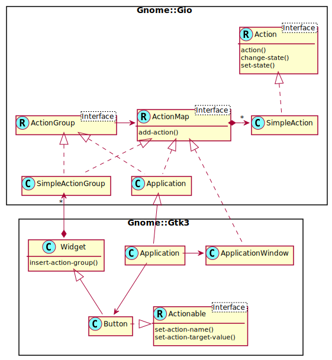

# GIO Actions

See also for some text on this subject here [HowDoI GAction](https://wiki.gnome.org/HowDoI/GAction). Also [Inkshape](https://wiki.inkscape.org/wiki/index.php/GtkAction_migration) has a migration doc with some explanation about the different techniques of signals versus GAction way of working.

## Intro

The purpose of this document is to get an overview of the Action module interactions. Action modules make use of a Variant object to be able to sent all sorts of data to a signal handler. A Variant object can hold simple types to complex types such as arrays, tuples, hashes, etc.

A signal is sent after a call to `.activate()` or `.change-state()`. The activation takes also place, at a button click on e.g. RadioButton or a menu entry click, in short, all widgets inheriting the Actionable interface.

# GIO Actions Model

## UML diagram

In the diagram below, the Button class inherit indirectly from Widget and Application has a Button somewhere as a child object on its UI. The UML diagram is like shown below. It's a one to one mapping from the C-libraries setup.

## User Programming Steps

There are some steps involved to make use of Actions.

* Create a SimpleAction object with or without a state.
* Register a signal handler for an `activate` signal.
* Add the SimpleAction to the ActionMap in a Application or ApplicationWindow.
* Add an Actionable widget such as a Button to the GUI.
* Set the action name of this widget to `app.something` or `win.something` depending if an Application or ApplicationWindow is used to store the SimpleAction.

## Advantages

* Used with **Gnome::Gio::Menu**. This might not be very interesting to Raku because of the menu widgets provided in GTK. However, Gtk version 4 does not have any support for menu items because they did depend on **Gnome::Gio::Menu** and therefore not really necessary.

* Used with **Gnome::Gtk3::Actionable** widgets. There are menu and button widgets using this interface.
* They can be remotely activated from a remote **Gnome::Gio::Application** instance. This works only for application actions, those with a 'app.' prefix. A **Gnome::Gio::SimpleAction** is stored in an Application.
* Can be listed as "additional application actions" in desktop files. This also works only for application actions.
* Can be remotely activated from other D-Bus callers.
* Can be used with **Gnome::Gio::Notification** notifications but works only for application actions.

Other remarks from the Inkscape migration web page;
* Less code to write: we only need one signal handler for the "activate" signal for a particular action; not multiple handlers for each GUI event. So, no need to register a handler on a button, menu entry, d-bus or whatever, if they need to do the same action.
* Easier look-up: Each action is identified by a unique text ID, and so we can access it by name.
* It is trivial to allow actions (with or without arguments) to be called from the command line.
* There is a built in DBus interface.

Action signals can also be fired by calling `.activate()`. A value, if needed, can be set by `.set-action-target-value()` before calling. State changes can be done by calling `.change-state()` which in turn trigger a `change-state` signal. Without a handler, it always sets the new state. If there is a handler, the handler is called with the new state and the handler must set it explicitly using a call to `.set-state()` and return a success code.
As I understand it, `action` signals can come from other sources then your current running program (it might come from a second instance of the same program) and also from a call to `.action()`. `change-state` signals, however, always are initiated by a call from `.change-state()`.

### Raku model

Seeing the advantages, most importantly the triggers caused by outside processes such as DBus and multiple started applications, it is necessary to implement the modules involved. However, there might be a possible way to minimize the use of Variants.
