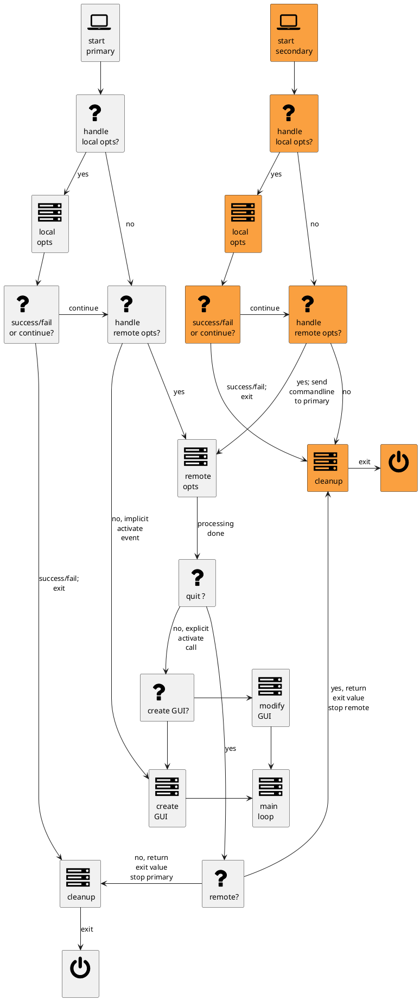

```plantuml
@startuml
'scale 0.8
!include <tupadr3/common>
!include <tupadr3/font-awesome/laptop>
!include <tupadr3/font-awesome/heart_o>
!include <tupadr3/font-awesome/coffee>
!include <tupadr3/font-awesome/server>
!include <tupadr3/font-awesome/question>
!include <tupadr3/font-awesome/power_off>

'FA_COFFEE(relax,)
FA_QUESTION(x1,"quit ?")
FA_QUESTION(x4,"remote?")
FA_QUESTION(x5,"create GUI?")
FA_QUESTION(y1,"success/fail\nor continue?") #faa040
FA_QUESTION(z1,"success/fail\nor continue?")

FA_QUESTION(pho,"handle\nlocal opts?")
FA_QUESTION(sho,"handle\nlocal opts?") #faa040
FA_QUESTION(pro,"handle\nremote opts?")
FA_QUESTION(sro,"handle\nremote opts?") #faa040

FA_POWER_OFF(es,) #faa040
FA_POWER_OFF(ep,)

FA_LAPTOP(start1,"start\nprimary")
FA_SERVER(p1,"local\nopts")
FA_SERVER(p2,"remote\nopts")
FA_SERVER(p3,"create\nGUI")
FA_SERVER(p4,"modify\nGUI")
FA_SERVER(p5,"cleanup")
FA_SERVER(p6,"main\nloop")

FA_LAPTOP(start2,"start\nsecondary") #faa040
FA_SERVER(s1,"local\nopts") #faa040
FA_SERVER(s2,"cleanup") #faa040

'relax --> start1: let's do\n something
'start1 --> p1: handle\nlocal\opts
start1 --> pho
pho --> p1: yes
pho --> pro: no
pro ---> p2: yes
pro ----> p3: no, implicit\nactivate\nevent
p1 --> z1
'z1 ---> p2: continue
z1 -> pro: continue
z1 -------> p5: success/fail;\nexit
p5 --> ep: exit

'relax --> start2
'start2 --> s1: handle\nlocal\opts
start2 --> sho
sho --> s1: yes
sho --> sro: no
sro ---> p2: yes; send\ncommandline\nto primary
sro --> s2: no
s1 --> y1
'y1 --> p2: continue;\nsend\ncommandline\nto primary
y1 -> sro: continue
y1 ---> s2: success/fail;\nexit

p2 --> x1: processing\ndone
x1 --> x5: no, explicit\nactivate\ncall
x1 -> x4: yes
s2 <-- x4: yes, return\nexit value\nstop remote
p5 <- x4: no, return\nexit value\nstop primary

x5 --> p3
p3 -> p6
x5 -> p4
p4 --> p6

s2 -> es: exit
@enduml
```
