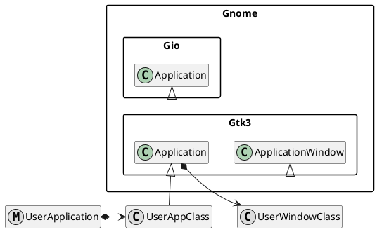

```plantuml
@startuml
skinparam packageStyle rectangle
skinparam stereotypeCBackgroundColor #80ffff
set namespaceSeparator ::
hide empty members


class UserApplication <<(M,#dddddd)>>
class UserAppClass <<(C,#dddddd)>>
class UserWindowClass <<(C,#dddddd)>>

'Connections
Gnome::Gio::Application <|-- Gnome::Gtk3::Application


Gnome::Gtk3::Application <|-- UserAppClass
Gnome::Gtk3::ApplicationWindow <|-- UserWindowClass

Gnome::Gtk3::Application *-> UserWindowClass

UserApplication *-> UserAppClass

@enduml
```
