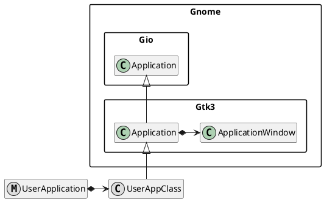

```plantuml
@startuml
skinparam packageStyle rectangle
skinparam stereotypeCBackgroundColor #80ffff
set namespaceSeparator ::
hide empty members

'Connections
Gnome::Gio::Application <|-- Gnome::Gtk3::Application

Gnome::Gtk3::Application *-> Gnome::Gtk3::ApplicationWindow

Gnome::Gtk3::Application <|-- UserAppClass

class UserAppClass <<(C,#dddddd)>>
class UserApplication <<(M,#dddddd)>>

UserApplication *-> UserAppClass

@enduml
```
