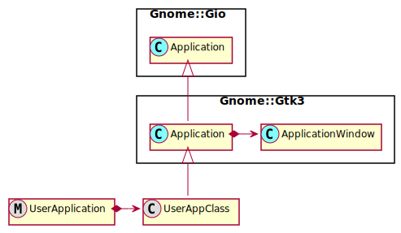
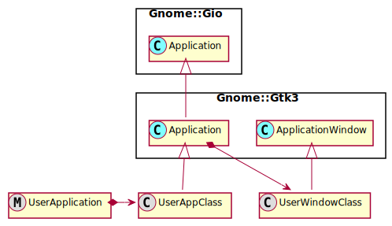
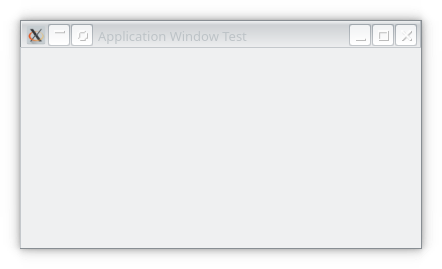
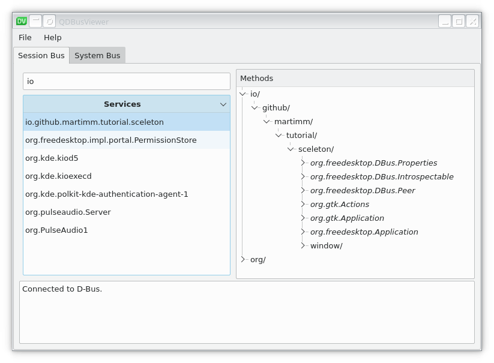

# The Application classes

## A Sceleton Application

The basic class we need is the **Gnome::Gio::Application** class. Fortunately, Gnome has made a **Gnome::Gtk3::Application** class which inherits directly from the Application defined in Gio. The second class we need is a kind of toplevel window. This class will be **Gnome::Gtk3::ApplicationWindow**. This is now the class where you build your GUI into instead of **Gnome::Gtk3::Window**.

|Basic setup of an application  |
|-------------------------------|
||


The **UserAppClass** is a class which can handle all of the generated signals produced by the several initialization stages.

We can make it a bit more flexible;


|Slightly extended version          |
|-----------------------------------|
||

Here the **UserWindowClass** is used to separate the GUI buildup from the communication between the main Application and external events.

The rest of the tutorial will follow the first diagram to keep it simple.

## Some terminology

We need some terminology now to prevent long sentences describing application runs;
* **session**. A session is in most cases a login session. The uniqueness of a running application depends on the boundaries of a session.
* **instance**. Here, we mean the running application.
* **primary**. A primary instance is a running application started first and makes the registration. This 'first' ony applies to the current session. A different user working in a different session will be able to also start a 'first' time run of the same application. It will not interfere.
* **secondary**. A secondary instance is the same application and started later while the first one still runs.
* **local**. Local data is data which is defined and set in the same instance.
* **remote**. Remote data is data which is defined and set in another instance and sent to another. This can be for example a series of arguments which are sent from a secondary to the primary for further processing.

## The UserApplication

In Raku, it is important that the main program is kept small. This is because all code, program and modules are parsed and compiled into an intermediate code which will be executed by a virtual machine. Most of the time that will be MoarVM but there is also a JVM and later possibly others. Anyways, before running, the compiled modules are saved into .precomp directories but not the program. This means that the program always get parsed and compiled before running and that is the reason to keep it small.

```
use v6;
use UserAppClass;

my UserAppClass $user-app .= new;                                     # ①
exit($user-app.run);                                                  # ②
```

① Your UserAppClass inherits from the Application class (see below), so you may decide to have some options for it in this call to `.new()` instead of having everything specified in the UserAppClass. For example you could specify the application id here as well as some initialization flags controlling the behaviour of the application.

② Then when all is ready, call `.run()` to start the application. When finished, it returns an exit code where you may finish your program with. The options and arguments to the application provided on the commandline are processed in the call to `.run()`.

Well, you can't get smaller than this …, or maybe use this one-liner; `exit(UserAppClass.new.run)`.

The rest of the code is defined in the **UserAppClass**.


## The UserAppClass

The class becomes larger than this if it has to do something useful.

```
use v6;
use Gnome::Gtk3::Application:api<1>;
use Gnome::Gtk3::ApplicationWindow:api<1>;


unit class UserAppClass is Gnome::Gtk3::Application;

constant APP-ID = 'io.github.martimm.tutorial.sceleton';          # 1
has Gnome::Gtk3::ApplicationWindow $!app-window;


submethod new ( |c ) {
  self.bless( :GtkApplication, :app-id(APP-ID), |c);              # 2
}

submethod BUILD ( ) {
  self.register-signal( self, 'app-activate', 'activate');        # 3

  my Gnome::Glib::Error $e = self.register;                       # 4
  die $e.message if $e.is-valid;
}

method app-activate ( UserAppClass :_widget($app) ) {             # 5
  with $!app-window .= new(:application(self)) {
    .set-size-request( 400, 200);
    .set-title('Application Sceleton');
    .register-signal( self, 'exit-program', 'destroy');
    .show-all;
  }

  say "\nInfo:\n  Registered: ", self.get-is-registered;
  say '  app id: ', self.get-application-id;
}

method exit-program ( ) {                                         # 6
  self.quit;
}
```

1) The application id is defined as a constant here because it will not change for the life of the application. There is a [nice document](https://developer.gnome.org/documentation/tutorials/application-id.html) about how to specify such a string. In short, it represents a "reversed DNS" style. The next list shows where it is used for (taken from that page);

  * Used by **Gnome::Gio::Application** as a method of identifying your application to the system, for ensuring that only one instance of your application is running at a given time, and as a way of passing messages to your application (such as an instruction to open a file)

  * Used by D-Bus, to name your application on the message bus. This is the primary means of communicating between applications and is visible via the `gdbus` commandline tool or the graphical D-Bus browser `qdbusviewer-qt5`. I believe that there is another type of communication on Windows or that dbus is ported to Windows. For the moment I assume Linux/Unix systems when talking about dbus.

  * Used as the name of the ".desktop file" for your application. This file is how you describe your application to the system (so that it can be displayed in and launched by gnome-shell). This also something coming from Linux/Unix systems. The _`freedesktop.org`_ has defined several protocols and specifications centered around desktops.

  * Used as a way for the system to remember state information about your applications (for example, which notifications it has requested to be shown to the user) and as a way for it to control settings about your application (for example, if its notifications have been blocked by the user)

  * Used as a way for the system to use your application to extend itself (for example, by way of search providers)

  * Used as the bundle name for application bundles
  <!--
  * Used as the base name of any GSettings schemas that your application may install. These names are visible via the gsettings commandline tool or the dconf-editor graphical editor.
  -->


2) The application id is applied to the initialization of the Applications native object.

2) To control several phases of the initialization, a few signal handlers need to be set up. We'll start with only one, `activate` which must show the default first window of the application.
3) To control several phases of the initialization, a few signal handlers need to be set up;
  * `startup`: sets up the application when it first starts. It is fired right after the call to `.register()`.
  * `activate`: shows the default first window of the application. This corresponds to the application being launched by the desktop environment.
  * `shutdown`: performs shutdown tasks after the main loop is exited.

4) Then, the application registers itself.
<!--
 This will cause the `startup` signal to fire. This is your opportunity to set things ready for further work, for example setup a database connection. This only happens in primary instances.
-->

5) When initialization is finished, the user calls `.run()` to run the application. This will cause the `activate` signal to fire.

6) After working with the app, the user may decide to press an exit button or select a quit menu entry.
<!--
 When that happens, `.quit()` warps a `shutdown` signal. Again, this will only happen on the primary instance. Useful to cleanup things like last minute database updates and cleanup or closing files.
-->

When run, it shows a very uninteresting window …



On the commandline…
```
# raku sceleton-application-v1.raku        

Info:
  Registered: True
  app id: io.github.martimm.tutorial.simple-app
```

What's more, the application recognizes a few options automatically;
```
# raku sceleton-application-v1.raku --help
Usage:
  raku [OPTION…]

Help Options:
  -h, --help                 Show help options
  --help-all                 Show all help options
  --help-gapplication        Show GApplication options
  --help-gtk                 Show GTK+ Options

Application Options:
  --display=DISPLAY          X display to use
```

Or when not recognized
```
# raku sceleton-application-v1.raku --version
Unknown option --version
```

With a dbus viewer (I like `qdbusviewer-qt5` very much), you can find your application when it runs. You will see how the application id is used on the dbus.



To prove that there is some communication being done under the hood, try to start a second one from another terminal (command shell), while the first is still running. You will see that the first one shows some more messages on the terminal screen and the second program will return quite quickly after showing some messages. A second window is opened as well. When one of the close buttons (an [X] button placed by window management), both windows will close and the firstly started program stops.

This is not a very nice behavior and we need to change that to make the application useful. Here it is meant to show that there is some communication between the instances.
A simple trick is to add a flag to the init of your application to sever any communication.
```
submethod new ( |c ) {
  self.bless(
    :GtkApplication, :app-id(APP-ID),
    :flags(G_APPLICATION_NON_UNIQUE)
    |c
  );
}
```
Now, every start is the same as if you would be using a simple **Gnome::Gtk3::Window** instead of an **Gnome::Gtk3::Application**. The application won't register on the DBus, so looking with the dbus viewer you will not find a notion of the application.

## What did we learn

Let's summarize some things we have learned.

* How to create a simple sceleton application.
* That an application id is needed when we register the application and that it is used on the dbus.
* We have seen that primary and secondary instances talk with each other. I believe that Window users have other means to communicate.
* We can modify the behavior of an application using flags at initialization time. We have seen one flag in use; `G_APPLICATION_NON_UNIQUE` can revert behavior to standalone instances.
