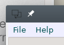

# Window Details

We will dive a little deeper with what we can do with the Gnome::Gtk3::Window. W've seen that it can hold one widget. We could do a little bit more with this window such as placement of the window on screen or replace the default icon in the decoration. Let's start!

## Changing icon in decoration

<p>

Normally the window decoration would be something like the one you see in the upper left corner of an application. This one is a default icon from the Gtk ApplicationWindow class (very dark, almost invisible).
</p>
<br/>
<p>

<br/>
We are going to replace it with this icon shown on the left using the following piece of code. The width and height is automatically scaled to its proper size. The icon can be found <a href="https://icons8.com" target="\_blank">here at icons8</a>.
</p>
<br/>
<br/>
<br/>


```raku
use Gnome::Gtk3::Window;
use Gnome::Glib::Error;                                               # 1
use Gnome::Gdk3::Pixbuf;

my Gnome::Gtk3::Window $window .= new;                                # 2
$window.set-title('Window');
my Gnome::Gdk3::Pixbuf $win-icon .= new(
  :file<icons8-invoice-100.png>
);

my Gnome::Glib::Error $e = $win-icon.last-error;                      # 3
if $e.is-valid {
  die "Error icon file: $e.message()";                                # 4
}

else {
  $window.set-icon($win-icon);                                        # 5
}
```

1) We need an Error class from Glib and a Pixbuf class from Gdk3.
2) Next, the window is created and the image loaded in a Pixbuf.
3) When there is an error, e.g. the image file isn't found, an error is set and a default broken image is loaded in the Pixbuf instead. You can check the error by calling `.last-error()`.
4) If the error is valid, an error occurred.
5) If not, the icon can be set with the following result;


## Window sizing and resizing

To set a size of the window at the start of the program one can use several methods. `$window.set-default-size()` sets an existing window to that size or larger. This 'larger' depends on what is placed in the window which need at least the sum of natural sizes of the containing widgets. The user is still able to shrink the window if the natural sizes of the widgets within permits.

There is another method to set the size. `$window.set-size-request()` which is a size method for any widget. When called on a window, it cannot be made smaller by the user.

Also a resize method is available as `$window.gtk-window-resize()` <!--[`$window.gtk_window_resize()`](../reference/Gtk3/Window.html#wow101).-->

The information about current sizes is retrieved by calling `$window.get-size()`.


## Placement of a Window or Dialog

When an application is started and its top level window mapped and realized, it can appear anywhere on the screen. You have some control over it where the window can show up. The call `$window.set-position($position)` is the way to do it. `$position` is an enummeration with the following values;
* `GTK_WIN_POS_NONE`; No influence is made on placement.
* `GTK_WIN_POS_CENTER`; Windows should be placed in the center of the screen.
* `GTK_WIN_POS_MOUSE`; Windows should be placed at the current mouse position.
* `GTK_WIN_POS_CENTER_ALWAYS`; Keep window centered as it changes size, etc.
* `GTK_WIN_POS_CENTER_ON_PARENT`; Center the window on its transient parent.

Most values are obvious and `GTK_WIN_POS_NONE` does not influence any placement so there it is up to the display manager which, on my system, searches for the most empty spot on the desktop and places it there.

You can also control the placement in depth a bit as you can obscure the several windows on your desktop with another. To prevent obscuring your window, you can call for instance `$dialog.set-keep-above(True)`.

Then if you also want to grab the focus explicitly in your application, call `$window.set-modal(True)`. Modal windows prevent interaction with other windows in the same application.

To keep modal dialogs on top of the main application windows, use `$dialog.set-transient-for($window)` to make the dialog transient for the parent. Most window managers will then disallow lowering the dialog below the parent. That saves us the call to `.set-keep-above()` explained above.

Your program may now look something like this;

```raku
use Gnome::Gtk3::Window;
use Gnome::Glib::Error;
use Gnome::Gdk3::Pixbuf;

my Gnome::Gdk3::Pixbuf $win-icon .= new(:file<icons8-invoice-100.png>);
my Gnome::Glib::Error $e = $win-icon.last-error;
die "Error icon file: $e.message()" unless $e.is-valid;

with my Gnome::Gtk3::Window $window .= new {
  .set-title('Window');
  .set-position(GTK_WIN_POS_CENTER_ON_PARENT);
  .set-size-request( 200, 300);
  .set-keep-above(True);
  .set-icon($win-icon);
}
```


### What have we learned
We have seen how we can manipulate the main window (or dialog)
* Show up on different places on your desktop
* Set a starting size
* Place the window above other windows
* Grab a focus on a window.


# References

* [Gnome::Gtk3::Window]({{ url }}/Gtk3/Window.html)
* [Gnome::Gdk3::Pixbuf]({{ url }}/Gdk3/Pixbuf.html)
* [Gnome::Glib::Error]({{ url }}/Glib/Error.html)
