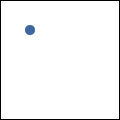
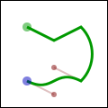

# Drawing with Cairo

In order to create an image you desire, you have to prepare the context for each of the drawing verbs. To use `stroke()` or `fill()` you first need a path. To use `show-text()` you must position your text by its insertion point. To use `mask()` you need a second source pattern or surface. And to use any of the operations, including `paint()`, you need a primary source.

## Preparing and Selecting a Source

There are three main kinds of sources in cairo: colors, gradients, and images.

### Colors
Colors are the simplest; they use a uniform hue and opacity for the entire source. You can select these without any preparation with `set-source-rgb()` and `set-source-rgba()`. Using `set-source-rgb( $r, $g, $b)` is equivalent to using `set-source-rgba( $r, $g, $b, 1)`, and it sets your source color to use full opacity.


<pre class='highlight'><code>
$surface .= new( :format(CAIRO_FORMAT_ARGB32), :120width, :120height);
with my Gnome::Cairo $context .= new(:$surface) {
  .scale( 120, 120);

  .set-source-rgb( 0, 0, 0);
  .move-to( 0, 0);
  .line-to( 1, 1);
  .move-to( 1, 0);
  .line-to( 0, 1);
  .set-line-width( 0.2);
  .stroke;

  .rectangle( 0, 0, 0.5, 0.5);
  .set-source-rgba( 1, 0, 0, 0.80);
  .fill;

  .rectangle( 0, 0.5, 0.5, 0.5);
  .set-source-rgba( 0, 1, 0, 0.60);
  .fill;

  .rectangle( 0.5, 0, 0.5, 0.5);
  .set-source-rgba( 0, 0, 1, 0.40);
  .fill;
}
</code></pre>
<p style="clear:both;"/>

### Gradients
Gradients describe a progression of colors by setting a start and stop reference location and a series of "stops" along the way. Linear gradients are built from two points which pass through parallel lines to define the start and stop locations. Radial gradients are also built from two points, but each has an associated radius of the circle on which to define the start and stop locations. Stops are added to the gradient with add-color-stop-rgb() and `add-color-stop-rgba()` which take a color like `set-source-rgb()`, as well as an offset to indicate where it lies between the reference locations. The colors between adjacent stops are averaged over space to form a smooth blend. Finally, the behavior beyond the reference locations can be controlled with `set-extend()`.


<pre class='highlight'><code>
my Gnome::Cairo::Pattern $radpat .= new(
  :radial( 0.25, 0.25, 0.1,  0.5, 0.5, 0.5)
);

with $radpat {
  .pattern-add-color-stop-rgb( 0, 1.0, 0.8, 0.8);
  .pattern-add-color-stop-rgb( 1, 0.9, 0.0, 0.0);
}

my Gnome::Cairo::Pattern $linpat .= new(
  :linear( 0.25, 0.35, 0.75, 0.65)
);

with $linpat {
  .pattern-add-color-stop-rgba( 0.00, 1, 1, 1, 0);
  .pattern-add-color-stop-rgba( 0.25, 0, 1, 0, 0.5);
  .pattern-add-color-stop-rgba( 0.50, 1, 1, 1, 0);
  .pattern-add-color-stop-rgba( 0.75, 0, 0, 1, 0.5);
  .pattern-add-color-stop-rgba( 1.00, 1, 1, 1, 0);
}

$surface .= new(
  :format(CAIRO_FORMAT_ARGB32), :120width, :120height
);

with $context .= new(:$surface) {
  .scale( 120, 120);

  loop ( my Int $i = 1; $i < 10; $i++ ) {
    loop ( my Int $j = 1; $j < 10; $j++ ) {
      .rectangle( $i/10.0 - 0.04, $j/10.0 - 0.04, 0.08, 0.08);
    }
  }

  .set-source($radpat);
  .fill;

  .rectangle( 0.0, 0.0, 1, 1);
  .set-source($linpat);
  .fill;
}
</code></pre>

<p style="clear:both;"/>


### Images

Images include both surfaces loaded from existing files with `Gnome::Cairo::ImageSurface.from-png()` and surfaces created from within cairo as an earlier destination. As of cairo 1.2, the easiest way to make and use an earlier destination as a source is with `push-group()` and either `pop-group()` or `pop-group-to-source()`. Use `pop-group-to-source()` to use it just until you select a new source, and `pop-group()` when you want to save it so you can select it over and over again with `set-source()`.


## Creating a Path

Cairo always has an active path. If you call `stroke()` it will draw the path with your line settings. If you call `fill()` it will fill the inside of the path. But as often as not, the path is empty, and both calls will result in no change to your destination. Why is it empty so often? For one, it starts that way; but more importantly after each `stroke()` or `fill()` it is emptied again to let you start building your next path.

What if you want to do multiple things with the same path? For instance to draw a red rectangle with a black border, you would want to fill the rectangle path with a red source, then stroke the same path with a black source. A rectangle path is easy to create multiple times, but a lot of paths are more complex.

Cairo supports easily reusing paths by having alternate versions of its operations. Both draw the same thing, but the alternate doesn't reset the path. For stroking, alongside `stroke()` there is `stroke-preserve()`; for filling, `fill-preserve()` joins `fill()`. Even setting the clip has a preserve variant. Apart from choosing when to preserve your path, there are only a couple of common operations.

## Moving


Cairo uses a connect-the-dots style system when creating paths. Start at 1, draw a line to 2, then 3, and so forth. When you start a path, or when you need to start a new sub-path, you want it to be like point 1: it has nothing connecting to it. For this, use `move-to()`. This sets the current reference point without making the path connect the previous point to it. There is also a relative coordinate variant, `rel-move-to()`, which sets the new reference a specified distance away from the current reference instead. After setting your first reference point, use the other path operations which both update the reference point and connect to it in some way.

```
$cairo.move-to( 0.25, 0.25);
```
<p style="clear:both;"/>

## Straight Lines


Whether with absolute coordinates `line-to()` (extend the path from the reference to this point), or relative coordinates `rel-line-to()` (extend the path from the reference this far in this direction), the path connection will be a straight line. The new reference point will be at the other end of the line.

```
$cairo.line-to( 0.5, 0.375);
$cairo.rel-line-to( 0.25, -0.125);
```
<p style="clear:both;"/>

## Arcs


Arcs are parts of the outside of a circle. Unlike straight lines, the point you directly specify is not on the path. Instead it is the center of the circle that makes up the addition to the path. Both a starting and ending point on the circle must be specified, and these points are connected either clockwise by `arc()` or counter-clockwise by `arc_negative()`. If the previous reference point is not on this new curve, a straight line is added from it to where the arc begins. The reference point is then updated to where the arc ends. There are only absolute versions.

```
$cairo.arc( 0.5, 0.5, 0.25 * sqrt(2), -0.25 * π, 0.25 * π);
```
<p style="clear:both;"/>

## Curves


Curves in cairo are cubic Bézier splines. They start at the current reference point and smoothly follow the direction of two other points (without going through them) to get to a third specified point. Like lines, there are both absolute (`curve-to()`) and relative (`rel-curve-to()`) versions. Note that the relative variant specifies all points relative to the previous reference point, rather than each relative to the preceding control point of the curve.

```
$cairo.rel-curve-to( -0.25, -0.125, -0.25, 0.125, -0.5, 0);
```
<p style="clear:both;"/>

## Close the path


Cairo can also close the path by drawing a straight line to the beginning of the current sub-path. This straight line can be useful for the last edge of a polygon, but is not directly useful for curve-based shapes. A closed path is fundamentally different from an open path: it's one continuous path and has no start or end. A closed path has no line caps for there is no place to put them.
```
$cairo.close_path;
```
<p style="clear:both;"/>

## Text

Finally text can be turned into a path with `text-path()`. Paths created from text are like any other path, supporting stroke or fill operations. This path is placed anchored to the current reference point, so `move-to()` your desired location before turning text into a path. However there are performance concerns to doing this if you are working with a lot of text; when possible you should prefer using the verb `show-text()` over `text-path()` and `fill()`.
