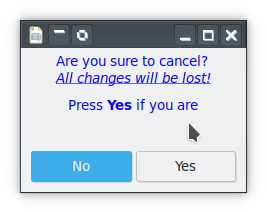

# Message Dialog

This widget is used to show messages of some sort. It is possible to add buttons to this dialog depending on what the message is. For example only an `Ok` button can be used, just to confirm you read the message.

## Example

An example below shows a message dialog displaying a message and two buttons 'Yes' and 'No'. The class inherits from the MessageDialog to change little things such as adding a second message.
```
use Gnome::Gtk3::Enums:api<1>;
use Gnome::Gtk3::Dialog:api<1>;
use Gnome::Gtk3::MessageDialog:api<1>;
use Gnome::Gtk3::Window:api<1>;

unit class YNMsgDialog is Gnome::Gtk3::MessageDialog;            # ①

submethod new ( Str :$message, |c ) {                            # ②
  self.bless(
    :GtkMessageDialog, |c, :type(GTK_MESSAGE_WARNING),           # ③
    :buttons(GTK_BUTTONS_YES_NO), :markup-message($message)
  );
}

submethod BUILD ( *%options ) {
  self.secondary-markup('Press <b>Yes</b> if you are');
  self.set-position(GTK_WIN_POS_MOUSE);
  self.set-keep-above(True);
  self.set-default-response(GTK_RESPONSE_NO);
}
```

Display of the dialog and getting the response will be explained below.


① Made a convenient class inheriting from the message dialog class. For some more explanation about inheriting, see [this page]({{ url }}).

② A sneeky pinch of the `:message` argument. This argument can be given to the message dialog instantiation but here it is intercepted before `c` so the capture `c` will not have this argument.

③ The pinched message is handed over to `bless()` as a `:markup-message`. Furthermore `:GtkMessageDialog` is provided to signal the message dialog module to process the arguments. Any of the `:type`, `:buttons` or `:markup-message` arguments in `c` are ignored because of the location of `|c` in the argument list.

Next picture shows what this will look like using the next declaration
```
my YNMsgDialog $yn .= new(
  :message(
    "Are you sure to cancel?\n<i><u>All changes will be lost!</u></i>"
  )
);
```


