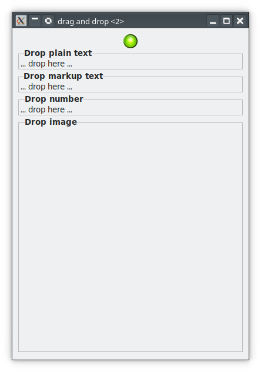
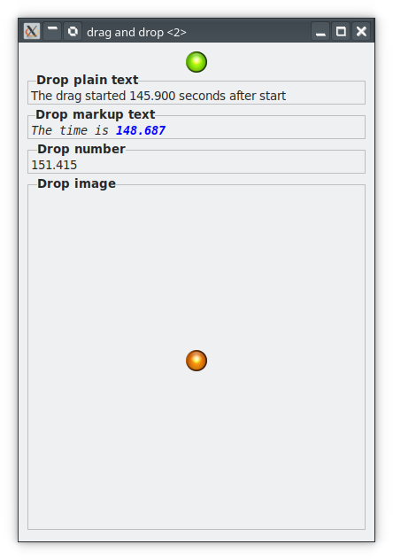

# An Example DND Application

To show how the signal handlers are set up for the source and destination widgets, we make a complete example. The application will have a single source widget: an image in an event box that can offer four types of target data: plain text, marked-up text, numbers, and an image. There will be four destination widgets: three labels, one accepting numbers, one accepting plain text, and one accepting marked-up text, and an image that can accept image data and text/uri-lists.

The widgets are all pimped up using a frame and then placed in a grid. The grid is placed in a top-level window. The user can drag from the source onto any of the other widgets. The destination labels will reflect their receipt of data by changing the text to show the new data. The image will display the images that it receives.

The program will look like the image below when it is just started. The green led image at the top is the drag source and the destination widgets are labels tucked in a frame.



<!--

-->

This [little movie](images/dnd-steps.mkv) shows what happens when the green led at the top is dragged to all possible fields.


## The Source Widget

The application's drag source handling is done by a class named **DragSourceWidget**. A widget given to this class will become the drag source widget. A few attributes are defined here: `$!start-time` is set when the class is instantiated and `$!drag-time` is set in the `drag-begin` handler.

```
unit class ExDND::DragSourceWidget;

has Instant $!start-time;
has $!drag-time;
has Gnome::Gtk3::DragSource $!source;
```

### submethod BUILD
The `BUILD()` submethod is shown in the next listing.
```
submethod BUILD ( :$source-widget ) {

  $!start-time = now;                                                   # ①

  my Array $target-entries = [                                          # ②
    N-GtkTargetEntry.new( :target<text/html>, :flags(0), :info(TEXT_HTML)),
    N-GtkTargetEntry.new( :target<STRING>, :flags(0), :info(STRING)),
    N-GtkTargetEntry.new( :target<number>, :flags(0), :info(NUMBER)),
    N-GtkTargetEntry.new( :target<image/png>, :flags(0), :info(IMAGE))
  ];

  $!source .= new;
  $!source.set(
    $source-widget,                                                     # ③
    GDK_BUTTON1_MASK,                                                   # ④
    $target-entries,                                                    # ⑤
    GDK_ACTION_MOVE +| GDK_ACTION_COPY                                  # ⑥
  );

  $source-widget.register-signal( self, 'on-drag-begin', 'drag-begin'); # ⑦
  $source-widget.register-signal( self, 'on-drag-data-get', 'drag-data-get');
}
```

① Get the current time and saves it in an attribute to be used in the `drag-begin` handler.

② Specify an array of targets that this source widget will handle. You see that the target names are free to specify but many applications will use registered mimetypes such as _text/plain_, _image/jpeg_, etc. The `:flags` are `0` to say that we may drag the led image to any widget or application elsewhere besides this one. You can test that for yourself by starting two instances of this program and drag the green led to the other instance destination widgets. the values `TEXT_HTML`, `STRING`, etc. are defined in an enumeration.

③ Set the `$source-widget` as the drag source.

④ Dragging is started by click and hold then drag using the first mouse button.

⑤ The drag source gets the target array so it knows what to support.

⑥ The actions supported by the source widget is copy and move. That said, there is no handler defined to cleanup after ourselfes when the destination target request for cleanup after it assumes to have moved the item.

⑦ Register two event handlers for the signals `drag-begin` and `drag-data-get`.


### method on-drag-begin

The `drag-begin` handler is called as soon as the drag is started on this widget.

```
method on-drag-begin (
  N-GObject $context-no,                                                # ①
  :_widget($source-widget)
) {
  $!source.set-icon-name( $source-widget, 'text-x-generic');            # ②
  $!drag-time = now - $!start-time;                                     # ③
}
```

① The `drag-begin` handler gets one positional argument, the context of the drag. It is not needed here but it is necessary to specify it with its type. The named arguments are optional but we need the the source widget.

② Set an icon which shows when the drag is started.

③ Calculate the time in seconds after the start of the application.


### method on-drag-data-get

The next `drag-data-get` handler is called when a drop is done on the destination widget and the handler for that event requests for the data. When the `drag-data-get` handler returns, the event `drag-data-received` will be triggered on the drag destination widget.

```
method on-drag-data-get (
  N-GObject $context-no, N-GObject $selection-data-no,                  # ①
  UInt $info, UInt $time,
  :_widget($source-widget)
) {

  my Gnome::Gtk3::SelectionData $selection-data .= new(
    :native-object($selection-data-no)
  );

  given $info {                                                         # ②
    when TEXT_HTML {
      my Str $html-data = [~]
        '<span font_family="monospace" style="italic">The time is ',
          '<span weight="bold" foreground="blue">',
          $!drag-time.fmt('%.3f'),
          '</span></span>';

      $selection-data.set(
        Gnome::Gdk3::Atom.new(:intern<text/html>), $html-data
      );
    }

    # number to send is elapsed time. 16 bit gives about 18 hours to run
    # without problems.
    when NUMBER {
      $selection-data.set(
        Gnome::Gdk3::Atom.new(:intern<number>), $!drag-time.Num
      );
    }

    when STRING {
      $selection-data.set(
        Gnome::Gdk3::Atom.new(:intern<STRING>),
        "The drag started $!drag-time.fmt('%.3f') seconds after start"
      );
    }

    when IMAGE {
      $selection-data.set-pixbuf(
        Gnome::Gdk3::Pixbuf.new(:file(%leds{<amber red green>.roll}))
      );
    }
  }
}
```

① The handler for the `drag-data-get` handler receives four positional arguments: the drag context, the selection data, target info and a time stamp.

② We must handle each of the set of supported targets defined when instantiating the class. The check is done using `$info` which was provided to the target array. The data for each of the targets are given to the method `$selection-data.set()` to be transported to the destination. The image is sent as a pixbuf which has its own call `$selection-data.set-pixbuf()`.

* **TEXT_HTML**: A fancy text is created showing the `$!drag-time` value. It is sent together with proper tag value of `text/html`.

* **NUMBER**: The time in `$!drag-time` will be send as a 32 bit floating point number with the target name 'number'.

* **STRING**: A string with the `$!drag-time` in it is send with a target name `STRING`.

* **IMAGE**: Here we are selecting one out of three led colors. The `.set-pixbuf()` adds the proper target value depending on the type of image. The images are all png files so the target will become `image/png`.


## The Destination Widgets

The application's drag destination handling is done by a class named **DragDestinationWidget**. A widget given to this class will become the drag destination widget. There are more than one widgets used as a destination so we need some way to diffentiate between them. Another enumeration is created for that with values; `NUMBER_DROP`, `MARKUP_DROP`, `TEXT_PLAIN_DROP` and  `IMAGE_DROP` and we set the attribute  `$!destination-type` with that value.

```
unit class ExDND::DragDestinationWidget;

has Gnome::Gtk3::DragDest $!destination;
has DestinationType $!destination-type;
```

### submethod BUILD

The initialization is more cumbersome but is not that bad. The `BUILD()` submethod is shown in the next listing.

```
submethod BUILD ( :$destination-widget, DestinationType :$!destination-type ) {

  $!destination .= new;
  $!destination.set( $destination-widget, 0, GDK_ACTION_COPY);            # ①

  my Gnome::Gtk3::TargetList $target-list;
  given $!destination-type {                                              # ②
    when NUMBER_DROP {
      $target-list .= new(:targets( [
            N-GtkTargetEntry.new(
              :target<number>, :flags(GTK_TARGET_SAME_APP), :info(NUMBER)
            ),
          ]
        )
      );
    }

    when MARKUP_DROP {
      $target-list .= new(:targets( [
            N-GtkTargetEntry.new(
              :target<text/html>, :flags(0), :info(TEXT_HTML)
            ),
          ]
        )
      );
    }

    when TEXT_PLAIN_DROP {
      $target-list .= new(:targets( [
            N-GtkTargetEntry.new( :target<STRING>, :flags(0), :info(STRING)),
          ]
        )
      );
    }

    when IMAGE_DROP {
      $target-list .= new;
      $target-list.add-image-targets( IMAGE, True);
      $target-list.add-uri-targets(TEXT_URI);
    }
  }

  $!destination.set-target-list( $destination-widget, $target-list);      # ③

                                                                          # ④
  $destination-widget.register-signal( self, 'on-drag-motion', 'drag-motion');
  $destination-widget.register-signal( self, 'on-drag-leave', 'drag-leave');
  $destination-widget.register-signal( self, 'on-drag-drop', 'drag-drop');
  $destination-widget.register-signal(
    self, 'on-drag-data-received', 'drag-data-received'
  );
}
```

① Each of the destinations will only support the copy action. This means that the source, which set the copy and move actions, will never get the signal to cleanup.

② Each of the destinations will support a different target with different possibilities.

* **NUMBER_DROP**: This will accept drops having a target name `number`. Also, this destination will only accept a drop origination from the same application. Above I've suggested to run two instances of the same application. You can then exactly see what is happening whe you try to drag from the one instance to the other.

* **MARKUP_DROP**: Accept drops having target name `text/html` and accepts drop from anywhere.

* **TEXT_PLAIN_DROP**: Accept drops having target name `STRING` and also  accepts drop from anywhere.

* **IMAGE_DROP**: This destination will accept many types of images and lists of urls. Later, we will see that only a small set of image types are processed.

③ Here we set the widget and the needed targets as the drag destination.

④ Register the event handlers for the signals we need to handle.


### method on-drag-motion

This handler is called when te drag is started and the mouse moves over the destination widget. It receives the context, coordinates into the widget and a time stamp. Besides checking its target, you could also add a check of an area of the widget using the coordinates. This is also possible in the `drag-drop` handler later on.

```
method on-drag-motion (
  N-GObject $context-no, Int $x, Int $y, UInt $time,
  :_widget($destination-widget)
  --> Bool
) {
  my Bool $status = False;                                                # ①

  my Gnome::Gdk3::DragContext $context .= new(:native-object($context-no));
  my Gnome::Gdk3::Atom $target-atom = $!destination.find-target(          # ②
    $destination-widget, $context,
    $!destination.get-target-list($destination-widget)
  );

  if $target-atom.name ~~ 'NONE' {                                        # ③
    $context.status( GDK_ACTION_NONE, $time);
  }

  else {
    $!destination.highlight($destination-widget);                         # ④
    $context.status( GDK_ACTION_COPY, $time);
    $status = True;
  }

  $status
}
```

① Let's assume everything goes wrong and with this we do not accept the drop when returning `False`.

② This call to `.find-target()` returns an `Atom`.

③ The atom name is `NONE` if the requested targets do not match with the set this widget supports. In this case we do nothing which we must notify using the call to `.status()`.

④ If `.find-target()` found some target the widget supports, we just return the COPY action in the status call and return `True`. Also we can turn on some highlighting on the widget. (NOTE: In my tests I've not seen any highlighting which might depend on the choosen theme)


### method on-drag-leave

A simple method to do small preparations like unhighlighting. The method is called when the drag moves out of the destination widget again or when a drop is done on the widget.

```
method on-drag-leave (
  N-GObject $context-no, UInt $time, :_widget($destination-widget)
) {
  $!destination.unhighlight($destination-widget);
}
```


### method on-drag-drop

After `drag-leave`, `drag-drop` is fired. The handler is called with the same arguments as for the `drag-motion` handler. As methioned there, we could now also check for its coordinates if you would like to have a special action on some section of the widget.

```
method on-drag-drop (
  N-GObject $context-no, Int $x, Int $y, UInt $time,
  :_widget($destination-widget)
  --> Bool
) {
  my Gnome::Gdk3::DragContext $context .= new(:native-object($context-no));
  my Gnome::Gdk3::Atom $target-atom = $!destination.find-target(          # ①
    $destination-widget, $context,
    $!destination.get-target-list($destination-widget)
  );

  $!destination.get-data(                                                 # ②
    $destination-widget, $context-no, $target-atom, $time
  ) if ?$target-atom;

  True
}
```
① Get the atom target using the `.find-target()` call again.

② And ask for data using this atom. This triggers a `drag-data-get` on the source widget. When data is received or when an error occurs, the `drag-data-received` signal on destination is triggered.


### method on-drag-data-received

This handler is called when the `drag-data-get` handler is finished preparing the data. Now we can get the data out and change the destination widgets with that data.

```
method on-drag-data-received (
  N-GObject $context-no, Int $x, Int $y,
  N-GObject $selection-data-no, UInt $info, UInt $time,
  :_widget($destination-widget)
) {
  my Gnome::Gtk3::SelectionData $selection-data .= new(
    :native-object($selection-data-no)
  );

  my $source-data;
  given $!destination-type {                                              # ①
    when MARKUP_DROP {
      $source-data = $selection-data.get(:data-type(Str));
      $destination-widget.set-markup($source-data);
    }

    when TEXT_PLAIN_DROP {
      $source-data = $selection-data.get-text;
      $destination-widget.set-text($source-data);
    }

    when NUMBER_DROP {
      $source-data = $selection-data.get(:data-type(Num));
      $destination-widget.set-text($source-data.fmt('%.3f'));
    }

    when IMAGE_DROP {
      my Gnome::Gdk3::Atom $target-atom = $!destination.find-target(      # ②
        $destination-widget, $context-no,
        $!destination.get-target-list($destination-widget)
      );

      given $target-atom.name {
        when 'image/png' {                                                # ③
          $source-data = $selection-data.get-pixbuf;
          $destination-widget.set-from-pixbuf($source-data);
        }

        when 'text/uri-list' {                                            # ④
          $source-data = $selection-data.get-uris;

          for @$source-data -> $uri is copy {
            if $uri.IO.extension ~~ any(<jpg png jpeg svg>) {
              $uri ~~ s/^ 'file://' //;                                   # ⑤
              $uri ~~ s:g/'%20'/ /;

              $destination-widget.set-from-pixbuf(                        # ⑥
                Gnome::Gdk3::Pixbuf.new(
                  :file($uri), :380width, :380height, :preserve_aspect_ratio
                )
              );
              last;
            }
          }
        }

        default {
          note "Application can not handle target type '$_'";
        }
      }
    }
  }
}
```

① We use the `$!destination-type` again to know what data to get for this widget.

* **MARKUP_DROP**: We get the data by a call to `.get()` on the selection data. A data type is needed to have the method return the proper value.

* **TEXT_PLAIN_DROP**: For text, we can also call `.get-text()` which is easier.

* **NUMBER_DROP**: For the number we must call `.get()` with the `.Num` type.

* **IMAGE_DROP**: Image are handled differently, see below

② We have to find the proper target atom to know what to do. We keep it simple, target `image/png` comes from the applications source widget and `text/uri-list` happens when we drag from a file explorer of some sort.

③ When we get a png image from our source widget, it is stored as a pixbuf and to retrieve it we must call `.get-pixbuf()`.

④ The list is a list of uri's from e.g. an explorer and thus can have all sorts of file types so we must check for its extension. We will accept `jpg`, `png` and `svg` types only.

⑤ We drop the `file://` protocol part and also replace the `%20` url encoding for a space. There are proper modules to do that but this suffices here.

⑥ We could have used `$destination-widget.set-from-file($uri)` here but we want to have a maximum width of 380 pixels to prevent expanding into huge displays, so we need to get a bit more elaborate.
