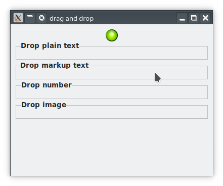

# Signal Handlers in Depth

We will now show how to set up signal handlers for the source and destination widgets. To make things concrete, we will demonstrate this with a specific, but contrived example. We will create a single source widget: an image in an event box that can offer four types of target data: plain text, marked-up text, numbers, and an image. There will be four destination widgets: three labels, one accepting numbers, one accepting plain text, and one accepting marked-up text, and an image that can accept image data and text/uri-lists.

The widgets will all placed in a grid and the grid in a top-level window so that the user can drag from the source onto any of the other widgets. <!--Because the only data that a button has is its label, we will attach different types of data to the button as a GObject, so that it can supply data to destination widgets when they request it.--> The destination buttons will reflect their receipt of data by changing the label text to show the new data. The image will display the images that it receives.

The program will look like below when it is just started. The green led image at the top is the drag source and the destination widgets are (empty) labels tucked in a frame.



## The Source Widget

The application's drag source is set up with a call to `setup-source-button()`, shown in the next listing. This gets the current time and save it in a local variable. It passes its value to the drag-begin handler. Most of the work is in the function `make-drag-source()`, shown in the second listing.

```
mthod setup-source-button ( Gnome::Gtk3::Button $source-button ) {
time_t
 start_time ;
start_time
 =
 t i m e (NULL ) ;
/
∗
 Convert
 the
 button
 into
 a
 drag
make_drag_source ( s o u r c e _ b u t t o n ) ;
source
 ∗ /
g _ s i g n a l _ c o n n e c t (G_OBJECT( s o u r c e _ b u t t o n ) ,
" drag_begin " ,
G_CALLBACK
 ( on_begin_drag ) ,
GUINT_TO_POINTER( s t a r t _ t i m e ) ) ;
g _ s i g n a l _ c o n n e c t (G_OBJECT( s o u r c e _ b u t t o n ) ,
" drag_data_get " ,
G_CALLBACK
 ( on_drag_data_get ) ,
NULL ) ;
}
g _ s i g n a l _ c o n n e c t (G_OBJECT( s o u r c e _ b u t t o n ) ,
" drag_end " ,
G_CALLBACK
 ( on_end_drag ) ,
NULL ) ;
The function
 make_drag_source() begins by defining the targets it will offer.
 The number target is limited
to those widgets in the same application just to demonstrate what happens when it is dragged to another
application when this flag is set. The function loads two pixbufs from hard-coded filenames and sets pointer
to them as data in the button, so that it can deliver images when requested. The lines
g_object_set_data(G_OBJECT(source_button), "targetlist",
(gpointer) target_entries);
g_object_set_data(G_OBJECT(source_button), "ntargets",
GUINT_TO_POINTER(G_N_ELEMENTS(target_entries)));
set the target table and its length as data in the button object so that these will be available to other callback
functions that need access to the offered targets (the drag-begin handler).
Listing 3: make_drag_source()
void
 make_drag_source
 ( GtkWidget
 ∗ source_button )
{
GError
 ∗ e r r o r = NULL ;
GdkPixbuf
 ∗ p i x b u f = NULL ;
GdkPixbuf
 ∗ p i x b u f 2 = NULL ;
/
∗
 Define
 the
 target
 data
 types
 that
 this
 widget
 can
 deliver
 ∗ /
/
∗
 Even
 though
 this
 is
 declared
 on
 the
 stack ,
 when
 the
 pointer
 is
set
 on
 the
 object ,
 it
 is
 reference
 counted
 and
 does
 not
 get
 deleted .
I
 was
 surprised
 by
 this .
 ∗ /
GtkTargetEntry
 target_entries [ ]
 =
 {
{" t e x t / html " ,
 0,
 TEXT_HTML
 },
{ "STRING " ,
 0,
 STRING } ,
{ " number " ,
 GTK_TARGET_SAME_APP,
 NUMBER} ,
{" image / j p e g " ,
 0,
 IMAGE_JPEG} ,
{" t e x t / u r i
 − l i s t
 ",
 0,
 TEXT_URI}
};
13
CSci493.73 Graphical User Interface Programming
The GTK+ Drag-and-Drop Mechanism
Prof. Stewart Weiss
gtk_drag_source_set ( source_button ,
GDK_BUTTON1_MASK,
target_entries ,
G_N_ELEMENTS
 ( target_entries ) ,
GDK_ACTION_COPY|GDK_ACTION_MOVE) ;
/
∗
 Create
 a
 pixbuf
 from
 file
 data
 and
 error
 −c h e c k ∗ /
pixbuf
 =
 gdk_pixbuf_new_from_file
 (
 BUTTON_IMAGE_PATH,
 &e r r o r
 );
if
 (
 error
 !=
 NULL)
{
g_print (" F a i l e d
 to
 load
 image
 file :
 %s \ n " ,
 error
 − >m e s s a g e ) ;
g_error_free ( e r r o r ) ;
error
 = NULL ;
}
/
∗
 Create
 a
 second
 pixbuf
 from
 file
 data
 and
 error
 −c h e c k ∗ /
pixbuf2
 =
 gdk_pixbuf_new_from_file
 (
 BUTTON_IMAGE2_PATH,
 &e r r o r
if
 (
 error
 !=
 NULL)
{
g_print (" F a i l e d
 to
 load
 image
 file :
 %s \ n " ,
 error
 − >m e s s a g e ) ;
g_error_free ( e r r o r ) ;
error
 = NULL ;
}
);
}
/
∗
 Attach
 the
 images
 to
 the
 widget
 so
 that
 it
 them
g _ o b j e c t _ s e t _ d a t a (G_OBJECT( s o u r c e _ b u t t o n ) ,
" image " ,
 ( gpointer )
 pixbuf ) ;
g _ o b j e c t _ s e t _ d a t a (G_OBJECT( s o u r c e _ b u t t o n ) ,
" image2 " ,
 ( gpointer )
 pixbuf2 ) ;
to
deliver
 ∗ /
/
∗
 Attach
 the
 targetlist
 pointer
 and
 the
 length
 of
 the
 array
 to
 the
so
 that
 the
 callbacks
 can
 reconstruct
 the
 array .
 ∗ /
g _ o b j e c t _ s e t _ d a t a (G_OBJECT( s o u r c e _ b u t t o n ) ,
 " targetlist ",
( gpointer )
 target_entries );
g _ o b j e c t _ s e t _ d a t a (G_OBJECT( s o u r c e _ b u t t o n ) ,
 " ntargets " ,
GUINT_TO_POINTER(G_N_ELEMENTS( t a r g e t _ e n t r i e s ) ) ) ;
object
The drag-begin signal handler must have the following prototype:
void
 user_function
( GtkWidget
 *widget,
GdkDragContext *drag_context,
gpointer
 user_data);
The
 drag_context
 is a pointer to a
 GdkDragContext
 structure.
 This structure will be passed to various
callback functions during the drag operation.
 Both the source and the destination have a drag context
structure. It contains
struct GdkDragContext {
GObject parent_instance;
GdkDragProtocol GSEAL (protocol);
gboolean GSEAL (is_source);
GdkWindow *GSEAL (source_window);
GdkWindow *GSEAL (dest_window);
GList *GSEAL (targets);
GdkDragAction GSEAL (actions);
14
CSci493.73 Graphical User Interface Programming
The GTK+ Drag-and-Drop Mechanism
GdkDragAction GSEAL (suggested_action);
GdkDragAction GSEAL (action);
guint32 GSEAL (start_time);
};
Prof. Stewart Weiss
Notice that it contains references to the source and destination windows, actions and suggested actions, a
list of targets, the start time, and the protocol and parent. The details are not so important now. What
matters is that you see that this
 drag_context
 is keeping track of the drag, and will be needed when it
comes time to get targets and to determine actions.
The primary reason to have a handler for the drag-begin signal is to set up a custom drag icon.
 Our
drag-begin handler will do a bit more than this. It will get the current time and compute the time elapsed
between when the application started up and the current time. It will save this as the number to be offered
to any widget asking for number data.
It will also construct more data based on the current time.
 It will create a plain text string stating the
current time, e.g.:
It is now Sun Dec 11 20:57:46 2011
and it will create a Pango marked up string saying the same thing, but with formatting applied.
 It will
create an array of four gpointers that will point to each of the four different data chunks that it can offer,
indexed by the
 info
 members of the target array. In other words, the array is
target_data[TEXT_HTML]
 contains a pointer to the marked up text
target_data[STRING]
 contains a pointer to the plain text
target_data[NUMBER]
 contains the number, cast to a gpointer
target_data[IMAGE_JPEG]
 contains a pointer to the pixbuf
The handler also creates the drag icon. When the user starts the drag, an image of the plain text string
stating what time it is will be the icon. Because the code to create the icon is detailed and distracting, it is
listed in the Appendix rather than here. The drag-begin handler is in Listing 4.
Listing 4: drag-begin handler
void
 on_drag_begin
 (
 GtkWidget
 ∗ source_button
 ,
GdkDragContext
 ∗ dc ,
gpointer
 user_data
 )
{
GtkTargetEntry
 ∗ target_entries
 ;
gpointer
 ∗ t a r g e t _ d a t a = NULL ;
guint
 start_time
 = GPOINTER_TO_UINT( u s e r _ d a t a ) ;
GdkPixbuf
 ∗ pixbuf
 = NULL ;
gchar
 ∗ html
 = NULL ;
gchar
 ∗ string
 = NULL ;
guint
 elapsed_time ;
guint
 which ;
size_t
 length ;
time_t
 now
 =
 t i m e (NULL ) ;
 /
 ∗
 Get
 the
 current
 time
 ∗ /
gchar
 ∗ now_string
 =
 c t i m e (&now ) ;
 /
 ∗
 Convert
 it
 to
 a
 string
 ∗ /
length
 =
 s t r l e n ( now_string ) ;
now_string [ length
 − 1]
 =
 '\0 ';
 /
 ∗
 remove
 ending
 newline
 ∗ /
/
∗
 get
 target
 entry
 data
 ∗ /
15
CSci493.73 Graphical User Interface Programming
The GTK+ Drag-and-Drop Mechanism
Prof. Stewart Weiss
target_entries
guint
 ntargets
=
=( GtkTargetEntry
 ∗ )
 g_object_get_data (
G_OBJECT( s o u r c e _ b u t t o n ) , " t a r g e t l i s t " ) ;
GPOINTER_TO_UINT
 ( g_object_get_data (
G_OBJECT( s o u r c e _ b u t t o n ) , " n t a r g e t s " ) ) ;
/
∗
 pick
 a
 random
 number
 using
 current
 time
 as
 seed
 ∗ /
s r a n d ( now ) ;
which
 =
 rand ( )
 ;
/
∗
 Get
 the
 pixbuf
 image
 data
 pointer
 ∗ /
if
 (
 which
 % 2 == 0
 )
pixbuf
 =
 g _ o b j e c t _ g e t _ d a t a (G_OBJECT( s o u r c e _ b u t t o n ) ,
else
pixbuf
 =
 g _ o b j e c t _ g e t _ d a t a (G_OBJECT( s o u r c e _ b u t t o n ) ,
" image " ) ;
" image2 " ) ;
//
 Compute
 the
 time
 since
 the
 application
 started
elapsed_time
 = now
 −
 start_time ;
//
 Create
 and
 draw
 the
 drag
 icon
draw_drag_icon ( s o u r c e _ b u t t o n ,
 dc ,
now_string ) ;
//
 Allocate
 the
 array
 of
 pointers
 for
 the
 target
 data ,
 which
//
 on
 the
 source
 button ' s
 object
 properties
 table
target_data
 = g_new ( g p o i n t e r ,
 ntargets );
g _ o b j e c t _ s e t _ d a t a (G_OBJECT( s o u r c e _ b u t t o n ) ,
 " target_data " ,
target_data ) ;
is
stored
//
 Define
 the
 content
 of
 the
 target
 data .
html
 =
 g_markup_printf_escaped
 (
"< s p a n
 f o n t _ f a m i l y =\" m on o s p a ce \"
 style
 =\" i t a l i c \">The
 time
"< s p a n
 w e i g h t =\" b o l d \ "
 f o r e g r o u n d =\" b l u e \ " >%s . </ s p a n >"
"</ sp a n >" ,
now_string ) ;
string
 =
 g_strconcat (" I t
 is
 now
 ",
 now_string ,
 ".\n" ,
 NULL ) ;
is
 "
}
//
 Make
 a
 copy
 of
 the
 target
 data
 and
 store
 it
 in
 the
 array
 indexed
//
 that
 we
 can
 retrieve
 it
 based
 on
 the
 TargetInfo
 enumerated
 type .
t a r g e t _ d a t a [TEXT_HTML]
 =
 g_strdup ( html ) ;
t a r g e t _ d a t a [ STRING ]
 =
 g_strdup ( s t r i n g ) ;
t a r g e t _ d a t a [NUMBER]
 = GUINT_TO_POINTER( e l a p s e d _ t i m e ) ;
if
 (
 pixbuf
 !=
 NULL
 )
 {
t a r g e t _ d a t a [ IMAGE_JPEG ]
 =
 ( gpointer ) pixbuf ;
}
so
/
∗
 We
 have
 to
 free
 the
 two
 strings ,
 since
 we
 copied
 them
 into
 the
 target
array ,
 but
 cannot
 free
 the
 pixbuf ,
 since
 we
 did
 not
 allocate
 it
 here ,
but
 just
 copied
 the
 pointer
 to
 a
 local .
 ∗ /
g _ f r e e ( html ) ;
g_free ( s t r i n g ) ;
The most important signal handler for the source is the drag-data-get handler. When the drop is made on
a destination widget, the drag-data-get signal is emitted on the source. The prototype for this handler is
void
 user_function
( GtkWidget
 *widget,
GdkDragContext *drag_context,
GtkSelectionData *data,
guint
 info,
16
CSci493.73 Graphical User Interface Programming
The GTK+ Drag-and-Drop Mechanism
Prof. Stewart Weiss
guint
 time,
gpointer
 user_data);
The data argument is a pointer to a GtkSelectionData structure that was initialized by GTK+ before
emitting the signal. This structure has a member named target which is a pointer to the target requested
by the destination. The info member is the number in the target list that corresponds to this target. The
responsibility of the handler is to determine the target type and deliver the requested data. Therefore, its first
task is to query the info member for the target data type. It can then copy data into the GtkSelectionData
structure using the function
void
 gtk_selection_data_set
( GtkSelectionData *selection_data,
GdkAtom type,
gint format,
const guchar *data,
gint length);
It needs the atom representing the target, the
 format (remember this is the number of bits in a unit of
 this
type),
 data,
 a pointer to the data to be copied, and
 length, the number of units of this target type.
The exception is that pixbuf data is delivered in a different way.
 There is a special function that copies
pixbuf data into a selection structure:
gboolean
 gtk_selection_data_set_pixbuf
 ( GtkSelectionData *selection_data,
GdkPixbuf *pixbuf);
This returns
 TRUE
 if it was successful, and
 FALSE
 if it failed.
Our handler for the source button's drag-data-get handler is in Listing 5. The drag context is not used in
this function. The important part of the code is the switch statement. It checks the type of data requested
and in each case, copies the data into the selection structure. Although we use instructions like
gdk_atom_intern(text/html, TRUE);
to get the atom for the target, it would be simpler to replace these by
selection_data->target
which is the requested atom. This code just shows another way to do the same thing.
Listing 5: drag-data-get handler for source button
void
 on_drag_data_get
 (
 GtkWidget
 ∗ source_button ,
GdkDragContext
 ∗ dc ,
GtkSelectionData ∗ selection_data
 ,
guint
 info ,
guint
 time ,
gpointer
 user_data
 )
{
guint
 number_data ;
GdkPixbuf
 ∗ p i x b u f = NULL ;
gpointer
 ∗ target_data =
g _ o b j e c t _ g e t _ d a t a (G_OBJECT( s o u r c e _ b u t t o n ) ,
 " target_data " ) ;
17
CSci493.73 Graphical User Interface Programming
The GTK+ Drag-and-Drop Mechanism
Prof. Stewart Weiss
/ ∗
 Use
 the
 info
 argument
 to
 determine
 which
 data
 the
 destination
 has
requested ,
 and
 set
 up
 the
 GtkSelectionData
 structure
 to
 be
 passed
 to
the
 destination
 through
 the
 d r a g −d a t a−r e c e i v e d
 callback .
The
 target_data
 array
 was
 filled
 in
 such
 a way
 that
 the
 info
 value
equals
 the
 array
 index ,
 so
 we
 set
 the
 data
 for
 info
 v a l u e X from
target_data [X ] .
The
 exception
 is
 the
 image
 data .
 There
 are
 separate
 functions
 for
supplying
 pixbuf ,
 uri ,
 and
 u t f − 8 d a t a .
∗ /
switch ( i n f o )
{
c a s e TEXT_HTML :
gtk_selection_data_set ( selection_data ,
/ ∗ We c o u l d
 use
s e l e c t i o n _ d a t a − >t a r g e t
instead
 of
 getting
 the
 interned
 atom
 each
 time
∗ /
gdk_atom_intern ( " t e x t / h tm l " , TRUE) , / ∗
 type
 ∗ /
8,
 / ∗
 format
 ∗ /
t a r g e t _ d a t a [TEXT_HTML] ,
 / ∗
 data
 ∗ /
s t r l e n ( t a r g e t _ d a t a [TEXT_HTML ] ) ) ;
 / ∗
 length
 ∗ /
break ;
case
 STRING
 :
gtk_selection_data_set ( selection_data ,
gdk_atom_intern ( "STRING" , TRUE) ,
 / ∗
 type
 ∗ /
8,
 / ∗
 format
 ∗ /
t a r g e t _ d a t a [ STRING ] ,
 / ∗
 data
 ∗ /
s t r l e n ( t a r g e t _ d a t a [ STRING ] ) ) ;
 / ∗
 length
 ∗ /
break ;
c a s e NUMBER :
number_data = GPOINTER_TO_UINT( t a r g e t _ d a t a [NUMBER ] ) ;
gtk_selection_data_set ( selection_data ,
gdk_atom_intern ( " number " , TRUE) ,
 / ∗
 type
 ∗/
32 ,
 / ∗
 format
 ∗/
( g u c h a r ∗ ) &number_data ,
 / ∗
 data
 ∗/
1);
 / ∗
 length
 ∗/
break ;
c a s e IMAGE_JPEG
 :
p i x b u f = t a r g e t _ d a t a [ IMAGE_JPEG ] ;
gtk_selection_data_set_pixbuf ( selection_data , pixbuf ) ;
break ;
}
}
The source widget has two remaining signals that it should handle.
 One is drag-end and the other is
drag-delete. In our case there is nothing to do for the drag-delete handler. If we wanted to do a real move
instead of a copy, then we would have to delete data in the source widget when the drag finished, but in this
example we do not do this.
However, the drag-end signal should be handled because we need to de-allocate the strings that we created
with the current time. We no longer need them. The prototype for the drag-end handler is
void
 user_function
( GtkWidget
 *widget,
GdkDragContext *drag_context,
18
CSci493.73 Graphical User Interface Programming
The GTK+ Drag-and-Drop Mechanism
Prof. Stewart Weiss
gpointer
 user_data);
Our handler does not use the drag context. It does not need to free any resources used by the drag icon
because GTK+ takes care of unref-ing the icon's pixmap when the drag finishes. Our handler is in Listing
6.
Listing 6: drag-end handler
void
 on_end_drag
 (
 GtkWidget
 ∗ source_button
 ,
GdkDragContext
 ∗ dc ,
gpointer
 user_data
 )
{
//
 Retrieve
 the
 array
 of
 pointers
 to
 source
 supplied
 data
gpointer
 ∗ target_data
 =
g _ o b j e c t _ g e t _ d a t a (G_OBJECT( s o u r c e _ b u t t o n ) ,
 " target_data " ) ;
}
//
 Release
 the
 memory
 that
 was
 allocated
//
 drag
 source
g _ f r e e ( t a r g e t _ d a t a [TEXT_HTML ] ) ;
g _ f r e e ( t a r g e t _ d a t a [ STRING ] ) ;
g_free ( target_data ) ;
when
 widget
 was
 set
as
 a
//
 Set
 the
 key
 t o NULL
g _ o b j e c t _ s e t _ d a t a (G_OBJECT( s o u r c e _ b u t t o n ) ,
" t a r g e t _ d a t a " , NULL ) ;
6.2
 The Button Destination Widgets
There are four destination widgets: three buttons and one drawing area. The buttons all share the same
functions. To make this possible, each button will have an ID number attached to it as user data, and this
ID will tell the callbacks which button is the destination widget. There are also more signals to be handled
on the destination side.
The code to set up the destination buttons is in Listing 7. The button's id is passed as user data to the
setup function, and it is then passed as user data to each of the callback functions. Separate target lists are
created for the number and text buttons.
Listing 7: setup_dest_button()
void
 setup_dest_button
 (
 GtkWidget
 ∗ dest_button
 ,
DestinationType
 button_type
 )
{
GtkTargetList
 ∗ target_list
 ;
/ ∗
 One
 button
 will
 accept
 text
 targets ;
 the
 other ,
 number
 data
 ∗ /
GtkTargetEntry
 number_targets [ ]
 =
 {
{ " number " , GTK_TARGET_SAME_APP,
 NUMBER} ,
};
/ ∗
 Allow
 two
 different
 types
 of
 text
 ∗ /
GtkTargetEntry
 text_targets [ ]
 =
 {
{" t e x t / html " ,
 0,
 TEXT_HTML } ,
{ "STRING" ,
 0,
 STRING}
};
19
CSci493.73 Graphical User Interface Programming
The GTK+ Drag-and-Drop Mechanism
Prof. Stewart Weiss
gtk_drag_dest_set (
dest_button ,
0,
NULL,
0,
GDK_ACTION_COPY) ;
switch
 (
 button_type
 )
{
case
 NUMBER_DROP:
t a r g e t _ l i s t = gtk_target_list_new ( number_targets ,
G_N_ELEMENTS( n u m b e r _ t a r g e t s ) )
break ;
case
 MARKUP_DROP:
case
 TEXT_PLAIN_DROP:
t a r g e t _ l i s t = gtk_target_list_new ( text_targets ,
G_N_ELEMENTS( t e x t _ t a r g e t s ) )
 ;
break ;
default :
g_print (" U n i d e n t i f i e d
 button . \ n " ) ;
}
;
/ ∗ Now add
 the
 target
 list
 created
 above
 to
 the
 widget
 ∗ /
gtk_drag_dest_set_target_list ( dest_button ,
 target_list );
/ ∗
 Connect
 this
 widget
 to
 all
 of
 the
 signals
 ∗ /
g _ s i g n a l _ c o n n e c t (G_OBJECT( d e s t _ b u t t o n ) ,
" drag_data_received " ,
G_CALLBACK ( o n _ d b _ d r a g _ d a t a _ r e c e i v e d ) ,
GUINT_TO_POINTER( b u t t o n _ t y p e ) ) ;
g _ s i g n a l _ c o n n e c t (G_OBJECT( d e s t _ b u t t o n ) ,
" drag_drop " ,
G_CALLBACK ( on_db_drag_drop ) ,
GUINT_TO_POINTER( b u t t o n _ t y p e ) ) ;
g _ s i g n a l _ c o n n e c t (G_OBJECT( d e s t _ b u t t o n ) ,
" drag_motion " ,
G_CALLBACK ( on_db_drag_motion ) ,
GUINT_TO_POINTER( b u t t o n _ t y p e ) ) ;
}
g _ s i g n a l _ c o n n e c t (G_OBJECT( d e s t _ b u t t o n ) ,
" drag_leave " ,
G_CALLBACK ( on_db_drag_leave ) ,
GUINT_TO_POINTER( b u t t o n _ t y p e ) ) ;
The first handler that we need to create is the drag-motion signal handler. This signal is emitted on a
destination when the cursor moves over it during a drag. The callback prototype is
gboolean
 user_function
20
( GtkWidget
 *widget,
GdkDragContext *drag_context,
gint
 x,
gint
 y,
guint
 time,
CSci493.73 Graphical User Interface Programming
The GTK+ Drag-and-Drop Mechanism
Prof. Stewart Weiss
gpointer
 user_data);
The two arguments of interest here besides the drag_context are the x and y coordinates. These are the
cursor's position in the coordinates of the widgets GDK window. The handler may use these to determine
whether a drop is possible in that particular place, or if there are different types of data that can be dropped
depending on the position.
This handler has several roles. One is to determine whether it can accept a drop. Another is to highlight
the widget to give the user visual feedback that a drop is possible. To do either of these things, it needs to
check the targets that are being offered by the drag and compare them to the targets in its list of acceptable
targets. The function
GdkAtom
 gtk_drag_dest_find_target
( GtkWidget *widget,
GdkDragContext *context,
GtkTargetList *target_list);
can be used for this purpose. It is given the destination widget and a pointer to the passed in drag context.
The third argument is a target list. The function will compare the targets stored in the drag context against
those in the target list, traversing the two lists from front to back, and stopping when it finds the first target
that the source is offering that is also in the target list.
The proper way to use this function is to pass
 NULL as the third argument. By doing this, GTK will use the
list returned by the call
 gtk_drag_dest_get_target_list(widget), which is the list of targets that the
destination widget can accept.
If a target is found, its atom is returned, otherwise GDK_NONE is returned. If no target was found, the
drag motion handler needs to notify the source that it will not accept a drop. It does this by calling
void
 gdk_drag_status
( GdkDragContext *context,
GdkDragAction action,
guint32 time_);
To indicate that a drop will not be accepted, it passes a 0 as the second argument and returns
 FALSE. It can
pass the time value argument given to the drag motion handler as the third argument.
On the other hand, if an atom was found, then the handler should highlight the widget and call
 gdk_drag_status()
to indicate the action that should be taken when the drop happens. This can be any of the values
GDK_ACTION_DEFAULT
 Means nothing, and should not be used.
GDK_ACTION_COPY
 Copy the data.
GDK_ACTION_MOVE
 Move the data, i.e. first copy it, then delete it from the source using the DELETE target
of the X selection protocol.
GDK_ACTION_LINK
 Add a link to the data. Note that this is only useful if source and destination agree on
what it means.
GDK_ACTION_PRIVATE
 Special action which tells the source that the destination will do something that the
source doesn't understand.
GDK_ACTION_ASK
 Ask the user what to do with the data.
Rather than making this decision itself, the handler can simply call
gdk_drag_status(context, context->suggested_action, time);
21
CSci493.73 Graphical User Interface Programming
The GTK+ Drag-and-Drop Mechanism
Prof. Stewart Weiss
which will tell GTK+ to use the suggested action as the action to take. GTK+ will base this on default
settings, such as whether the control key is pressed. Lastly, to highlight the widget, it should call
void
 gtk_drag_highlight
 ( GtkWidget *widget);
which will highlight the widget and attach expose event and draw handlers to it. But if you do this, then
you also have to handle the drag-leave signal, because if you highlight the widget when the cursor is over
it, then you have to unhighlight it when the cursor leaves it. This requires keeping some state around to
know what its state of highlighting is. Our example drag-motion and drag-leave handlers are in Listing 8.
The drag-motion handler has to return
 TRUE
 if a drop is possible.
Listing 8: drag-motion and drag-leave handlers
gboolean
 on_db_drag_motion
 (
 GtkWidget
 ∗ dest_button
 ,
GdkDragContext
 ∗ dc ,
gint
 x,
gint
 y,
guint
 time ,
gpointer
 user_data
 )
{
GdkAtom t a r g e t _ a t o m ;
static
 int
 counter = 0;
target_atom = gtk_drag_dest_find_target ( dest_button ,
if
 (
 target_atom
 != GDK_NONE)
{
g d k _ d r a g _ s t a t u s ( dc ,
 dc− >s u g g e s t e d _ a c t i o n ,
 time ) ;
dc ,
 NULL ) ;
//
//
if
{
}
If
 the
 destination
 widget
 isn ' t
 highlighted
 yet
 and
 an
 action
has
 been
 suggested
 by GTK,
 higlight
 this
 destination
 widget .
(
 ! g _ o b j e c t _ g e t _ d a t a (G_OBJECT( d e s t _ b u t t o n ) ,
" h i g h l i g h t e d " ) &&
 dc− >s u g g e s t e d _ a c t i o n )
g _ o b j e c t _ s e t _ d a t a (G_OBJECT( d e s t _ b u t t o n ) ,
" highlighted " ,
 ( g p o i n t e r )TRUE ) ;
gtk_drag_highlight ( dest_button ) ;
}
/ ∗
 The
 widget
 is
 a
r e t u r n TRUE;
}
g d k _ d r a g _ s t a t u s ( dc ,
 0,
return
 FALSE ;
valid
 destination .
 ∗ /
time ) ;
/ ∗∗∗∗∗∗∗∗∗∗∗∗∗∗∗∗∗∗∗∗∗∗∗∗∗∗∗∗∗∗∗∗∗∗∗∗∗∗∗∗∗∗∗∗∗∗∗∗∗∗∗∗∗∗∗∗∗∗∗∗∗∗∗∗∗∗∗∗∗∗∗∗∗ /
void
 on_db_drag_leave
 (
 GtkWidget
 ∗ dest_button
 ,
GdkDragContext
 ∗ dc ,
guint
 time ,
gpointer
 user_data
 )
{
gtk_drag_unhighlight ( dest_button ) ;
g _ o b j e c t _ s e t _ d a t a (G_OBJECT( d e s t _ b u t t o n ) ,
 " highlighted " ,
 ( g p o i n t e r )FALSE ) ;
}
22
CSci493.73 Graphical User Interface Programming
The GTK+ Drag-and-Drop Mechanism
Prof. Stewart Weiss
The destination has to have a handler for the drag-drop signal, which occurs when the user releases the
mouse button over the widget. The prototype for this handler is
gboolean
 user_function
( GtkWidget
 *widget,
GdkDragContext
 *drag_context,
gint
 x,
gint
 y,
guint
 time,
gpointer
 user_data);
which is the same as that of the drag motion handler, and the arguments have the same meanings.
 The
drag-drop handler has to request the data from the source widget. To do this it needs to know which data
to request. If there were no drag-motion handler, this handler would have to check the targets being offered
against those in the destination's target list, just as was done in the drag motion handler. But since that
work was already done, we know that a drop is possible, and all that a handler has to do is to ask for the
data by calling
void
 gtk_drag_get_data
( GtkWidget *widget,
GdkDragContext *context,
GdkAtom target,
guint32 time_);
passing the required target atom. How does it know which target to request? It could look in its target list.
In our case, each destination button requests a specific type of data, so we just inspect the user data, which
encodes the button's ID, and request that target that the button is designed to accept. Listing 9 clarifies
this.
gboolean
{
on_db_drag_drop
Listing 9: drag-drop handler
(
 GtkWidget
 ∗ dest_button
 ,
GdkDragContext
 ∗ dc ,
gint
 x,
gint
 y,
guint
 time ,
gpointer
 user_data
 )
GdkAtom t a r g e t _ a t o m = GDK_NONE;
//
 Decide
 which
DestinationType
widget
 emitted
 the
 signal ,
 based
 on
 user_data
b u t t o n _ t y p e = GPOINTER_TO_UINT( u s e r _ d a t a ) ;
//
 The
 target_atom
 to
 request
 depends
 on
 the
 widget .
 The Markup
 button
//
 ask
 for
 the
 text
 as
 markup ;
 the
 Number
 button
 will
 ask
 for
 the
 data
//
 a
 number .
 The
 plain
 text
 choice
 has
 no
 widget
 at
 present .
if
 (
 b u t t o n _ t y p e == MARKUP_DROP )
t a r g e t _ a t o m = gdk_atom_intern ( " t e x t / h t m l " , TRUE ) ;
else
 if
 (
 b u t t o n _ t y p e == TEXT_PLAIN_DROP )
t a r g e t _ a t o m = gdk_atom_intern ( "STRING" , TRUE ) ;
else
 if
 (
 b u t t o n _ t y p e == NUMBER_DROP
 )
t a r g e t _ a t o m = gdk_atom_intern ( " number " , TRUE ) ;
will
as
//
 This
 should
 always
 be
 true ,
 unless
 the
 atoms
 got
 deleted
 somehow .
if
 (
 target_atom
 != GDK_NONE )
23
CSci493.73 Graphical User Interface Programming
The GTK+ Drag-and-Drop Mechanism
Prof. Stewart Weiss
}
gtk_drag_get_data ( dest_button ,
r e t u r n TRUE;
dc ,
target_atom ,
 time ) ;
The destination widget then needs the handler for the drag-data-received signal, which is emitted on it
when the source has supplied the data. The callback prototype is
void
 user_function
( GtkWidget
 *widget,
GdkDragContext
 *drag_context,
gint
 x,
gint
 y,
GtkSelectionData
 *data,
guint
 info,
guint
 time,
gpointer
 user_data);
The parameters are at this point self-explanatory, except possibly for the (x,y) coordinates.
 This is the
position where the drop occurred.
The responsibility of this handler is to get the data from the
 GtkSelectionData
 structure and copy it into
its own variables, and to call
 gtk_drag_finish()
 to notify the source that the drag has been completed.
In the simple case, it does not need to look at the position of the drop.
 It should look at the value of
drag_context->action
 to see if it is a move or a copy, or whether it is
 GDK_DRAG_ASK,
 in which case it
should display a dialog box asking the user what to do.
In our application we just treat the action as a copy and forgo checking the action.
 Again, because the
callback has to do different things for different buttons, its logic is based on the value of the button id passed
as user data. It is in Listing 10.
Listing 10: drag-data-received handler
void
 on_db_drag_data_received
 (
 GtkWidget
 ∗ dest_button
 ,
GdkDragContext
 ∗ dc ,
gint
 x,
gint
 y,
GtkSelectionData
 ∗ selection_data
 ,
guint
 info ,
guint
 time ,
gpointer
 user_data
 )
{
gchar
 ∗ label
 = NULL ;
guint
 elapsed_time ;
DestinationType
 b u t t o n _ t y p e = GPOINTER_TO_UINT( u s e r _ d a t a ) ;
switch
 ( button_type )
 {
c a s e MARKUP_DROP:
label
 = g_strconcat ( ( gchar
 ∗ ) s e l e c t i o n _ d a t a − >d a t a
 ,
 "
 " , NULL ) ;
g t k _ l a b e l _ s e t _ m a r k u p (GTK_LABEL(GTK_BIN( d e s t _ b u t t o n ) − > c h i l d ) ,
 label );
g_free ( l a b e l ) ;
break ;
c a s e TEXT_PLAIN_DROP:
label
 = g_strconcat ( ( gchar
 ∗ ) s e l e c t i o n _ d a t a − >d a t a
 ,
 "
 " , NULL ) ;
g t k _ l a b e l _ s e t _ t e x t (GTK_LABEL(GTK_BIN( d e s t _ b u t t o n ) − > c h i l d ) ,
 label );
g_free ( l a b e l ) ;
break ;
24
CSci493.73 Graphical User Interface Programming
The GTK+ Drag-and-Drop Mechanism
Prof. Stewart Weiss
}
c a s e NUMBER_DROP:
e l a p s e d _ t i m e = ( g u i n t ) ∗ ( s e l e c t i o n _ d a t a − >d a t a ) ;
label
 = g_strdup_printf
 ( " The
 drag
 s t a r t e d %u
 seconds
 after "
"
 the
 application
 started .\n" ,
 elapsed_time ) ;
g t k _ l a b e l _ s e t _ t e x t (GTK_LABEL(GTK_BIN( d e s t _ b u t t o n ) − > c h i l d ) ,
g_free ( l a b e l ) ;
break ;
default :
g_print ("
 Got
 some
 other
 data . \ n " ) ;
}
label );
//
 Indicate
 that
 the
 drag
 is
 finished
 and
 free
 the
 target_name
 string
gtk_drag_finish (
 dc ,
 TRUE,
 FALSE ,
 time ) ;
6.3
 The Drawing Area Widget
This widget is also a destination widget. Its setup was displayed in Listing 1. The signal handlers for it are
conceptually the same as those for the buttons, but the technical details are different. We describe here how
to extract image and text/uri-list data in the drag-data-received handler, and how to check for valid drop
targets in the motion and drop handlers.
(to be continued...)
25
CSci493.73 Graphical User Interface Programming
The GTK+ Drag-and-Drop Mechanism
Appendix
Prof. Stewart Weiss
void
 draw_drag_icon
{
GtkStyle
GdkPixmap
GdkPixmap
GdkGC
GdkGC
GdkColor
PangoFontDescription
PangoLayout
PangoContext
gint
Listing 11: Drawing a Custom Drag Icon
(
 GtkWidget
 ∗ widget ,
GdkDragContext
 ∗ drag_context
 ,
gchar
 ∗ text )
∗ s t y l e = NULL ;
∗ i co n _ p i x ma p = NULL ;
∗ i c o n _ ma s k = NULL ;
∗ pixmap_gc = NULL ;
∗ mask_gc = NULL ;
mask_color ;
∗ fd ;
∗ layout ;
∗ context ;
width ,
height ;
//
 Get
 the
 style
 of
 the
 widget .
 To
 be
 sure
 it
 actually
 has
 a
 style ,
 we
//
 call
 gtk_widget_ensure_style ,
 which
 basically
 tests
 that
 the
 widget
 is
//
 realized .
gtk_widget_ensure_style ( widget ) ;
style
 =
 gtk_widget_get_style ( widget ) ;
/
 ∗∗∗
 The
 next
 few
 steps
 are
 required
 to
 draw
 text
 into
 a
 pixmap .
 ∗∗∗ /
//
 Get
 the
 current
 font
 description
 from
 the
 widget ' s
 GtkStyle
fd
 =
 widget
 − >s t y l e − >f o n t _ d e s c ;
//
 Get
 a
 PangoContext
 with
 the
 appropriate
 font
 map ,
 font
 description ,
//
 and
 base
 direction
 for
 this
 widget .
context
 =
 gtk_widget_get_pango_context ( w i d g e t ) ;
//
 Create
 a
 new
 PangoLayout
 object
 with
 attributes
 initialized
 to
//
 default
 values
 for
 the
 newly
 created
 PangoContext .
layout
 =
 pango_layout_new
 ( context ) ;
//
 We
 have
 to
 determine
 the
 size
 of
 the
 rectangle
 that
 will
 be
 used
 to
//
 render
 the
 text .
 We
 set
 the
 font
 description
 in
 the
 layout
 and
 then
//
 copy
 the
 text
 into
 it .
 The
 layout
 can
 then
 calculate
 the
 width
 and
 height
//
 of
 the
 rendered
 text ,
 measured
 in
 PANGO_distance
 units
 !!
pango_layout_set_font_description
 ( layout ,
 fd ) ;
pango_layout_set_text
 ( layout ,
 text ,
 − 1);
pango_layout_get_size
 ( layout ,
 &wi d t h ,
 &h e i g h t ) ;
//
 PANGO_SCALE
 is
 the
 number
 of
 pango
 units
 per
 pixel ,
 so
 we
 scale
 the
//
 width
 and
 height
 into
 pixels
width
 =
 width
 / PANGO_SCALE ;
height
 =
 height
 / PANGO_SCALE ;
//
 Create
 and
 allocate
 the
 icon
 pixmap
 and
 mask
icon_pixmap
 = gdk_pixmap_new ( w i d g e t
 − >window ,
 width ,
 height ,
 − 1);
icon_mask
 = gdk_pixmap_new (NULL,
 width ,
 height ,
 1);
//
 Next
 we
 initialize
 the
 icon
 pixmap
 and
 mask
 graphical
pixmap_gc = gdk_gc_new ( i c o n _ p i xm a p ) ;
gd k _ g c_ s e t _ ba ck g r o u nd ( pixmap_gc ,
 &s t y l e
 − >w h i t e ) ;
contexts
26
CSci493.73 Graphical User Interface Programming
The GTK+ Drag-and-Drop Mechanism
Prof. Stewart Weiss
g d k _ g c _ s e t _ f o r e g r o u n d ( pixmap_gc ,
 &s t y l e
 − >b l a c k
g d k _ g c _ s e t _ f u n c t i o n ( pixmap_gc ,
 GDK_COPY) ;
);
mask_gc = gdk_gc_new ( i co n _ ma s k ) ;
mask_color . p i x e l
 =
 1;
g d k _ g c _ s e t _ f o r e g r o u n d ( mask_gc ,
 &m a s k _ c o l o r ) ;
g d k _ g c _ s e t _ f u n c t i o n ( mask_gc ,
 GDK_COPY) ;
}
//
 Now
 we
 draw
 a
 white
 background
 for
 the
 icon
 rectangle
 and
 set
 the
//
 foreground
 color
 of
 the
 gc
 to
 black
g d k _ g c _ s e t _ f o r e g r o u n d ( pixmap_gc ,
 &s t y l e
 − >w h i t e ) ;
g d k _ d r a w _ r e c t a n g l e ( icon_pixmap ,
 pixmap_gc ,
 TRUE,
 0,
 0,
 width ,
 height ) ;
g d k _ g c _ s e t _ f o r e g r o u n d ( pixmap_gc ,
 &s t y l e
 − >b l a c k
 );
//
 Make
 the
 icon
 completely
 opaque
g d k _ d r a w _ r e c t a n g l e ( icon_mask ,
 mask_gc ,
 TRUE,
mask_color . p i x e l
 =
 0;
g d k _ g c _ s e t _ f o r e g r o u n d ( mask_gc ,
 &m a s k _ c o l o r ) ;
0,
 0,
 width ,
 height ) ;
//
 Render
 the
 text
 into
 the
 icon
 pixmap ,
 cast
 as
 a
 GtkDrawable
gdk_draw_layout
 (GDK_DRAWABLE( i co n _ p i x ma p ) ,
pixmap_gc ,
0,
0,
layout ) ;
//
 Set
 the
 icon
 as
 the
 drag
 icon .
gtk_drag_set_icon_pixmap ( d r a g _ c o n t e x t ,
gdk_colormap_get_system ( ) ,
 icon_pixmap ,
width /2 ,
 height /2);
icon_mask ,
/
∗
 unref
 the
 layout
 ∗ /
g_object_unref
 ( layout ) ;
