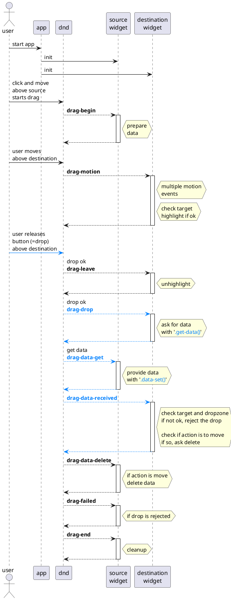

```plantuml
@startuml
actor usr as "user"
participant app as "app"
participant dnd
participant src as "source\nwidget"
participant dst as "destination\nwidget"
'control begin as "drag\nbegin"
'control motion as "drag\nmotion"
'control leave as "drag\nleave"
'control recv as "drag\ndata\nreceived"

usr -> app : start app
app -> src : init
app -> dst : init

usr -> dnd : click and move\nabove source\nstarts drag

dnd --> src : <b>drag-begin</b>
hnote right of src : prepare\ndata
activate src
src --> dnd
deactivate src

usr -> dnd : user moves\nabove destination
dnd --> dst : <b>drag-motion</b>
hnote right of dst : multiple motion\nevents
hnote right of dst : check target\nhighlight if ok
activate dst
dst --> dnd
deactivate dst

usr -[#0080FF]> dnd : user releases\nbutton (=drop)\nabove destination
dnd --> dst : drop ok\n<b>drag-leave</b>
activate dst
hnote right of dst : unhighlight
dst --> dnd
deactivate dst

dnd --[#0080FF]> dst : drop ok\n<font color="#0080FF"><b>drag-drop</b></font>
hnote right of dst : ask for data\nwith '<font color="#0080FF">.get-data()</font>'
activate dst
dst --[#0080FF]> dnd
deactivate dst

dnd --[#0080FF]> src : get data\n<font color="#0080FF"><b>drag-data-get</b></font>
hnote right of src : provide data\nwith '<font color="#0080FF">.data-set()</font>'
activate src
src --[#0080FF]> dnd
deactivate src

dnd --[#0080FF]> dst : <font color="#0080FF"><b>drag-data-received</b></font>
hnote right of dst
  check target and dropzone
  if not ok, reject the drop

  check if action is to move
  if so, ask delete
endnote
activate dst
dst --[#0080FF]> dnd
deactivate dst

dnd --> src : <b>drag-data-delete</b>
hnote right of src : if action is move\ndelete data
activate src
src --> dnd
deactivate src

dnd --> src : <b>drag-failed</b>
hnote right of src : if drop is rejected
activate src
src --> dnd
deactivate src

dnd --> src : <b>drag-end</b>
hnote right of src : cleanup
activate src
src --> dnd
deactivate src
@enduml
```
