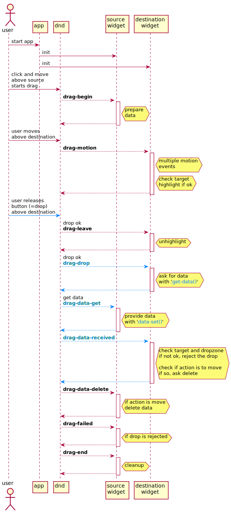

# Drag and Drop

This tutorial is build up from documents written by _Prof. Stewart Weiss_. On [his site here](http://www.compsci.hunter.cuny.edu/~sweiss/index.php), you can find many documents about computer science and in particular about [the GTK user interface](http://www.compsci.hunter.cuny.edu/~sweiss/course_materials/csci493.70/csci493.70_lecture_notes.php). His explanations are about using Gtk using the C programming language. So the documents used here are changed to reflect the raku language and the use of the modules in the provided **Gnome::Gdk3** and **Gnome::Gtk3** packages.

# Overview
Drag-and-drop (DND,for short) is an operation in applications with graphical user interfaces by which users can request, in a visual way, that running applications exchange data with each other. To the user, in a drag-and-drop operation, it appears that data is being dragged from the source of the drag to the destination of the drag. Because applications are independent of each other and written without cognizance of who their partners will be in a DND operation, for DND to work, there must be underlying support by either the operating system or the windowing system.

The Mac OS operating system has always had built-in support for drag-and-drop. Microsoft Windows did not have it; it was added on top of the operating system in Windows 95 and later. UNIX has no support for it at all because the graphical user interfaces found in UNIX systems are not part of the operating system. Support for DND is provided by the X Window system.

Over the years, several different protocols were developed to support DND on X Windows. The two most common were Xdnd and Motif DND. GTK+ can perform drag-and-drop on top of both the Xdnd and Motif protocols.

In GTK+, for an application to be capable of DND, it must first define and set up the widgets that will participate in it. A widget can be a source and/or a destination for a drag-and-drop operation. A source widget is one that can provide drag data, so that the user can drag something off of it. A destination widget is one that can receive drag data. Destination widgets can limit from whom they will accept drag data, e.g. the same application or any application (including itself). Destination widgets can also define the types of data that they are willing to receive.

In GTK+, DND is made possible through the use of the signals emitted by widgets, i.e., the signals defined for the **Gnome::Gtk3::Widget** base class. There are several signals that are emitted during the various stages of a DND operation. The most fundamental ones are those involved in the transfer of data from the source to the destination. This is, after all, the whole point of DND - to make this transfer happen. Understanding how this transfer happens and the role that signals play in carrying it out is crucial to being able to write programs that use drag-and-drop. Therefore, we begin by describing the steps involved in the transfer.

 The actual transfer begins when the user, having started a drag and holding the mouse button down, releases it over a potential destination widget.
1. At this moment a `drag-drop` signal is emitted on this widget.
2. The "drag-drop" signal causes two simultaneous events:
  * If no errors occurred, a `drag-data-get` signal is emitted on the source widget. This signal is in essence a request for data from the source.
  * If a handler for the `drag-drop` signal was connected to the destination widget, then that handler runs.
3. In response to `drag-drop` signal, the destination widget has to indicate that it wishes to receive data from the source of the drag; it does this by calling `Gnome::Gtk3::SelectionData.get-data()`.
4. If a handler for the `drag-data-get` signal was connected to the source widget, when the source receives this signal, it must deliver the data. It does this by calling `Gnome::Gtk3::SelectionData.data-set()`. This function copies the data into a native selection object.
5. When the source widget has copied its data into a selection object, GTK arranges for a `drag-data-received` signal to be emitted on the destination widget.
6. If a handler for the `drag-data-received` signal was connected to the destination widget, that handler's argument includes the selection object containing the data, and the destination can copy the data out of the object into its own variables.

This may seem complicated on first reading, but the basic idea is that the communication between the source and destination takes place through a third entity, GTK+'s selection mechanism, which will be explained in detail below, and is made possible by the underlying DND protocol. Notice that neither the source nor the destination know the others identity.

GTK+ provides a way to do very basic DND without diving into the complexity of the topic, if you are willing to accept default behaviors and do not need to drop many different types of data. On the other hand, if you want to do things such as customizing the drag icon on the start of a drag, deciding whether or not to accept drag data depending no cursor position, or deciding what type of data to accept based on the cursor's position on the destination, highlighting the widget when it is a potential drop site, checking error conditions, and so on, then you need to learn how to use a larger portion of the API.

These notes describe how to do many of these tasks. The remaining sections provide the background and detailed information required to implement drag-and-drop in elementary and more advanced ways. We begin by covering background material.

A schematic view of what has been said is shown below. Here are some more signals visible than is told about before. It might give a more complete idea of what is going on. The blue dashed lines are the actions explained above and the DND line is what GTK is doing behind the scenes.

