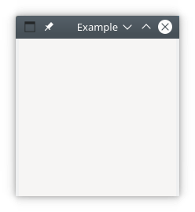
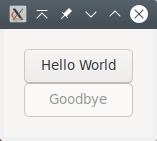

<!--
https://github.com/highlightjs/highlight.js
-->

<!--
<script src="https://cdn.jsdelivr.net/npm/highlightjs"></script>
<script src="https://cdn.jsdelivr.net/npm/highlightjs-raku"></script>
<script>
  hljs.registerLanguage("raku", window.hljsDefineRaku);
  hljs.initHighlightingOnLoad();
</script>

<pre><code class="language-raku">
my $v = 10;
.note for ^$v;
</code></pre>
-->

# Getting Started
## A Simple Window

To get an idea of how the modules from the `Gnome::Gtk3` package work, a simple example is shown where a window is opened. When the window manager button  is clicked, the application will stop and the GUI will disappear.







Lets explain some of the code displayed above. To start with, load the modules used in this program. These are **Gnome::Gtk3::Main** and **Gnome::Gtk3::Window** `(1`. They will load class definitions to control the main loop and to handle a plain window.

Next, we initialize the **Main** object `$m` which is used later on to control the so called, event loop `(2`.

Then we will setup a class to handle signals. These signals are registered after all widgets are setup and laid out `(3`. There is only one method defined in that class to stop the program. Our first GTK method is used here, `.quit()` from the **Main** class to stop our program.
Later, when your applications grow bigger, you will see that you will need more than one class to handle all signals so you can separate the different tasks of your program. E.g. a class to handle a file menu, or one to handle an input form.

Now we can start creating the widgets. There is always a toplevel widget wherein other widgets are placed. Examples of toplevel widgets are **Window** or **Gnome::Gtk3::Dialog**.
Here we have used only one widget, a Window and set its title to 'Example' `(4`. This text is shown at the top of the window in an area called titlebar.

Initialize the handler class and register signals. We use the `destroy` signal to call the `.exit-program()` method in the handler object `$ash` `(5`.

Then show the window and everything in it `(6` and start the main loop `(7`.

To run the program, save the code in a file called `simple-example.raku` and type the following on the command line (in windows you can double click on the filename).

```
raku simple-example.raku <Enter>
```

### What we have learned

So, what we have learned here are several specific things which will always come back in all user interface based programs.
* Defining a handler class where all handler methods can reside. However, you are not restricted to one class and you do not have to have the class defined in your main program. You can split the handling in several 'categories' e.g. file dialog handling or tree view handling.
* Creating a window and have it a title.
* Add more widgets to the window (not shown here, it is a simple example you know).
* Registration of your callback handlers to handle specific signals.
* Starting and stopping of the main loop.


## Simple Window with a Button

The next step is to put something in the window, for example a button. We will make the button act in such a way that clicking on the button will stop the program.






You see that the layout of the program is more or less the same as in our previous example. We need to load an extra module **Gnome::Gtk3::Button** `(1`. We also have added another method to the handler class to handle the button click `(2`. We could also have used the same method `.exit-program()` in this case.

We have also have used `.set-title()` to set the title of the window `(3`.

What is new is the creation of a button `(4` and how it is added to the window `(5`. Later on the signal handler `.button-exit()` is registered to handle the _clicked_ event `(6`.

Now save the code in `window-button.raku` and run it. Pressing the button will stop the program.

The order of creating widgets is often not important so we could also do



my AppSignalHandlers $ash .= new;

with my Gnome::Gtk3::Button $button .= new(
  :label('Exit Our Very Lovely Program')
) {
  .register-signal( $ash, 'button-exit', 'clicked');
}

with my Gnome::Gtk3::Window $top-window .= new {
  .set-title('With Button');
  .register-signal( $ash, 'exit-program', 'destroy');
  .add($button);
  .show-all;
}




## Simple Window with two Buttons

Lets go on quickly and add a second button with the `.add()` method. The relevant part is shown below.



…
my AppSignalHandlers $ash .= new;

with my Gnome::Gtk3::Button $button1 .= new(
  :label('Exit Our Very Lovely Program')
) {
  .register-signal( $ash, 'button-exit', 'clicked');
}

with my Gnome::Gtk3::Button $button2 .= new(
  :label('Exit too with button two')
) {
  .register-signal( $ash, 'button-exit', 'clicked');
}

with my Gnome::Gtk3::Window $top-window .= new {
  .set-title('With 2 Buttons');
  .add($button1);
  .add($button2);
  .register-signal( $ash, 'exit-program', 'destroy');
  .show-all;
}
…


Save it into `window-two-buttons.raku` and run. When run, we see that there is a problem. There is still one button and an error is shown on the commandline. This error comes directly from the GTK libs and will tell you what goes wrong. The error is;
```
(window-two-buttons.raku:25360): Gtk-WARNING **: 20:31:04.187: Attempting
to add a widget with type GtkButton to a GtkWindow, but as a GtkBin
subclass a GtkWindow can only contain one widget at a time; it already
contains a widget of type GtkButton
```
A few things to note here;
* The line 25360 can not be found in our code. It is perhaps a line number in the library or a memory address.
* The objects in GTK+ are named a bit differently but it is easy to see what class we have to look at, e.g. GtkWindow is the native representation of a **Gnome::Gtk3::Window** class. This native object is also stored within that Raku class.
* We notice a new object, namely a GtkBin which is a parent class of GtkWindow.

The error tells us that the **Gnome::Gtk3::Window** class is a subclass of **Gnome::Gtk3::Bin** which is a container able to contain only one object. This is the reason that we only saw one button in the running program.

### The proper way

Ok. Need to do things differently then. Lets look at our next attempt which is also a bit more interesting too. The next example is taken from the **GTK::Simple** package so you can compare the two implementations.







We will use a **Gnome::Gtk3::Grid** to add the buttons to and the grid will be added to the window. Maybe you have heard of GtkVBox and GtkHBox. These are container classes where you can layout other widgets vertically or horizontally. They still exist in Gtk version 3 but are deprecated and therefore not supported by the Raku packages. However, the **Grid** class can do it all for you and much easier.

When creating the buttons, we start with the lower one because we need the object in the registration of the handler of the upper button `(1` The lower button is disabled using `.set-sensitive()` `(2` and is visible as a grayed-out button.

The upper button handler is `.upper-button-click()`. We see that there is a named argument added called `:$lower-button` to the registration call `(3`. You are totally free to add any named argument except for names starting with an underscore. Those names are reserved. The arguments are provided to the handler as is. The reserved naqmed argument `:$_widget` will hold the object on which the handler is registered.

Then an empty grid is created `(4`. Add the buttons to the **Grid** using `.attach()`. The integers 0, 0, 1, 1 in the first call mean; first column, first row and take up 1 grid location in width and height. The lower button is placed below the first one taking up the same space. The grid is molded around the buttons taking the minimum space needed.

The method `.set-border-width()` on the **Window** is used to get some space around our buttons `(5`. Also the **Grid** is added on the next line.

The first handler `.upper-button-click()` `(6` is called when the top button is clicked. It uses the object `$b1` provided by `:_widget` to make that object insensitive . This is the top button and will now become grayed out. The other button `$b2` given by `:lower-button` is made sensitive. You will see that it 'returns from its grayness' so to speak.

The second handler `.lower-button-click()` `(7` is called when the bottom button is clicked and will call `.quit()` to stop the program.


### What we have learned
* A window can hold only one object while a grid can hold more objects. The grid can be added to the window and other widgets can be added to the grid.
* We learned a few more methods to manipulate widgets e.g. `.set-border-width()` and `.set-sensitive()`.
* When registering signal handlers, we can add more information using named arguments but that the `:widget` argument is reserved.

# References

* [Gnome::Gtk3::Main]({{ url }}/Gtk3/Main.html)
* [Gnome::Gtk3::Window]({{ url }}/Gtk3/Window.html)
* [Gnome::Gtk3::Dialog]({{ url }}/Gtk3/Dialog.html)
* [Gnome::Gtk3::Button]({{ url }}/Gtk3/Button.html)
* [Gnome::Gtk3::Grid]({{ url }}/Gtk3/Grid.html)
