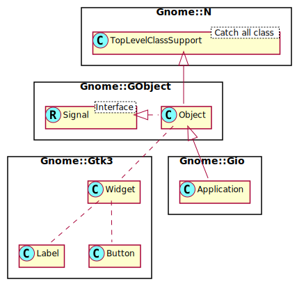

# The Gnome::GObject::Object

As the manual states;

_**Gnome::GObject::Object** is the fundamental type providing the common attributes and methods for all object types in GTK+, Pango and other libraries based on `N-GObject`. The `N-GObject` object provides methods for object construction and destruction, property access methods, and signal support._

In this document, we will see what it can do for you. A short list;
* Initialization
* Handling signals and events.
* Using threads to do computing in parallel.
* How variables are maintained by an object, called properties.
* How to store your own data into the native object by associating data to keys.

First a picture of how classes are connected.


We see that several classes inherit from Object directly or inderectly and therefore have access to the mechanisms provided by Object.


## Initialization

As discussed in the document [Raku Modules](raku-modules.html), each widget must be initialized to have a native object representing the C object stored in the Raku object. Most Raku objects accept the `:native-object` named argument and many (widgets) know about the `:build-id` next to their own set of arguments if any.

* `:native-object`; This argument is not handled here really, it is handled at the top of the food chain, in **Gnome::N::TopLevelClassSupport**. It is handled there because the native object is defined in that class. Therefore, any class inheriting from that class knows about this named argument. Its use is to import a native object from elsewhere into the Raku object. After that, the methods can be used to access that object.

* `:build-id`; This argument can be used when GUI descriptions in XML are created by hand or with the use of the designer program `glade`. The XML can be loaded with the use of class **Gnome::Gtk3:Builder**. When the **Builder** class is instantiated, the object is also stored in the **Object** class in such a way that any other **Object** object can access the **Builder** object. The entities described in the XML can have id's unique in that XML. This then makes it possible to retrieve an object from the **Builder** by using this `:build-id` argument. Under the hood, it would be something like;
  ```raku
  my Gnome::Gtk3::Builder $builder .= new;

  my Gnome::Glib::Error $e = $builder.add-from-file('my-ui-description.glade');
  if $e.is-valid {
    my N-GObject $builder.get-object('my-button-1'), N-GObject, '.get-object()';


  ```


## Signals and events

The **Gnome::GObject::Object** of Gnome also helps with the handling of signals of events. It uses the **Gnome::GObject::Signal** role for it. It is a rather large subject so there is [more on this described here](http://localhost:4000/gnome-gtk3/content-docs/tutorial/Groundwork/Signal.html).

## Concurrent processes

Concurrency is implemented in the modules **Gnome::Glib::MainLoop** and **Gnome::Glib::MainContext**. A method `Gnome::GObject::Object.start-thread()` is implemented as a convenience for the use of these modules.

An example of its use comes from my testing programs where some of the events are tested. Below, events for the **Gnome::Gtk3::AboutDialog** are tested;

```
use Test;
use NativeCall;

use Gnome::N::GlibToRakuTypes;
use Gnome::Gtk3::AboutDialog;
use Gnome::Gdk3::Pixbuf;
use Gnome::Gtk3::Main;

my Gnome::Gtk3::Main $main .= new;

class SignalHandlers {
  has Bool $!signal-processed = False;

  method activate ( Str $uri --> Bool ) {                             # ①
    is $uri, 'https://example.com/my-favourite-items.html',
      'uri received from event';
    $!signal-processed = True;

    True
  }

  method signal-emitter (
    Gnome::Gtk3::AboutDialog :_widget($about-dialog) --> Str
  ) {                                                                 # ②

    $about-dialog.emit-by-name(                                       # ③
      'activate-link',
      'https://example.com/my-favourite-items.html',
      :return-type(gboolean),
      :parameters([gchar-ptr,])
    );

    sleep(0.4);
    is $!signal-processed, True, '\'activate-link\' signal processed';

    $main.main-quit;

    'done'
  }
}

my SignalHandlers $sh .= new;
$a.register-signal( $sh, 'activate', 'activate-link');                # ④

my Promise $p = $a.start-thread( $sh, 'signal-emitter', :new-context);# ⑤

$main.main;                                                           # ⑥

is $p.result, 'done', 'emitter finished';
```

① There are two handlers in the **SignalHandlers** class. The signal to be tested is `activate-link` and the method `.activate()` receives it. This handler receives an uri.

② The second handler is the one running in a thread. We need a thread if long running work is to be done and it should not hold up the interaction of the user interface. Here it just fires an event to test the event handler.

③ The method `.emit-by-name()` is used to fire the event. It must deliver all arguments which an event handler can receive. After emitting, we need some rest and then finish the event loop. The types are native types used in Gtk and are defined in **Gnome::N::GlibToRakuTypes** as a convenience. The `gboolean` is an `int32` and `gchar-ptr` is a `CArray[Str]`.

④ We must register the signal handler.

⑤ Now we can create a thread which, in this case, also creates a new event context. This is not always necessary, but in that case you need to process the events yourself like here;
```
while $main.events-pending() { $main.iteration-do(False); }
```

⑥ Start the event loop. We return here when `.main-quit()` is called to end the loop. After that we can test for any results comming back from the thread.


## Properties

Properties are predefined items in the native object. Each Gtk class has its own set of variables to store data set by the several routines of a class. Most of the values can be retrieved by the native subroutines as well as set the values. Sometimes however, there are no subs defined and we must use special calls to get and set them. At the start of the implementation of the Raku classes, there was only one method available and is documented everywhere at the start of the properties section of a class.

For instance in the module **Gnome::Gtk3::AboutDialog** we can find the methods to get and set the program name which is shown in the dialog.

```
$about-dialog.set-program-name('AboutDialog.t');
say $about-dialog.get-program-name;         # AboutDialog.t
```

To use the property for this data you can run the following snippet;
```
my Gnome::GObject::Value $gv .= new(:init(G_TYPE_STRING));            # ①
$about-dialog.get-property( 'program-name', $gv);                     # ②
say $gv.get-string;                         # AboutDialog             # ③
$gv.clear-object;                                                     # ④
```
① Initialize the **Gnome::GObject::Value** object with the type we have to get data from. These types are defined in **Gnome::GObject::Type**.

② Then we can get the property from the about dialog object into the **Gnome::GObject::Value** object.

③ Using the call `.get-string()`, we are able to retrieve the string from the property. For each type, there is another method. Examples are `.get-boolean()` and `.get-int64()`. There is also a set property method. In this case `.set-string()`. Note that not all properties are writable.

④ When done with the Value object, clean it up.

Das war damals, but still usable. Now, new methods are added and are much simpler to work with.
```
my @r = $about-dialog.get-properties( 'program-name', Str);
say @r[0];                                  # AboutDialog
```
More than one property can be returned from one call. Therefore, the values are returned in a list.

Errors like the next one, are shown at the terminal when wrong or non-existant property names are used.
```
(AboutDialog.t:10839): GLib-GObject-WARNING **: 16:25:15.822: g_object_get_is_valid_property: object class 'GtkAboutDialog' has no property named 'program-nme'
```

## Data

Properties are predefined values of a Gtk class. The user of a widget might have a few of ther own to add to the native object. But first …

There was this issue #23 posted by Grenzionky about loosing information set in attributes of classes which inherit from gnome widgets. The problem happened when the object of such a class was set as a page in a notebook. Later the object was returned again from the notebook by some call to a method. The strange thing was that, when the rake object was recreated again, the attributes in that object were not having the values which were set before.

A code snippet to show what has been done
```
class ExtendedLabel is Gnome::Gtk3::Label {                           # ①
  has Str $.custom-data;

  submethod new (|c) {                                                # ②
  	self.bless( :GtkLabel, |c );
  }
}

my ExtendedLabel $label .= new(
  :custom-data('some data contents'), :text('words')
);

my Gnome::Gtk3::Notebook $notebook .= new;                            # ③
$nb.append-page( $label, Gnome::Gtk3::Label.new(:text('title')));

my Gnome::Gtk3::Window $window .= new;                                # ④
$window.add($notebook);

… Further setup and start main loop …

say ExtendedLabel.new(                                                # ⑤
  :native-object($notebook.get-nth-page(0))
).custom-data;

```

① This is the class we want to talk about. `$!custom-data` is the attribute we like to control.

② A necessary step to inherit the Label widget.

③ Create the notebook and add the **ExtendedLabel** object as a page.

④ Create a window and add the notebook to it. Additionally, we need to register callback handlers, show everything and start the main loop.

⑤ Sometime later we want to get the object again to do some work and we expect to get `'some data contents'` as the stored text. Unfortunately, it will be undefined!

So, why did the Raku class not initialize to its original value?
The problem lies in the fact that all Raku widget classes wrap a native object. This object can only be given to the native suboutines in order to complete their tasks. When, at a later moment, the object is retrieved, the object can only be wrapped in again into the Raku class without any knowledge of the previous settings of its attributes. In the above case it is more or less obvious that the object is imported (See line ⑤).

It is less clear when a `-rk` version is used like below;

```
my Gnome::Gtk3::Label $label = $notebook.get-nth-page-rk(0);
```

Essentially, it does the same besides finding out what Raku widget object to create. Note that it can only return a **Gnome::Gtk3::Label**, the code cannot possibly know about other classes. Therefore this is not usable on child classes like **ExtendedLabel**.

To solve this problem I proposed to create a singleton class where the Raku class objects can register themselves using a key. This key can also be used as a widget name which is stored on the native object. When the object is retrieved, the widget name can be asked for and with that the Raku object found in the registry of the singleton.

That works of course but the **Gnome::GObject::Object** module is upgraded with implemented methods `.get-data()` and `.set-data()`. With these calls you can store data on the native object. Now, when the object returns, the data can be retrieved from the object.

Some examples;

### Example 1

Here is an example to show how to associate some data to an object and to retrieve it again. You must import the raku **NativeCall** module to get access to some of the native types and routines.

```
my Gnome::Gtk3::Button $button .= new(:label<Start>);
my Gnome::Gtk3::Label $att-label .= new(:text<a-label>);
$button.set-data( 'attached-label-data', $att-label);

…

my Gnome::Gtk3::Label $att-label2 =
  $button.get-data( 'attached-label-data', N-GObject);

or, if you want to be sure, add the C<widget-class> named argument;

my Gnome::Gtk3::Label $att-label2 = $button.get-data(
  'attached-label-data', N-GObject,
  :widget-class<Gnome::Gtk3::Label>
);
```

### Example 2

Other types can be used as well to store data. The next example shows what is possible;

```
$button.set-data( 'my-text-key', 'my important text');
$button.set-data( 'my-uint32-key', my uint32 $x = 12345);

…

my Str $text = $button.get-data( 'my-text-key', Str);
my Int $number = $button.get-data( 'my-uint32-key', uint32);
```

### Example 3

An elaborate example of more complex data can be used with **BSON**. This is an implementation of a JSON like structure but is serialized into a binary representation. It is used for transport to and from a MongoDB server. Here we use it to attach complex data in serialized form to an **Gnome::GObject::Object**. (Please note that the **BSON** package must be of version 0.13.2 or higher.)

```
# Create the data structure
my BSON::Document $bson .= new: (
  :int-number(-10),
  :num-number(-2.34e-3),
  :strings( :s1<abc>, :s2<def>, :s3<xyz> )
);

# And store it on a label
my Gnome::Gtk3::Label $bl .= new(:text<a-label>);
$bl.set-data( 'my-buf-key', $bson.encode);

…

# Later, we want to access the data again,
my BSON::Document $bson2 .= new($bl.get-data( 'my-buf-key', Buf));

# Now you can use the data again.
say $bson2<int-number>;  # -10
say $bson2<num-number>;  # -234e-5
say $bson2<strings><s2>; # 'def'
```

## BUILD into child class

The method calls to `.set-data()` and `.get-data()` could be conveniently tucked away in the `BUILD()` submethod of the child class like so;
```
class ExtendedLabel is Gnome::Gtk3::Label {
  has Str $.custom-data;
  method new ( |c ) {
    self.bless( :GtkLabel, |c );
  }

  submethod BUILD ( Str :$!custom-data, :$native-object? ) {
    if $native-object {                                               # ①
      $!custom-data = self.get-data( 'custom-data', Str);
    }

    else {                                                            # ②
      self.set-data( 'custom-data', $!custom-data);
    }
  }
}
```

① when imported, get data

② otherwise, set data

<!--
## Reference counting
### Floating references
### :native-object
### .get-native-object()
### .get-native-object-no-reffing()
### .clear-object()

-->

# References

* [Gnome::N::TopLevelClassSupport]({{ url }}/Native/TopLevelClassSupport.html)

* [Gnome::GObject::Object]({{ url }}/GObject/Object.html)
* [Gnome::GObject::Signal]({{ url }}/GObject/Signal.html)
