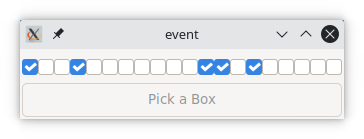

# Signals and Events

We are going to see a bit more about signals. First some repetition. We define our signal handler methods in a class of its own. The purpose of that is to separate the handling of signals from the main code. This class is setup around some object with all information it needs. An example could be the handling of a group of radio-buttons. Below a slight different approach where you can see that the class has its business with the top level window.

Such a class can be defined in a separate module which is imported at the start of the program.

```
class Gui::TopWindow {
  has Gnome::Gtk3::Window $.top-window;

  submethod BUILD ( ) {
    with $!top-window .= new {
      .title('my top level window');
      .register-signal( self, 'exit-program', 'destroy');
    }
  }

  method exit-program ( ) { Gnome::Gtk3::Main.new.gtk-main-quit; }
}

...
my Gui::TopWindow $w .= new;

my Gnome::Gtk3::Grid $grid .= new;
$w.top-window.add($grid);
…
```


## Declaration of the Registration Method

```
method register-signal (
  $handler-object, Str:D $handler-name,
  Str:D $signal-name, *%user-options
  --> Int
)
```

We have used the first few arguments `$handler-object` and `$handler-name` before and the use of it should be clear as well as the argument `$signal-name`. With these three arguments you can handle any signal you wish to handle.

Now, I want to tell a bit more about the `*%user-options`. This is an accumulation of all named attributes given in the argument list to `.register-signal()`. The user is free to use any named attribute name. Unfortunately however, in the early setup of the routine I claimed the name 'widget' to provide the Raku object on which the signal was fired. This is changed now into '\_widget' and the older form will be deprecated and free to be used by the developer later after version 0.30.0. From now on all names starting with an underscore ('\_') are reserved.

```
my Gnome::Gtk3::DrawingArea $da .= new;
my Gnome::Gtk3::Button $draw-bttn .= new(:label<Draw>);
my Int $handler-id = $draw-bttn.register-signal(
  HandlerObject.new, 'draw-picture', 'clicked',
  :draw-area($da)
);
```

All of the `*%user-options` are provided to the signal handler so that the handler can process the signal with access to other variables which might be needed. In the example above, `:$draw-area` will be passed to the handler.
Together with the user named attributes the arguments `:$_widget`, `:$_native-object` and `:$_handler-id` are also provided.

The handler id is also returned from the call to `.register-signal()`. More on this in the next section.

## Unregistering Signals

There are times that you want to get rid of a signal when your program gets into another phase. For instance in the example above, the drawing area can be replaced with something else or removed altogether and the button may get another function. You could remove the button too and create a new one and register a new handler but there could be reasons that it wouldn't be easy to do so, for instance you have the button object but don't know in which container it is placed in. Here the handler id comes in because you need it to remove the handler.

```
has Int $!handler-id;
has Gnome::Gtk3::Button $!draw-bttn;
…
$!draw-bttn .= new(:label<Draw>);
$!handler-id = $!draw-bttn.register-signal(
  HandlerObject.new, 'draw-picture', 'clicked',
  :draw-area($da)
);
…

# After some time we want to change the 'clicked' signal handling
$!draw-bttn.handler-disconnect($!handler-id);
…
```
Or done in a handler
```
$_widget.handler-disconnect($_handler-id);
…
```

So, that was easy 😉.

## A note about `:$_native-object`

The `$_native-object` variable provided to the handler is the same native object as stored within the Raku object provided in `$_widget`. However, there are situations that the Raku object gets invalidated; `$_widget.is-valid() ~~ False`. This is quickly remedied when it can be expected, like so;
```
method handler (
  …,
  Gnome::Gtk3::Button :_widget($button) is copy,
  N_GObject :_native-object($no),
  …
) {
  $button .= new(:native-object($no)) unless $button.is-valid;
  …
}
```

## Other Signals

Each of the Gnome objects who can handle signals have some detailed information in their documentation. If we look for example at the `key-press-event` defined for **Gnome::Gtk3::Widget** we see the following handler declaration;
```
method handler (
  N-GdkEventKey $event,
  Int :$_handler_id,
  Gnome::GObject::Object :_widget($widget),
  *%user-options
  --> Int
);
```
All named arguments are optional but the positional arguments, if any, are not. Also _**the postional arguments must have a type!**_. Above we see that `$event` has a type `N-GdkEventKey` which is a structure from **Gnome::Gdk3::Events**.

To show what you can do, here is another code snippet;
```
class HandlerObject {

  # if you want to test more event types
  method show-keys ( N-GdkEvent $event ) {

    say "\nevent type: ", GdkEventType($event.type);

    if $event.type ~~ GDK_KEY_PRESS {
      my N-GdkEventKey $event-key := $event.event-key;
      say "key: ", $event-key.keyval.fmt('0x%04x');

      if $event-key.keyval == GDK_KEY_Return {
        note "Typed an <Enter> key";
      }
    }
  }
}

my Gnome::Gtk3::Frame $my-key-input .= new;
$my-key-input.register-signal(
  HandlerObject.new, 'show-keys', 'key-press-event'
);
...
```
The `N-GdkEvent` type is a union of event structures of which `N-GdkEventKey` is one of them. Of all these structures, the first three fields are the same. The structure `N-GdkEventAny` is only holding these values. That's the reason why you can test its type and then access the other fields using the `N-GdkEventKey` type by binding the variable to it. `N-GdkEvent.type ~~ N-GdkEventKey.type`. If only one type of event is processed by your handler, you could skip a few tests and have `method show-keys ( N-GdkEventKey $key-event )` directly in your handler declaration.

You can test the keys for its values such as `GDK_KEY_Return` used in the example. The names can be found here: **Gnome::Gdk3::Keysyms**.

## Event Loop

Most of the time the program only have to sit back and wait for the user of your precious application to press a button or generate an action of some sort. Most of the time the actions are short lived and the program returns to its waiting state. This state is called the event loop where the program is waiting for events to happen. The state is entered with the call to `Gnome::Gtk3::Main.new().gtk-main()` and ended with `.gtk-main-quit()` in the **Gnome::Gtk3::Main** object.

However, every action performed by your code will freeze the user interface. As mentioned above, this processing time is mostly short and the freezing is barely noticed. When you have to do something substantial you will have to check for events yourself and let the library process the queued events to prevent an unresponsive interface.

You can do this by inserting the following code on regular spots in your code;
```
my Gnome::Gtk3::Main $main;
...
while $main.events-pending {
  $main.main-iteration;
}
```
Or an even smaller snippet;
```
my Bool $exited = ? $main.main-iteration(False);
```
Only you won't know if there were any events processed. The value returned is 0 or 1 to show if the current event loop was exited.

Yes, current event loop, because event loops can be nested, although, I do not yet have a good example for it. It seems that dialog widgets use a local event loop. I can imagine that a modal dialog shields the events from parent windows off by doing that but that needs to be found out yet. To get the current loop nesting level call `$main.main-level()`.

There are other ways to run code and keep the interface responsive as is shown in the next example. It shows a scale widget which you can change and two buttons _Start Update_ and _Stop Update_. The start update button is used to start a process in a thread which mimic computations and show results by moving the scale left or right. The stop update button stops that process. While running, all gui elements stay responsive while running the 'updates' like button clicks and window resizes.


Class **X** is controlling a few veriables which are accessed from several threads and need therefore some protection using semaphores. There is a package for this called **Semaphore::ReadersWriters**. See also [readers-writers problem on wikipedia](https://en.wikipedia.org/wiki/Readers%E2%80%93writers_problem). Initializing the semaphores [22-25] uses two keys to control two semaphores for the variables `$!promise` and `$!running-update`. Later you see examples of reading [35,52] and writing [54,55-61].

You cannot blindly start a thread and try to update the interface from there. The Glib library provides several ways to enter a thread safely. The routine `.start-thread()` from **Gnome::GObject::Object** does that for you and returns a **Promise** object [56-59]. Option `:start-time` gives you the opportinity to let the thread wait a little before taking off. `:new-context` is a necessary option which controls the creation of a separate context. This is needed if one is to show the changes in the Gui otherwise it will still use the main loop and the Gui will freeze.

Initialization and configuration takes place at 76-107 after which all is shown [108] and the event loop entered [109].





## Sending Events

I believe that sending an event to some widget is seldom used but it is possible to, for example, send a click event to a button and start the action for that event. A test interface (already in the making) could make use of this so a Gui can be tested by a script instead of the tedious and repeatative work of pressing all buttons and providing input to see if the program still works.

In the next program example w'll see the use of `.emit-by-name()` from **Gnome::GObject::Signal**. It is a bit of a fun application which could work much more easy using `.set-active()` on the check box widget but there is also our motto **_TIMTOWTDI_** or **_There Is More Than One Way To Do It!_**



Clicking on the button named 'Pick a Box' will choose a checkbox to send a `clicked` event to one of the check buttons. After receiving the event, the checkbox toggles between its on or off state and calls the callback routine. This routine writes the result information to the console wherein the program is started.





Most of the code is obvious after having shown several examples. The initialization of class **X** generates 20 check buttons and place these in the first row [14-27] of the provided grid [46]. We use the `toggled` signal to call the `.check-box-toggle()` method [25].

The second row is occupied by the button over all its horizontal grid cells, 20 cells that is [48,49]. It is setup to call method `$x.pick-a-box()` after procesing the `clicked` event [50].

The method `$x.pick-a-box()` will randomly choose one of the generated check buttons to send the event `clicked` to. Here the method `.emit-by-name()` is called to do just that [39].
