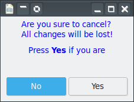

# Dialogs

## Introduction

Dialogs are toplevel windows which are important tools to most applications. The dialogs have many uses ranging from displaying simple messages to full fledged installation forms and other questionaires. Although an application has a basic window, a dialog window is a separate window with other information displayed. A dialog window can be made 'modal' which means that the I/O is directed to that dialog. To get it completely right, that is, the window manager keeps the dialog on top amongst other things, the dialog must have the application window as its transient parent window.


## Prefab dialogs

There are already some dialog types made for special purposes. A dialog to show messages, an about dialog to show something about the application, a file select dialog and a color picker dialog to name a few.

Next, we'll have a closer look at some of those dialogs.

### Message dialog

This widget is used to show messages of some sort. It is possible to add buttons to this dialog depending on what the message is. For example only an `Ok` button can be used, just to confirm you read the message.

An example below shows a message dialog displaying a message and two buttons 'Yes' and 'No'. The class inherits from the MessageDialog to change little things.
```
use Gnome::Glib::Error;
use Gnome::Gdk3::Pixbuf;
use Gnome::Gtk3::Enums;
use Gnome::Gtk3::Dialog;
use Gnome::Gtk3::MessageDialog;
use Gnome::Gtk3::Window;

unit class QA::Gui::YNMsgDialog;
also is Gnome::Gtk3::MessageDialog;

submethod new ( Str :$message, |c ) {
  self.bless(
    :GtkMessageDialog, :type(GTK_MESSAGE_WARNING),
    :buttons(GTK_BUTTONS_YES_NO), :markup-message($message),
    |c
  );
}

submethod BUILD ( *%options ) {
  self.format-secondary-markup('Press <b>Yes</b> if you are');
  self.set-position(GTK_WIN_POS_MOUSE);
  self.set-keep-above(True);
  self.set-default-response(GTK_RESPONSE_NO);

  my Gnome::Gdk3::Pixbuf $win-icon .= new(
    :file(%?RESOURCES<icons8-invoice-100.png>.Str)
  );

  my Gnome::Glib::Error $e = $win-icon.last-error;
  if $e.is-valid {
    note "Error icon file: $e.message()";
  }

  else {
    self.set-icon($win-icon);
  }
}
```

Display of the dialog and getting the response will be explained below.



## Dialog
