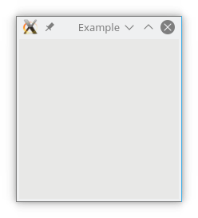
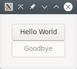

# Getting Your Feet Wet

## A Simple Window

To get an idea of how the modules from the `Gnome::Gtk3` package work, a simple example is shown where a window is opened. When the window manager button  is clicked, the application will stop and the GUI will disappear.







Lets explain some of the code displayed above. To start with, load the modules used in this program. These are **Gnome::Gtk3::Main** and **Gnome::Gtk3::Window** [3,4]. They will load class definitions to control the main loop and to handle a plain window.

Next, we initialize a **Gnome::Gtk3::Main** object `$m` which will be used later on [7].

Then we will setup a class to handle signals. These signals are registered after all widgets are setup and laid out [10-14]. There is only one method defined in that class to stop the program. Our first GTK method is used here, `gtk-main-quit()` from the **Gnome::Gtk3::Main** class [12].

Now we can start creating the widgets. There is only one widget **Gnome::Gtk3::Window** and initialized as a window with its title set to 'Example' [17].

Initialize the handler class and register signals. We use the `destroy` signal to call the `exit-program()` method in the handler object `$ash` [20,21].

Then show the window and everything in it [24] and start the main loop [26].

To run the program, save the code in a file called `simple-example.pl6` and type the following on the command line (in windows you can double click on the filename).
```
perl6 simple-example.pl6 <Enter>
```
#### What we have learned
So, what we have learned here are several specific things which will always come back in all user interface based programs.
* Initialization of the libraries
* Creating a window and displaying it on screen having a title.
* Defining a handler class where all handler classes can reside. However, you are not restricted to one class and you do not have to have the class defined in your main program. You can split the handling in several 'categories' e.g. file dialog handling or tree view handling.
* Registration of your handlers to handle specific signals.
* Starting and stopping of the main loop.

## Simple Window With A Button

The next step is to have some action using a button. The button is placed in the window and clicking on the button will stop the program.






You see that the layout of the program is more or less the same as in our previous example. We need to load an extra module **Gnome::Gtk3::Button** [5]. We also have added another method to the handler class to handle the button click [12-16].

We have used a method `.set-title()` to set the title of the window [27].

What is new is the creation of a button [30] and how it is added to the window [31]. Later on the signal handler `.button-exit()` is registered to handle the _click_ event [35].

Now save the code in `window-button.pl6` and run it. Pressing the button will stop the program.

## Simple Window With Two Buttons

Lets go on quickly and add another button with the `.gtk-container-add()` method. The relevant part is shown below.

```
...
my Gnome::Gtk3::Window $top-window .= new(:empty);
$top-window.set-title('With 2 Buttons');

# Create buttons
my Gnome::Gtk3::Button $button1 .= new(:label('Exit Our Very Lovely Program'));
$top-window.gtk-container-add($button1);
my Gnome::Gtk3::Button $button2 .= new(:label('Exit too with button two'));
$top-window.gtk-container-add($button2);

# Instantiate the event handler class and register signals
my AppSignalHandlers $ash .= new;
$button1.register-signal( $ash, 'button-exit', 'clicked');
$button2.register-signal( $ash, 'button-exit', 'clicked');
$top-window.register-signal( $ash, 'exit-program', 'destroy');
...
```

When run, we see that there is a problem. There is still one button and an error is shown on the commandline. This error comes directly from the GTK libs and will tell you sometimes what goes wrong. The error is;
```
(window-two-buttons.pl6:25360): Gtk-WARNING **: 20:31:04.187: Attempting
to add a widget with type GtkButton to a GtkWindow, but as a GtkBin
subclass a GtkWindow can only contain one widget at a time; it already
contains a widget of type GtkButton
```
A few things to note here;
* The line 25360 can not be found in our code. It is perhaps a line number in the library or a memory address.
* The objects in GTK+ are named a bit differently but it is easy to make the proper connection, e.g. GtkWindow is the native representation of a **Gnome::Gtk3::Window** class. This native object is also stored within that class.
* We notice a new object, namely a GtkBin which is a parent class of GtkWindow.

The error tells us that the **Window** class is a subclass of **Bin** which is a container able to contain only one object. This is the reason that we only saw one button in the running program.

Ok. Need to do things differently then. Lets look at our next attempt which is also a bit more interesting too. The next example is taken from the **GTK::Simple** package so you can compare the two implementations.







We will use a **Grid** to add the buttons to. Maybe you have heard of GtkVBox and GtkHBox. These are container classes where you can layout other widgets vertically or horizontally. They still exist in Gtk version 3 but are deprecated and therefore not supported by the Perl6 packages. However, the **Grid** class can do it all for you and easier.

The method `.set-border-width()` on the **Window** is used to get some space around our buttons [43]. Then an empty grid is created and added to the window [46,47]. The buttons are created [50,51] but the second button is disabled with `.set-sensitive()` [52]. This will be visible as a grayed-out button.

Add the buttons to the **Grid** with `.gtk-grid-attach()` [55,56]. The integers 0, 0, 1, 1 in the first call mean; first column, first row and take up 1 grid location in width and height. The second button is placed below the first one taking up the same space. The grid is molded around the buttons taking the minimum space needed.

The first button handler is `.first-button-click()`. We see that there is a named argument added (`:other-button`) to the registration call [60-63]. You are totally free to add any named argument except for `:widget` which is reserved. The arguments are provided to the handler as is. The `:widget` will hold the object on which the handler is registered.

The first handler `.first-button-click()` is called when the top button is clicked [15-23]. It uses the object `$b1` provided by `:widget` to make that object insensitive [19]. This is the top button and will become grayed. The other button `$b2` given by `:other-button` is made sensitive [20]. You will see that it 'returns from its grayness' so to speak.

The second handler `.second-button-click()` [26-30] is called when the bottom button is clicked and will call `.gtk-main-quit()` to stop the program.

All handlers are returning an integer, mostly 1, to say that the handler has handled things properly and that there is no need to call other handlers for the same signal. But sometimes it is not, depending on arguments perhaps or whatever, and a 0 can be returned as to say that it is not handled. In special cases other values must be returned.

#### What we have learned
* A window can hold only one object while a grid can hold more objects. The grid can be added to the window and other widgets can be added to the grid.
* We learned a few more methods to manipulate widgets e.g. `.set-border-width()` and `.set-sensitive()`.
* When registering signal handlers, we can add more information using named arguments but that the `:widget` argument is reserved.
* The signal handlers must return an integer mostly 1 or 0 which means something like 'I did it' or 'I like someone else to do it' respectively.
