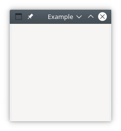

# Getting Your Feet Wet

## A Simple Window

To get an idea of how the modules from the `Gnome::Gtk3` package work, a simple example is shown where a window is opened. When the window manager button  is clicked, the application will stop and the GUI will disappear.







Lets explain some of the code displayed above. To start with, every Perl6 program starts with `use v6` with variants like `use v6.c` [line 1]. Then we need to load the modules used in this program. These are `Gnome::Gtk3::Main` and `Gnome::Gtk3::Window` [3,4]. They will load class definitions to control the main loop and to handle a plain window.

Next, we initialize a `Gnome::Gtk3::Main` object `$m` which will be used later on [7].

Then we will setup a class to handle signals. These signals are registered after all widgets are setup and laid out [10-14]. There is only one method defined in that class to stop the program. Our first GTK method is used here, `gtk-main-quit` from the `Gnome::Gtk3::Main` class [12].

Now we can start creating the widgets. There is only one widget `Gnome::Gtk3::Window` and initialized as a window with its title set to 'Example' [17].

Initialize the handler class and register signals. We use the `destroy` signal to call the `exit-program` method in the handler object `$ash` [20,21].

Then show the window and everything in it [24] and start the main loop [26].

To run the program, save the code in a file called `simple-example.pl6` and type the following.
```
perl6 simple-example.pl6 <Enter>
```

So, what we have touched upon here are several specific things which will always come back in all gui based programs.
* Initialization of the underlying libraries including starting and stopping the main loop.
*

## Simple Window With A Button
