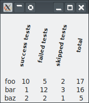

# Inheriting Widget Classes

## Introduction

There are situations in your projects that a widget gets dressed up the same way all the time and stray away from the defaults of a widget. For instance, you might want several labels to change a font and make it bold. So you repeat the steps all the time you create a label. For example the below label has a smaller font and printed bold. Also rotated for 90 degrees (useful in a grid to make columns small, e.g. when showing checkboxes or small numbers);

```
$text = "<b><small>$text</small></b>";
my Gnome::Gtk3::Label $label .= new(:$text);
$label.set-use-markup;
$label.set-angle(90);
```

Of course, we can make a method to do all that and that is easy enough. In some cases it is also the best thing you can do. However, the code can be more readable when such items are put away in some class and a proper name can then describe the result better. Beside that, it can be shared with other projects.


## Inheriting

Putting things in a class is the subject then. How on earth can we have the behavior of the label without coding it all again? Well, inheriting the label class is the key to the solution! So, how do we make a class like that? In Raku, we use the `is` trait in the class declaration to get the beavior of a parent class.

But we must do a bit more to let the parent class process the arguments and generate a native object. We must define a `new()` method for it to `bless()` the class to a living object. This method creates the object by providing the necessary options if there are any but most importantly, it must provide a special option `:GtkLabel` to let the label build routine know that it must process the options to create a native label object. Of course, other widget types need other named arguments. The reference of a widget makes it clear if it can be inherited and which argument must be given.

Then the `BUILD()` must do the additional steps to let the label be what it should be. This time rotating a smaller angle.

The code for it could look like the example below;
```
use Gnome::Gtk3::Label;

unit class VerticalHeaderLabel is Gnome::Gtk3::Label;

submethod new ( |c ) {                                                    # ①
  self.bless( :GtkLabel, |c);                                             # ②
}

submethod BUILD ( ) {                                                     # ③
  my Str $text = '<b><small>' ~ self.get-text ~ '</small></b>';
  self.set-text($text);
  self.set-use-markup(True);
  self.set-line-wrap(False);
  self.set-width-chars(16);
  self.set-angle(80);
}
```

Example use;
```
my Gnome::Gtk3::Grid $grid .= new;
my Int $col = 1;
for ('success tests', 'failed tests', 'skipped tests', 'total') -> $hdr {
  my VerticalHeaderLabel $v .= new(:text($hdr));                          # ④
  $grid.attach( $v, $col++, 0, 1, 1);
}

my $data = [
  ( 'foo', 10, 5, 2, 17),
  ( 'bar', 1, 12, 3, 16),
  ( 'baz', 2, 2, 1, 5),
];

my Int $row = 1;
for @$data -> @d {
  my Int $col = 0;
  for @d -> $col-data {
    my Str $text = $col-data ~~ Str
        ?? $col-data.fmt('%5s')
        !! $col-data.fmt('%3d');

    $grid.attach(
      Gnome::Gtk3::Label.new(:$text), $col++, $row, 1, 1
    );
  }
  $row++;
}
```

A bit of explanation is in order…
① `|c` is used here to get the lot of arguments in a Capture.

② Then, `c` is flattened in the call of bless. Note the `:GtkLabel` is used here to give **Gnome::Gtk3::Label** a signal to process the named arguments like `:text`. It is also possible to provide named arguments there to symplify the users need to provide them.

③ The BUILD routine in this example gets the label text to add some markup. Also it needs to turn on markup processing. The angle is now set to 80 degrees so that it is not completely vertical.

④ In the second part of the example, you see the usage of the class brought back to a single line where there is no fuzz about bolding and what not.

And naturally you want to see the result!<br/>


You need however a window around it and start the main loop, but that, you already knew 😄

## Inheriting another level

It is possible to inherit the `VerticalHeaderLabel` too to make further adjustments. The new method however, must be repeated in the newer class. This is because Raku only runs the `new()` method of the class mentioned in the declaration.
