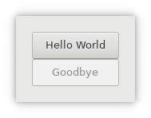

# What's this all about
This package, together with a few others is an interface to the great Gnome libraries Gtk, Gdk, Cairo, Pango, GObject and Glib. There are already a few interfaces made by other fellow programmers such as **GTK::Simple**, **GTK::Simpler** and **GTK::Scintilla**. Why then, would you ask, build another one? There were several reasons to do this, to sum up a few;
* Learning to handle Perl6 native interface to C libraries and having example code with the packages mentioned above.
* I wanted to follow the Gnome documents as closely as possible. This meant that the subroutine names are kept the same as those in the libs. Later on, I introduced some modifications to shorten these names where possible.
* I wanted to have classes with methods instead of the subroutines.
* I wanted the event handling code in separate classes where the information about specific procedures can be stored.
* I wanted all possible event handlers available for the user, not just the most used ones.
* I didn't want to fix events in method calls like `click()`.
* Later, I decided that I also wanted a more complete set of methods interfaced to GTK+ et al. This happened after I had created a program to scim through the source code of the gtk libraries (.h and .c), because these files are very well documented, and generate a perl6 module from it.
* I wanted to follow the obsolete markings of Gnome. E.g. the GtkHBox and GtkVBox are not supported anymore in favor of GtkGrid.

## History
There is already a bit of history for this package. It started off building the **GTK::Glade** package which soon became too big. So a part was separated into **GTK::V3**. After some working with the library I felt that the class names were a bit too long and that the words `gtk` and `gdk` were repeated too many times in the class path. E.g. there was **GTK::V3::Gtk::GtkButton** and **GTK::V3::Gdk::GdkScreen** to name a few. So, finally it was split into several other packages named, **Gnome::N** for the native linkup on behalf of any other Gnome module, **Gnome::Glib**, **Gnome::GObject**, **Gnome::Gdk3** and **Gnome::Gtk3** according to what is shown [on the developers page here][devel refs]. The classes in these packages are now renamed into e.g. **Gnome::Gtk3::Button**, **Gnome::Gdk3::Screen**, **Gnome::GObject::Object** and **Gnome::Glib::List**. As a side effect the package **GTK::Glade** is also renamed into **Gnome::Gtk3::Glade** to show that it is from Gnome and that it is based on Gtk version 3.


## Packages
### Gnome::N
Used to hold any access specs to the libraries. Also there is some debugging possible and an exception class defined.

### Gnome::Glib
C-based object and type system with signals and slots

### Gnome::GObject
Data structures and utilities for C programs

### Gnome::Gdk3
Low-level abstraction for the windowing system

### Gnome::Gtk3
Widget toolkit for graphical interfaces

### Gnome::Gtk3::Glade
Package to make use of the graphical user interface designer program **Glade**.

# Install Perl6 Packages
To install all of the above packages, run;
```
zef install Gnome::Gtk3::Glade
```

# Dependencies on external software
The software in these packages do not (yet) install the GTK+ software, so there is a dependency on several libraries which must be installed too.

# Site Contents
## Tutorial
A tutorial about using the modules in all its forms.

## Examples
A series of examples.

## Reference
References of all the modules in all packages

## Design
Notes on how things are set up.

# Warning
The software is far from finished as well as the documentation is not yet available for all modules in the packages.


## An Example

This example does the same as the example from `GTK::Simple` to show you the differences between the implementations. What immediately is clear is that this example is somewhat longer. To sum up;
### Pros
  * The defaults of GTK+ are kept. Therefore the buttons are in the proper size compared to what GTK::Simple produces.
  * Separation of callbacks from other code. Closures are not needed to get data into the callback code. Data can be provided with named arguments to the `register-signal()` method.
  * The package is designed with the usage of glade interface designer in mind. So to build the interface by hand like below, is not necessary. Use of `Gnome::Gtk3::Glade` is preferable when building larger user interfaces.
  * No fancy stuff like tapping into channels to run signal handlers.
  * There is a registration of callback methods to process signals like button clicks as well as events like keyboard input and mouse clicks.. This is not available in `GTK::Simple`. The provided way to handle a signal there, is fixed into a method. E.g. the button has a 'clicked' method and the container has none while an observer might want to know if an object is inserted into a grid using the 'add' signal.
  * The same method, `register-signal()`, is also used to register other types of signals. There are, for example, events to handle keyboard input and mouse clicks. Not all signal handler types are supported yet but can be installed in time.

### Cons
  * The code is larger.
  * Code is somewhat slower. The setup of the example shown next is about 0.05 sec slower. That isn't much seen in the light that a user interface is mostly set up and drawn once.

A screenshot of the example



The code can be found at `examples/01-hello-world.pl6`.
```

```


[screenshot 1]: images/01-hello-world.png

[screenshot 2]: https://martimm.github.io/perl6-gnome-gtk3/images/examples/16a-level-bar.png
[screenshot 3]: https://martimm.github.io/perl6-gnome-gtk3/images/examples/16b-level-bar.png
[screenshot 4]: https://martimm.github.io/perl6-gnome-gtk3/images/examples/ex-GtkScale.png
